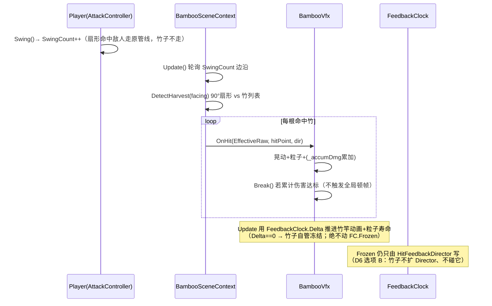
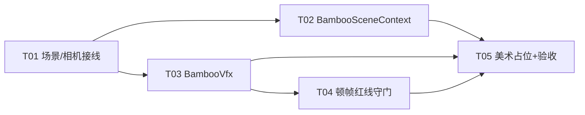

# 竹林 2.5D 技术验证 · 轮次 B 架构设计

> 分支：`feature/2.5d`　|　工程：`F:/AI-project/ancientGame/shuimofeng/shuimofeng`（Unity 2022.3）
> 设计者：高见远（软件架构师）　|　日期：2026-08-10
> 配套文档：`docs/2.5d-tech-verify-plan.md`（§1.1 竹林 3D 场景 + §1.3 砍竹子特效）、`docs/unity-2.5d-feasibility.md`
> 本环境无 Unity / dotnet，**仅出设计 + 任务拆解，不含可编译实现代码**。

---

## 0. 设计依据与边界

### 0.1 已确认的事实（来自真实代码，非凭空假设）

| 事实 | 来源 | 对设计的约束 |
|---|---|---|
| `IsometricCameraRig.cs` 已落盘，public `BindTarget(Transform)` / `offset` / `orthographicSize` | `Assets/_Project/Scripts/Runtime/2.5D/IsometricCameraRig.cs` | `BambooSceneContext` 只注入 `target`，相机参数可运行时配置（不改动 rig 源码） |
| `WorldBuilder.BuildScene()` 是静态、自幂等（先 `DestroyGeneratedRoots()`），玩家由 `BuildPlayer()` 生成 | `WorldBuilder.cs:127,535` | `BambooSceneContext` 不可挂 `ShuimoGenerated` 标记，否则会被 `DestroyGeneratedRoots()` 误删 |
| 玩家攻击判定 = 90° 扇形 / 半径 70 / 基于 `PlayerController.LastFacing`；命中走 `AttackController.SwingCount` 增长沿 | `AttackController.cs:167,184` | 砍竹检测**轮询 `SwingCount` 边沿**（与 `HeroineAnimator` 同款非侵入模式），复用扇形几何思路 |
| 命中反馈四件套（hitstop/屏震/闪白/飘字）**唯一调度者 = `HitFeedbackDirector`**；`FeedbackClock.Frozen` **唯一写入者也是它**；本工程永久禁用 `timeScale` | `FeedbackClock.cs:48-104`、`HitFeedbackDirector.cs:341` | 顿帧**绝不可由表现层直写 `FeedbackClock.Frozen`**；如需全局顿帧必走 `HitFeedbackDirector`。竹子按 **D6 选项 B** 仅用 `FeedbackClock.Delta` 冻自身动画，**不触发全局顿帧、不碰 `Frozen`** |
| 暂停语义：`CombatBridge.IsGameplayBlocked = IsRunOver \|\| _menuPaused`；`Scheduler.Paused` 唯一写者是 `CombatBridge.ApplyPauseState()` | `CombatScheduler.cs:45`、`FeedbackClock.cs:67` | 竹林暂停只读 `IsGameplayBlocked`；**绝不碰 `CombatScheduler.Paused`** |
| `T2` 的 `asmdef` 在 `Runtime/` 根，递归编译所有子目录（含 `2.5D/`） | `Xianxia.Unity.T2.asmdef` | 新增 `.cs` 放 `2.5D/` 即自动归属 `Xianxia.Unity.T2`，可直接引用 `IsometricCameraRig`/`AttackController`/`CombatBridge`/`FeedbackClock` |
| 已存在水墨 Shader：`BambooTrunk.shader` / `BambooLeaf.shader` / `InkGround.shader`，但**标注为 Built-in RP**（`surface surf Lambert`，非 URP） | `Assets/_Project/Shaders/Ink/` | 与可行性文档 D-2「默认 URP」冲突 → **待拍板 D4**（见 §8） |
| 相机位于 `z = -100`（`WorldBuilder.cs:662`：`cam.transform.position = new Vector3(player.x, player.y, -100)`），标准 2D 布局（相机在 -Z 侧朝 +Z 看） | `WorldBuilder.cs:662` | **深度轴 = -Z（朝向相机）**，不是 +Z（见 §6.2，工程师实现已踩坑修正） |
| `BambooInkImporter` 是 **Editor-only**（`using UnityEditor` + `Xianxia.Unity.T2.Editor` asmdef），且只套材质、不生成几何 | `Assets/_Project/Scripts/Editor/` | 运行时程序集够不着，不能在 `Load()` 里当资源生成器用（见 §2.1 材质落地） |
| 女主 39 帧精灵 / `HeroineAnimator` / `HeroineFrames` / `SpriteFactory` 一律不改 | 任务铁律 | 轮次 B 女主动画零接触（轮次 C 才换 Spine） |

### 0.2 本轮范围（红线内的产出）

- **只做**：`BambooSceneContext.cs`（竹林场景加载/销毁入口 + 玩家绑定 + 砍竹扇形检测）、`BambooVfx.cs`（砍竹特效）。
- **不做**：Spine 接入（轮次 C）、水墨 Shader 精修（轮次 C/后）、任何战斗内核改动。

---

## 1. BambooSceneContext.cs 接口契约

### 1.1 职责

对标 `WorldBuilder.BuildScene` 的「世界根」思路，但产出 **3D 竹子**而非 2D Tilemap：以自身 `Transform` 为根，程序化生成 20–30 根 3D 竹子 + 地面 + 雾层；负责把女主 `Transform` 接给 `IsometricCameraRig.BindTarget`；每帧轮询攻击扇形命中竹子并触发 `BambooVfx.OnHit`。

**与 `WorldBuilder` 的关键区别**：`BambooSceneContext` 自身**不挂** `ShuimoGenerated` 标记、也不在 `DestroyGeneratedRoots()` 清理范围内 —— 因此世界重建（菜单 Clean、按 R 重开）**不会**误删竹林；反之竹林 `Unload()` 也**不碰** `WorldBuilder` 的根与任何战斗静态状态。

### 1.2 公开方法签名（契约）

```csharp
namespace Xianxia.Unity.T2
{
    /// <summary>竹林 2.5D 场景上下文（feature/2.5d，仅此文件 + BambooVfx.cs 属轮次 B）。</summary>
    [DisallowMultipleComponent]
    public sealed class BambooSceneContext : MonoBehaviour
    {
        // ---- 生成参数（Inspector 可配）----
        public int   BambooCount      = 26;     // 20–30，程序生成
        public float GroveHalfExtent  = 1400f;  // 可行走区半边长（px 同尺度，见 §6）
        public float BambooMinDist    = 120f;   // 竹子间最小间距
        public float TrunkRadius      = 14f;    // 竹竿半径（同尺度）
        public float HeightMin = 170f, HeightMax = 250f;

        // ---- 砍竹判定（2.5D 空间，复用 AttackController 的"扇形"思路，半径用本场景尺度）----
        public float HarvestRadius = 90f;       // ≈ 玩家一刀够到的距离
        public float HarvestArcDeg = 90f;        // 与 AttackController.AttackArcDeg 同值

        // ---- 引用（Inspector / Load 时解析）----
        public IsometricCameraRig cameraRig;     // 场景里已放的等距相机
        public Material trunkMaterial;           // URP Lit 占位 或 Ink/BambooTrunk
        public Material leafMaterial;            // URP Lit 占位 或 Ink/BambooLeaf
        public GameObject inkLeafPrefab;         // 墨迹/竹叶 粒子 prefab（直接引用，见 §3）

        // ---- 生命周期 ----
        /// <summary>程序化生成竹林 + 配置相机。对标 WorldBuilder.BuildScene 的"世界根"思路，
        /// 但本根不挂 ShuimoGenerated 标记，避开 DestroyGeneratedRoots。</summary>
        public void Load();

        /// <summary>销毁竹林根（仅自身子节点），不触碰 WorldBuilder 根、不改 CombatScheduler.Paused。</summary>
        public void Unload();

        /// <summary>缓存玩家 Transform，调用 cameraRig.BindTarget(player)，并按 §6 重配相机参数。
        /// 玩家由 WorldBuilder 生成，本类不修改 WorldBuilder，仅惰性解析引用。</summary>
        public void BindPlayer(Transform player);

        // ---- 内部 ----
        private void Update();                   // 轮询 SwingCount 边沿 → DetectHarvest
        private void DetectHarvest(Vector2 facing);   // 扇形命中 → BambooVfx.OnHit
        private float EffectiveRaw();            // = AttackController.AttackRaw + bridge.PlayerAtkBonus
    }
}
```

### 1.3 对标 `WorldBuilder.BuildScene` 的要点

| WorldBuilder.BuildScene | BambooSceneContext.Load |
|---|---|
| 静态方法；自建 `RootName` 根并 `ShuimoGenerated.Mark(root)` | 实例组件；以 `transform` 为根，**不 Mark**，避免被 `DestroyGeneratedRoots()` 删 |
| `ComputeWorldData()` 确定性（PCG32 派生流） | 同样用 `ZoneSeed.CreateRng(zoneId, isSafe, visits)` 派生独立流生成竹子布局（确定性纪律延续） |
| `BuildPlayer()` → `SetupCamera(player)` | `BindPlayer(player)` → `cameraRig.BindTarget(player)` + 配置相机 |
| `BuildCombat()` 挂 CombatController/CombatBridge | **不改**；竹子不进战斗内核 |

### 1.4 生命周期与红线协调

```mermaid
sequenceDiagram
    participant Boot as Bootstrap(静态)
    participant WB as WorldBuilder
    participant BSC as BambooSceneContext
    participant Rig as IsometricCameraRig
    participant Player as Player(含 AttackController)
    participant Sched as CombatScheduler

    Boot->>WB: BuildScene()(场景加载/重开兜底)
    WB->>Player: BuildPlayer()(生成女主+攻击组件)
    Note over BSC: Awake 解析相机引用<br/>不自建世界、不挂标记
    BSC->>BSC: Load()(生竹林+地面+雾)
    BSC->>Player: BindPlayer(t)
    BSC->>Rig: BindTarget(player)+配置相机参数
    Note over Sched: Paused 红线：BSC 永不写<br/>只读 CombatBridge.IsGameplayBlocked
    Note over WB,BSC: 按 R 重开 → WB 重建世界<br/>BSC 根无标记→保留;若场景重载则 BSC.Unload() 再 Load()
```

- **场景加载 / 重开**：`Bootstrap` 走 `WorldBuilder.BuildScene`（不动）。`BambooSceneContext` 作为**常驻场景对象**（不生成、无 `ShuimoGenerated`）调用 `Load()` 生竹林；玩家生成后调用 `BindPlayer()`。
- **世界重建**：`DestroyGeneratedRoots()` 只删带 `ShuimoGenerated` 的根 → 竹林根幸免。若整个场景 `LoadScene` 重载，则 `BambooSceneContext` 走 `OnDestroy`→`Unload()`，新场景重建后 `Load()` 再次生成。
- **`CombatScheduler.Paused` 红线**：`BambooSceneContext` / `BambooVfx` **任何代码都不引用 `CombatScheduler`**，砍竹检测前先判 `CombatBridge.IsGameplayBlocked`，暂停/终局期间不触发 `OnHit`、不请求顿帧（与 `HeroineAnimator` 同闸门，读 `CombatBridge.IsGameplayBlocked`）。

---

## 2. 3D 竹林场景搭建

### 2.1 程序化生成（20–30 根）

- **布局**：以 `GroveHalfExtent` 为半边长的正方形可行走区内，用 `ZoneSeed.CreateRng` 派生流做「带最小间距的泊松式撒点」（确定性，复刻 WorldBuilder 的随机纪律）。目标 `BambooCount ∈ [20,30]`。
- **单根竹子结构**（`Bamboo_N` 父节点，挂 `BambooVfx`）：
  - 竹竿：`Cylinder` 缩放为 `(TrunkRadius*2, height, TrunkRadius*2)`，沿**深度轴**生长（见 §6.2；默认 -Z 朝相机）。
  - 竹叶：3–5 片 `Quad` 面片（双面材质）置于竹竿上部，随机朝向。
  - 碰撞：`CapsuleCollider`（**isTrigger**，仅作命中/软碰撞几何，不参与物理）。
  - 全部挂在 `BambooSceneContext.transform` 下 → 随 `Unload()` 一起销毁。
- **材质（落地方式，已据工程师反馈修正）**：`BambooInkImporter` 是 **Editor-only**（`using UnityEditor` + asmdef `Xianxia.Unity.T2.Editor`），且只套材质、不生成几何，运行时程序集够不着，**不能在 `Load()` 里当资源生成器用**。正确落地：① 优先用 Inspector 拖入已套好水墨材质的 `bamboo_ink.fbx`（用户先在编辑器跑一次 Importer 菜单套材质）；② 否则退 primitives + 运行时 `Shader.Find("Xianxia/Ink/BambooTrunk")` / `Shader.Find("Xianxia/Ink/BambooLeaf")` 复刻 Importer 同款参数。D4（URP vs 现有 Built-in Ink Shader）仍待拍板（见 §8）。

### 2.2 地面 + 雾层

- **地面**：大 `Plane`/`Quad`（尺寸 ≥ 2×`GroveHalfExtent`），法线朝 +Z（与玩法平面一致），`URP Lit` 占位或 `Ink/InkGround`。`sortingOrder` 置底。
- **雾层**：`Volume`（URP）加 `Fog` 或场景 `RenderSettings.fog`；薄雾用半透明 `ParticleSystem`（向上飘的墨点）充当「薄雾粒子」层次。雾色取墨色（`#0f1512` 系）以贴合水墨。

### 2.3 可行走区域 / 碰撞（2.5D 自管，不复用 WorldBuilder Grid）

- **不复用** `WorldBuilder.Grid`/`IsWalkable`：其 `Tilemap` 是 2D 表现，且竹林场景未必有 2D 地形。
- **可行走区定义**：矩形 `[−GroveHalfExtent, +GroveHalfExtent]²`（XY 平面）。`BambooSceneContext.Update` 内做**软碰撞**：读玩家 XY，若落入某竹 `CapsuleCollider` 半径内，则沿径向把玩家推出到边界（手动分离，不依赖 Rigidbody）。
- **竹子碰撞精度**（待拍板 D3）：默认用「单根竹竿圆心 + `TrunkRadius` 的圆形软碰撞」；如需更准可加叶子 `BoxCollider`，但验证阶段圆形足够。

### 2.4 遮挡 / 景深（Z 深度）

- 竹子用 **Opaque** 材质（Lit/Ink 均 Opaque），写入深度缓冲；女主 `SpriteRenderer` 为透明，默认**深度测试通过** → 位于竹子（更靠近相机、沿深度轴更近，本工程即 -Z 更小）之后的玩家精灵会被正确遮挡，反之覆盖。遮挡由标准 3D 深度缓冲解决，无需手工 Z 排序。
- 相机 `transparencySortMode = CustomAxis`、轴 `(0,0,1)`（按 Z 排序透明精灵），保证玩家 vs 飘字等精灵间次序正确。
- 相机重配（由 `Load()`/`BindPlayer()` 设置，覆写 rig 默认值）：
  - `cameraRig.orthographicSize` → 约 `352`（与 2D 取景同尺度，见 §6；rig 默认 `9` 是占位，会被覆盖）。
  - `cameraRig.offset` → 沿**深度轴**方向后退（默认 -Z，见 §6.2）：`(0, -H, depthSign·D)`（H≈GroveHalfExtent*0.4, D≈GroveHalfExtent*0.55），使 XY 玩法平面呈俯视斜角、竹高方向（深度轴）朝向相机。
  - **旋转（必须用 `LookRotation`，不能单轴欧拉角）**：`Euler(tiltX,0,0)` 无法同时满足「正视 XY 板 + 竹高朝上 + X 不镜像」——单轴 X 旋转会在「forward.z 为负」与「up.y 为正」间二选一，补 180° yaw 又会让 +X 镜像。改用：
    ```csharp
    float dz = depthSign;                    // 深度轴 z 分量 = ±1（本工程 = -1）
    Vector3 forward = new Vector3(0, Mathf.Sin(t), -dz * Mathf.Cos(t));
    Vector3 up      = new Vector3(0, Mathf.Cos(t),  dz * Mathf.Sin(t)); // = normalize(depthAxis - forward·dot(depthAxis,forward))
    // 验证 forward·up ≡ 0 ✓
    cameraRig.transform.rotation = Quaternion.LookRotation(forward, up);
    ```
    ⚠️ **坑**：`up.z` 若取反号，`forward·up = sin(2t)`，**t=45° 时两向量平行**，`LookRotation` 直接退化报错。默认 `tilt = 34°`（55° 会把女主精灵压到 `cos55≈0.57`，变形过重）。

---

## 3. BambooVfx.cs 砍竹特效

### 3.1 契约

```csharp
namespace Xianxia.Unity.T2
{
    [DisallowMultipleComponent]
    public sealed class BambooVfx : MonoBehaviour
    {
        [Header("断裂/晃动")]
        public float shakeDuration   = 0.35f;   // 晃动时长
        public float shakeAmplitude  = 0.25f;   // 沿深度轴晃动幅度（同尺度，默认 -Z）
        public float breakThreshold  = 30f;     // 累计伤害达此值即断（≈3 刀普攻，复用伤害量级）
        [Header("粒子（直接引用 prefab，见 §3.3）")]
        public GameObject inkLeafPrefab;        // 墨迹/竹叶 粒子 prefab

        private int   _hits;
        private float _accumDmg;
        private bool  _broken;
        private float _shakeRemain;

        /// <summary>命中入口。由 BambooSceneContext.DetectHarvest 在扇形命中本竹时调用。</summary>
        public void OnHit(float damage, Vector2 hitPoint, Vector2 hitDir);

        private void Update();        // 用 FeedbackClock.Delta 推进晃动/断裂动画与粒子寿命
        private void Break();         // 竹竿倾倒 + 释放顶部 + 触发粒子
        private void SyncFxPause(bool frozen); // Delta==0 时 ps.Pause(true)/Play(true)（粒子不认 FeedbackClock）
    }
}
```

### 3.2 行为

- **`OnHit(damage, hitPoint, hitDir)`**：累加 `_accumDmg`；启动 `shakeRemain = shakeDuration`（竹竿沿**深度轴**做阻尼晃动）；在 `hitPoint` 实例化 `inkLeafPrefab` 粒子（墨迹飞溅 + 竹叶飘落）；`_accumDmg ≥ breakThreshold` 或 `_hits ≥ 3` → `Break()`。**不触发全局顿帧**（D6 选项 B：不改 `HitFeedbackDirector`、不调它的任何方法、绝不直写 `FeedbackClock.Frozen`）。
- **晃动 / 断裂动画**：**全部用 `FeedbackClock.Delta` 推进**（不用 `Time.deltaTime`）。竹子自身动画随 `Delta` 归零而冻结——这是「复用 A-1 裁定、禁用 timeScale」的落地方式；按 D6 选项 B，竹子**不**请求全局顿帧，故不随内核 hitstop 同步，仅自管冻结。
- **`Particles` 不认 `FeedbackClock`**：`ParticleSystem` 内部吃 `Time.deltaTime`，不吃 `FeedbackClock.Delta`。故 `Delta==0`（暂停 / 终局 / 自管冻结）时由 `SyncFxPause(true)` 显式 `ps.Pause(true)`、恢复时 `SyncFxPause(false)` → `ps.Play(true)`，确保墨点/竹叶粒子与竹竿动画同步冻/解。
- **`Break()`**：竹竿上段绕根部旋转倾倒（coroutine/手动插值均可），顶部叶片随断口释放；可留一截残桩。

### 3.3 粒子 prefab 引用方式（直接引用为主，Resources 兜底）

- **首选：Inspector 直接序列化引用**。`inkLeafPrefab` 为 `GameObject` 字段，拖入 prefab 资产（路径建议 `Assets/_Project/Prefabs/2.5D/BambooHitFx.prefab`），运行时 `Instantiate` 即用，**不引入 Addressables 依赖**（feature 分支保持轻量）。
- **兜底**：若字段为空，则 `Resources.Load<GameObject>("2.5D/BambooHitFx")` 实例化（prefab 同时放一份到 `Assets/_Project/Resources/2.5D/`）。
- **prefab 来源**（待拍板 D2）：自做（推荐，控制水墨墨点/竹叶两路 `ParticleSystem`）或 Asset Store。轮次 B 先用自做占位。

### 3.4 与内核伤害回传的接线点（谁触发 `OnHit`）



- **触发点**：`BambooSceneContext.DetectHarvest` 在检测到某竹落入玩家 90° 扇形内时，对该竹的 `BambooVfx` 调 `OnHit`。**不**经过 `CombatEventsUnity.OnHit`（竹子不是 `Combatant`，内核事件不会为它触发），因此用「轮询 `SwingCount` 边沿 + 自管扇形」替代——这是对 `AttackController` **零改动**的复用方式。
- **伤害数值复用**：`BambooSceneContext.EffectiveRaw()` = `AttackController.AttackRaw(12) + (CombatBridge.PlayerAtkBonus)`（与 `AttackController.ResolveHits` 的 `effectiveRaw` 同公式），作为 `OnHit` 的 `damage` 参数传入，使竹子断裂节奏随玩家等级成长——即「复用伤害管线」的落地。

---

## 4. 复用边界（红线）

| 红线 | 要求 | 本设计如何守住 |
|---|---|---|
| 战斗内核不改 | `Combat/Skill/Status/AI/Progression` 一行不改 | 竹子不进内核；砍竹检测只在表现层轮询 `SwingCount` + 自管扇形，不调用 `DamageResolver` |
| 顿帧禁用 `timeScale` | 表现层冻结只用 `FeedbackClock.Delta`；`Frozen` 唯一写入者 = `HitFeedbackDirector` | 竹子动画用 `FeedbackClock.Delta` 自管冻结；**绝不直写 `FeedbackClock.Frozen`、绝不调用 `HitFeedbackDirector`**（D6 选项 B：竹子不改 Director、不触发全局顿帧，仅冻自身） |
| 暂停读 `IsGameplayBlocked` | 暂停/菜单期间停止新反馈 | `BambooSceneContext.Update` / `BambooVfx` 在触发前判 `CombatBridge.IsGameplayBlocked`，与 `HeroineAnimator` 同闸门 |
| 女主动画轮次 B 不动 | `HeroineAnimator`/`HeroineFrames`/`SpriteFactory` 不改 | 玩家仅作为被绑定的 `Transform` 源，不触碰其组件 |
| 不碰 2D 世界生成 | `WorldBuilder` 2D 段、`SpriteFactory` 不改 | 竹林根不挂 `ShuimoGenerated`；不调用 `WorldBuilder.*` 生成逻辑 |
| `CombatScheduler.Paused` 红线 | 表现层不得写暂停位 | 全程不引用 `CombatScheduler` |

---

## 5. 文件清单（相对 `Assets/`）

### 5.1 新增文件（feature/2.5d，独立目录 `2.5D/`）

| 文件 | 说明 | asmdef |
|---|---|---|
| `_Project/Scripts/Runtime/2.5D/BambooSceneContext.cs` | 竹林场景加载/销毁 + 玩家绑定 + 砍竹扇形检测 | `Xianxia.Unity.T2`（自动归属） |
| `_Project/Scripts/Runtime/2.5D/BambooSceneContext.cs.meta` | GUID 由 Unity 导入自动生成，需全局唯一（见 §5.3） | — |
| `_Project/Scripts/Runtime/2.5D/BambooVfx.cs` | 砍竹特效（断裂/晃动/粒子） | `Xianxia.Unity.T2` |
| `_Project/Scripts/Runtime/2.5D/BambooVfx.cs.meta` | 同上 | — |
| `_Project/Prefabs/2.5D/BambooHitFx.prefab`(+.meta) | 墨迹/竹叶 粒子 prefab（直接引用首选路径） | — |
| `_Project/Resources/2.5D/BambooHitFx.prefab`(+.meta) | 同一 prefab 的 Resources 兜底副本（可选） | — |

### 5.2 改动文件（仅必要最小集）

| 文件 | 改动 | 性质 |
|---|---|---|
| `Scenes/SampleScene.unity` | 叠加竹林层：放置 `IsometricCameraRig` 相机 + `BambooSceneContext` 空物体 + 引用材质/粒子字段。**不新建 `BambooGrove.unity`**（D5 已拍板：叠加 SampleScene）。 | 场景资源（D5=选项 B） |

> **D6 已拍板选项 B**：竹子仅用 `FeedbackClock.Delta` 冻自身动画，**不改 `HitFeedbackDirector.cs` 一行**，故本表无内核改动行。

### 5.3 GUID 唯一性校验（必做）

`.meta` 的 `guid` 为 32 位十六进制串，Unity 首次导入自动生成。因本环境无 Unity，工程师在本地导入后须校验无冲突：

```
# 在 Assets/ 下检索新 guid，结果应只命中自身 .meta
grep -rl "guid: <NEW_GUID>" Assets/
```

> 若工程已存在相同 guid 的 `.meta`，Unity 会静默丢弃其一导致引用断裂——务必确认两个新 `.cs` 的 guid 全局唯一。

### 5.4 明确**不改动**的文件

`Assets/Scripts/Systems/Combat/**`（内核）、`WorldBuilder.cs`（2D 段）、`SpriteFactory.cs`、`HeroineAnimator.cs`、`HeroineFrames.cs`、`AttackController.cs`、`PlayerController.cs`、`CombatController.cs`、`CombatBridge.cs`、`StreamingAssets/characters/heroine/**`。

---

## 6. 跨帧 / 坐标约定

### 6.1 世界单位尺度（关键决策：与 2D 同尺度，PPU=1 保留）

- **决策**：2.5D 竹林直接用 **2D 世界单位（1 单位 = 1 px，PPU=1）** 搭建。理由：攻击判定常量（`AttackController.AttackRadius=70`、`AttackArcDeg=90`）与女主精灵尺寸（48×64）均以此尺度定义；同尺度可**字节级复用攻击/伤害管线**，且女主精灵无需缩放（详见下）。
- 相机 `orthographicSize` 由 `BambooSceneContext` 重配为 ≈`352`（与 2D 取景一致），使 256 单位高的竹子约占屏高 1/3，呈「竹林俯视」观感；rig 默认 `9` 仅为占位。

### 6.2 坐标平面（守住 PlayerController 不动的硬约束）

- **玩法平面 = XY（z=0）**：`PlayerController`/`AttackController` 以 XY 移动与判定，本设计**不改**二者 → 平面必须是 XY。
- **深度轴 = 朝向相机的方向（默认 -Z）**：工程实测 `WorldBuilder.cs` 相机位于 `z=-100`（朝 +Z 看），故竹子沿 **-Z（朝向相机）** 生长；`BambooSceneContext` 用 `autoDepthAxisFromCamera`（默认开）从相机 z 自动推导符号，把朝向错误消灭在运行时。`IsometricCameraRig` 经 `BSC` 重配为正视 XY 板的俯视斜角。
- 遮挡由深度缓冲自然解决（§2.4）。

### 6.3 女主 48×64 与攻击 96×64 在 3D 中的摆放

| 资源 | 2D 尺寸 | 3D 场景处理（同尺度，PPU=1） |
|---|---|---|
| 女主精灵 | 48×64 px → 48×64 单位 | **原生尺寸直接使用**，置于 z=0（或沿深度轴 −Z 微偏、更靠相机，避免与地面 z-fighting）；`SpriteRenderer` 深度测试通过后由竹子 Opaque 网格正确遮挡 |
| 玩家占位方块 | `PlayerBodySize=40` 单位 | 同尺度，无需缩放 |
| 攻击扇形画布 | 半径 70 / 弧 90°（VfxSlash） | 同尺度；竹子命中判定 `HarvestRadius=90` 与之同量级，一刀命中 1–3 根 |

> **结论**：因采用同尺度，女主与攻击画布均**零缩放**对齐；唯一需要重配的是相机 `orthographicSize` 与 `offset/rotation`（让 XY 板呈现 2.5D 斜俯视）。

---

## 7. 任务分解（有序、含依赖）

> 供工程师下一步实现。依赖方向尽量收敛到「T01 基础设施」以减少线性链。

| ID | 任务 | 来源文件 | 依赖 | 优先级 |
|---|---|---|---|---|
| **T01** | **场景与相机接线**：在 `SampleScene` 叠加竹林层（D5=选项 B，不新建 BambooGrove）；放置 `IsometricCameraRig` 相机 + `BambooSceneContext` 空物体；接好材质/粒子字段引用（占位 URP Lit） | `Scenes/SampleScene.unity`、`2.5D/BambooSceneContext.cs`(空壳)、`IsometricCameraRig`(已存在) | — | P0 |
| **T02** | **BambooSceneContext 实现**：程序化生成竹林（确定性布局）+ 地面 + 雾层；`Load/Unload/BindPlayer`；`Update` 轮询 `SwingCount` 边沿 + 90° 扇形 `DetectHarvest`；相机参数重配 | `2.5D/BambooSceneContext.cs`、`2.5D/BambooSceneContext.cs.meta` | T01 | P0 |
| **T03** | **BambooVfx 实现**：`OnHit` 断裂/晃动（用 `FeedbackClock.Delta`）+ 粒子 prefab 实例化；`breakThreshold` 累计伤害断裂 | `2.5D/BambooVfx.cs`、`2.5D/BambooVfx.cs.meta`、`Prefabs/2.5D/BambooHitFx.prefab` | T01 | P0 |
| **T04** | **顿帧红线守门（验证）**：确认 `BambooVfx` 仅用 `FeedbackClock.Delta` 冻自身动画 + `SyncFxPause` 管粒子，**绝无调用 `HitFeedbackDirector`、绝不直写 `FeedbackClock.Frozen`**；复核 `IsGameplayBlocked` 闸门在暂停/终局期间不触发 `OnHit` | `2.5D/BambooVfx.cs` | T03 | P1 |
| **T05** | **美术占位与真机验收**：`BambooHitFx` 粒子 prefab（墨迹+竹叶两路）；雾层/地面调参；按 §1.1/§1.3 验收清单在真机逐项核对（遮挡、断裂、粒子层次、顿帧仍生效） | `Prefabs/2.5D/BambooHitFx.prefab`、`Shaders/Ink/*`(可选)、场景 | T02,T03,T04 | P1 |



---

## 8. 待用户拍板事项

| # | 决策项 | 选项 A（推荐） | 选项 B | 影响 | 状态 |
|---|---|---|---|---|---|
| **D1** | 水墨 Shader vs URP Lit 占位 | 轮次 B 先用 **URP Lit 占位**，调参风险最低 | 直接启用 `Ink/BambooTrunk` 等（但现为 **Built-in RP**，需先转 URP） | 决定 §2.1/§2.2 材质与 D4 | 待拍板 |
| **D2** | 粒子 prefab 来源 | **自做**（墨点 + 竹叶两路 `ParticleSystem`，可控水墨感） | Asset Store 购买 | §3.3 prefab 资产 | 待拍板 |
| **D3** | 竹子碰撞精度 | 单根 **圆形软碰撞**（圆心+`TrunkRadius`） | 加叶子 `BoxCollider` 精修 | §2.3 行走手感 | 待拍板 |
| **D4** | 渲染管线一致性 | 维持 **URP**（可行性 D-2 默认），把 `Ink/*` Shader 从 Built-in 转 URP | 全工程切回 Built-in RP 以直接用现有 Ink Shader | 与 D1 联动，影响全工程 | 待拍板（最大风险） |
| **D5** | 新场景文件 | 新增 `BambooGrove.unity`（独立验证场景，隔离干净） | 叠加在 **`SampleScene`**（复用 2D 世界+战斗栈，需隐藏 2D Tilemap） | §5.2 改动文件 | **已拍板：选项 B（SampleScene）** |
| **D6** | 顿帧扩展（红线例外） | 在 `HitFeedbackDirector` 加 public `RequestHitstop`（唯一 sanctioned 扩展） | 不改 Director，竹子**仅用 `FeedbackClock.Delta` 冻自身动画**，不触发全局顿帧 | §3.4 / §4 红线 | **已拍板：选项 B（不改 Director，竹子自管冻结）** |

> D5/D6 已由用户拍板（均选项 B）：竹林叠加 `SampleScene`、竹子不改 `HitFeedbackDirector` 仅用 `FeedbackClock.Delta` 冻自身动画。剩余 D1/D4 仍相互牵连（管线决定 Shader 可用性），建议优先拍板 **D4（管线）** 再定 D1。

---

## 9. 一句话风险判断

> **最大风险是 D4（URP vs 现有 Built-in 水墨 Shader 冲突）这一处需用户拍板的「管线决策」——D6 已拍板选项 B（不改 `HitFeedbackDirector`、竹子仅用 `FeedbackClock.Delta` 冻自身动画，红线零破），D5 已拍板叠加 `SampleScene`；其余均为 2.5D 目录内零侵入实现，回退零成本。**
