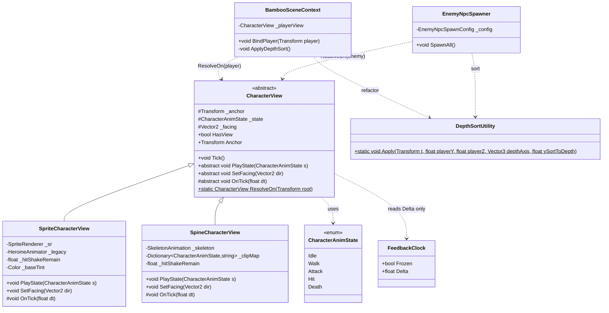
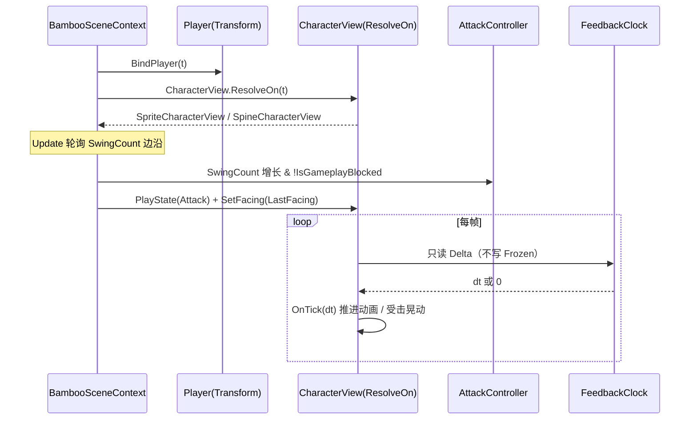
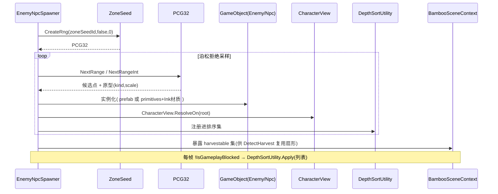
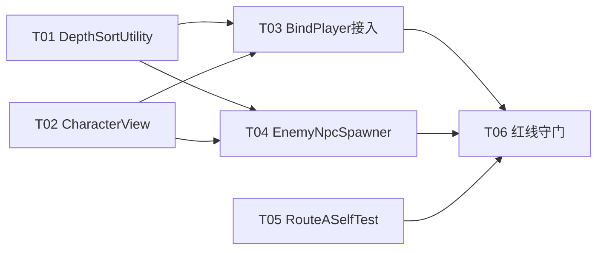

# 竹林 2.5D 技术验证 · 轮次 C 增量设计

> 分支：`feature/2.5d`　|　工程：`F:/AI-project/ancientGame/shuimofeng/shuimofeng`（Unity 2022.3.62f3c1）
> 设计者：高见远（软件架构师）　|　日期：2026-08-12
> 上游依据：`docs/bamboo-2_5d-roundB-design.md`（轮次 B，已含红线与红线表）、`docs/bamboo-2_5d-local-verify.md`（Route A 真机自测清单）
> **本环境无 Unity / dotnet，仅出设计文档 + 任务拆解，不含可编译实现代码，不执行任何 git 操作。**

---

## 0. 增量范围（相对 Round B 改了 / 加了什么，明确「零内核改动」）

### 0.1 本轮三大需求

- **A. 竹林 Spine 角色视图层**：当前玩家/敌人是占位 sprite（`HeroineAnimator` 驱动的 2D 精灵）。目标是让竹林能接 Spine 骨骼动画角色，但**工程当前没有 Spine 运行时包、也没有任何 `.skel`/`.json` 骨骼数据**。因此设计必须是**可选依赖守卫**：默认 `SpriteCharacterView`（用 `SpriteRenderer`，立即可用），仅当 Spine 运行时存在时启用 `SpineCharacterView`。所有动画推进走 `FeedbackClock.Delta`（不碰 `Frozen`）。
- **B. 敌人 / NPC 撒点**：`EnemyNpcSpawner` 确定性撒点，复用 `ZoneSeed.CreateRng → PCG32`（与竹林撒点同源种子纪律）；类别含「竹林小怪（复用 boss/witch/elder/musician 缩放思路）」与「NPC 标记点（可对话/可交互，先占位）」；外观套 Ink 材质、深度排序复用 `ApplyDepthSort` 思路。
- **C. Route A 自测工具化**：Editor 工具 `RouteASelfTest.cs`（菜单 `Shuimo/2.5D/运行 Route A 自测`），一键跑通 `docs/bamboo-2_5d-local-verify.md` 的核心项，出 PASS/WARN/FAIL 报告。

### 0.2 新增文件（全部落在 `2.5D/` 或 `Editor/`，绝不碰内核）

| 文件（相对 `Assets/`） | 说明 | 归属 asmdef |
|---|---|---|
| `_Project/Scripts/Runtime/2.5D/CharacterView.cs` | `CharacterView` 抽象层 + `SpriteCharacterView`（默认）+ `#if HAS_SPINE_PACKAGE` 守卫的 `SpineCharacterView` | `Xianxia.Unity.T2` |
| `_Project/Scripts/Runtime/2.5D/EnemyNpcSpawner.cs` | `EnemyNpcSpawner`（MonoBehaviour）+ `EnemyNpcSpawnConfig`（ScriptableObject）+ `EnemyArchetypeEntry` | `Xianxia.Unity.T2` |
| `_Project/Scripts/Runtime/2.5D/DepthSortUtility.cs` | 从 `BambooSceneContext.ApplyDepthSort` 抽出的「单物体按玩家 Y 推深度轴」共享静态工具（供竹/敌/NPC 统一复用） | `Xianxia.Unity.T2` |
| `_Project/Scripts/Editor/RouteASelfTest.cs` | Route A 自测器（5 项校验 + 报告） | `Xianxia.Unity.T2.Editor` |

### 0.3 修改文件（仅 2.5D 目录内既有文件，属本分支范围，**不是内核**）

| 文件 | 改动 | 性质 |
|---|---|---|
| `_Project/Scripts/Runtime/2.5D/BambooSceneContext.cs` | ① `BindPlayer` 扩展：识别 `CharacterView`（`CharacterView.ResolveOn(player)`）；② `ApplyDepthSort` 重构为调用 `DepthSortUtility`；③ 暴露 `DepthAxis` 只读属性与「注册待排序物体」入口，供 `EnemyNpcSpawner` 复用 | 轮次 B 既有 2.5D 文件，本分支内可改 |
| `_Project/Scripts/Runtime/2.5D/BambooSceneContext.cs` 注释 | 将红线提醒注释中的裸关键字（如 `Time.timeScale`）保持原样即可——自测器按「注释剥离」扫描，不会误报（见 §4.3） | 非必须 |

### 0.4 明确**不改动**（零内核改动铁证）

`Xianxia.Core/`、`Xianxia.Combat/`、`Xianxia.Combat.Unity/`（含 `FeedbackClock`、`CombatView`）、`CombatBridge.cs`、`AttackController.cs`、`PlayerController.cs`、`WorldBuilder.cs`、`HeroineAnimator.cs`、`HeroineFrames.cs`、`SpriteFactory.cs`、`StreamingAssets/characters/heroine/**`。本设计对内核**零引用、零修改、零新增**。

> 注：本设计新增的 `CharacterView` 与内核 `Xianxia.Combat.UnityBridge.CombatView` 是**两个完全不同的类型、两个命名空间**（`Xianxia.Unity.T2` vs `Xianxia.Combat.UnityBridge`），不存在命名冲突，也不引用内核 `CombatView`。

---

## 1. 红线与约束复述（含为什么这样设计）

| # | 红线 | 设计要求 | 为什么这样设计（依据真实代码） |
|---|---|---|---|
| **R1** | 两轨不合并 | `main`=2D 长期主线、`feature/2.5d`=2.5D 长期并行支线，不合并。代码只落 `2.5D/` 或 `Editor/`，绝不碰 `Xianxia.Core`/`Xianxia.Combat`/`CombatBridge` 等共享文件 | 分支策略：合并会把 2.5D 实验代码拖进 2D 主线，污染确定性对拍与发布管线 |
| **R2** | 顿帧红线（A-1） | 禁用 `Time.timeScale`；受击/暂停驱动的动画推进走 `FeedbackClock.Delta`/`FeedbackClock.Frozen`；`Frozen` 唯一写入者 = `HitFeedbackDirector`；竹子/角色**只冻自身动画**（D6 选项 B），**不扩 Director、不调 `RequestHitstop`/`KickHitstop`、不直写 `Frozen`** | `CombatController.cs:313` 是 `Scheduler.Tick(Time.deltaTime)`，`timeScale` 会连内核一起缩放 → 同一输入在「开/关反馈」下跑出不同战斗结果 → 确定性对拍失守（围攻倍率指纹 2.5294x 作废）。`Frozen` 单写者避免解冻时序错乱（`FeedbackClock.cs:48-104`） |
| **R3** | 深度轴 | 沿「朝相机」方向；相机在 `z=-100` 朝 +Z → 深度轴 `(0,0,-1)`，`autoDepthAxisFromCamera` 默认开（从相机 z 推导符号）。新增角色/敌人必须复用 `ApplyDepthSort`/`ResolveDepthAxis` 思路 | Round B 实测：若竹子沿 +Z 生长会到相机背面、永远遮不住女主，§2.4 遮挡验收直接失效（`BambooSceneContext.cs` 文件头注释） |
| **R4** | 渲染 | Built-in RP；水墨材质用 `Shader.Find("Xianxia/Ink/...")` 复刻同款参数（`BambooInkImporter` 是 Editor-only，运行时够不着，只套材质不生成几何） | D4 已拍板 Built-in 兼容；`BambooInkImporter.cs` 仅 Editor，运行时不引用它 |
| **R5** | asmdef 分层 | 纯逻辑放根目录 asmdef（`noEngineReferences=true`）；Unity Bridge（含 MonoBehaviour）放独立子目录 + 独立 asmdef（`noEngineReferences=false`），引用 `Xianxia.Core`+`Xianxia.Combat`+`Xianxia.Combat.Unity`+`UnityEngine.UI`。新增 2.5D 脚本归属 `Xianxia.Unity.T2` 体系 | 依赖方向单向：`T2 → Combat.Unity → Combat`（`FeedbackClock.cs` 注释）。确认 `Xianxia.Unity.T2.asmdef` 已在 `Runtime/` 根、递归编译 `2.5D/` 子目录，引用上述四项、`noEngineReferences=false` |
| **R6** | 红线自测 | 设计要便于后续 grep 验证 0 命中：`Time.timeScale` / `CombatScheduler` / `RunPhase` / `DamageResolver` / `RequestHitstop` / `KickHitstop` / 对 `Frozen` 的赋值（均在 `2.5D/` 目录下） | 见 §4.3 自测器设计；C 项工具化正是把这条变成一键 |

**顿帧落实口径（全工程统一）**：本设计的「角色/敌人/竹子」动画一律只读 `FeedbackClock.Delta`，`Delta==0`（顿帧/暂停/终局）时动画与粒子同步冻结；**任何代码都不写 `FeedbackClock.Frozen`**，也**不引用 `CombatScheduler` / `RunPhase` / `DamageResolver` / `RequestHitstop` / `KickHitstop` / `Time.timeScale`**。暂停语义照旧只读 `CombatBridge.IsGameplayBlocked`（与 `BambooSceneContext`、`HeroineAnimator`、`HitFeedbackDirector` 同闸门）。

---

## 2. A 角色视图层设计（轮次 C）

### 2.1 设计目标与约束

- 让竹林能承载 Spine 骨骼角色，但**当前工程无 Spine 包、无骨骼数据** → 默认 Sprite 视图立即可用，Spine 视图**可选依赖守卫**。
- 受击硬直/晃动走 `FeedbackClock.Delta`（不碰 `Frozen`）——与 `BambooVfx` 同款红线口径。
- 动画状态机 `Idle / Walk / Attack / Hit / Death` 由战斗事件（挥砍边沿、受击、死亡）驱动。
- 接入点：扩展 `BambooSceneContext.BindPlayer(Transform)` 使其识别 `CharacterView`，并给出「玩家/敌人统一视图挂载约定」。

### 2.2 类图



### 2.3 接口契约

```csharp
namespace Xianxia.Unity.T2
{
    /// <summary>角色视图动画状态（战斗事件驱动）。</summary>
    public enum CharacterAnimState { Idle, Walk, Attack, Hit, Death }

    /// <summary>
    /// 竹林 2.5D 角色视图抽象层（轮次 C）。
    /// 子类：SpriteCharacterView（默认，SpriteRenderer，零 Spine 依赖）、
    ///       SpineCharacterView（仅当 HAS_SPINE_PACKAGE 定义时编译）。
    /// 动画推进一律走 FeedbackClock.Delta；只读、绝不写 FeedbackClock.Frozen。
    /// </summary>
    public abstract class CharacterView : MonoBehaviour
    {
        /// <summary>供深度排序 / 挂载使用的锚点 Transform（通常是自身 transform）。</summary>
        public Transform Anchor { get; protected set; }

        /// <summary>是否存在可用视图（Sprite 或 Spine 任一）。</summary>
        public bool HasView { get; protected set; }

        /// <summary>
        /// 每帧推进动画。内部只读 FeedbackClock.Delta；
        /// Delta==0（顿帧/暂停/终局）时直接 return，动画随全场同步冻结。
        /// 不写 FeedbackClock.Frozen、不碰 Time.timeScale。
        /// </summary>
        public void Tick()
        {
            if (FeedbackClock.Frozen) return;          // 只读闸门
            float dt = FeedbackClock.Delta;            // 唯一时钟原语
            if (dt > 0.0f) OnTick(dt);
        }

        /// <summary>切换动画状态（Idle/Walk/Attack/Hit/Death）。</summary>
        public abstract void PlayState(CharacterAnimState state);

        /// <summary>设置朝向（XY 单位向量），驱动精灵翻转 / 骨骼 flipX。</summary>
        public abstract void SetFacing(Vector2 dir);

        /// <summary>子类实现具体动画推进（dt 已为 FeedbackClock.Delta）。</summary>
        protected abstract void OnTick(float dt);

        /// <summary>
        /// 统一解析入口：在 root 上取或挂一个 CharacterView。
        /// 挂载约定：每个 2.5D 角色根节点有且只有一个 CharacterView 组件，
        /// 玩家与敌人共用本方法解析（见 §2.7）。
        /// 守卫规则见 §2.5。
        /// </summary>
        public static CharacterView ResolveOn(Transform root);
    }
}
```

### 2.4 子类职责

**`SpriteCharacterView`（默认，立即可用，零 Spine 依赖）**
- 取 `GetComponent<SpriteRenderer>()`（自身或子节点）；可选 `GetComponent<HeroineAnimator>()`（**只读复用，不改它**）作为既有 2D 精灵动画的委托。
- 状态实现（均走 `FeedbackClock.Delta`）：
  - `Idle/Walk`：`HeroineAnimator` 存在则委托其 playback；否则维持当前 sprite。
  - `Attack`：短暂缩放脉冲（`OnTick` 内用 `dt` 衰减）。
  - `Hit`：受击硬直——沿 `FeedbackClock.Delta` 做阻尼晃动（`_hitShakeRemain`），并触发一次 tint 闪（与 `BambooVfx.TickShake` 同源思路，不碰 `Frozen`）。
  - `Death`：淡出 + 轻微下沉（`OnTick` 内 `dt` 衰减）。
- `SetFacing`：根据 `dir.x` 符号设 `SpriteRenderer.flipX`（与 `PlayerController.LastFacing` 约定一致）。

**`SpineCharacterView`（仅 `#if HAS_SPINE_PACKAGE` 编译，可选依赖）**
- 引用 `Spine.Unity.SkeletonAnimation` / `SkeletonMecanim`（由 Spine 官方运行时提供）。
- 持有 `_clipMap : Dictionary<CharacterAnimState,string>`，将状态映射到 Spine 动画名（Inspector 或配置可配，默认 `"idle"/"walk"/"attack"/"hit"/"death"`）。
- `SetFacing`：设 `SkeletonAnimation.Skeleton.FlipX`。
- `OnTick(dt)`：用 `dt`（= `FeedbackClock.Delta`）喂给 `AnimationState.Update(dt)`，使 Spine 动画与全场顿帧同步冻结；`Hit` 时对受击骨骼做基于 `dt` 的抖动。
- 因为**整个类被 `#if HAS_SPINE_PACKAGE` 包裹**，Spine 类型引用在缺包时根本不参与编译 → 工程照常通过。

### 2.5 可选依赖守卫方案与取舍（任务核心决策）

**要求**：没有 Spine 包时工程必须照常编译通过；导入 Spine 后自动切换。两种做法二选一。

| 方案 | 机制 | 优点 | 缺点 |
|---|---|---|---|
| **A. 编译符号 `#if HAS_SPINE_PACKAGE` + 运行时组件探测（推荐）** | `SpineCharacterView` 与工厂的 Spine 分支整体包在 `#if HAS_SPINE_PACKAGE` 内；符号未定义时该类不编译、工厂只返回 Sprite。符号已定义时，工厂再**运行时探测** `GetComponent<Spine.Unity.SkeletonAnimation>()`，有才用 Spine、无则退回 Sprite | 零反射、类型安全、编译隔离绝对可靠；运行时探测又顺带满足「导入 Spine 后按子物体 SkeletonAnimation 自动切换」 | 用户导入 Spine 后需手动在 Player Settings 加 `HAS_SPINE_PACKAGE` 一个符号（一步） |
| **B. 纯运行时反射探测（不加符号）** | `ResolveOn` 用 `Type.GetType("Spine.Unity.SkeletonAnimation, ...")` 反射查找组件并动态驱动 | 导入 Spine 即生效，无需加符号 | `SpineCharacterView` 仍须引用 Spine 类型才能编译 → 缺包时编译失败；若改为全反射（不引用类型）则极脆弱、难维护 |

**决策：采用方案 A（编译符号守卫为硬边界 + 运行时组件探测为软切换）。**
- 硬边界（编译安全）：`#if HAS_SPINE_PACKAGE` 保证「无 Spine 包 → `SpineCharacterView` 不编译 → 工程零报错」。
- 软切换（导入即生效）：即便定义了符号，单个角色若没有 `SkeletonAnimation` 组件，仍回落 `SpriteCharacterView`。这与任务书「导入 Spine 后由 CharacterView 检测子物体上的 SkeletonAnimation 组件自动切换」完全吻合。
- 导入步骤（写进 §7 待明确）：用户导入 Spine Unity Runtime 后，在 `Project Settings → Player → Scripting Define Symbols` 追加 `HAS_SPINE_PACKAGE`（一行）。此后含 `SkeletonAnimation` 的角色自动走 Spine 视图。

`ResolveOn` 伪代码（含守卫）：

```csharp
public static CharacterView ResolveOn(Transform root)
{
    if (root == null) return null;
#if HAS_SPINE_PACKAGE
    // 仅在符号存在时，才探测 Spine 组件（类型引用被 #if 隔离，缺包不编译）
    var sk = root.GetComponent<Spine.Unity.SkeletonAnimation>();
    if (sk != null)
    {
        var sv = root.GetComponent<SpineCharacterView>() ?? root.gameObject.AddComponent<SpineCharacterView>();
        sv.Bind(sk);
        return sv;
    }
#endif
    // 默认：Sprite 视图（零依赖，立即可用）
    var sp = root.GetComponent<SpriteCharacterView>() ?? root.gameObject.AddComponent<SpriteCharacterView>();
    return sp;
}
```

### 2.6 动画状态机与战斗事件驱动

- 状态枚举：`Idle / Walk / Attack / Hit / Death`。
- 驱动来源（表现层，不进内核）：
  - `Attack` ← `BambooSceneContext` 轮询 `AttackController.SwingCount` 增长沿（与 `DetectHarvest` 同源边沿）后，对玩家 `CharacterView` 调 `PlayState(Attack)`。
  - `Hit` ← 角色自身受击（2.5D 小怪被 harvest 命中、或预留的敌人受击事件）调 `PlayState(Hit)`。
  - `Death` ← 配置或预留 HP 归零（2.5D 占位，不进内核战斗）。
  - `Walk/Idle` ← 由 `PlayerController.LastFacing` 是否为零 / 移动输入推断，每帧 `SetFacing` + 状态维持。
- **受击硬直/晃动一律走 `FeedbackClock.Delta`**（见 §2.4），绝不写 `Frozen`。

### 2.7 接入点：扩展 `BindPlayer` + 统一挂载约定

`BambooSceneContext.BindPlayer(Transform player)`（当前 L388）扩展为：

```csharp
public void BindPlayer(Transform player)
{
    _player = player;
    if (player != null)
    {
        _playerController = player.GetComponent<PlayerController>();
        _attack = player.GetComponent<AttackController>();
        // —— 轮次 C 新增：识别并解析角色视图 ——
        _playerView = CharacterView.ResolveOn(player);
        _lastSwingCount = _attack != null ? _attack.SwingCount : 0;
    }
    else { _playerController = null; _attack = null; _playerView = null; _lastSwingCount = 0; }

    ResolveCameraRig();
    if (cameraRig != null) cameraRig.BindTarget(player);
    ApplyCameraFraming();
}
```

并在 `Update` 的挥砍边沿判定处追加（`!blocked` 且 `attackEdge` 时）：
```csharp
if (_playerView != null) _playerView.PlayState(CharacterAnimState.Attack);
// 每帧维护朝向
if (_playerView != null && _playerController != null)
    _playerView.SetFacing(_playerController.LastFacing);
```

**统一挂载约定（玩家与敌人同款）**：
> 每个 2.5D 角色根节点**有且只有一个** `CharacterView` 组件（由 `CharacterView.ResolveOn(root)` 取/挂）。`BambooSceneContext` 对玩家、`EnemyNpcSpawner` 对敌人，都通过 `ResolveOn` 解析视图，彼此不耦合。

调用序列（玩家绑定 + 动画驱动）：



---

## 3. B 敌人 / NPC 撒点设计（轮次 C）

### 3.1 设计目标与约束

- `EnemyNpcSpawner`（MonoBehaviour，挂在 `BambooSceneContext` 子树或同场景对象）确定性撒点，复用 `ZoneSeed.CreateRng → PCG32`（与竹林撒点同源种子纪律，保证可复现）。
- 类别：① 竹林小怪（复用既有 boss/witch/elder/musician 缩放思路，4 类共约 18 只）；② NPC 标记点（可对话/可交互，先占位）。
- 外观：套 Ink 材质（`Shader.Find("Xianxia/Ink/...")` 回退 + 可选 prefab）；深度排序复用 `DepthSortUtility`（从 `ApplyDepthSort` 抽出）。
- 交互：小怪**可配置**能否被「砍竹式扇形 `DetectHarvest`」命中（默认开）；NPC 仅标记，不触发 harvest。

### 3.2 配置载体：`EnemyNpcSpawnConfig`（ScriptableObject）

集中承载全部可配字段，避免散落序列化字段。

| 字段 | 类型 | 默认值 | 说明 |
|---|---|---|---|
| `zoneSeedId` | string | `"zone_bamboo_enemies_2_5d"` | 确定性种子（走 `ZoneSeed.CreateRng`，与竹林同源纪律） |
| `spawnAreaHalfExtent` | float | `1400f` | 撒点区半边长（XY 正方形，与 `BambooSceneContext.groveHalfExtent` 同尺度） |
| `minDist` | float | `160f` | 同类/同物体最小间距（泊松拒绝采样） |
| `archetypes` | `List<EnemyArchetypeEntry>` | 4 项（Boss/Witch/Elder/Musician 各 1，count 分别为 2/5/6/5 ≈ 18） | 小怪原型表 |
| `npcMarkerCount` | int | `4` | 纯标记 NPC 数量（不战斗、不 harvest） |
| `globalScaleRef` | float | `1.0f` | 整体缩放基准（复用 boss/witch/... 相对缩放思路） |
| `inkMaterialTrunk` | Material | null（运行时按 `Xianxia/Ink/BambooTrunk` 建） | 小怪躯干材质 |
| `inkMaterialLeaf` | Material | null（运行时按 `Xianxia/Ink/BambooLeaf` 建） | 小怪叶片/装饰材质 |
| `depthSortEnabled` | bool | `true` | 是否参与深度排序 |
| `ySortToDepth` | float | `0.5f` | Y→深度轴强度（与 BSC 同义） |
| `harvestableByDefault` | bool | `true` | 小怪默认可被扇形 harvest 命中 |

`EnemyArchetypeEntry` 字段表：

| 字段 | 类型 | 默认 | 说明 |
|---|---|---|---|
| `kind` | enum `EnemyKind { Boss, Witch, Elder, Musician }` | Boss | 原型类别 |
| `count` | int | 见上 | 该原型数量 |
| `scale` | float | Boss 1.6 / Witch 0.9 / Elder 1.1 / Musician 1.0 | 相对缩放（复用 2D explore 的 4 类缩放思路） |
| `prefab` | GameObject | null | 可选模型 prefab（缺则 primitives + Ink 材质兜底，同 BSC 路线 B） |
| `harvestable` | bool | `true` | 该原型能否被扇形 harvest 命中 |
| `inkMaterialOverride` | Material | null | 该原型材质覆盖（缺则取 config 全局） |

### 3.3 撒点算法

与 `BambooSceneContext.ScatterPositions` 同源纪律：

1. `PCG32 rng = ZoneSeed.CreateRng(config.zoneSeedId, false, 0);`（同源种子纪律，可复现）。
2. 泊松式拒绝采样：在 `[−spawnAreaHalfExtent, +spawnAreaHalfExtent]²` 内放点，满足 `minDist`；上限 `attempts = totalTarget * 60` 防死循环。
3. 按 `archetypes` 的 `count` 权重/轮询分配每个点的原型（`kind` + `scale` + `prefab`）。
4. 对每个点：
   - 生成根 `GameObject`（名 `Enemy_<kind>_<i>` 或 `Npc_<i>`）；
   - 若 `prefab != null` 实例化（套 Ink 材质，缩放到 `scale`）；否则 primitives（Cylinder/Quad）+ `Shader.Find("Xianxia/Ink/...")` 建材质（同 `BSC.EnsureMaterials` 思路）；
   - `CharacterView.ResolveOn(root)` 挂视图；
   - 加入 `DepthSortUtility` 排序集（存 `List<Transform>` 供每帧排序）；
   - 小怪若 `harvestable`：登记进「可被 harvest 命中的视图/碰撞集」，供 `BSC.DetectHarvest` 复用同一扇形几何（**零内核改动**，仅扩展命中集）。
5. NPC 标记：仅生成 `GameObject` + `CharacterView`（Idle 占位）+ 可选 `InteractableMarker` 标记组件（先占位，不含对话内容），**不进 harvest 集**。

### 3.4 材质 / 深度 / 交互

- **材质**：优先 Inspector 拖入 `MAT_Ink_*` 或 prefab；缺失则运行时 `Shader.Find("Xianxia/Ink/BambooTrunk" | "BambooLeaf")` 复刻 `BambooInkImporter` 同款参数（参数名见 `BSC.EnsureMaterials`：`_InkBottom/_InkMid/_InkTop/_GradStart/_GradEnd/_NoiseScale/...`）。
- **深度排序（复用思路，红线 R3）**：抽出的 `DepthSortUtility.Apply(Transform t, float playerY, float playerZ, Vector3 depthAxis, float ySortToDepth)` 实现 `BSC.ApplyDepthSort` 的「按与玩家 Y 差推到深度轴」逻辑；`BambooSceneContext` 与 `EnemyNpcSpawner` **共用同一静态方法**，确保遮挡验收一致。`Spawner` 每帧（在 `!IsGameplayBlocked` 闸门下）对其列表调用 `DepthSortUtility.Apply`。
- **交互**：
  - 小怪 `harvestable=true`：被 `BSC.DetectHarvest` 扇形命中时，对其 `CharacterView` 调 `PlayState(Hit)` + 走类似 `BambooVfx` 的受击表现（可独立 `EnemyNpcView` 表现，不进内核）。
  - NPC：永不进 harvest 集；仅承载 `InteractableMarker`（占位）。

撒点序列（确定性 + 深度/视图复用）：



---

## 4. C Route A 自测工具设计（轮次 C）

### 4.1 菜单与归属

- 文件：`Assets/_Project/Scripts/Editor/RouteASelfTest.cs`
- 命名空间：`Shuimo.EditorTools`（与既有 `BambooHitFxPrefabBaker` 同 asmdef `Xianxia.Unity.T2.Editor`，无需新建 asmdef）
- 菜单：`[MenuItem("Shuimo/2.5D/运行 Route A 自测", false, 30)]`
- 红线遵守：纯 Editor 工具，**不引用内核、不写 `Time.timeScale`/`Scheduler`/`Frozen`、不碰 `DamageResolver`**。

### 4.2 五项校验

| # | 校验项 | 实现要点 | 失败处置 |
|---|---|---|---|
| **1** | `ProjectSettings/GraphicsSettings.asset` 的 `m_AlwaysIncludedShaders` 含 `Xianxia/Ink/BambooTrunk` / `BambooLeaf` / `InkGround` | 用 `Application.dataPath` 定位工程根 → 读 `ProjectSettings/GraphicsSettings.asset` 文本 → 解析 `m_AlwaysIncludedShaders:` 块，逐项比对三个 ShaderLab 名；并可补 `Shader.Find(name) != null` 确认能编译。缺失→**WARN** | 给出指引：`Project Settings → Graphics → Always Included Shaders` 添加三行；否则真打包 `Shader.Find` 返回 null（Editor PlayMode 不受影响但打包黑屏） |
| **2** | `BambooHitFx` prefab 存在 | 检查 `Assets/_Project/Scripts/Runtime/2.5D/Prefabs/BambooHitFx.prefab` 与 `Assets/_Project/Resources/2.5D/BambooHitFx.prefab`（任一处存在即 PASS），用 `AssetDatabase.LoadAssetAtPath<GameObject>` 判定 | 缺失→**WARN**，指引菜单 `Shuimo/2.5D/烘焙 BambooHitFx.prefab`（`BambooHitFxPrefabBaker`）或含 Resources 副本 |
| **3** | 红线 grep：`2.5D/` 目录下 `Time.timeScale` / `CombatScheduler` / `RunPhase` / `DamageResolver` / `RequestHitstop` / `KickHitstop` / 对 `Frozen` 的赋值 → 0 命中 | 见 §4.3（注释感知扫描） | 任一**代码命中**→**FAIL**，列出文件:行号 |
| **4** | `bamboo_ink.fbx` 的 `ModelImporter.globalScale == 1` | 主路径：`AssetImporter.GetAtPath("Assets/_Project/Art/Bamboo/bamboo_ink.fbx") as ModelImporter` → 断言 `globalScale == 1f && useFileScale == false`；兜底：解析 `.meta` 文本 | 文件不存在→**WARN**（Route A 资产未导入）；`globalScale != 1`→**FAIL**，指引菜单 `Shuimo/2.5D/Reimport Ink Bamboo FBX`（`BambooInkFbxImportFix` 已自动置 1） |
| **5** | 输出报告 | Console 打印 + 可选写 `docs/routeA-selftest-report.md` | — |

### 4.3 红线 grep 扫描器设计（关键：注释感知，避免误报）

**问题**：Round B 的 `BambooSceneContext.cs` 红线注释里已出现 `Time.timeScale` / `CombatScheduler` / `RunPhase` 等字样（文档性提及）。若用裸 grep，Round B 既有文件就会「假阳性」命中，与「0 命中」要求冲突。

**解决**：扫描器**逐行剥离 `//` 单行注释与 `/* ... */` 块注释后再匹配**；且对 `Frozen` 仅匹配赋值形态（`Frozen\s*=` / `FeedbackClock\.Frozen\s*=`）。这样只有**真实代码 token**才会判 FAIL，文档性红线提醒被忽略。匹配模式：

```
Time\.timeScale\s*=              // 赋值才算（真实违规）
\bCombatScheduler\b(?![\w])      // 类型/字段实引用（注释已剥离）
\bRunPhase\b
\bDamageResolver\b
\bRequestHitstop\b
\bKickHitstop\b
Frozen\s*=|FeedbackClock\.Frozen\s*=
```

扫描范围：`Assets/_Project/Scripts/Runtime/2.5D/*.cs`（仅本目录；内核不在范围内，天然 0 命中）。命中即 FAIL 并输出 `文件:行号`。

> 设计意图对齐 R6：本工程「红线自测 0 命中」指的是**无代码违规**，注释里的红线提醒是良好实践，扫描器据此区分。

### 4.4 报告格式

- Console：每项一行 `[PASS|WARN|FAIL] #n 检查项 — 详情` + 末尾 Summary（通过数/告警数/失败数）。
- 可选落盘 `docs/routeA-selftest-report.md`，表格形式：

| 检查项 | 结果 | 详情 / 修复建议 |
|---|---|---|
| 1 AlwaysIncludedShaders | PASS/WARN | 缺 X 个 → 指引… |
| 2 BambooHitFx prefab | PASS/WARN | 缺失 → 烘焙指引… |
| 3 红线 grep | PASS/FAIL | 命中文件:行 → 必须消除 |
| 4 bamboo_ink.fbx globalScale | PASS/WARN/FAIL | ≠1 → Reimport 指引 |
| 汇总 | — | PASS n / WARN m / FAIL k |

---

## 5. 文件清单 + 依赖包

### 5.1 新增文件（相对 `Assets/`）

| 文件 | 说明 | 归属 asmdef |
|---|---|---|
| `_Project/Scripts/Runtime/2.5D/CharacterView.cs` | `CharacterView` 抽象 + `SpriteCharacterView` + `#if HAS_SPINE_PACKAGE` 守卫 `SpineCharacterView` + `CharacterAnimState` 枚举 | `Xianxia.Unity.T2`（自动归属，递归编译 2.5D/） |
| `_Project/Scripts/Runtime/2.5D/EnemyNpcSpawner.cs` | `EnemyNpcSpawner` + `EnemyNpcSpawnConfig`（ScriptableObject）+ `EnemyArchetypeEntry` + `EnemyKind` 枚举 + `InteractableMarker`（占位） | `Xianxia.Unity.T2` |
| `_Project/Scripts/Runtime/2.5D/DepthSortUtility.cs` | 共享深度排序静态工具（从 `BSC.ApplyDepthSort` 抽出） | `Xianxia.Unity.T2` |
| `_Project/Scripts/Editor/RouteASelfTest.cs` | Route A 自测器（5 项校验 + 报告） | `Xianxia.Unity.T2.Editor` |

### 5.2 修改文件（仅 2.5D 目录内，非内核）

| 文件 | 改动 |
|---|---|
| `_Project/Scripts/Runtime/2.5D/BambooSceneContext.cs` | ① `BindPlayer` 解析 `CharacterView.ResolveOn(player)` 并存 `_playerView`；② 挥砍边沿驱动 `_playerView.PlayState(Attack)` + 每帧 `SetFacing`；③ `ApplyDepthSort` 改为调用 `DepthSortUtility.Apply`；④ 暴露 `public Vector3 DepthAxis { get; }` 与「注册待排序物体」入口供 `EnemyNpcSpawner`；⑤ `DetectHarvest` 命中集扩展到敌人视图（harvestable 集） |

### 5.3 依赖包（可选）

| 包 | 是否必需 | 说明 |
|---|---|---|
| **Spine Unity Runtime**（`com.esotericsoftware.spine.spine-unity`，官方 UPM/Asset Store） | **可选** | 仅启用 `SpineCharacterView` 时需要。导入后在 `Player Settings → Scripting Define Symbols` 追加 `HAS_SPINE_PACKAGE`。**不导入时工程照常编译**（类被 `#if` 隔离）。另需用户后续提供 `.skel`/`.json` 骨骼数据与对应 Spine 图集。 |
| `Xianxia.Unity.T2` / `Xianxia.Unity.T2.Editor` | 已存在 | 新增文件自动归属，无需新建 asmdef |

### 5.4 asmdef 归属说明（对齐 R5）

- 本设计所有新增 2.5D 脚本是 **Unity Bridge 组件（含 MonoBehaviour）**，落在 `2.5D/` 子目录、归属既有 `Xianxia.Unity.T2.asmdef`（`noEngineReferences=false`，引用 `Xianxia.Core`+`Xianxia.Combat`+`Xianxia.Combat.Unity`+`UnityEngine.UI`，递归编译 `2.5D/`）——完全符合 R5「含 MonoBehaviour 放独立子目录 + 独立 asmdef(noEngineReferences=false)」。
- 编辑器工具 `RouteASelfTest.cs` 归属 `Xianxia.Unity.T2.Editor.asmdef`（`includePlatforms=Editor`，引用 `Xianxia.Unity.T2` 等）。
- **无需新建任何 asmdef**。本 2.5D 需求中不存在「纯逻辑、零引擎引用」的独立模块（所有新代码都面向 Unity 组件/Editor），故不触发 R5 的 `noEngineReferences=true` 根目录 asmdef 分支。

---

## 6. 工程师任务列表（有序、含依赖、按实现顺序排列）

> 供工程师下一步实现。依赖尽量收敛到基础设施（T01/T02），减少线性链。

| ID | 任务 | 来源文件 | 依赖 | 优先级 |
|---|---|---|---|---|
| **T01** | **共享深度排序工具**：新增 `DepthSortUtility.cs`（`Apply(Transform, playerY, playerZ, depthAxis, ySortToDepth)`）；重构 `BambooSceneContext.ApplyDepthSort` 调用它；暴露 `BSC.DepthAxis` 只读属性与「注册待排序物体」入口 | `2.5D/DepthSortUtility.cs`、`2.5D/BambooSceneContext.cs` | — | P0 |
| **T02** | **角色视图抽象层**：新增 `CharacterView.cs`（`CharacterView` 抽象 + `SpriteCharacterView` 默认 + `#if HAS_SPINE_PACKAGE` 守卫 `SpineCharacterView` + `CharacterAnimState` 枚举）；`Tick()` 只读 `FeedbackClock.Delta`、`PlayState/SetFacing/OnTick` 抽象；`ResolveOn` 工厂含守卫 | `2.5D/CharacterView.cs` | — | P0 |
| **T03** | **BindPlayer 接入 + 玩家视图驱动**：扩展 `BSC.BindPlayer` 解析 `CharacterView.ResolveOn(player)`；挥砍边沿调 `_playerView.PlayState(Attack)`、每帧 `SetFacing(LastFacing)`；定义「玩家/敌人统一视图挂载约定」 | `2.5D/BambooSceneContext.cs` | T01, T02 | P0 |
| **T04** | **敌人/NPC 撒点**：新增 `EnemyNpcSpawner.cs`（`EnemyNpcSpawnConfig` ScriptableObject + `EnemyArchetypeEntry` + `EnemyKind` + `InteractableMarker`）；确定性撒点复用 `ZoneSeed.CreateRng→PCG32`；Ink 材质套用；深度排序复用 `DepthSortUtility`；harvestable 集暴露给 `BSC.DetectHarvest` | `2.5D/EnemyNpcSpawner.cs` | T01, T02 | P0 |
| **T05** | **Route A 自测工具**：新增 `RouteASelfTest.cs`（菜单 + 5 项校验 + 注释感知红线 grep + Console/MD 报告） | `Editor/RouteASelfTest.cs` | — | P1 |
| **T06** | **红线守门验证（最终）**：确认 `2.5D/` 全量 grep 0 命中（`Time.timeScale`/`CombatScheduler`/`RunPhase`/`DamageResolver`/`RequestHitstop`/`KickHitstop`/对 `Frozen` 赋值）；确认无 `Time.timeScale`、无 `Frozen` 直写、无 `CombatScheduler` 引用；确认**无 Spine 包时工程编译通过**；无内核 C# 改动 | `2.5D/*`、`Editor/RouteASelfTest.cs` | T02, T03, T04, T05 | P1 |



---

## 7. 待明确事项（需用户本地确认 / 后续提供）

| # | 事项 | 影响 | 状态 |
|---|---|---|---|
| **D-7** | **Spine Unity Runtime 包 + 骨骼数据**：工程当前无 Spine 包、无 `.skel`/`.json`。需用户后续导入官方 Spine Unity Runtime 并在 `Player Settings → Scripting Define Symbols` 追加 `HAS_SPINE_PACKAGE`；并提供角色骨骼数据与图集 | 决定 `SpineCharacterView` 是否生效；不导入则仅 `SpriteCharacterView` 可用（已满足「立即可用」） | 待用户后续提供 |
| **D-8** | **敌人具体数值平衡**：HP / 伤害 / 受击表现参数、4 类（boss/witch/elder/musician）数量与缩放的最终取值 | 影响撒点配置默认值；2.5D 占位阶段先用 §3.2 默认 | 待拍板 |
| **D-9** | **NPC 交互内容**：对话/交互数据载体（先 `InteractableMarker` 占位，不含实质内容） | 不影响本轮结构，仅占位 | 待补 |
| **D-10** | **小怪 harvest 与 `DetectHarvest` 的集成粒度**：是复用 `BSC.DetectHarvest` 的同一扇形（推荐，零内核改动）还是独立判定 | 影响 T04 与 `BSC` 的改动面 | 建议复用，待确认 |
| **D-11** | **`BambooSceneContext` 注释中的红线关键字**：Round B 既有文件注释含 `Time.timeScale`/`CombatScheduler` 等字样。自测器已按「注释剥离」处理不误报；若团队要求连注释也零命中，需顺手微调 Round B 注释措辞（非必须） | 仅文档洁癖，不影响红线实质 | 非阻塞 |

> 已拍板项（沿用 Round B）：D4 渲染管线 = Built-in（复用 `Xianxia/Ink/*`）；D5 场景 = 叠加 `SampleScene`；D6 顿帧 = 竹子/角色只冻自身动画（不扩 `HitFeedbackDirector`、不写 `Frozen`）。本设计严守这三项。

---

## 8. 一句话风险判断

> **最大不确定性是 D-7（Spine 运行时与骨骼数据需用户后续提供）——但设计已用 `#if HAS_SPINE_PACKAGE` + 运行时组件探测双重守卫将其隔离：缺包时 `SpineCharacterView` 不编译、工程零报错，仅 `SpriteCharacterView` 生效；其余 A/B/C 全部是 `2.5D/` 与 `Editor/` 目录内零侵入增量，红线 R1–R6 逐项守住，回退零成本。**
