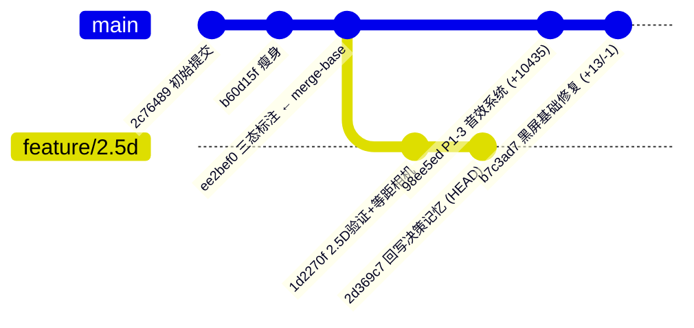
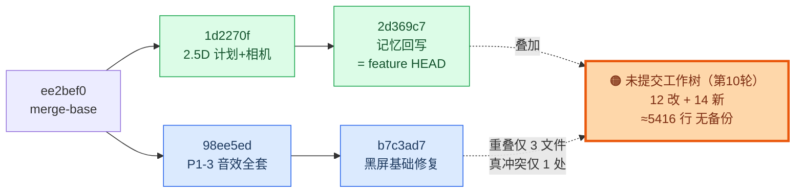

# 分支合并协调方案：`main` × `feature/2.5d`

> 产出人：架构师 高见远
> 日期：2026-08-11
> 工程根：`F:/AI-project/ancientGame/shuimofeng/shuimofeng`
> 文档性质：**纯方案文档**。本文档产出过程中**未执行任何 git 写操作**（无 commit / merge / checkout / stash / reset），全部结论来自只读命令与**临时目录内的无副作用合并预演**。
> 环境限制：本环境**无 Unity、无 dotnet**，无法编译、无法运行 NUnit。凡涉及编译与 Test Runner 的步骤，一律标注 **🔴 待用户本地执行**。

---

> 🛑 **【2026-08-12 策略更正 · 主理人齐活林】**
> 本文 §0「推荐策略 A」（feature→main 合并再回合）**已被用户推翻**。用户明确意图为：
> **`main` = 2D 主线（长期保留可玩版）；`feature/2.5d` = 2.5D 长期并行支线；两条线独立推进、互不影响，不合并。**
> 因此：本会话**不再执行任何 `feature/2.5d` → `main` 合并**，也**不再要求用户把 2.5D 代码"搬"到 main**。
> 2.5D 后续开发**直接在 `feature/2.5d` 上改/提交/推送**即可（代码已在该分支，远程 = `248c0bc`）。
> 下方 §0–§8 的冲突分析仅作为"若将来某天确需合并时的参考"，**非当前待办**。
> 注意：若两线都改 `CombatBridge.cs` 等共享文件会自然分叉——但用户已选择不合并，故分叉无所谓，保持各线自洽即可。

---

## 0. 结论速览（30 秒版）

| 项 | 结论 |
|---|---|
| 合并可行性 | ✅ 可行，且**远比预期干净** |
| 已提交部分（`main` × `feature/2.5d`） | ✅ **零冲突**，`git merge-tree` 实测直接产出合并树 |
| 三方真正重叠的文件 | **仅 3 个**：`Bootstrap.cs`、`CombatBridge.cs`、`docs/changelog.md` |
| 需要人工裁决的冲突 | **仅 1 处**：`CombatBridge.cs` 内 1 个冲突块（机械合并即可，非逻辑打架） |
| `Bootstrap.cs` | ✅ 自动合并干净，结果 = feature 工作树版（已实证为 main 版的**严格超集**，0 行删除） |
| `docs/changelog.md` | ⚠️ **文本自动合并成功，但语义错误**（出现两个「阶段 23」+ 顺序倒置）→ 最阴的一处 |
| 两套改动的交叉依赖 | ✅ **零**。BOSS 代码不引用任何音频符号，反之亦然 |
| 最大风险 | ⚠️ **未提交工作树**：约 5416 行产出（1329 行已跟踪改动 + 4087 行未跟踪新文件）**无任何备份**（无 commit / 无 stash / 无 reflog） |
| 推荐策略 | **策略 A**：feature 先落盘提交 → `feature/2.5d` merge `main` → 解冲突 → 验证 → `main` merge `feature/2.5d` |

---

## 1. 对任务简报的核实订正

> 要求「凡写进文档的路径/行号/符号/hunk 必须自行复核」。以下为**实测与简报不符**之处，均以命令输出为准。

| # | 简报说法 | 实测结论 | 证据 |
|---|---|---|---|
| 1 | `docs/feature-closure-plan.md` **两边都改过**，属冲突点 | ❌ **不成立**。feature 侧（含已提交与工作树）**从未碰过**该文件，仅 `main/98ee5ed` 单边改 1 行 → **自动合入，零冲突** | `comm -12` 重叠集不含该文件；`git log main -- <file>` 仅 `98ee5ed`/`ee2bef0`/`2c76489` |
| 2 | `docs/changelog.md`「两边各自追加在文件尾 → **文本必冲突**」 | ❌ **不冲突**。`git merge-file` 实测 `rc=0`、冲突块 0，自动合并出 897 行。**但语义是错的**（见 §6.3），属"假绿"，比冲突更危险 | 预演 `changelog.md` rc=0 |
| 3 | main 的 changelog 用「**阶段 23**」，feature 用「阶段 24」，冲突源于编号 | ⚠️ **部分不符**。真实情况更糟：main 加的是 `### 阶段 23 · P1-3 音效…`，而 feature **也**加了一个 `### 阶段 23 · P2-1「BOSS 战接线」（08-09 夜）`，外加 `## 阶段 24 · …`。合并后**同时存在两个「阶段 23」** | 合并结果 792 行 / 821 行各有一个 `### 阶段 23` |
| 4 | changelog 章节均为 `##` 级 | ❌ base 与 main 的阶段标题实为 `###`（H3，如 `### 阶段 22`、`### 阶段 23`）；feature 的 `## 阶段 24` 用了 **H2，层级与全文不一致** | `awk` 标题扫描 |
| 5 | CombatBridge/main hunk 头 `@@ -114,6 +114,21 @@`、`@@ -585,6 +611,124 @@` | ⚠️ 差 1 行：实测为 `@@ -115,6 +115,21 @@`、`@@ -586,6 +612,124 @@`。其余 2 处（`-343`、`-1366`）完全一致 | `diff -u base main` |
| 6 | `CombatController.cs` 属「Unity 层」 | ❌ **路径错**。实际为 `Assets/Scripts/Systems/Combat/Unity/CombatController.cs`，位于**内核脚本根**下的 `Unity/` 子目录，**不在** `Assets/_Project/Scripts/Runtime/` | `git status --short` |
| 7 | main 独有共约 **10453** 行 | ⚠️ 实测 **10449** 行（21 files changed, 10449 insertions(+), 2 deletions(-)） | `git diff --stat base main` |
| 8 | `-1366` 两边都改、`-343`/`-357` 相邻 → 暗示多处硬冲突 | ⚠️ 只有 `-1366` 是真冲突（**1 处**）。`-343`（main，覆盖 343–348）与 `-357`（feature，覆盖 357–362）**间隔 9 行、不重叠**，git 自动合并 | 见 §6.1 hunk 级表 |
| 9 | （未提及） | ✅ **补充**：`main` 新增的 7 个音频 `.cs` **全部没有配套 `.meta`**；feature 的 5 个新 `.cs` **都有 `.meta`** | `git cat-file -e main:<...>.cs.meta` 全部 N |
| 10 | （未提及） | ✅ **补充**：`audio_syntax_check.py` / `audio_guard_mutation_test.py` / `qa_dsp_verify.py` **只存在于 `main`**，当前工作树（feature）**没有这三个文件**，因此**合并前无法运行**，只能作为合并后闸门 | `[MISS]` + `main=Y feat=N` |
| 11 | （未提及） | ✅ **补充**：`t1_selfcheck.py` / `t3_selfcheck.py` 被 `.gitignore:44`（`Assets/Scripts/**/Tests/*.py`）忽略，**不属于任何分支**，不参与合并，全程可用 | `git check-ignore -v` |

### 1.1 一个必须写下来的预演陷阱（CRLF）

仓库 `core.autocrlf=true` 且**无 `.gitattributes`**：

| 位置 | 换行符 | 实测 |
|---|---|---|
| 对象库 blob | **纯 LF** | `Bootstrap.cs@main`：CRLF=0，bare_LF=220 |
| 工作树文件 | **纯 CRLF** | `Bootstrap.cs` 工作树：CRLF=328，bare_LF=0 |

> ⚠️ **陷阱**：若把 `git show` 导出的文件（LF）与工作树文件（CRLF）直接做三方合并，会得到**整文件冲突**的假象（我第一次预演就踩了：Bootstrap/CombatBridge/changelog 三个文件各报一个横跨全文的冲突块）。
> **正确做法**：预演前先对工作树副本套用 git 的 clean 过滤（`CRLF → LF`）。修正后 Bootstrap 与 changelog 立刻变为 `rc=0` 干净合并。
> **对真实合并的影响：无**。`git merge` 本身在对象空间比较，会自动归一，不会因此产生冲突。此条仅用于警示"手工预演/手工比对"时不要被误导。

---

## 2. 分叉现状图



**当前工作树叠加在 `feature/2.5d` 顶点之上（未提交）：**



**10 秒读懂：**

- **`main` 有而 feature 完全没有**：整套 P1-3 音效系统（6 个运行时类 + 1 个测试集 + 3 个护栏脚本 + 6 篇文档 + `docs/unity-p2-1-boss-prd.md`）+ 黑屏**基础**修复。共 **21 文件 / +10449 行**。
- **feature 有而 main 完全没有**：已提交的 2.5D 验证骨架（5 文件 / +286 行）+ **未提交**的第 10 轮 BOSS 全套（12 改 + 14 新 / ≈5416 行）。
- **两边都碰的**：只有 `Bootstrap.cs`、`CombatBridge.cs`、`docs/changelog.md` 三个文件。

---

## 3. 双向差集清单表（文件级）

图例：🔵 仅 main ｜ 🟢 仅 feature ｜ 🟠 双改 ｜ ✅ 无冲突 ｜ ⚠️ 需处理

### 3.1 仅 `main`（21 文件，+10449 行）— 全部 ✅ 无冲突，直接合入

| 文件 | 行数 | 类别 |
|---|---:|---|
| `Assets/_Project/Scripts/Runtime/AmbienceLayer.cs` | 357 | 🔵 新增 |
| `Assets/_Project/Scripts/Runtime/AudioClipFactory.cs` | 369 | 🔵 新增 |
| `Assets/_Project/Scripts/Runtime/AudioConfig.cs` | 769 | 🔵 新增 |
| `Assets/_Project/Scripts/Runtime/AudioDirector.cs` | 1224 | 🔵 新增 |
| `Assets/_Project/Scripts/Runtime/SfxRecipes.cs` | 1415 | 🔵 新增 |
| `Assets/_Project/Scripts/Runtime/SfxSynth.cs` | 844 | 🔵 新增 |
| `Assets/_Project/Scripts/Runtime/Tests/P1_3_AudioTests.cs` | 1487 | 🔵 新增测试 |
| `Assets/_Project/audio_syntax_check.py` | 429 | 🔵 护栏脚本 |
| `Assets/_Project/audio_guard_mutation_test.py` | 74 | 🔵 护栏脚本 |
| `docs/qa_dsp_verify.py` | 204 | 🔵 护栏脚本 |
| `docs/unity-p1-3-audio-prd.md` | 573 | 🔵 文档 |
| `docs/unity-p1-3-audio-architecture.md` | 1129 | 🔵 文档 |
| `docs/unity-p1-3-audio-qa-report.md` | 349 | 🔵 文档 |
| `docs/audio-class-diagram.mermaid` | 363 | 🔵 文档 |
| `docs/audio-sequence-diagram.mermaid` | 220 | 🔵 文档 |
| `docs/verification-checklist.md` | 54 | 🔵 文档 |
| **`docs/unity-p2-1-boss-prd.md`** | **372** | 🔵 文档（**PRD 在 main，实现在 feature**，见 §6.5） |
| `docs/feature-closure-plan.md` | +1/-1 | 🔵 单边改（P1-3 行标为已交付）→ **简报误判为冲突** |
| `docs/changelog.md` | +53 | 🟠 见 §6.3 |
| `Assets/_Project/Scripts/Runtime/Bootstrap.cs` | +13/-1 | 🟠 见 §6.2 |
| `Assets/_Project/Scripts/Runtime/CombatBridge.cs` | +150 | 🟠 见 §6.1 |

> ⚠️ 7 个音频 `.cs` 均**未提交 `.meta`**。Unity 首次导入会自动生成新 GUID 的 `.meta`——对纯脚本无害（脚本引用按类型名解析），但建议合并后**把新生成的 `.meta` 一并提交**，避免多人协作时 GUID 漂移。

### 3.2 仅 `feature/2.5d`（已提交，5 文件 +286 行）— 全部 ✅ 无冲突

| 文件 | 行数 |
|---|---:|
| `Assets/_Project/Scripts/Runtime/2.5D/IsometricCameraRig.cs` | 57 |
| `docs/2.5d-tech-verify-plan.md` | 100 |
| `.workbuddy/memory/MEMORY.md` | +64 |
| `.workbuddy/memory/2026-08-10.md` | +29 |
| `.workbuddy/automations/automation-1786170865072/memory.md` | +40/-4 |

### 3.3 仅 `feature/2.5d`（**未提交工作树**，第 10 轮）— ✅ 除 3 文件外无冲突

**已跟踪改动（12 文件，+1329/-9）**

| 文件 | 增减 | 归属层 | 冲突 |
|---|---:|---|---|
| `Assets/Scripts/Systems/Combat/Encounter.cs` | +175 | 内核 | ✅ |
| `Assets/Scripts/Systems/Combat/RunPhase.cs` | +13 | 内核 | ✅ |
| `Assets/Scripts/Systems/Combat/Tests/RunPhaseTests.cs` | +219 | 内核测试 | ✅ |
| **`Assets/Scripts/Systems/Combat/Unity/CombatController.cs`** | +30 | **内核根下 Unity 子目录**（简报路径有误） | ✅ |
| `Assets/_Project/Scripts/Runtime/EnemySpawner.cs` | +62 | Unity 层 | ✅ |
| `Assets/_Project/Scripts/Runtime/Hud.cs` | +38 | Unity 层 | ✅ |
| `Assets/_Project/Scripts/Runtime/WorldBuilder.cs` | +109 | Unity 层 | ✅ |
| `Assets/_Project/Scripts/Runtime/Bootstrap.cs` | +122 | Unity 层 | 🟠 §6.2 |
| `Assets/_Project/Scripts/Runtime/CombatBridge.cs` | +509 | Unity 层 | 🟠 §6.1 |
| `docs/changelog.md` | +27 | 文档 | 🟠 §6.3 |
| `.workbuddy/memory/2026-08-10.md` | +9 | 记忆 | ✅ §6.4 |
| `.workbuddy/automations/…/memory.md` | +25 | 记忆 | ✅ §6.4 |

**未跟踪新文件（14 个，4087 行）— 全部 ✅ 无冲突（main 侧不存在同名文件）**

| 文件 | 行数 |
|---|---:|
| `Assets/_Project/Scripts/Runtime/BossFlowConfig.cs` (+`.meta` 11) | 203 |
| `Assets/_Project/Scripts/Runtime/FxAutoDespawn.cs` (+`.meta` 11) | 62 |
| `Assets/_Project/Scripts/Runtime/HudBossBar.cs` (+`.meta` 11) | 341 |
| `Assets/_Project/Scripts/Runtime/Tests/P0_4_BootstrapResetTests.cs` (+`.meta` 11) | 562 |
| `Assets/_Project/Scripts/Runtime/Tests/P2_1_BossWiringTests.cs` (+`.meta` 11) | 553 |
| `docs/unity-p2-1-boss-architecture.md` | 1426 |
| `docs/boss-class-diagram.mermaid` | 354 |
| `docs/boss-sequence-diagram.mermaid` | 182 |
| **`docs/p2-1-bosspending-qa-report.md`** ⭐ | **349** |

> ⭐ `docs/p2-1-bosspending-qa-report.md` 于 **2026-08-11 08:26** 由并行的 QA 流程生成（**非本方案产出**），属第 10 轮 P2-1 配套交付物。它在本方案初稿完成后才出现，**务必一并纳入阶段 1 的提交**，否则会被落下。
> 该报告自述「新增文件：2 个 `.py` + 本报告」——那 2 个 `.py` 若位于 `Assets/Scripts/**/Tests/`，会被 `.gitignore:44` 忽略，属**本地工具**，不参与合并（与 `t1/t3_selfcheck.py` 同性质）。提交前请用 `git status --short` 再确认一次是否还有其他新产物。

### 3.4 三方重叠（🟠 双改）

| 文件 | merge-file 预演 | 结论 |
|---|---|---|
| `Assets/_Project/Scripts/Runtime/Bootstrap.cs` | `rc=0`，冲突块 **0** | ✅ 自动合并，结果 328 行 = feature 版 |
| `Assets/_Project/Scripts/Runtime/CombatBridge.cs` | `rc=1`，冲突块 **1**（结果行 1550–1568） | ⚠️ 唯一需人工动手处 |
| `docs/changelog.md` | `rc=0`，冲突块 **0** | ⚠️ **假绿**，语义错误需人工修正 |

---

## 4. 合并预演：一手证据

### 4.1 已提交部分 — 零冲突（`git merge-tree`）

```
$ git merge-tree --write-tree --name-only main feature/2.5d
5608f656424341bd484ed1a5c6b22747e575ccf4
$ echo $?
0
```

> 新式 `merge-tree` 在**有冲突时**会在树 OID 之后输出冲突文件清单并返回非 0。此处**只输出了一个树 OID、退出码 0** ⇒ `main` 与 `feature/2.5d` 的**已提交内容完全无冲突**。
> 原因很直白：feature 已提交部分只碰了 `.workbuddy/*`、`IsometricCameraRig.cs`、`2.5d-tech-verify-plan.md`，与 main 的改动集**交集为空**。

**⇒ 本次合并的全部冲突，100% 来自未提交的工作树改动。**

### 4.2 未提交部分叠加后 — 逐文件三方预演

方法（无副作用，全程在系统临时目录内，未触碰仓库任何 ref/index/worktree）：

1. `base` = `git cat-file blob $(git merge-base main feature/2.5d):<file>`（LF）
2. `main` = `git cat-file blob main:<file>`（LF）
3. `feat` = 工作树文件 **套用 clean 过滤**（`CRLF → LF`），模拟"第 10 轮已提交到 feature"
4. `git merge-file -p --diff3 feat base main`

| 文件 | rc | 冲突块 | 合并后行数 | 冲突块位置 |
|---|---:|---:|---:|---|
| `Bootstrap.cs` | 0 | 0 | 328 | — |
| `CombatBridge.cs` | 1 | **1** | 2144（含标记） | 1550–1568 |
| `changelog.md` | 0 | 0 | 897 | — |

---

## 5. 交叉依赖核查（决定"能否机械合并"的关键）

| 检查 | 结果 |
|---|---|
| feature 的 BOSS 新文件（`BossFlowConfig` / `HudBossBar` / `FxAutoDespawn` / 2 个测试集）中出现 `AudioDirector` / `SetupAudio` / `TeardownAudio` / `_audio` / `PlaySfx` / `AudioConfig` / `SfxRecipes` | **全部 0 次** |
| feature 工作树版 `CombatBridge.cs` 中出现 `AudioDirector` / `SetupAudio` / `TeardownAudio` | **全部 0 次** |

**⇒ 两套改动在符号层面完全正交。** 这是"逐 hunk 机械合并"成立的前提，也是本次合并风险低的根本原因。

> 📌 **反过来的含义**：合并完成后，BOSS 流程**不会自带任何音效**（BOSS 入场/阶段切换/死亡都无声）。这不是 bug，是两条线各自独立开发的必然结果。**BOSS 音效接线属于合并后的新增工作项**，不应算进本次合并的验收范围。

---

## 6. 逐冲突点解法

### 6.1 ⚠️ `Assets/_Project/Scripts/Runtime/CombatBridge.cs` — 唯一需人工裁决处

**hunk 级合并动作表**（坐标均为 merge-base `ee2bef0` 的行号）

| # | 来源 | hunk 头 | base 覆盖区 | 内容 | 与对侧关系 | 合并动作 |
|---|---|---|---|---|---|---|
| 1 | main | `@@ -115,6 +115,21 @@` | 115–120 | 新增字段 `private AudioDirector _audio;` + 15 行注释 | 对侧无改动 | ✅ **自动**，直接取入 |
| 2 | feature | `@@ -324,6 +324,13 @@` | 324–330 | `Start()` 内 `SpawnFirstWave()` 后插入 `ArmBossPending();` | 对侧无改动 | ✅ **自动** |
| 3 | main | `@@ -343,6 +358,17 @@` | 343–348 | `Start()` 内 `SetupHitFeedback()` 后插入 `SetupAudio();` | 与 #4 **相邻但不重叠**（间隔 9 行） | ✅ **自动** |
| 4 | feature | `@@ -357,6 +364,17 @@` | 357–362 | `Start()` 内 `PhaseChanged +=` 后插入 `SetupBossFlow();` | 与 #3 相邻不重叠 | ✅ **自动** |
| 5 | main | `@@ -586,6 +612,124 @@` | 586–591 | 新增整段「P1-3 音效」方法区（+118 行，**0 删除**） | 对侧无改动 | ✅ **自动** |
| 6 | feature | `@@ -763,9 +781,20 @@` | 763–771 | **唯一含删除的 hunk**：`SetZoneConfig(_zone.Enemies, null, …)` → `SetZoneConfig(_zone.Enemies, _zone.Boss, …)`（-3/+14） | 对侧无改动 | ✅ **自动**（虽是原地改行，但 main 不碰此处） |
| 7 | feature | `@@ -1328,6 +1357,14 @@` | 1328–1333 | 终局处插入 `HideBossBar();` | 对侧无改动 | ✅ **自动** |
| 8 | **main** | `@@ -1366,6 +1510,12 @@` | **1366–1371** | `TeardownHitFeedback();` 后插入 `TeardownAudio();` | 🔴 **与 #9 同锚点** | ⚠️ **人工：保留双方** |
| 9 | **feature** | `@@ -1366,6 +1403,15 @@` | **1366–1371** | `TeardownHitFeedback();` 后插入 `TeardownBossFlow();` | 🔴 **与 #8 同锚点** | ⚠️ **人工：保留双方** |
| 10 | feature | `@@ -1408,6 +1454,463 @@` | 1408–1413 | 新增整段「P2-1 BOSS」方法区（+457 行，0 删除） | 对侧无改动 | ✅ **自动** |

**冲突性质判定**

| 维度 | 判定 |
|---|---|
| 冲突性质 | **同一函数、同一锚点行（`TeardownHitFeedback();`）之后的两处独立追加**。**不是**改同一行，**不是**逻辑打架 |
| 是否可机械合并 | ✅ 可以。两侧插入内容在符号上零交集（§5 已证），互不引用、互不依赖 |
| 推荐解法 | **保留双方**，顺序：先 `TeardownAudio()`（main），后 `TeardownBossFlow()`（feature） |
| 取舍理由 | 与 `Start()` 中的装配顺序保持镜像一致：合并后装配序为 `SetupHitFeedback → SetupAudio → … → SetupBossFlow`（hunk #3 在 #4 之前），拆卸段沿用同序可读性最好。两者互不依赖，**顺序不影响正确性**，此处纯为可读性择优 |
| 风险 | **低**。已实证：按此解法合成后文件 2141 行、0 残留冲突标记、花括号 261/261 平衡、`SetupAudio()`/`TeardownAudio()`/`SetupBossFlow()`/`TeardownBossFlow()`/`ArmBossPending()` 各出现 2 次（定义 1 + 调用 1），无重复无遗漏 |

**推荐的最终形态**（把冲突标记整段替换为下列内容）：

```csharp
            // ★ P1-2：与 SetupHitFeedback 里的两次 += 严格对称，
            //   并在最后兜底放开 FeedbackClock.Frozen（防"下一局开局即全局冻结"）。
            TeardownHitFeedback();

            // ★ P1-3：与 SetupAudio 里的两次 += 严格对称，并在最后按
            //   Stop → clip = null → Destroy(clip) 的顺序真正释放全部 AudioClip。
            //   这一句是**唯一**在正常路径上释放非托管音频资源的地方（Director 的
            //   OnDestroy 里还有一道幂等兜底，防止本组件之外的销毁路径漏掉）。
            TeardownAudio();

            // ★P2-1：与 SetupBossFlow 的 += 严格对称。
            //   BossPhaseChanged 挂在 CombatEventsUnity 上（生命周期跟随 CombatController），
            //   不退订的话，重开后旧回调会拿着一个已销毁的 HudBossBar 去 SetPhase，
            //   在 Unity 里就是一条 MissingReferenceException —— 而它抛在事件分发链里，
            //   会把同一事件的后续订阅者一起带走。顺手清掉 _bossBar / _boss 两个引用，
            //   免得下一局的惰性解析摸到上一局的残骸（Unity 的 == null 重载能识破，
            //   但"看起来非空、其实已死"的对象没必要留着让人猜）。
            TeardownBossFlow();
        }
```

> ✅ **自检口诀**：解完后 `CombatBridge.cs` 应为 **2141 行**；`grep -c "Teardown" ` 能同时看到 `TeardownHitFeedback` / `TeardownAudio` / `TeardownBossFlow` 三行调用。

---

### 6.2 ✅ `Assets/_Project/Scripts/Runtime/Bootstrap.cs` — 确认为严格超集，自动合并

**超集验证（要求「若 feature 版遗漏 main 版任何改动要点，必须点名」）**

```
$ diff -u <main版> <feature工作树版> | grep -c '^-[^-]'
0            ← 零删除行 ⇒ feature 版是 main 版的严格超集
```

逐要点点名核对 `main/b7c3ad7` 的改动是否**全部**存在于 feature 版：

| main `b7c3ad7` 的改动要点 | main 版 | feature 工作树版 | 结论 |
|---|:---:|:---:|---|
| `OnSceneLoaded` 中「按 R 重开 / 暂停菜单重新开始修复」注释块 | 1 处 | 1 处 | ✅ 完整保留 |
| `Debug.Log("[T2] 场景重载完成，无条件强制重建世界（修复重开黑屏）。")` | 1 处 | 1 处 | ✅ 完整保留 |
| `OnSceneLoaded` 末尾无条件 `ShuimoSceneBuilder.BuildAll();`（取代 `BuildWorldIfNeeded()`） | 有 | 有（文件内 `BuildAll();` 共 2 处，两版一致） | ✅ 完整保留 |

**⇒ 未发现任何遗漏。** feature 版在 main 版基础上**额外**新增：

| feature 独有增量 | 说明 |
|---|---|
| 文件头「两个 static bool 必须有复位钩子」注释块（+13 行） | 事故沉淀 |
| `public static bool FirstSceneBootstrapped { get; }` | 只读测试访问器 |
| `public static bool DelegateRegistered { get; }` | 只读测试访问器 |
| `[RuntimeInitializeOnLoadMethod(SubsystemRegistration)] public static void ResetStatics()` | **黑屏根因修复**：复位 `_firstSceneLoaded` / `_registered` |
| `Register()` 上「`=` 是承重的」注释块 | 不变量说明 |
| `SceneManager.sceneLoaded -= OnSceneLoaded;`（幂等订阅先减后加） | **重复订阅修复** |

| 维度 | 判定 |
|---|---|
| 冲突性质 | 名义双改，实为**单向演进**（feature 版 = main 版 + 增量） |
| 推荐解法 | **直接取 feature 工作树版**（git 会自动得出此结果，`rc=0`，无需人工介入） |
| 取舍理由 | main 版只修了「重开路径」这一条成因；feature 版额外修了「Domain Reload 关闭时 static 残值」这条成因，二者是同一黑屏症状的两条独立成因，**必须都在** |
| 风险 | ⚠️ **唯一风险来自人为误操作**：若有人用 `-X ours` / 手工挑 main 侧解决此文件，会**静默丢掉 `ResetStatics` 与幂等订阅**，黑屏 bug 原样复发，且本环境**没有任何自检能发现**（纯 Unity PlayMode 行为，且只在第 2 次进 PlayMode 时暴露）。**执行步骤中已明令禁止对本次合并使用任何 `-X ours/theirs`** |

---

### 6.3 ⚠️ `docs/changelog.md` — 「假绿」：文本自动合并成功，语义错误

**三方结构实测**

| 版本 | 尾部结构 |
|---|---|
| base `ee2bef0` | … → `### 阶段 22 · 文档修复+2.5D 可行性评估（08-09 傍晚）` → `## 附录 A` |
| `main` | … → `### 阶段 22` → **`### 阶段 23 · P1-3 音效系统全栈落地（…2026-08-10）`** → `## 附录 A` |
| feature 工作树 | … → `### 阶段 22` → **`### 阶段 23 · P2-1「BOSS 战接线」（08-09 夜）`** → **`## 阶段 24 · 黑屏完整修复 + P2-1 BOSS 接线（…第10轮）`** → `## 附录 A` |

**git 自动合并的产物（rc=0，无冲突标记）：**

```
792: ### 阶段 23 · P2-1「BOSS 战接线」（08-09 夜）            ← feature
808: ## 阶段 24 · 黑屏完整修复 + P2-1 BOSS 接线（第10轮）      ← feature
821: ### 阶段 23 · P1-3 音效系统全栈落地（2026-08-10）         ← main   ❌ 编号重复 + 顺序倒置
874: ## 附录 A · 关键指标速查
```

**三处缺陷**

| # | 缺陷 | 说明 |
|---|---|---|
| 1 | **编号重复** | 合并后同时存在两个「阶段 23」（一个记 P2-1 BOSS 接线，一个记 P1-3 音效） |
| 2 | **时序倒置** | 「阶段 24」（08-10 第10轮）排在「阶段 23 · P1-3」（08-10）**之前** |
| 3 | **层级不一致** | base/main 的阶段标题均为 `###`(H3)，feature 的 `## 阶段 24` 用了 `##`(H2) |

| 维度 | 判定 |
|---|---|
| 冲突性质 | **无文本冲突，但语义错误**——git 会报成功，人若不看就直接带病入库 |
| 推荐解法 | 合并后**手工重排**尾部章节，按下表统一编号与层级 |
| 取舍理由 | 编号应反映**实际落地时序**：P1-3 音效（`98ee5ed`，第 8 轮）早于第 10 轮 BOSS 接线；且 feature 自加的「阶段 23 · P2-1（08-09 夜）」与「阶段 24」内容高度重叠，应合并为一节 |
| 风险 | **低**（纯文档），但**发现概率也低**——这是本次合并唯一"工具报绿、结果是错的"的地方 |

**推荐的合并后章节顺序与编号（★ 主理人齐活林第 11 轮拍板裁定，已覆盖架构师初版建议）**

裁定口径：**阶段号一律按「落盘时序」递增**，这是 changelog 从阶段 1 起就在用的口径，不按"第几轮产出"算。据此 P2-1 接线（08-09 夜）早于 P1-3 归位 `main`（08-10），编号 23 归前者。

| 顺序 | 标题（统一为 `###` H3） | 来源 | 本轮状态 |
|---|---|---|---|
| 1 | `### 阶段 22 · 文档修复：闪避 PRD 资源描述 + 2.5D 方向可行性评估（08-09 傍晚）` | base | 不动 |
| 2 | `### 阶段 23 · P2-1「BOSS 战接线」（08-09 夜）` | feature 已有 | **不动**（时序上它就是 23） |
| 3 | `### 阶段 24 · P1-3 音效系统全栈落地（程序化合成，零二进制资源，2026-08-10）` | main 现为「阶段 23」 | 🔴 **合并时重编号 23 → 24**（main 侧唯一需改的编号） |
| 4 | `### 阶段 25 · 黑屏完整修复（ResetStatics + 幂等订阅 + 回归测试）+ P2-1 BOSS 接线（第10轮）` | feature 工作树原「阶段 24」 | ✅ **第 11 轮已在 feature 侧改完**（`##`→`###` 层级也已统一） |
| 5 | `### 阶段 26 · 分叉风险收束 + BossPending 内核护栏（第11轮）` | 第 11 轮新增 | ✅ 已落盘 |
| 6 | `## 附录 A · 关键指标速查（全阶段核实）` | base | 不动 |

**与架构师初版建议的两处差异（及理由）**

| # | 架构师初版 | 主理人裁定 | 理由 |
|---|---|---|---|
| 1 | 23 = P1-3 音效（编号不动） | 23 = P2-1 接线，P1-3 改 24 | 按落盘时序，P2-1 是 08-09 夜、P1-3 是 08-10。且此方案下 feature 侧零改动、main 侧只改 1 个数字，总改动量更小 |
| 2 | 把「阶段 23·P2-1」与「阶段 24」**合并为一节** | **保留为两节** | 两者是不同轮次的独立产出（08-09 夜的六根线接线 vs 第 10 轮的内核 BossPending 状态机 + 黑屏修复），合并会抹掉"内核状态机是后补的"这一关键时序信息 |

**合并时对 main 侧那一节的具体操作**（唯一动作）：
```bash
# 把 main 带来的「阶段 23 · P1-3 音效…」标题改成「阶段 24」，并移动到「阶段 23 · P2-1」之后、「阶段 25」之前
grep -n '^#\+ 阶段 2[2-9]' docs/changelog.md   # 改前：应看到两个「阶段 23」
# …手工编辑…
grep -n '^#\+ 阶段 2[2-9]' docs/changelog.md   # 改后：22/23/24/25/26 唯一且递增，且全部为 ###
```

> 📌 feature 的 changelog 原有一条自写提示：「阶段编号：`main` 已用 `阶段 23`，本回合记为 `阶段 24` 以免合并冲突」。**该判断只对了一半**——它没料到 feature 自己另外还有一个 `### 阶段 23 · P2-1`。**第 11 轮已就地划删除线并注明作废**，无需在合并时再处理。

---

### 6.4 ✅ `.workbuddy/` 记忆文件 — 不构成冲突

| 文件 | 状态 |
|---|---|
| `.workbuddy/memory/MEMORY.md` | feature 已提交 +64；main 未碰 → ✅ 自动 |
| `.workbuddy/memory/2026-08-10.md` | feature 已提交 +29，工作树再 +9；main 未碰 → ✅ 自动 |
| `.workbuddy/automations/automation-1786170865072/memory.md` | feature 已提交 +40/-4，工作树再 +25；main 未碰 → ✅ 自动 |

| 维度 | 判定 |
|---|---|
| 冲突性质 | **无**。`main` 自 `ee2bef0` 起从未修改 `.workbuddy/` 下任何文件（已用重叠集验证） |
| 推荐解法 | **无需任何特殊处理**，以 feature 版为准自然合入。**不要**为它写 merge 驱动或 `.gitattributes` 规则——本次没有冲突面，加规则是无谓复杂度 |
| 取舍理由 | 记忆文件是**追加型时间线**，feature 侧是唯一写入方，天然单向 |
| 风险 | 极低。仅需注意：**未来若 main 也开始写记忆文件**，将出现与 changelog 同类的"追加型假绿"，届时再考虑 `merge=union` |

---

### 6.5 ℹ️ `docs/unity-p2-1-boss-prd.md`（main）× 实现（feature）分居两地

| 维度 | 判定 |
|---|---|
| 现状 | PRD `docs/unity-p2-1-boss-prd.md`（372 行）**只在 main**；架构文档 `docs/unity-p2-1-boss-architecture.md`（1426 行）+ 两张图 + 全部实现代码 **只在 feature 工作树** |
| 是否影响代码合并 | ❌ **完全不影响**。两侧文件名不重叠，git 视为两组独立新增，各自合入即可 |
| 影响什么 | **文档一致性**：合并前，任何单独 checkout 一侧的人都只能看到"有需求无实现"或"有实现无需求"的半张图 |
| 推荐解法 | 合并后做一次**文档对账**：以 `unity-p2-1-boss-prd.md` 的验收条目为准，逐条核对 `unity-p2-1-boss-architecture.md` 与 `P2_1_BossWiringTests.cs` 是否覆盖；对账结论写入 `docs/verification-checklist.md`（该文件来自 main） |
| 风险 | 低，但**容易被忘**。已列入 §8 验证闸门 D-3 |

---

## 7. 候选合并策略比较

| | **策略 A（推荐）**<br/>feature 先提交 → feature merge main → 回合 main | **策略 B**<br/>feature 先提交 → main merge feature | **策略 C**<br/>cherry-pick 拆分 |
|---|---|---|---|
| 步骤概要 | ①第10轮落盘为 commit ②`git switch feature/2.5d && git merge main` ③解 1 处冲突 + 修 changelog ④验证 ⑤`git switch main && git merge feature/2.5d` | ①第10轮落盘 ②`git switch main && git merge feature/2.5d` ③在 main 上解冲突 | 把 `98ee5ed`+`b7c3ad7` cherry-pick 到 feature |
| 冲突解决发生在 | **feature 分支**（隔离区） | **main 分支**（生产线） | feature 分支 |
| 解冲突期间 main 可用性 | ✅ 始终干净可用 | ❌ 处于冲突/半成品态 | ✅ 干净 |
| 验证时机 | ✅ 合并结果在 feature 上**充分验证后**才回合 main | ❌ 验证时 main 已被污染 | ✅ 可验证 |
| 最终 main 的合并动作 | 可 fast-forward 或一次干净 merge，**零冲突** | 一次带冲突的 merge | 需再合一次 |
| 历史可读性 | ✅ 保留完整分支拓扑，一个清晰 merge commit | ✅ 同样保留 | ❌ 提交重复（同内容两份 SHA），后续真 merge 易再冲突 |
| 出错回退成本 | ✅ 低：`git merge --abort` 或重置 feature 即可，main 未动 | ❌ 高：需重置 main，且 main 已推 origin | ⚠️ 中：需 `cherry-pick --abort` + 清理 |
| 额外风险 | 无 | main 若在冲突态被误推 origin，团队全体受影响 | 重复提交污染后续 merge-base，**本场景无收益** |
| **评价** | ⭐ **推荐** | 可行但无必要地把风险放到 main | ❌ 不推荐 |

**推荐：策略 A。**

理由三条：
1. **冲突只有 1 处且是机械合并**——没有任何需要"拆开分批 pick"的理由，策略 C 的复杂度换不来收益，反而制造重复提交。
2. **本次唯一的真风险是未提交工作树**（§9），策略 A 的第一步就把它变成 commit，风险当场归零；后续任何失手都能靠 `git reset --hard <该commit>` 无损回到今天的状态。
3. **验证成本**：合并后必须跑的闸门里，`audio_syntax_check.py` 等三个脚本**只存在于 main**（§1 订正 10）。策略 A 在 feature 上完成 merge 后，这些脚本恰好已被拉进工作树，可以**在回合 main 之前**就跑完全套自证——策略 B 做不到这一点（那时 main 已经脏了）。

---

## 8. 执行步骤（逐条可复制 + 每步回退）

> ⚠️ 以下命令**全部由用户在本地执行**。本文档产出过程未执行其中任何一条。
> ⚠️ **全程禁止使用 `-X ours` / `-X theirs`**。本次唯一的冲突需要**保留双方**，任何一侧的自动取舍都会静默丢代码（尤其 `Bootstrap.cs`，见 §6.2 风险栏）。

### 阶段 0 · 保险丝（**最重要，先做完再谈合并**）

当前工作树有 ≈5416 行**无任何备份**的产出。第一步必须消除这个单点。

```bash
cd F:/AI-project/ancientGame/shuimofeng/shuimofeng

# 0-1 全量物理备份（最稳的一道保险，与 git 无关）
#     Windows 资源管理器复制整个工程目录，或：
cp -r "F:/AI-project/ancientGame/shuimofeng/shuimofeng" "F:/AI-project/_backup_shuimofeng_20260811"

# 0-2 确认当前状态（应为 feature/2.5d，12 改 + 13 未跟踪）
git status --short
git rev-parse --abbrev-ref HEAD          # 期望：feature/2.5d
git rev-parse --short HEAD               # 期望：2d369c7

# 0-3 记下当前锚点（回退全靠它）
git rev-parse HEAD > ../ANCHOR_feature_before_merge.txt
git rev-parse main >> ../ANCHOR_feature_before_merge.txt
```

**回退**：阶段 0 无写操作（除物理拷贝），无需回退。

---

### 阶段 1 · 把第 10 轮产出落盘为 commit

```bash
# 1-1 把未跟踪的 BOSS 新文件全部纳入（含 .meta，一个都不能漏）
git add Assets/_Project/Scripts/Runtime/BossFlowConfig.cs \
        Assets/_Project/Scripts/Runtime/BossFlowConfig.cs.meta \
        Assets/_Project/Scripts/Runtime/FxAutoDespawn.cs \
        Assets/_Project/Scripts/Runtime/FxAutoDespawn.cs.meta \
        Assets/_Project/Scripts/Runtime/HudBossBar.cs \
        Assets/_Project/Scripts/Runtime/HudBossBar.cs.meta \
        Assets/_Project/Scripts/Runtime/Tests/P0_4_BootstrapResetTests.cs \
        Assets/_Project/Scripts/Runtime/Tests/P0_4_BootstrapResetTests.cs.meta \
        Assets/_Project/Scripts/Runtime/Tests/P2_1_BossWiringTests.cs \
        Assets/_Project/Scripts/Runtime/Tests/P2_1_BossWiringTests.cs.meta \
        docs/unity-p2-1-boss-architecture.md \
        docs/boss-class-diagram.mermaid \
        docs/boss-sequence-diagram.mermaid \
        docs/p2-1-bosspending-qa-report.md

# 1-2 纳入 12 个已跟踪改动
git add -u

# 1-3 确认暂存内容 = 12 改 + 14 新，无遗漏无多余
git status --short
git diff --cached --stat | tail -3        # 期望 26 files changed, 约 +5416

# 1-3b ★ 兜底：确认没有新产物被落下（并行 QA 流程仍可能产出新文件）
git status --short | grep '^??'           # 除本方案文档外应为空

# 1-4 提交
git commit -m "P2-1 BOSS 接线 + 黑屏完整修复（ResetStatics/幂等订阅/回归测试）：第10轮产出"

# 1-5 立刻推远端，彻底消除单点
git push origin feature/2.5d
```

**回退**：
```bash
git reset --soft HEAD~1        # 撤提交，改动全部回到暂存区（内容零损失）
# 若已 push 且确需撤回：git push --force-with-lease origin feature/2.5d
```

---

### 阶段 2 · 在 feature 分支合入 main

```bash
# 2-1 记录合并前锚点
git rev-parse HEAD > ../ANCHOR_before_merge.txt

# 2-2 预演（可选，无副作用，应只报 CombatBridge.cs 一个文件）
git merge-tree --write-tree --name-only main feature/2.5d

# 2-3 正式合并（禁止 -X 参数）
git merge --no-ff main -m "合并 main（P1-3 音效系统 + 黑屏基础修复）into feature/2.5d"
```

**预期结果**：git 报 `CONFLICT (content): Merge conflict in Assets/_Project/Scripts/Runtime/CombatBridge.cs`，**且仅此一个文件**。
若报出**更多**冲突文件 → 说明工作树状态与本方案假设不符，**立即 `git merge --abort` 并回来复核**。

**回退**：
```bash
git merge --abort              # 冲突未解决时，一键完全撤销
```

---

### 阶段 3 · 解冲突

```bash
# 3-1 确认冲突面（应只有 1 个文件）
git diff --name-only --diff-filter=U
```

**3-2 手工编辑 `Assets/_Project/Scripts/Runtime/CombatBridge.cs`**：
定位唯一的 `<<<<<<<` 块（在 `TeardownHitFeedback();` 之后），按 **§6.1 的「推荐的最终形态」代码块**整段替换（保留双方，先 `TeardownAudio()` 后 `TeardownBossFlow()`）。

```bash
# 3-3 解完自检（本环境可跑）
grep -c '<<<<<<<\|=======\|>>>>>>>' Assets/_Project/Scripts/Runtime/CombatBridge.cs   # 期望 0
wc -l Assets/_Project/Scripts/Runtime/CombatBridge.cs                                  # 期望 2141
grep -n 'TeardownHitFeedback()\|TeardownAudio()\|TeardownBossFlow()' \
     Assets/_Project/Scripts/Runtime/CombatBridge.cs                                   # 期望三者齐全

# 3-4 手工修正 docs/changelog.md 章节编号与顺序（§6.3 推荐表）
#     ★ git 不会报冲突，必须主动改，否则带病入库
grep -n '^#\+ 阶段 2[2-9]' docs/changelog.md       # 改前确认，应看到两个「阶段 23」
#     …编辑…
grep -n '^#\+ 阶段 2[2-9]' docs/changelog.md       # 改后确认，编号唯一且递增

# 3-5 标记解决并完成合并
git add Assets/_Project/Scripts/Runtime/CombatBridge.cs docs/changelog.md
git commit --no-edit
```

**回退**：
```bash
git merge --abort                                   # 若尚未 git commit
git reset --hard $(cat ../ANCHOR_before_merge.txt)  # 若已 commit
```

---

### 阶段 4 · 验证（详见 §8 闸门清单）

```bash
# 4-1 本环境可自证的四项，全部要过
python Assets/Scripts/Systems/Combat/Tests/t1_selfcheck.py
python Assets/Scripts/Systems/Combat/Tests/t3_selfcheck.py
python Assets/_Project/audio_syntax_check.py          # 合并后才存在
python Assets/_Project/audio_guard_mutation_test.py   # 合并后才存在
```

🔴 **待用户本地执行**：Unity 编译 + Test Runner + 目视/实听（§8 B 栏）。

**闸门**：A 栏四项全绿 **且** B 栏全部通过后，方可进入阶段 5。任一红灯 → 回退至阶段 3 修正。

---

### 阶段 5 · 回合 main

```bash
# 5-1 切到 main（此时工作树应干净）
git status --short          # 期望：空
git switch main

# 5-2 记录 main 锚点
git rev-parse HEAD > ../ANCHOR_main_before.txt        # 期望 b7c3ad7

# 5-3 合并（此时应为 fast-forward 或零冲突 merge）
git merge --no-ff feature/2.5d -m "合并 feature/2.5d：P2-1 BOSS 接线 + 黑屏完整修复 + 2.5D 技术验证骨架"

# 5-4 合并后复跑本环境四项自证
python Assets/Scripts/Systems/Combat/Tests/t1_selfcheck.py
python Assets/Scripts/Systems/Combat/Tests/t3_selfcheck.py
python Assets/_Project/audio_syntax_check.py
python Assets/_Project/audio_guard_mutation_test.py

# 5-5 推送
git push origin main
```

**回退**：
```bash
git reset --hard $(cat ../ANCHOR_main_before.txt)   # 回到 b7c3ad7
# 若已 push：git push --force-with-lease origin main
```

---

### 阶段 6 · 收尾（合并后新增工作项，不属于本次合并验收）

| # | 事项 |
|---|---|
| 6-1 | 把 Unity 自动生成的 7 个音频 `.cs.meta` 补提交（§3.1 注） |
| 6-2 | **BOSS 音效接线**：两套系统正交（§5），BOSS 全流程当前无声，需新开一轮 |
| 6-3 | P2-1 PRD ↔ 架构 ↔ 测试三方对账（§6.5），结论写入 `docs/verification-checklist.md` |
| 6-4 | 更新 `docs/feature-closure-plan.md` 的 P2-1 三态标注 |

---

## 9. 合并后验证闸门清单

### A 栏 · ✅ 本环境可自证（无需 Unity）

| # | 闸门 | 命令 | 通过标准 | 合并前基线（实测） |
|---|---|---|---|---|
| A-1 | 内核战斗自检 | `python Assets/Scripts/Systems/Combat/Tests/t1_selfcheck.py` | **64 / 64 通过**，结果 `PASS` | ✅ 64/64 PASS |
| A-2 | 围攻倍率不漂 | 同上，看汇总行 | **2.5294x**（基线 2.53x，±0.03）；频率表 `1源=1.700 / 2源=3.350 / 3源=4.300 / 4源=4.300 / 8源=4.300` | ✅ 2.5294x |
| A-3 | 静态类型护栏 | `python Assets/Scripts/Systems/Combat/Tests/t3_selfcheck.py` | **9 passed / 0 failed** | ✅ 9/9 PASS（当时扫描 90 个 .cs） |
| A-4 | 音频语法护栏 | `python Assets/_Project/audio_syntax_check.py` | 脚本自身判定通过 | ⛔ **合并前无法运行**（文件只在 main） |
| A-5 | 音频护栏变异测试 | `python Assets/_Project/audio_guard_mutation_test.py` | 脚本自身判定通过 | ⛔ **合并前无法运行**（文件只在 main） |
| A-6 | DSP 校验（可选） | `python docs/qa_dsp_verify.py` | 脚本自身判定通过 | ⛔ **合并前无法运行**（文件只在 main） |
| A-7 | 冲突标记清零 | `grep -rn '<<<<<<<\|>>>>>>>' Assets docs` | **0 命中** | — |
| A-8 | changelog 编号唯一 | `grep -n '^#\+ 阶段 2[2-9]' docs/changelog.md` | 编号**唯一且递增**，无重复「阶段 23」 | ⚠️ 自动合并后会有 2 个「阶段 23」 |

> 📌 **A-3 的预期变化**：合并后 `.cs` 总数由 **90** 增至约 **97**（+7 个音频类）。t3 汇总行里的「N 个 .cs → 类型 …」数字**会变**，这是正常的；**判定标准只看 `9 passed / 0 failed`**，不要把数字变化当回归。
> 📌 **A-4/A-5/A-6 三项在合并前物理不存在**（§1 订正 10）。这也是推荐策略 A 的理由之一：在 feature 上完成 merge 后它们即可用，无需等到 main。

### B 栏 · 🔴 必须用户本地 Unity 执行（本环境无 Unity/dotnet，无法代劳）

| # | 闸门 | 类型 | 通过标准 |
|---|---|---|---|
| B-1 | Unity 编译 | 编译 | Console **0 error**（`.meta` 自动生成的 warning 可忽略） |
| B-2 | Test Runner · `P1_3_AudioTests`（来自 main，1487 行） | EditMode/PlayMode | 全绿。**重点**：合并后 `CombatBridge` 多了 BOSS 接线，需确认音频测试未被拖红 |
| B-3 | Test Runner · `P2_1_BossWiringTests`（feature，553 行） | 测试 | 全绿 |
| B-4 | Test Runner · `P0_4_BootstrapResetTests`（feature，562 行） | 测试 | 全绿。**这是 `ResetStatics` 契约的唯一自动化守卫** |
| B-5 | Test Runner · `RunPhaseTests` RP15–RP19（feature，+219 行） | 测试 | 全绿（BossPending 状态机） |
| B-6 | Test Runner · 全量回归 | 测试 | 无新增红灯 |
| B-7 | **黑屏回归 · 关键路径** | 目视 | 关闭 Domain Reload（Enter Play Mode Options），**连续进出 PlayMode 3 次**，每次都能看到完整世界（地图+人物），**无黑屏** |
| B-8 | 重开路径 | 目视 | 游戏内按 **R** 重开 ≥3 次，世界每次完整重建，**不卡顿递增**（验证幂等订阅生效） |
| B-9 | BOSS 全流程 | 目视 | BossPending → Entering → Fighting → Done 五态推进正常；BOSS 血条出现/隐藏正确 |
| B-10 | BOSS 血条终局收敛 | 目视 | **玩家先死**时，结算面板上方**不残留满血 BOSS 条**（`HideBossBar()` 生效） |
| B-11 | 音效实听 | 实听 | 12 音效 + 1 条环境衬底均可闻，无爆音/无重复叠加 |
| B-12 | 音频资源释放 | 目视 | 重开数次后 Profiler 中 AudioClip 数量**不持续增长**（`TeardownAudio()` 生效） |
| B-13 | 暂停三态 | 目视 | 暂停/主菜单时音效与 BOSS 流程**同步冻结**（`IsGameplayBlocked` 收敛） |
| B-14 | BOSS 音效缺失确认 | 目视 | **确认 BOSS 流程当前无专属音效属预期**（§5），不作为缺陷记录 |

---

## 10. 风险与回退

### 10.1 风险登记

| # | 风险 | 概率 | 影响 | 缓解 |
|---|---|:---:|:---:|---|
| R1 | **未提交工作树丢失**（≈5416 行，无 commit / 无 stash / 无 reflog 可依） | 中 | 🔴 致命 | 阶段 0 全量物理备份 + 阶段 1 立即 commit & push。**在完成阶段 1 之前，禁止任何 `git checkout` / `merge` / `reset` / `stash`** |
| R2 | `Bootstrap.cs` 被误解析到 main 侧 → 静默丢 `ResetStatics` + 幂等订阅 → 黑屏复发 | 低 | 🔴 高 | 全程禁用 `-X ours/theirs`；靠 **B-4 / B-7 / B-8** 兜底。注意 **A 栏无法发现此问题** |
| R3 | `changelog.md` 假绿带病入库 | **高** | 🟡 低 | A-8 闸门强制检查；§6.3 给出目标章节表 |
| R4 | `CombatBridge.cs` 解冲突时漏掉一侧 | 低 | 🔴 高 | 3-3 三条自检（0 标记 / 2141 行 / 三个 Teardown 齐全） |
| R5 | 未跟踪 `.meta` 漏 add → Unity 重新生成 GUID，测试集丢失 asmdef 归属 | 中 | 🟡 中 | 1-1 显式逐个列出 14 个文件；1-3 核对 26 files changed |
| R9 | **并行 QA/自动化流程在合并期间继续产出新文件**（本方案撰写期间就多出了 `docs/p2-1-bosspending-qa-report.md`），导致 1-1 的显式清单过期、新产物被落下 | 中 | 🟡 中 | 执行 1-1 前先跑一次 `git status --short` 对账；1-3b 兜底检查 `^??` 为空；合并期间建议**暂停后台自动化** |
| R6 | 合并后 BOSS 无音效被误当作回归 | 中 | 🟢 无 | §5 已定性；B-14 明确列为预期 |
| R7 | t3 扫描文件数由 90→97 被误当作回归 | 中 | 🟢 无 | A-3 备注已说明只看 `9 passed / 0 failed` |
| R8 | 手工比对时被 CRLF/LF 误导，误判为整文件冲突 | 中 | 🟡 低 | §1.1 已记录；真实 `git merge` 不受影响 |

### 10.2 100% 回到当前状态的回退路径

**当前状态锚点（已核实）**

| 项 | 值 |
|---|---|
| HEAD 分支 | `feature/2.5d` |
| `feature/2.5d` | `2d369c7`（与 `origin/feature/2.5d` **同步**） |
| `main` | `b7c3ad7`（与 `origin/main` **同步**） |
| merge-base | `ee2bef0cec02f39e43554f9562408b56fbab8ff2` |
| 工作树 | 12 文件改动（+1329/-9） + 14 个未跟踪文件（4087 行） |
| 远端 | `git@github.com:lianlingxuelan/shuimo.git` |

> ✅ **好消息**：两个分支的**已提交内容都已推到 origin**，天然有远端备份。
> ⚠️ **坏消息**：**未提交的 ≈5416 行没有任何 git 层面的备份**——这是全场唯一的不可恢复资产。

**按阶段回退**

| 出问题的阶段 | 回退命令 | 恢复程度 |
|---|---|---|
| 阶段 0（备份前） | 无写操作，无需回退 | 100% |
| 阶段 1（提交后） | `git reset --soft HEAD~1` | 100%（回到未提交态，内容零损失） |
| 阶段 2（merge 冲突中） | `git merge --abort` | 100% |
| 阶段 3（已 commit 合并） | `git reset --hard $(cat ../ANCHOR_before_merge.txt)` | 100%（回到阶段 1 的提交） |
| 阶段 5（main 已合并） | `git reset --hard $(cat ../ANCHOR_main_before.txt)`<br/>已 push 则加 `git push --force-with-lease origin main` | 100%（回到 `b7c3ad7`） |

**核按钮：完全放弃，回到今天的原始状态**

```bash
# 前提：阶段 0 的物理备份已做
cd F:/AI-project/ancientGame/shuimofeng
rm -rf shuimofeng
cp -r _backup_shuimofeng_20260811 shuimofeng
cd shuimofeng && git status --short      # 应重现：12 改 + 13 未跟踪
```

若物理备份也没了，但阶段 1 已提交并 push：

```bash
git fetch origin
git switch feature/2.5d
git reset --hard origin/feature/2.5d     # 回到含第10轮产出的提交
git switch main && git reset --hard origin/main
```

---

## 附录 A · 本方案全部结论的复现命令（只读，可安全重跑）

```bash
cd F:/AI-project/ancientGame/shuimofeng/shuimofeng
MB=$(git merge-base main feature/2.5d)                  # ee2bef0…

# 拓扑与差集
git log --all --oneline --graph --decorate
git diff --stat $MB main                                # 21 files, +10449/-2
git diff --stat $MB feature/2.5d                        # 5 files, +286/-4
git diff --stat                                         # 12 files, +1329/-9
git ls-files --others --exclude-standard                # 13 个

# 已提交部分的合并预演（零冲突）
git merge-tree --write-tree --name-only main feature/2.5d

# 三方重叠集
git diff --name-only $MB main | sort > /tmp/m.txt
{ git diff --name-only $MB feature/2.5d; git diff --name-only; \
  git ls-files --others --exclude-standard; } | sort -u > /tmp/f.txt
comm -12 /tmp/m.txt /tmp/f.txt                          # 仅 3 个文件

# CombatBridge 双向 hunk 头
git cat-file blob $MB:Assets/_Project/Scripts/Runtime/CombatBridge.cs > /tmp/cb.base
git cat-file blob main:Assets/_Project/Scripts/Runtime/CombatBridge.cs > /tmp/cb.main
diff -u /tmp/cb.base /tmp/cb.main | grep '^@@'          # 115 / 343 / 586 / 1366

# 换行符真相（务必用 python，MSYS 的 grep 会在管道上误判 CR）
python -c "d=open('Assets/_Project/Scripts/Runtime/Bootstrap.cs','rb').read(); print('worktree CRLF=%d LF=%d'%(d.count(b'\r\n'),d.count(b'\n')-d.count(b'\r\n')))"

# 合并前基线
python Assets/Scripts/Systems/Combat/Tests/t1_selfcheck.py | tail -6
python Assets/Scripts/Systems/Combat/Tests/t3_selfcheck.py | tail -4
```

> ⚠️ 附录 A 中**没有任何写操作**。三方合并预演（`git merge-file`）需要把三个版本导出到**系统临时目录**后进行，且必须先把工作树副本 `CRLF → LF` 归一，否则会得到整文件冲突的假象（§1.1）。

---

## 附录 B · 关键数字速查

| 项 | 值 |
|---|---|
| merge-base | `ee2bef0cec02f39e43554f9562408b56fbab8ff2` |
| main 独有 | 21 文件 / **+10449** 行（简报作 10453） |
| feature 已提交独有 | 5 文件 / +286 行 |
| feature 未提交 | 12 改（+1329/-9）+ 14 新（4087 行）≈ **5416 行** |
| 三方重叠文件 | **3** 个 |
| 真正需人工解决的冲突块 | **1** 个（`CombatBridge.cs`） |
| 解冲突后 `CombatBridge.cs` | **2141** 行，花括号 261/261 |
| 合并后 `Bootstrap.cs` | **328** 行（= feature 版） |
| 合并后 `docs/changelog.md` | 897 行（**需手工重排章节**） |
| 合并后 `.cs` 总数 | 90 → 约 **97** |
| t1 基线 | **64/64**，围攻倍率 **2.5294x** |
| t3 基线 | **9 passed / 0 failed** |
