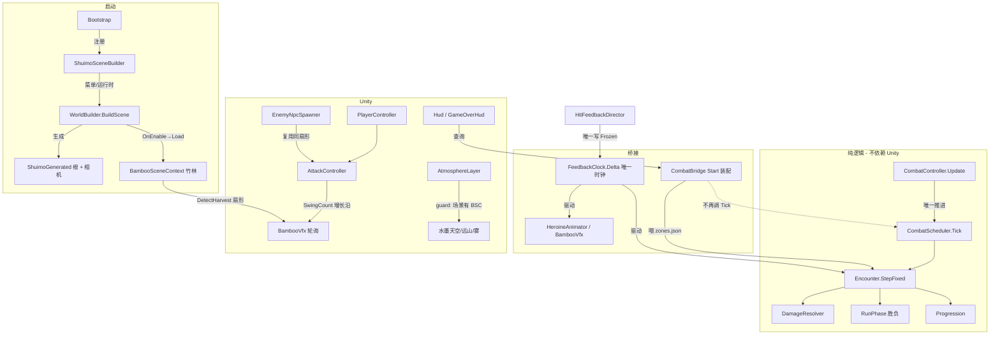

# 水墨仙侠 Shuimo 2.5D —— 项目代码阅读指南

> 适用工程：`F:/AI-project/ancientGame/shuimofeng/shuimofeng`（分支 `feature/2.5d`）
> 目标读者：想从头理解这份代码的人（含主理人自己在不同阶段回看）
> 配套文档：`docs/unity-frontend-onboarding.md`（用前端概念类比 Unity，适合先建立直觉）

---

## 0. 这个项目是什么

一个**水墨风 2.5D 仙侠 RPG** 的 Unity 工程（2.5D = 3D 场景 + 2D/骨骼角色）。

代码最重要的特征是**「纯逻辑内核」与「Unity 表现层」严格分离**：

- **内核（不依赖 UnityEngine）**：战斗、确定性随机、区域数据、数值。可脱离 Unity 单独跑 NUnit。
- **Unity 层（依赖引擎）**：只做桥接、生成、表现、UI。不重写内核逻辑。

这套分层是后面所有目录和阅读顺序的底层逻辑，先记住它。

---

## 1. 目录结构说明

### 1.1 工程根

```
shuimofeng/
├─ Assets/            # Unity 资产与脚本（核心代码在这里）
├─ Packages/          # 包清单（manifest.json / packages-lock.json）
├─ ProjectSettings/   # 工程设置（Graphics / Input 等）
├─ docs/              # 设计 / 架构 / PRD / QA / 对拍 / 本指南
└─ (git 相关)
```

### 1.2 `Assets/Scripts/` —— 纯逻辑内核（**不引用 UnityEngine**）

| 目录 | 用途 | 关键文件 |
|---|---|---|
| `Core/` | 确定性随机 + 区域数据加载 | `PCG32.cs`（可复现 RNG）、`ZoneSeed.cs`（种子派发）、`ZoneData.cs` / `ZoneLoader.cs`（读 zones.json/codex.json）、`WCore.cs`、`Difficulty.cs`；附 `wcore_selfcheck.py` 对拍脚本 |
| `Systems/Combat/` | 战斗内核（纯逻辑） | `Combatant.cs`、`Encounter.cs`、`CombatScheduler.cs`（固定步长推进）、`RunPhase.cs`（胜负状态机）、`DamageResolver.cs`、`Progression.cs`、`EnemyAI.cs`、`Skills/`、`Status/` |
| `Systems/Combat/Unity/` | **纯逻辑桥接层**（注意：仍 `noEngineReferences`，不含 UnityEngine） | `CombatController.cs`（内核推进权唯一）、`FeedbackClock.cs`（全局唯一时钟 / 顿帧）、`CombatView.cs`、`CombatEventsUnity.cs` |
| `Systems/Combat/Tests/` | 内核 NUnit 单测 | `Xianxia.Combat.Tests` |

> 为什么 `Combat/Unity/` 这么命名却“不碰 Unity”？它是内核与表现之间的**逻辑桥**，比如把 `Time` 抽象成 `FeedbackClock.Delta`，这样内核单测时不需要真 Unity。

### 1.3 `Assets/_Project/` —— Unity 表现层与资产

| 目录 | 用途 |
|---|---|
| `Scripts/Runtime/` | Unity 侧 `MonoBehaviour`（程序集 `Xianxia.Unity.T2`）。顶层是战斗/玩家/UI/生成框架；`2.5D/` 子目录是竹林与氛围 |
| `Scripts/Editor/` | 编辑器工具（程序集 `Xianxia.Unity.T2.Editor`）：套材质、放置竹林、重建场景、资源导入 |
| `Art/` | 美术资源：`Characters/`（女主/小怪）、`Bamboo/`（竹子模型与贴图） |
| `Materials/`、`Prefabs/`、`Resources/` | 材质、预制体、运行时资源（`_unused/` 是保留区，**绝不删除**） |
| `Shaders/Ink/` | 自写水墨 Shader：`InkGround` / `InkSky` / `InkMountain` / `BambooTrunk` / `BambooLeaf` 等 |

#### `Scripts/Runtime/` 顶层关键文件

| 文件 | 职责 |
|---|---|
| `Bootstrap.cs` | **启动入口**：持有切片参数(zone/visits/safe)唯一真源；把 `WorldBuilder.BuildScene` 注册到 `ShuimoSceneBuilder`；运行时兜底重建世界 |
| `WorldBuilder.cs` | 世界生成根：程序化搭建场景、相机（`SetupCamera` 定义 ±Z 约定）、注入竹林 |
| `CombatBridge.cs` | 战斗编排：**装配** Encounter（喂 zones.json）、数值接线、对外查询 HP/敌数/步数。**注意它不再调 `Scheduler.Tick`** |
| `PlayerController.cs` | 玩家移动（WASD） |
| `AttackController.cs` / `SkillController.cs` / `DodgeController.cs` | 攻击 / 技能 / 闪避输入 |
| `CharacterView.cs` | 角色表现抽象基类（Sprite / Spine 两套实现） |
| `UnityBoneCharacterView.cs` | Google 骨骼绑定实现（当前仍存在“纸片人”待修项） |
| `HeroineAnimator.cs` | 女主动画（非侵入轮询 `FeedbackClock.Delta`） |
| `Hud.cs` 系列 / `GameOverHud.cs` / `MainMenuHud.cs` / `PauseMenuHud.cs` | UI 与胜负面板、主菜单、暂停 |
| `HitFeedbackDirector.cs` | 顿帧（Hitstop）导演——**唯一**写 `FeedbackClock.Frozen` 的地方 |
| `CameraFollow.cs` / `CameraShake.cs` | 相机跟随与震屏 |
| `Vfx*/Fx*` | 特效（剑气、伤害飘字、状态图标等） |
| `ShuimoSceneBuilder.cs` / `ShuimoGenerated.cs` | 生成框架（编辑器菜单与“已生成根”标记） |
| `InventoryHud.cs` / `PlayerInventory.cs` | 背包雏形（内容未定，暂不动） |

#### `Scripts/Runtime/2.5D/` 子目录（最近重点）

| 文件 | 职责 |
|---|---|
| `BambooSceneContext.cs` | **竹林场景上下文**：程序化生成 20–30 根竹子 + 地面 + 雾；绑定相机跟随；暴露 `DetectHarvest` 扇形。**不挂 `ShuimoGenerated` 标记**，避免被误删 |
| `BambooVfx.cs` | 砍竹特效：晃动 → 断裂 → 墨/叶粒子。动画只用 `FeedbackClock.Delta` |
| `AtmosphereLayer.cs` | **水墨氛围层**（本指南相关的修复点）：`[RuntimeInitializeOnLoadMethod]` 零侵入自挂载，注入水墨天空 + 远山 + 雾。以“场景存在 `BambooSceneContext`”为 guard |
| `EnemyNpcSpawner.cs` / `EnemyPatrol.cs` / `EnemyAiBrain.cs` / `EnemyContactAttack.cs` | 小怪/NPC 确定性撒点、巡逻、AI、接触攻击（复用竹林同一扇形） |
| `IsometricCameraRig.cs` | 等距相机绑定目标 |
| `DepthSortUtility.cs` | 深度排序工具（按与玩家 Y 差推到深度轴） |
| `CharacterView.cs` / `UnityBoneCharacterView.cs` | 同顶层（此处是 2.5D 版职责一致） |

### 1.4 `Assets/Scenes/`

- `SampleScene.unity`：主场景（竹林 2.5D 叠加在上面）
- `T2Slice.unity`：切片验证场景

### 1.5 `Assets/Data/`

- `zones.json` / `codex.json`：区域与图鉴数据，由内核 `ZoneLoader` 读取

### 1.6 `docs/`

设计 / 架构 / PRD / QA / 对拍 / 蓝图。最重要的持久档案是 **`changelog.md`**（每轮任务追加一节，含总览表 + 阶段详述 + 红线约定 + 路线图）。分阶段架构在 `unity-t2-architecture.md`、`unity-t3-architecture.md` 等。

### 1.7 程序集（`asmdef`）分层

| 程序集 | `noEngineReferences` | 引用 | 角色 |
|---|---|---|---|
| `Xianxia.Core` | true | — | 纯净内核：随机/数据 |
| `Xianxia.Combat` | true | Core | 战斗内核 |
| `Xianxia.Combat.Unity` | true | Combat, Core | 纯逻辑桥接（FeedbackClock 等） |
| `Xianxia.Unity.T2` | **false** | 上面三个 + `UnityEngine.UI` + `Unity.2D.Animation.Runtime` | Unity 表现层 |
| `Xianxia.Unity.T2.Editor` | — | Runtime | 编辑器工具 |

**规则**：纯逻辑文件必须待在对应 asmdef 根（`noEngineReferences=true`）；Unity 表现层文件必须放 `_Project/Scripts` 且独立 asmdef。改内核不动 Unity 侧引用，反之亦然。

---

## 2. 阅读顺序（从外到内、从启动到细节）

建议按这条线走，不要一上来钻 `BambooVfx` 的细节：

1. **建立全局心智** → 读 `docs/unity-t2-architecture.md`（或 `changelog.md` 的总览段），理解“内核 / 桥接 / 表现”三层。
2. **启动入口** → `Bootstrap.cs`：切片参数真源、注册机制、`ResetStatics` 教训。
3. **世界生成根** → `WorldBuilder.cs`：场景如何被程序化搭建，相机 ±Z 约定的由来。
4. **战斗内核（纯逻辑）** → 顺序：`Combatant.cs` → `Encounter.cs` → `CombatScheduler.cs`（固定步长）→ `RunPhase.cs`（胜负状态机）→ `DamageResolver.cs` → `Progression.cs`。
5. **桥接层** → `Systems/Combat/Unity/CombatController.cs`（内核推进权唯一）+ `FeedbackClock.cs`（唯一时钟 / 顿帧）+ `CombatView.cs`。
6. **Unity 战斗编排** → `CombatBridge.cs`：装配、数值接线、对外查询（**它不再调 Tick**）。
7. **玩家与输入** → `PlayerController.cs` → `AttackController.cs` / `SkillController.cs` / `DodgeController.cs`。
8. **角色表现** → `CharacterView.cs`（抽象）→ `UnityBoneCharacterView.cs`（骨骼）→ `HeroineAnimator.cs`（非侵入轮询）。
9. **2.5D 竹林（最近重点）** → `BambooSceneContext.cs` → `BambooVfx.cs` → `AtmosphereLayer.cs` → `EnemyNpcSpawner.cs` / `EnemyPatrol.cs` / `EnemyAiBrain.cs`。
10. **UI 与反馈** → `Hud.cs` 系列、`HitFeedbackDirector.cs`、`GameOverHud.cs`、`MainMenuHud.cs` / `PauseMenuHud.cs`。
11. **编辑器工具** → `BambooInkImporter.cs`、`BambooScenePlacer.cs`、`ShuimoSceneRebuilder.cs`（理解如何在编辑器里套材质 / 放置竹林 / 重建场景）。
12. **美术与 Shader** → `Shaders/Ink/*`，对照 `Art/` 与 `Resources/`。

---

## 3. 模块关联（调用链 / 依赖图）



要点解读：

- **启动链**：`Bootstrap` 把 `WorldBuilder.BuildScene` 挂到 `ShuimoSceneBuilder` 的静态委托；运行时若无“活的”世界则兜底重建。`WorldBuilder` 生成场景根并触发 `BambooSceneContext.OnEnable → Load` 长出竹林。
- **战斗链**：`CombatController.Update` 是**唯一**调 `Scheduler.Tick` 的地方；`CombatBridge` 在 `Start` 把 `zones.json` 的 enemies/boss 喂进 `Encounter`，HUD 通过 `CombatBridge` 查 HP/敌数/步数。
- **暂停 / 顿帧红线**：全局唯一时钟是 `FeedbackClock.Delta`。暂停走 `CombatScheduler.Paused`（**不用** `Time.timeScale`）；顿帧由 `HitFeedbackDirector` 写 `FeedbackClock.Frozen`，竹子/角色**只读 Delta**，一处 `Time.deltaTime` 都没有。
- **2.5D 竹林**：`BambooSceneContext` 生成竹子并暴露 `DetectHarvest` 扇形；`AttackController.SwingCount` 增长沿被 `BambooVfx` 轮询（零侵入）；`EnemyNpcSpawner` 复用同一扇形撒点小怪；`AtmosphereLayer` 以“场景里存在 `BambooSceneContext`”为 guard 注入氛围。
- **角色**：`CharacterView` 抽象统一 Sprite/Spine/骨骼；`UnityBoneCharacterView` 绑定 Google 骨骼；`HeroineAnimator` 只读 `FeedbackClock.Delta` 驱动动画，是“纸片人 vs 骨骼”切换的切入点。
- **数据**：Core 的 `ZoneLoader` 读 `zones.json`/`codex.json`；`Bootstrap` 持有切片参数(zone/visits/safe)真源；`WorldBuilder` / `DeterminismDump` / `Hud` 都从 `Bootstrap` 读，不各存一份。

---

## 4. 关键红线（读代码 / 改代码时务必遵守）

1. **内核推进权唯一**：只有 `CombatController` 调 `Scheduler.Tick`，别处不得再调（否则每秒步数翻倍，对拍基线作废）。
2. **暂停不用 `Time.timeScale`**，用 `CombatScheduler.Paused`。
3. **竹子 / 角色动画只用 `FeedbackClock.Delta`**，绝不写 `Time.deltaTime` / `Time.timeScale` / `FeedbackClock.Frozen`。
4. **竹林根不挂 `ShuimoGenerated` 标记**，避免被 `WorldBuilder.DestroyGeneratedRoots()` 在菜单 Clean / 按 R 重开时误删。
5. **纯逻辑与 Unity 表现层严格分 asmdef**；改内核不动 Unity 侧引用，反之亦然。
6. **资产保护**：女主骨骼 prefab / 原图、程序化小怪、已保护资产**绝不删除或覆盖**；新资源一律新增并列。

---

## 5. 本地验证流程

1. 用 **Unity 2022.3** 打开工程目录（即本仓库根）。
2. 菜单 **`Shuimo / Scene / Force Recompile`** 强制重编（解决本环境无法编译、只落地代码的问题）。
3. 进入 **PlayMode**：看竹林生成、氛围层、战斗、UI。
4. 内核可复现性：跑 NUnit（`Xianxia.Core.Tests` / `Xianxia.Combat.Tests`）；同种子 → 同布局。
5. 对拍：参考 `docs/` 下的 `*verify*` / `*selftest*` 文档。

---

## 6. 速查表（文件 → 职责）

| 我想理解… | 先读 |
|---|---|
| 程序怎么起来的 | `Bootstrap.cs` → `WorldBuilder.cs` |
| 战斗怎么算的 | `Systems/Combat/Encounter.cs` → `CombatScheduler.cs` → `DamageResolver.cs` |
| 谁在推内核 | `Systems/Combat/Unity/CombatController.cs`（唯一） |
| 顿帧 / 暂停怎么做的 | `FeedbackClock.cs` + `HitFeedbackDirector.cs` + `CombatScheduler.Paused` |
| 竹林怎么长出来的 | `BambooSceneContext.cs` |
| 砍竹特效 | `BambooVfx.cs` |
| 水墨天空/远山/雾 | `AtmosphereLayer.cs` + `Shaders/Ink/InkSky` / `InkMountain` |
| 小怪怎么撒点 | `EnemyNpcSpawner.cs` → `EnemyPatrol.cs` → `EnemyAiBrain.cs` |
| 女主为什么像纸片人 | `CharacterView.cs` → `UnityBoneCharacterView.cs` → `HeroineAnimator.cs` |
| UI / 胜负面板 | `Hud.cs` 系列 / `GameOverHud.cs` |
| 编辑器里怎么套材质/放竹林 | `BambooInkImporter.cs` / `BambooScenePlacer.cs` / `ShuimoSceneRebuilder.cs` |
| 数据从哪来 | `Assets/Data/zones.json` + `Core/ZoneLoader.cs` |

---

> 本指南与 `changelog.md` 互补：changelog 是“按时间顺序做了什么”，本文件是“代码按什么逻辑组织、从哪里读起”。两者配合即可在任意阶段回看工程。
