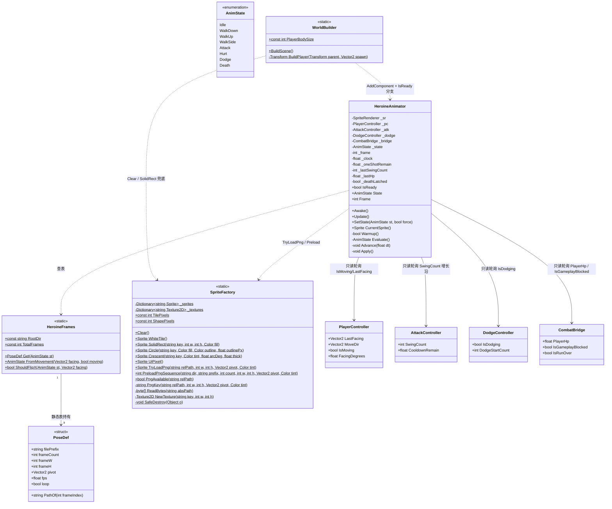
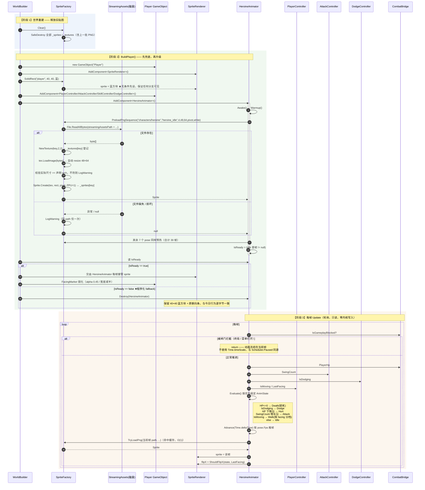
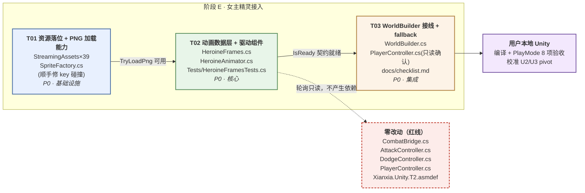

# 美术阶段 E · 女主水墨精灵接入 Unity —— 系统设计与任务分解

> 架构师：高见远 ｜ 工程根：`F:/AI-project/ancientGame/shuimofeng/shuimofeng/`
> 范围：**渲染层**替换玩家蓝方块占位为 39 帧水墨女主精灵。严禁触碰战斗内核。

---

## 0. 实地核实结论（设计前置事实）

| # | 核实项 | 结果 |
|---|--------|------|
| 1 | `Assets/_Project/Scripts/Runtime/{SpriteFactory,WorldBuilder,PlayerController}.cs` | ✅ 全部存在 |
| 2 | `Assets/images/characters/heroine/heroine_*.png` | ✅ **恰好 39 张** |
| 3 | `Assets/StreamingAssets/` | ❌ **不存在**（需新建） |
| 4 | `Assets/Resources/` | ❌ **不存在** |
| 5 | asmdef | 仅 `Runtime/Xianxia.Unity.T2.asmdef`，references = Core / Combat / Combat.Unity / UnityEngine.UI |
| 6 | **39 帧有无 `.meta`** | ❌ **全部没有 .meta** —— 说明 Unity **尚未导入**这批图 |
| 7 | 暂停唯一写点 | `CombatBridge.cs:1042` `controller.Scheduler.Paused = IsGameplayBlocked;`（注释明写"唯一允许写的地方"） |
| 8 | `PlayerController.cs` | grep 全文无 `Sprite`/`Animat` 字样 ✅（背景描述正确） |

**发现 6 是本次设计的关键红利**：39 帧还没有 GUID、没有任何资产引用，**现在移动到 StreamingAssets 是零成本、零引用断裂**。晚一步（用户打开一次 Unity）就会生成 39 个 `.meta`，再移动就要处理导入设置与潜在引用。

**发现 7 决定了暂停方案**：本设计**不读也不写** `Scheduler.Paused`，只读 `CombatBridge.IsGameplayBlocked`（与 `PlayerController.Update` L134-138 完全同款闸门），零内核耦合。

---

## Part A · 系统设计

### 1. 实现方案与关键决策

#### 1.1 总体思路：**纯轮询 + 零侵入**

工程现状给了一个非常干净的接入点——所有动画需要的状态，**都已经是别的组件的 public 只读属性**：

| 动画状态 | 数据来源（现成，已实测存在） | 判定方式 |
|---------|------------------------|---------|
| Death | `CombatBridge.PlayerHp` (L865) | `<= 0` → 终态锁死 |
| Dodge | `DodgeController.IsDodging` (L64) | 直接读 bool |
| Hurt | `CombatBridge.PlayerHp` (L865) | 与上帧比较，**下降沿**触发 |
| Attack | `AttackController.SwingCount` (L80) | 计数**增长沿**触发 |
| Walk\* | `PlayerController.IsMoving` / `LastFacing` (L54/L60) | 朝向分档 |
| Idle | 兜底 | — |
| 冻结 | `CombatBridge.IsGameplayBlocked` (L135) | 同 PlayerController 闸门 |

⇒ **`HeroineAnimator` 只读不写，不需要修改 `PlayerController` / `AttackController` / `DodgeController` / `CombatBridge` 任何一行。**

这是本设计最重要的决策：把"事件推送式动画"改为"状态轮询式动画"。代价是至多 1 帧延迟（60fps 下 16ms，8fps 动画根本感知不到），收益是**内核红线与战斗层零改动风险**，且工程师可以纯靠 grep 属性名做静态自查。

> ❗ 与用户原提法的差异：原方向写"CombatBridge 在攻击/受击/闪避/死亡事件时调 `SetState(...)`"。我**反对**这条 —— 那要在 CombatBridge（44571 字节、内核桥接层、注释里写满红线）里插回调，风险收益比极差。轮询能拿到完全等价的信息。`SetState()` 仍然作为 public API 保留（供未来/调试/测试强制驱动），只是**生产路径不用它**。

#### 1.2 决策一：运行时如何加载 39 张 PNG

| 方案 | 评估 |
|------|------|
| ① **StreamingAssets + `ImageConversion.LoadImage`** | ✅ **推荐** |
| ② `Resources.Load` | ❌ 否决 |
| ③ Editor 用 `AssetDatabase` + 构建回退 StreamingAssets | ❌ 否决 |

**推荐 ①，理由（按权重排序）：**

1. **绕开 AssetImporter 这个静态分析黑洞。** 方案 ②③ 都要求 39 张图被 Unity 导入为 `Texture2D`/`Sprite` 资产，那么 **PPU、Sprite Mode、Pivot、Read/Write、压缩格式全部写在 `.meta` 里**。而本工程 PPU=1 是硬约定（`SpriteFactory` 全文 `Sprite.Create(..., 1.0f, ...)`），Unity 默认导入 PPU=100 —— 意味着必须手工改 39 个导入设置，且**改错了 grep 查不出来**（本环境无 Unity，工程师无法验证 .meta）。走 StreamingAssets 时 PNG 是**纯字节数据**，PPU/pivot 全部由 `Sprite.Create` 在代码里显式指定，**100% 可 grep 自查**。这条直接命中"工程师能用静态分析自查"的约束。
2. **`Resources/` 是 Unity 官方明确反对的目录。** 其内容**无条件全量打进包体**（不管有没有引用），且拖慢启动时的 `Resources` 索引构建。为 39 张 120KB 的图开一个 Resources 目录，是给工程留一个以后会长大的坏习惯。
3. **不污染资产库、不产生 39 个 `.meta` 噪音。** 结合发现 6，现在移动零成本。
4. **`#if UNITY_EDITOR` 双路径（方案③）是 bug 温床。** Editor 与 Build 走两条代码路径，等于"能在编辑器跑"不再是"能在构建跑"的证据。而且 `AssetDatabase` 位于 `UnityEditor`，要在 Runtime asmdef 里引用必须条件编译，`Xianxia.Unity.T2.asmdef` 目前 `includePlatforms: []`（全平台），一旦写漏一个 `#if` 就是构建期报错。
5. **语义正确。** 这批 PNG 就是"运行时读取的数据文件"，StreamingAssets 正是该语义的官方目录。

**平台约束（必须写进代码注释）：** `File.ReadAllBytes(Application.streamingAssetsPath + ...)` 在 **Windows/macOS/Linux Standalone 与 Editor** 可用；在 **Android（jar 内）/ WebGL（http）不可用**，需换 `UnityWebRequest` 异步。本工程 P0 目标平台是 PC Standalone + Editor，故用同步读盘。设计上把"读字节"收敛到 `SpriteFactory.ReadBytes(string absPath)` **一个私有方法**里，将来换平台只改这一处。

**性能：** 39 张 × ≈3.5KB ≈ **136KB**，一次性同步读盘 + `LoadImage` 解码，实测量级 < 20ms，发生在 `BuildPlayer()`（本就是重建世界的卡顿窗口）内，**不需要异步**。预热（而非懒加载）是刻意选择：避免玩家第一次挥剑/死亡时卡一帧读盘。

**资源落位：MOVE 而非 COPY。**
```
Assets/images/characters/heroine/heroine_*.png   (39)   ──MOVE──▶
Assets/StreamingAssets/characters/heroine/heroine_*.png (39)
```
`Assets/images/characters/heroine/` 下的 5 张原始大图（1.4MB 级，已有 `.meta`）**保持原位不动**，它们是素材归档，与运行时无关。

#### 1.3 决策二：缓存 key 设计

**先说现状里的真 bug。** 现有 `SolidRect` 的 key 是 `"rect_" + key`，**不含 w/h/fill**：

```csharp
// SpriteFactory.cs L88
string k = "rect_" + key;   // ← w、h、fill 全部不参与
```

这意味着 `SolidRect("player", 40, 40, blue)` 之后，任何地方再调 `SolidRect("player", 20, 20, red)` 会**静默返回 40×40 的蓝块**。目前没爆是因为调用点恰好一一对应（实测全工程 5 处：`player` / `player_facing` / `ui_white` ×5），但这是定时炸弹，且正是用户"key 要含 w×h×color"诉求的由来。**本次一并修掉**（`Circle` 同理）。

**统一 key 规约（三类资源共用一套构造函数）：**

```
程序化矩形： rect|<key>|<w>x<h>|<RRGGBBAA>
程序化圆：   circ|<key>|<n>|<fillRGBA>|<outlineRGBA>|<outlinePx>
PNG 精灵：   png|<relPath>|<w>x<h>|<tintRGBA>|p<pivotX‰>x<pivotY‰>
```

PNG key 实例：
```
png|characters/heroine/heroine_idle_1|48x64|FFFFFFFF|p500x280
png|characters/heroine/heroine_attack_3|96x64|FFFFFFFF|p250x280
png|characters/heroine/heroine_hurt_1|48x64|FF6666FF|p500x280   ← 同图受击红染，独立条目
```

**逐段论证：**

| 段 | 为什么必须在 key 里 |
|----|-------------------|
| `relPath` | 39 帧互不覆盖的基本盘 |
| `<w>x<h>` | **调用方声明的期望像素尺寸**。① 同一张图未来若做 2× point 放大版本（96×128），key 天然不同，不覆盖；② 加载后与 PNG 实际尺寸**做断言校验**，不符则 `LogWarning` 报出"清单与资产不一致"——这是 39 帧清单唯一的自动化守卫。⚠️ 注意 key 必须能在**查缓存之前**构造出来，所以只能用"声明值"而非"读出来的实际值"，这是设计上必须的取舍 |
| `<tintRGBA>` | 染色实现为逐像素 `px[i] *= tint` **生成新 Texture2D**，与原图是两个独立对象，必须两个 key。`FFFFFFFF` = 不染色（走快路径，跳过整个像素循环） |
| `p<x‰>x<y‰>` | pivot 不同 ⇒ `Sprite.Create` 出的是**不同 Sprite**（可共享 Texture，但本设计不共享，见下）。attack 帧的 96 宽画布 pivot 必然异于 idle（见 §1.4），若不入 key，先建的会覆盖后建的，角色会在挥剑瞬间**整体位移半个身位**——极其隐蔽的 bug。千分比整数化避免浮点入字符串 |

**如何保证随 `Clear()` 一起释放 —— 这是接入现有生命周期的关键手法：**

`ImageConversion.LoadImage` 需要一个**已存在**的 `Texture2D` 实例作为容器（它会自动 resize）。于是：

```csharp
Texture2D tex = NewTexture(k, 2, 2);   // ★ 复用现有私有工厂，它内部执行 _textures[key] = tex
tex.LoadImage(bytes, markNonReadable);  // 自动 resize 成 48×64
```

`NewTexture()`（L294-304）**已经**做了 `_textures[key] = tex` 登记 + `hideFlags = DontSave` + `wrapMode = Clamp`。因此 PNG 纹理**自动**进入现有 `Clear()`（L40-52）的销毁循环，**新增零行生命周期代码**。Sprite 侧同理写 `_sprites[k]`。

> 工程师验收点：`grep -n "new Texture2D" SpriteFactory.cs` 结果必须**仍然只有 1 处**（在 `NewTexture` 内）。出现第 2 处 = 绕过了登记 = 泄漏。

**`markNonReadable` 优化：** `tint == Color.white` 时传 `true`（纹理上传 GPU 后释放 CPU 副本，省一半内存）；需要染色时传 `false`（后续要 `GetPixels32`）。

#### 1.4 尺寸 / pivot / 对齐（PPU=1 的连锁反应）

- **PPU=1 ⇒ 48×64 的 PNG 在世界里就是 48×64 世界单位**（1.5 tile 宽 × 2 tile 高）。玩家占位方块是 `PlayerBodySize = 40`。
- **决策：不缩放，直接用原生像素尺寸。** 人形角色比脚下地块高，是 3/4 视角 RPG 的正常比例。
- **决策：不改 `PlayerBodySize`。** 它被 `AttackController.AttackRadius`(70) 的手感、`PlayerController.UpdateFacingMarker`(L242) 的指示条距离、`clampToWorld` 边距共同依赖。改它 = 战斗手感改动 = 超出"渲染层替换"范围。⇒ `PlayerBodySize` 语义收窄为**逻辑体宽**，新增独立的 `HeroineFrames.FrameW/FrameH` 描述**视觉尺寸**。
- **pivot 必须从 (0.5, 0.5) 改掉。** 现有 `SolidRect` 全部用体心 pivot；人形立绘若用体心，角色会**看起来浮空半身**（世界坐标应锚在脚底）。推荐 `pivot = (0.5f, 0.28f)`（脚底略上一点，兼顾 3/4 视角的"站在格子上"感）。
- **attack 96×64 的水平对齐是本设计唯一无法在无 Unity 环境下定死的参数**，因此**参数化**：`PoseDef` 每个 pose 携带**独立 pivot**。
  - 若生成时角色身体居中、剑向两侧延展 ⇒ `pivotX = 0.5f`
  - 若身体占左半、剑向右挥出 ⇒ `pivotX = 0.25f`（= 24/96）
  - 同理 `death` 64×64 ⇒ 可能需 `pivotX = 0.5f`, `pivotY` 更低（倒地帧重心下移）
  - ⇒ 列入 §待明确事项，需 PlayMode 目测 10 秒即可定。**代码结构已为两种答案都留好位置，改的是一个常量表里的浮点数，不是逻辑。**

#### 1.5 健壮性：程序化 fallback（硬要求）

三层防护，任一层失守都不崩：

```
L1  SpriteFactory.TryLoadPng() 失败 → 返回 null（不抛异常），每个 path 只 LogWarning 一次
L2  HeroineAnimator.Awake() 预热；若 idle_1 缺失 → IsReady = false，组件自我 enabled = false
L3  WorldBuilder.BuildPlayer() 先无条件设蓝方块，再尝试"升级"为精灵
```

L3 的顺序是关键：

```
sr.sprite = SolidRect(蓝方块)          ← 先设，任何分支都保证有可见 Sprite
anim = go.AddComponent<HeroineAnimator>()
if (anim.IsReady) { anim 每帧接管 sr.sprite; }
else               { Destroy(anim);  保留蓝方块 + FacingMarker; }
```

⇒ StreamingAssets 没拷到 / 文件损坏 / 换平台读不到，游戏**照常跑蓝方块**，与今天行为逐字节一致。PRD P0-11「clone 即跑」的精神被保住。

#### 1.6 架构模式

**贫血数据表（`HeroineFrames`，static readonly 常量表）+ 状态机组件（`HeroineAnimator`，MonoBehaviour）+ 静态资源仓库（`SpriteFactory` 扩展）**。
不引入 Unity `Animator`/`AnimationClip`/`AnimatorController` —— 那需要 `.controller` 资产（又是 .meta 黑洞），且状态转移条件配在 Inspector 里、**grep 不可见**，与本工程"一切逻辑在代码里"的既有风格冲突（全工程连一个 Prefab 都没有，敌人模板都是 `SetActive(false)` 的场景对象）。

---

### 2. 文件列表

相对 `F:/AI-project/ancientGame/shuimofeng/shuimofeng/Assets/`：

| 操作 | 路径 | 说明 |
|------|------|------|
| **移动** | `images/characters/heroine/heroine_*.png` (39) → `StreamingAssets/characters/heroine/heroine_*.png` | 新建两级目录；源大图 5 张留原位 |
| **修改** | `_Project/Scripts/Runtime/SpriteFactory.cs` | +PNG 加载 API；key 复合化（`rect`/`circ` 一并修） |
| **新增** | `_Project/Scripts/Runtime/HeroineFrames.cs` | `AnimState` 枚举 + `PoseDef` 结构 + 39 帧静态清单表 |
| **新增** | `_Project/Scripts/Runtime/HeroineAnimator.cs` | 轮询状态机 + 帧推进，写 `SpriteRenderer.sprite` / `flipX` |
| **修改** | `_Project/Scripts/Runtime/WorldBuilder.cs` | `BuildPlayer()` L535-578：三层 fallback 接线 |
| **新增** | `_Project/Scripts/Runtime/Tests/HeroineFramesTests.cs` | EditMode：清单自洽性（39 帧、pose 计数、路径拼接） |
| **不改** | `_Project/Scripts/Runtime/PlayerController.cs` | ✅ 轮询式设计的红利，一行不动 |
| **不改** | `_Project/Scripts/Runtime/{CombatBridge,AttackController,DodgeController}.cs` | ✅ 内核红线 |
| **不改** | `_Project/Scripts/Runtime/Xianxia.Unity.T2.asmdef` | ✅ `System.IO` 在 netstandard；`ImageConversion` 在内置 `UnityEngine.ImageConversionModule`（`noEngineReferences: false` 已覆盖） |

---

### 3. 数据结构与接口（类图）



**关键方法签名（工程师照此实现）：**

```csharp
// ── SpriteFactory 新增（namespace Xianxia.Unity.T2） ──────────────────────
/// relPath 不含扩展名，相对 StreamingAssets 根，正斜杠。例 "characters/heroine/heroine_idle_1"
/// 失败返回 null，绝不抛异常。同一 relPath 的失败只 LogWarning 一次。
public static Sprite TryLoadPng(string relPath, int w, int h, Vector2 pivot, Color tint);

/// 批量预热 prefix_1 .. prefix_<count>。返回成功加载的帧数。
public static int PreloadPngSequence(string dir, string prefix, int count,
                                     int w, int h, Vector2 pivot, Color tint);

/// 仅探测文件是否存在（不加载、不缓存）。用于 WorldBuilder 的快速分支判断。
public static bool PngAvailable(string relPath);


// ── HeroineFrames（新文件） ───────────────────────────────────────────────
public enum AnimState { Idle, WalkDown, WalkUp, WalkSide, Attack, Hurt, Dodge, Death }

public readonly struct PoseDef
{
    public readonly string  FilePrefix;   // "heroine_idle"
    public readonly int     FrameCount;   // 4
    public readonly int     FrameW;       // 48
    public readonly int     FrameH;       // 64
    public readonly Vector2 Pivot;        // (0.5f, 0.28f)
    public readonly float   Fps;          // 4f
    public readonly bool    Loop;         // true
    public string PathOf(int i);          // "characters/heroine/heroine_idle_1"（i 从 0 起，文件名从 1 起）
}

public static class HeroineFrames
{
    public const string RootDir     = "characters/heroine";
    public const int    TotalFrames = 39;
    public static PoseDef Get(AnimState st);
    public static AnimState FromMovement(Vector2 facing, bool moving);
    public static bool ShouldFlipX(AnimState st, Vector2 facing);
}


// ── HeroineAnimator（新文件） ─────────────────────────────────────────────
[DisallowMultipleComponent]
[DefaultExecutionOrder(-50)]        // PlayerController(-100) 之后，默认组件(0) 之前
public sealed class HeroineAnimator : MonoBehaviour
{
    public bool      IsReady { get; private set; }
    public AnimState State   { get; private set; }
    public int       Frame   { get; private set; }
    public void   SetState(AnimState st, bool force = false);  // 调试/测试用，生产路径不调
    public Sprite CurrentSprite();
}
```

**39 帧静态清单表（`HeroineFrames.Get` 的数据，工程师照抄）：**

| AnimState | FilePrefix | 帧数 | W×H | Fps | Loop | Pivot（初值，待目测校准） |
|-----------|-----------|-----|-----|-----|------|--------------------------|
| Idle | `heroine_idle` | 4 | 48×64 | 4 | ✅ | (0.50, 0.28) |
| WalkDown | `heroine_walk_down` | 6 | 48×64 | 8 | ✅ | (0.50, 0.28) |
| WalkUp | `heroine_walk_up` | 6 | 48×64 | 8 | ✅ | (0.50, 0.28) |
| WalkSide | `heroine_walk_side` | 6 | 48×64 | 8 | ✅ | (0.50, 0.28) |
| Attack | `heroine_attack` | 6 | **96**×64 | 12 | ❌ | **(0.25, 0.28)** ⚠️待定 |
| Hurt | `heroine_hurt` | 2 | 48×64 | 8 | ❌ | (0.50, 0.28) |
| Dodge | `heroine_dodge` | 4 | 48×64 | 12 | ❌ | (0.50, 0.28) |
| Death | `heroine_death` | 5 | **64**×64 | 6 | ❌（停末帧） | **(0.50, 0.22)** ⚠️待定 |
| — | 合计 | **39** ✅ | | | | |

**状态优先级（`Evaluate()` 的判定顺序，从高到低）：**
```
Death (锁死，永不回落)  >  Dodge  >  Hurt  >  Attack  >  Walk*  >  Idle
```
一次性状态（Attack/Hurt/Dodge/Death）用 `_oneShotRemain = FrameCount / Fps` 计时；归零后回落到 Walk/Idle。Death 置 `_deathLatched = true`，`Evaluate()` 首行短路返回。

---

### 4. 程序调用流程（时序图）



---

### 5. 待明确事项（需用户/PlayMode 拍板）

| # | 事项 | 我的推荐 | 影响面 |
|---|------|---------|-------|
| **U1** | MVP 只接 idle 静态图，还是一并做 walk/attack/hurt/dodge/death 全动画驱动？ | **一并做全套**。39 帧已经全部生成落盘，驱动代码是同一个状态机，只接 idle 反而要写"以后再删的临时分支"。工作量差异 < 1 小时 | 决定 T02 规模 |
| **U2** | `attack` 96×64 画布里，角色身体是**居中**还是**偏左**？ | 代码已参数化。若居中 → `pivotX = 0.5f`；若身体占左半、剑向右挥 → `pivotX = 0.25f`。**PlayMode 目测 10 秒可定**。默认先填 0.25f（更常见的横向挥砍画布布局） | 只改常量表一个浮点数 |
| **U3** | `death` 64×64 的 pivotY | 倒地帧重心下移，初值 0.22f，同样目测微调 | 同上 |
| **U4** | 敌人白圆本轮是否也换水墨？ | **本轮不动**。① 只生成了女主一套，敌人无素材；② `EnemySpawner` 靠 `Circle(key, body色)` 按 kind 上色区分怪种，换成固定立绘会丢失这套区分度，需要配套设计。留待美术阶段 F | 零改动 |
| **U5** | `FacingMarker` 朝向条：删除 / 保留 / 弱化？ | **弱化保留**（alpha 0.95→0.45、宽度减半）。理由：攻击扇形吃 8 向 `LastFacing`，而动画只有 4 向（up/down/left/right），站桩不动时 idle 图完全不表达朝向 —— 删了玩家就看不出自己在往哪打 | `WorldBuilder` L551-555 两行 |
| **U6** | `Hurt` 是否叠加红色 tint？ | **不叠**。`heroine_hurt_*.png` 是专门画的受击帧，再染红是双重表达。tint 参数保留在 API 里备用（如中毒绿、冰冻蓝的 buff 表现） | 零改动 |
| **U7** | 39 帧移入 StreamingAssets 后，`Assets/images/characters/heroine/` 是否保留空目录？ | 保留（5 张源大图仍在）。**移动前请确认用户本地未打开 Unity**，否则会先生成 .meta | 操作时序 |
| **U8** | 目标平台是否只有 PC Standalone？ | 按 PC + Editor 设计（`File.ReadAllBytes`）。若未来上 Android/WebGL，改 `SpriteFactory.ReadBytes()` **一个私有方法**为 `UnityWebRequest` 异步即可 | 已隔离 |

---

## Part B · 任务分解

### 6. 依赖包

**无新增。** 逐项核对：

| 需求 | 提供方 | 是否需要改 asmdef |
|------|-------|-----------------|
| `File.ReadAllBytes` / `Path.Combine` | `System.IO`（netstandard2.1，Unity 默认可用） | ❌ |
| `ImageConversion.LoadImage(Texture2D, byte[])` | `UnityEngine.ImageConversionModule`（内置模块） | ❌ `noEngineReferences: false` 已覆盖 |
| `Application.streamingAssetsPath` | `UnityEngine.CoreModule` | ❌ |
| `ColorUtility.ToHtmlStringRGBA` | `UnityEngine.CoreModule` | ❌ |
| `Sprite.Create` / `SpriteRenderer` | `UnityEngine.CoreModule` | ❌ |

⇒ `Xianxia.Unity.T2.asmdef` **一个字节都不改**。这也是"不引入新依赖包"（T2 架构文档 §6）的延续。

### 7. 任务列表

> ⚠️ 本次改动实际只涉及 **4 个 .cs + 1 个资源目录**，硬拆到 5 个任务会违反"按功能模块分组、不按单文件拆分"。故给 **3 个任务**（上限内）。依赖链严格线性 T01 → T02 → T03。

---

#### **T01 · 资源落位 + SpriteFactory PNG 加载能力**（基础设施） · P0 · 依赖：无

| 项 | 内容 |
|----|------|
| **文件** | ① 新建 `Assets/StreamingAssets/characters/heroine/`；`git mv` 39 张 `heroine_*.png`<br>② 改 `Assets/_Project/Scripts/Runtime/SpriteFactory.cs`<br>③ 核对 `Xianxia.Unity.T2.asmdef` 无需改动（只读确认） |
| **做什么** | 1. 39 帧 **MOVE**（非 copy）到 StreamingAssets；`Assets/images/characters/heroine/` 下 5 张源大图不动<br>2. `SpriteFactory` 新增私有 `PngKey()` / `ReadBytes()` / 失败去重 `HashSet<string> _pngWarned`<br>3. 新增 public `TryLoadPng()` / `PreloadPngSequence()` / `PngAvailable()`<br>4. 纹理**必须**经现有 `NewTexture()` 创建（自动登记 `_textures`）<br>5. **顺手修 key 碰撞**：`SolidRect` key 加 `w`/`h`/`fill`；`Circle` key 加 `fill`/`outline`/`outlinePx`<br>6. `Clear()` 新增清空 `_pngWarned` |
| **验收（可 grep 静态自查）** | ✅ `ls Assets/StreamingAssets/characters/heroine/*.png \| wc -l` == **39**<br>✅ `ls Assets/images/characters/heroine/heroine_*.png` == **0 个**<br>✅ `grep -c "new Texture2D" SpriteFactory.cs` == **1**（仍只在 `NewTexture` 内）<br>✅ `grep -n "_sprites\[" SpriteFactory.cs` 每个 public 方法都有对应写入<br>✅ `SolidRect` 内 `string k =` 一行同时出现 `w`、`h`、`fill`<br>✅ `Clear()` 方法体内出现 `_pngWarned.Clear()`<br>✅ `TryLoadPng` 内无 `throw`，全路径 `try/catch` 后 `return null`<br>✅ 现有 5 处 `SolidRect`/6 处 `Circle` 调用点**签名不变**（不改调用方） |

---

#### **T02 · 动画数据层 + 驱动组件**（核心） · P0 · 依赖：T01

| 项 | 内容 |
|----|------|
| **文件** | ① 新建 `Assets/_Project/Scripts/Runtime/HeroineFrames.cs`<br>② 新建 `Assets/_Project/Scripts/Runtime/HeroineAnimator.cs`<br>③ 新建 `Assets/_Project/Scripts/Runtime/Tests/HeroineFramesTests.cs`（EditMode，纯数据断言，无需 Unity 运行时） |
| **做什么** | 1. `AnimState` 枚举 8 值 + `PoseDef` 只读结构 + `HeroineFrames` 静态表（照抄 §3 的 39 帧清单表）<br>2. `FromMovement(facing, moving)`：`abs(y) > abs(x)` ⇒ `y>0? WalkUp : WalkDown`，否则 `WalkSide`<br>3. `ShouldFlipX`：仅 `WalkSide`/`Attack`/`Idle` 时 `facing.x < 0` 返回 true（约定源图朝右）<br>4. `HeroineAnimator`：`Awake` 惰性缓存 5 个组件引用 + `Warmup()` 预热 39 帧 → `IsReady`<br>5. `Update`：`IsGameplayBlocked` 闸门 → `Evaluate()` → `Advance(Time.deltaTime)` → `Apply()`<br>6. 边沿检测：`_lastSwingCount` / `_lastHp` 字段；Death 用 `_deathLatched` 锁死 |
| **验收（可 grep 静态自查）** | ✅ `grep -c "new PoseDef\|PoseDef(" HeroineFrames.cs` == **8**<br>✅ 清单表帧数求和 `4+6+6+6+6+2+4+5` == **39**，且 `TotalFrames` 常量 == 39<br>✅ `grep -n "Time.timeScale\|unscaledDeltaTime" HeroineAnimator.cs` == **0 行** ★红线<br>✅ `grep -n "Scheduler\|RunPhase\|CombatScheduler" HeroineAnimator.cs` == **0 行** ★红线<br>✅ `grep -n "IsGameplayBlocked" HeroineAnimator.cs` ≥ 1 行（闸门存在）<br>✅ `HeroineAnimator` 对 `PlayerController`/`AttackController`/`DodgeController`/`CombatBridge` **只有属性读取，无赋值**（grep 这四个变量名后面不得跟 `.X =`）<br>✅ `[DefaultExecutionOrder(-50)]` 存在<br>✅ EditMode 测试断言：8 个 pose 全部可 `Get()`、`PathOf(0)` 结尾为 `_1`、`PathOf(count-1)` 结尾为 `_<count>` |

---

#### **T03 · WorldBuilder 接线 + fallback + 验收清单** · P0 · 依赖：T02

| 项 | 内容 |
|----|------|
| **文件** | ① 改 `Assets/_Project/Scripts/Runtime/WorldBuilder.cs`（`BuildPlayer()` L535-578）<br>② 只读确认 `Assets/_Project/Scripts/Runtime/PlayerController.cs` **零改动**<br>③ 新建 `docs/heroine-integration-checklist.md`（PlayMode 人工验收 + pivot 校准步骤） |
| **做什么** | 1. `BuildPlayer()`：保留 L542 蓝方块**作为第一行无条件兜底**（不删！）<br>2. `AddComponent<HeroineAnimator>()`，读 `IsReady`<br>3. `IsReady==true` → `FacingMarker` 弱化（alpha 0.45、`facingW` 减半）；`false` → `Object.Destroy(anim)`，蓝方块与朝向条原样保留<br>4. 写 `docs/heroine-integration-checklist.md`：列出 U2/U3 pivot 目测校准的具体操作（"进 PlayMode，按住 J 挥剑，看角色是否横移半身位；若横移则把 Attack pivotX 从 0.25 改 0.5"） |
| **验收（可 grep 静态自查）** | ✅ `grep -n 'SolidRect("player"' WorldBuilder.cs` **仍然存在**（fallback 未被删）★硬要求<br>✅ `grep -n "IsReady" WorldBuilder.cs` ≥ 1 行<br>✅ `grep -n "Destroy" WorldBuilder.cs` 出现在 `IsReady == false` 分支<br>✅ `git diff --stat PlayerController.cs` == **0 changed**<br>✅ `git diff --stat CombatBridge.cs AttackController.cs DodgeController.cs` == **0 changed** ★红线<br>✅ `WorldBuilder.PlayerBodySize` 常量值**仍为 40**（未被改动） |
| **PlayMode 人工验收（交用户本地跑）** | ① 开局玩家显示水墨女主，**站立呼吸**（idle 4 帧循环，约 1s/轮）<br>② WASD 移动 → 上/下/左右 三套走路帧正确切换，向左时 `flipX` 生效<br>③ 挥剑 → attack 6 帧播完自动回 idle/walk，**角色不发生水平位移**（若位移 → 校准 U2）<br>④ 被打 → hurt 2 帧；闪避 → dodge 4 帧（后 2 帧半透明残影可见）<br>⑤ 死亡 → death 5 帧播完**停在末帧**，不再循环、不回 idle<br>⑥ 打开暂停菜单 → 动画**冻结**在当前帧（不是继续播）<br>⑦ 菜单里点 Clean And Rebuild ×5 次 → Profiler 里 Texture Memory **不增长**（`Clear()` 生效）<br>⑧ **fallback 验证**：临时把 `StreamingAssets/characters/heroine` 改名 → 重新进 PlayMode → 应显示 40×40 蓝方块 + 朝向条，Console 有 Warning，**无 NullReferenceException** |

---

### 8. 共享知识（跨文件约定，工程师必读）

| # | 约定 | 说明 |
|---|------|------|
| **K1** | **PPU 恒为 1** | `Sprite.Create(..., pixelsPerUnit: 1.0f, ...)` —— 全工程唯一取值。⇒ **像素数 = 世界单位数**。48×64 的 PNG 在世界里就是 48×64 单位（1.5 × 2 tile） |
| **K2** | **一切 Texture2D 必须经 `SpriteFactory.NewTexture()` 创建** | 它负责 `_textures[key]` 登记 + `hideFlags = DontSave`。绕过它 = 逃出 `Clear()` = 每次 Clean And Rebuild 泄漏一批。`grep -c "new Texture2D" SpriteFactory.cs` 永远应等于 1 |
| **K3** | **缓存 key 必须包含全部影响输出的参数** | `png\|<relPath>\|<w>x<h>\|<tintRGBA>\|p<x‰>x<y‰>`。同图不同尺寸/染色/pivot 必须是**不同条目**。`rect`/`circ` 同规则 |
| **K4** | **StreamingAssets 路径用正斜杠、不含扩展名** | API 传 `"characters/heroine/heroine_idle_1"`，`.png` 由 `TryLoadPng` 内部拼。跨平台安全 |
| **K5** | **文件名帧号从 1 起，代码索引从 0 起** | `PathOf(0)` → `heroine_idle_1`。这是唯一的 off-by-one 风险点，`PoseDef.PathOf` 是**唯一**允许做这个 +1 的地方，别处不许再拼文件名 |
| **K6** | **源图朝向约定：`walk_side` 默认朝右（+X）** | 朝左用 `SpriteRenderer.flipX = true`，**不要**用 `localScale.x = -1`（那会把子物体 FacingMarker 一起镜像） |
| **K7** | **动画帧率每 pose 独立** | idle 4fps（1s 一个呼吸循环）、walk 8fps、attack/dodge 12fps（打击感）、death 6fps。不设全局帧率 |
| **K8** | **暂停只读 `CombatBridge.IsGameplayBlocked`** | ★红线：**禁用 `Time.timeScale`**；**禁止**在 `HeroineAnimator` 里读写 `Scheduler.Paused`（`CombatBridge.cs:1042` 是唯一合法写点）。表现层只观察，不参与内核推进 |
| **K9** | **本层对战斗组件只读、绝不赋值** | `PlayerController` / `AttackController` / `DodgeController` / `CombatBridge` 的属性只能出现在赋值号**右边**。动画是纯下游消费者 |
| **K10** | **程序化 fallback 是硬需求，不是"有空再做"** | `TryLoadPng` 永不抛异常；`BuildPlayer` 蓝方块必须**先于**精灵无条件设置。PNG 全丢时游戏行为与今天完全一致 |
| **K11** | **pivot 锚脚底，不锚体心** | 程序化图形沿用 `(0.5, 0.5)`；人形立绘用 `(0.5, 0.28)`。混用两套 pivot 是刻意的，因为方块的"中心"和人的"落脚点"本就不是同一个东西 |
| **K12** | **`PlayerBodySize = 40` 语义收窄为"逻辑体宽"** | 它服务于攻击半径/边界钳制/朝向条距离，**不再**等于视觉尺寸。视觉尺寸看 `PoseDef.FrameW/FrameH`。谁也不许为了"对齐视觉"去改这个常量 |
| **K13** | **`markNonReadable`：不染色时传 true** | `tint == Color.white` ⇒ 上传 GPU 后释放 CPU 副本，39 帧省约一半内存。需要 tint 时必须 false（要 `GetPixels32`） |

### 9. 任务依赖图



---

## 附：推荐实施顺序（一句话版）

**T01 先把 39 张图挪进 StreamingAssets 并让 `SpriteFactory` 会读 PNG（顺手修掉 `SolidRect` 那个 key 不含 w/h/color 的真 bug）→ T02 写 `HeroineFrames` 清单表和 `HeroineAnimator` 轮询状态机（一行不碰战斗组件）→ T03 在 `BuildPlayer` 里做"先蓝方块兜底、再尝试升级为精灵"的三层 fallback 接线 → 交用户本地 Unity 编译 + PlayMode 校准 attack/death 两个 pivot。**
