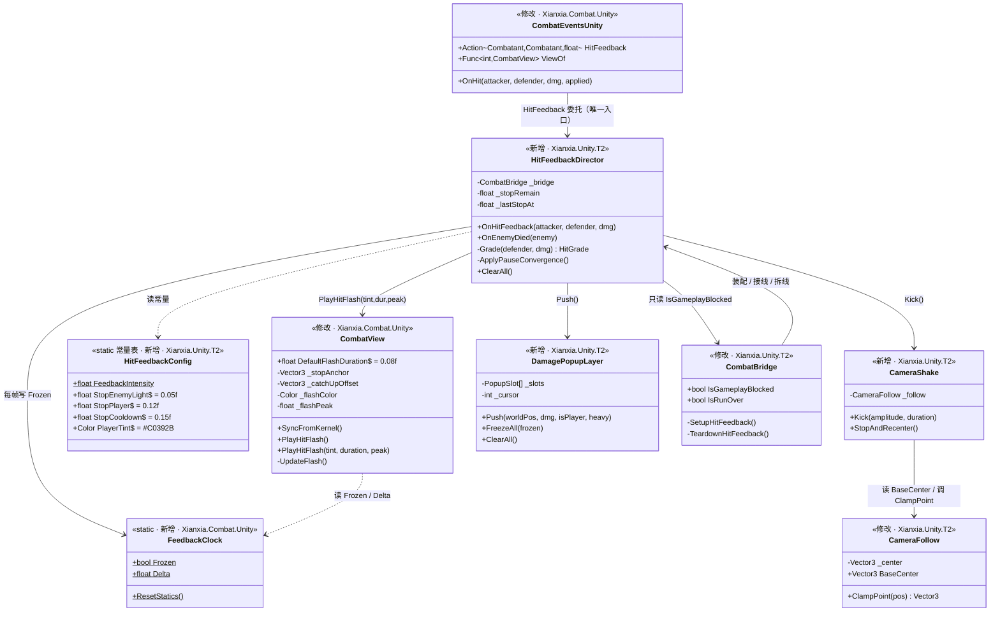
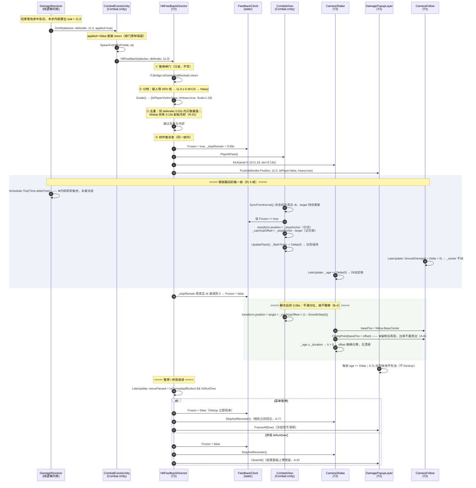
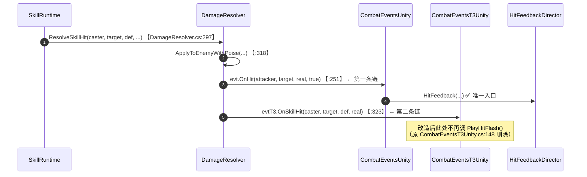
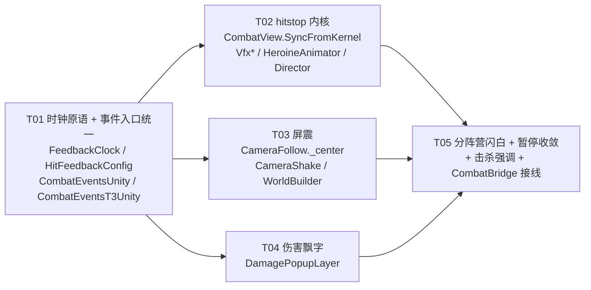

# P1-2 受击反馈 —— 系统设计与任务分解

> 版本：v1.0　｜　作者：高见远（架构师）　｜　对应 PRD：`docs/unity-p1-2-hitfeedback-prd.md`（许清楚 v1.0）
> 唯一工程根：`F:/AI-project/ancientGame/shuimofeng/shuimofeng`。与 `F:/AI-project/xianxia-rpg/`（Godot/Web 原型仓）**无关**，本文所有路径均相对于上述工程根。
> ⚠️ **本环境无 Unity、无 dotnet，本文所有代码片段均未编译验证**。所有符号位置均已 grep 实证，见 §8 证据链。
> 本文同时是设计文档与施工单：§1~§4 是设计，§5 是任务，§6 是约定，§7 是遗留问题。

---

## 0. TL;DR（给工程师的六句话）

1. **一个统一入口**：全部四件套只订阅**一处**事件 —— `CombatEventsUnity.OnHit`。技能链路 `CombatEventsT3Unity.OnSkillHit:148` 的那次 `PlayHitFlash()` 是**重复触发源，直接删掉**（证据见 §2.1，Q1 已实证定案）。
2. **hitstop 不碰时间，只钉位置**：内核插值状态机照吃真实时间**永不落后**，被冻的只是"渲染出来的那个 `transform.position`"，解冻后 0.08s 平滑归位。**全仓零 `Time.timeScale`**。
3. **屏震是独立组件**，`[DefaultExecutionOrder(150)]` 排在 `CameraFollow(100)` 之后；`CameraFollow` 改为以自己维护的 `_center` 为 `SmoothDamp` 起点（**无屏震时行为逐字等价**），彻底切断"抖动被喂回跟随"。
4. **飘字走屏幕空间 uGUI**，定长 12 环形池，`DamagePopupLayer` 独立组件订阅，`CombatBridge` 只负责接线与拆线。
5. **不新增第二个暂停闸门**。Director 只**读** `CombatBridge.IsGameplayBlocked`，绝不写 `Scheduler.Paused`。
6. **护栏不用动**：`t3_selfcheck.py` 的类型宇宙是 `rglob("*.cs")` 全树扫描（`t3_selfcheck.py:700`），新增 T2 文件自动纳入，`T3_PURE` 与 `EXPECTED_COUNT=33` **保持原样**。详见 §6.5。

---

## 1. 实现方案总述

### 1.1 一句话架构

> **内核只报"谁打了谁、打了多少"这一个事实；一个 Director 把这个事实翻译成四件套；四件套各自有独立组件，共享一个"表现层时钟"和一份"暂停三态规则"。**

```
[内核 DamageResolver]
      │ evt.OnHit(attacker, defender, dmg, applied=true)
      ▼
[CombatEventsUnity.OnHit]  ← Xianxia.Combat.Unity（不认识 T2）
      │ HitFeedback(attacker, defender, dmg)      ← 唯一富事件 hook
      ▼
[HitFeedbackDirector]      ← Xianxia.Unity.T2（策略全在这里）
      │分档 → 去重 → 派发
      ├──► FeedbackClock.Frozen = true  ─► CombatView / VfxSlash / VfxSkill / HeroineAnimator / CameraShake 集体"咬住"
      ├──► CombatView.PlayHitFlash(tint, dur, peak)      分阵营闪白
      ├──► CameraShake.Kick(amp, dur)                    屏震
      └──► DamagePopupLayer.Push(worldPos, dmg, isPlayer, heavy)  飘字
```

### 1.2 三个必须先立住的技术难点

| 难点 | 为什么难 | 本设计的答案 |
|---|---|---|
| **顿帧不能碰时间** | 内核吃 `Time.deltaTime`（`CombatController.cs:313`），任何 `timeScale` 改动都会连内核一起冻，破坏确定性对拍 | 三层时钟分离 + **钉渲染位置而非钉状态机**（§2.1） |
| **屏震不能污染跟随** | `CameraFollow.LateUpdate` 用 `transform.position` 当 `SmoothDamp` 起点，屏震一写 `transform.position` 就会被当成"玩家动了"喂回 `_velocity` | `CameraFollow` 引入 `_center` 权威中心，屏震只读不写它（§2.2） |
| **飘字要躲 HUD** | R-04 要求"投影落入 y∈[34,110] 就上抬到 y>120"，这是**设计分辨率下的像素约束**，世界空间根本表达不了 | 屏幕空间 uGUI + 复用 `Hud` 的 `CanvasScaler` 体系（§2.3） |

### 1.3 框架与范式选型

| 选择 | 结论 | 理由 |
|---|---|---|
| UI 技术 | **Legacy `UnityEngine.UI.Text` + `Outline`** | 沿用 `Hud.cs` 既定范式（其文件头注释已论证：TMP 需导入 Essentials 二进制资产，与「零美术资源」冲突）。工程零 TMP，不为飘字破例 |
| 特效范式 | 屏震/闪白沿用 `VfxSlash` 的"一次分配、播完自毁"；**飘字破例用定长池** | 见 §2.3 的 Q7 论证 —— 池化在这里是**更短的代码**，不是提前优化 |
| 配置载体 | **`static class HitFeedbackConfig` 常量表**，不做 ScriptableObject | R-13 明确是 P2。常量表一处集中、可 grep、不产生资产文件，符合工程"零资产"基调 |
| 组件 vs 静态类 | Director / Shake / PopupLayer 都是 **MonoBehaviour**；时钟是 **static** | 前三者需要 `Update`/`LateUpdate` 与执行顺序；时钟需要跨 asmdef 被读，且必须无实例 |

---

## 2. 对 A-1 ~ A-5 的逐条裁定

### A-1（一票否决级）hitstop 怎么实现才不破坏确定性？

#### 结论

**采用「三层时钟分离 + 钉渲染位置 + 解冻平滑归位」。内核在顿帧期间必须、且确实继续按真实 `Time.deltaTime` 推进；被冻结的只有"最终写进 `transform.position` 的那个值"，插值状态机本身一刻不停。**

#### 三层时钟的明确定义

| 层 | 时间源 | 顿帧期间 | 谁在用 |
|---|---|---|---|
| **内核层** | `Time.deltaTime`（真实） | **照常推进，一个字不改** | `CombatController.cs:313` `Scheduler.Tick(Time.deltaTime)` |
| **状态机层** | `Time.deltaTime`（真实） | **照常推进** | `CombatView._stepAge`、`_prevLogicPos`/`_currLogicPos` 的滚动 |
| **渲染层** | `FeedbackClock.Delta`（= 冻结时为 0） | **归零** | `transform.position` 的最终写入、闪白衰减、VFX `_age`、动画帧、相机跟随与屏震 |

#### 顿帧到底冻结"什么"——逐项清单

**✅ 冻结（渲染层）**

| # | 对象 | 具体做法 |
|---|---|---|
| 1 | `CombatView` 的**渲染位置** | 进入顿帧时记录 `_stopAnchor = transform.position`，顿帧期间每帧写回它 |
| 2 | `CombatView.UpdateFlash()` 闪白衰减 | `_flashTimer -= FeedbackClock.Delta` —— 顿帧期间白到底，"咬合"更实 |
| 3 | `VfxSlash.Update()` / `VfxSkill.Update()` 的 `_age` | `_age += FeedbackClock.Delta` |
| 4 | `HeroineAnimator.Update()` 的帧推进 | `dt = FeedbackClock.Delta`（钳制逻辑保持不变） |
| 5 | `CameraFollow.LateUpdate()` 的 `SmoothDamp` | 传 `FeedbackClock.Delta` 作为 `deltaTime` 参数 |
| 6 | `CameraShake` 的抖动计时 | 同上 |
| 7 | `DamagePopupLayer` 的飘字寿命 | 同上 —— 数字跟着一起"咬住" |

**❌ 不冻结**

| 对象 | 为什么不能冻 |
|---|---|
| `Scheduler.Tick()` | 冻了就是破坏确定性，本条是一票否决项 |
| `SyncPlayerIntoKernel()` | 玩家位置是 Unity 权威，断供会让内核读到陈旧速度，影响 AI 决策 → **变相改内核** |
| 输入采样 / `PlayerController` 移动 | 0.12s 吞输入 = 操作粘滞，比没有顿帧更糟 |
| HUD / 血条 / 暂停面板 | 冻住会显得像卡死；且它们不属于"打击感"表达 |
| `CombatView` 的**插值状态机** | ★ 这是本裁定的核心，见下 |

#### ★ 核心：为什么冻"渲染位置"而不是冻"状态机"

现有 `SyncFromKernel()`（`CombatView.cs:122-148`）每帧做三件事：

```csharp
// ① 检测内核走了新的一步 → 滚动插值区间
if ((next - _currLogicPos).sqrMagnitude > 1e-8f) { _prevLogicPos = _currLogicPos; _currLogicPos = next; _stepAge = 0f; }
// ② 推进步龄
_stepAge += Time.deltaTime;
// ③ 插值出渲染位置
transform.position = Vector3.Lerp(_prevLogicPos, _currLogicPos, Clamp01(_stepAge / FixedStep));
```

顿帧 0.05~0.12s ＝ 内核走 **3~7 步**（`FixedStep = 1/60`）。如果去冻 ② 或者干脆让方法提前 `return`：

- ① 仍会**连续触发 3~7 次**（因为内核在动，`Model.Position` 在变），`_prevLogicPos` 被反复覆盖，中间步全部丢失；
- `_stepAge` 停在 0 或严重落后，解冻瞬间 `t` 从 0 突跳到 1；
- 结果：**敌人原地静止 7 帧，然后瞬移一大截** —— 这正是 PRD 验收项 **B-4 明文禁止**的现象。

所以本设计让**状态机永远跟着内核走**（它一刻不落后），只在最后一步拦截：

```csharp
public void SyncFromKernel()
{
    if (Model == null) return;

    Vector3 next = new Vector3(Model.Position.X, Model.Position.Y, transform.position.z);
    if ((next - _currLogicPos).sqrMagnitude > 1e-8f)
    {
        _prevLogicPos = _currLogicPos; _currLogicPos = next; _stepAge = 0.0f;
    }

    // ★ 状态机吃真实时间，绝不落后于内核 —— 这是"不瞬移"的根
    Vector3 target;
    if (!interpolate)
    {
        target = _currLogicPos;
    }
    else
    {
        _stepAge += Time.deltaTime;
        float t = CombatScheduler.FixedStep > 0.0f ? _stepAge / CombatScheduler.FixedStep : 1.0f;
        target = Vector3.Lerp(_prevLogicPos, _currLogicPos, Mathf.Clamp01(t));
    }

    // ★ 顿帧：钉住渲染位置，同时持续记录"欠了多少"
    if (FeedbackClock.Frozen)
    {
        if (!_stopHeld) { _stopHeld = true; _stopAnchor = transform.position; }
        _catchUpOffset = _stopAnchor - target;   // 每帧刷新，解冻瞬间即为最终欠账
        _catchUpAge = 0.0f;
        transform.position = _stopAnchor;
        return;
    }
    _stopHeld = false;

    // ★ 解冻：把欠账在 CatchUpDuration 内 SmoothStep 抹平，不瞬移（B-4）
    if (_catchUpAge < CatchUpDuration && _catchUpOffset.sqrMagnitude > 1e-6f)
    {
        _catchUpAge += Time.deltaTime;
        float k = 1.0f - Mathf.SmoothStep(0.0f, 1.0f, Mathf.Clamp01(_catchUpAge / CatchUpDuration));
        transform.position = target + _catchUpOffset * k;
        return;
    }

    transform.position = target;
}
```

`CatchUpDuration = 0.08f`：略短于 `CameraFollow.DefaultSmoothTime = 0.14f`，保证归位比镜头跟随更快完成，不会两个平滑互相"拖影"。

#### 被否掉的方案，以及它们错在哪

| 方案 | 错在哪 |
|---|---|
| **① `Time.timeScale = 0.05f`** | `Scheduler.Tick(Time.deltaTime)` 会被同步缩放 → 内核推进被拉慢 → 同一输入序列开/关反馈跑出不同结果 → 破坏确定性对拍，`2.5294x` 指纹失守。PRD B-1 要求新增代码中 `Time.timeScale` **零命中**，此方案直接判负 |
| **② 冻结 `_stepAge`（只停插值 t）** | `_prevLogicPos`/`_currLogicPos` 仍在滚，`t` 卡在 0，解冻瞬间 `t` 跳到 1 → 瞬移。且冻结期的 3~7 个中间步被覆盖丢失，位置轨迹出现"跳点" |
| **③ `SyncFromKernel()` 提前 return** | 比 ② 更糟：`_currLogicPos` 解冻后一口吞掉 7 步位移，`_prevLogicPos` 与它相距极远，插值出一段完全不存在的直线滑行 |
| **④ 用 `Scheduler.Paused = true` 做顿帧** | 双重违规：(a) 直接冻内核，破坏推进节奏（§6.1.3）；(b) 复用了菜单暂停的标志位，违反 PRD §6.2「hitstop 的冻结与菜单暂停不得复用同一个标志位」 |
| **⑤ 给每个表现组件各发一个"我冻住了"的事件** | N 个组件 N 次订阅、N 份状态，解冻时序不同步会看到"人停了但特效还在走"。单一静态闸门是**唯一**能保证同帧一致的做法 |

#### 落点与 asmdef（重要）

`FeedbackClock` **必须放在 `Xianxia.Combat.Unity`**，不能放 T2。原因是硬性的依赖方向：

```
Xianxia.Unity.T2  ──references──►  Xianxia.Combat.Unity  ──►  Xianxia.Combat  ──►  Xianxia.Core
     （可以引用）                        （反过来不行）
```

`CombatView` 住在 `Xianxia.Combat.Unity`，它必须**读**这个闸门；而 `Xianxia.Combat.Unity.asmdef` 的 `references` 里没有也**不允许**有 `Xianxia.Unity.T2`（加上就成环了）。因此闸门只能放在 T2 够得着、Combat.Unity 也够得着的下层。

> 这是对 PRD §6.4「新增反馈组件应落在 `Assets/_Project/Scripts/Runtime/`」的**一处有据的例外**：`FeedbackClock` 不是"反馈组件"，它是一个 ~30 行、零策略的时钟原语，且 asmdef 方向决定了它没有第二个落点。四个真正的反馈组件（Director / Shake / PopupLayer / Config）全部落在 T2，PRD 的意图完整保留。

---

### A-2　屏震怎么跟 `CameraFollow` 共存？

#### 结论

**独立组件 `CameraShake`，`[DefaultExecutionOrder(150)]`（排在 `CameraFollow` 的 100 之后），与 `CameraFollow` 挂在同一个 Main Camera 上。同时把 `CameraFollow` 改造为"以自己维护的 `_center` 为 `SmoothDamp` 起点"——这是一次无屏震时行为逐字等价的改造。**

#### 叠加顺序与归属

```
LateUpdate 执行顺序：
  [100] CameraFollow.LateUpdate
          desired = target.position
          _center = ClampToBounds( SmoothDamp(_center, desired, ref _velocity, dt) )   ← 起点是 _center，不是 transform.position
          transform.position = _center                                                 ← 无屏震时到此为止，与现状完全一致
  [150] CameraShake.LateUpdate
          basePos = follow.BaseCenter          ← 只读，权威无偏移位置
          offset  = 衰减抖动(amp, freq, age)
          transform.position = follow.ClampPoint(basePos + offset)   ← ★ 偏移之后再钳一次
  [200] Hud / [210] HudSkillBar / [215] DamagePopupLayer              ← 读最终相机位置做世界→屏幕投影
```

#### 三个关键点

**1. `CameraFollow` 必须停止把 `transform.position` 当 `SmoothDamp` 起点。**

现状 `CameraFollow.cs:87`：

```csharp
Vector3 next = Vector3.SmoothDamp(transform.position, desired, ref _velocity, smoothTime);
```

一旦 `CameraShake` 写了 `transform.position`，下一帧跟随就从**被抖过的位置**起步 —— 抖动被当作"玩家移动"喂进 `_velocity`，产生跟随抖动与低频漂移，屏震停下后镜头还会"荡"几下。R-02 明文要求"结束时相机必须精确回到无偏移位置，不允许留下累计漂移"，这条不解决就是零分。

改造后：

```csharp
private Vector3 _center;                                  // 权威无偏移中心
public Vector3 BaseCenter { get { return _center; } }     // 供 CameraShake 只读

private void LateUpdate()
{
    if (target == null) return;
    Vector3 desired = new Vector3(target.position.x, target.position.y, cameraZ);
    Vector3 next = smoothTime > 0.0f
        ? Vector3.SmoothDamp(_center, desired, ref _velocity, smoothTime, Mathf.Infinity, FeedbackClock.Delta)
        : desired;
    next.z = cameraZ;
    _center = ClampToBounds(next);
    transform.position = _center;
}
```

**等价性论证**：无屏震时，`transform.position` 每帧末尾恒等于 `_center`，下一帧读 `_center` 与读 `transform.position` 取值相同 ⇒ **逐字等价**。`Configure()` 里的吸附也必须同步写 `_center`（否则首帧从原点起步）。

**2. 钳制必须在偏移之后 —— A-6 一票否决项。**

`CameraFollow.cs` 文件头注释已经写死了原则：「钳制必须在阻尼之后，否则贴边会抽搐」。屏震是**又一层位移**，同一条原则递归适用：钳制必须在**屏震偏移之后**。所以要把 `private Vector3 ClampToBounds(Vector3)` 提供一个 public 只读包装：

```csharp
/// <summary>供 CameraShake 对"叠加偏移后的位置"再钳一次。纯函数，不改任何状态。</summary>
public Vector3 ClampPoint(Vector3 pos) { return ClampToBounds(pos); }
```

在地图边缘，`basePos` 已贴边，`basePos + offset` 会被 `ClampPoint` 按住 —— **表现为"贴边时屏震幅度自动衰减到 0"**。这不是 bug，这正是 A-6 要的行为：宁可少抖，绝不露黑边。

**3. 抖动函数**：不用 `Random.insideUnitCircle`（会出现连续两帧同向 → 看起来像漂移）。用**两路异相正弦 × 线性衰减**，可复现、必然回零：

```csharp
float k = 1.0f - Mathf.Clamp01(_age / _duration);          // 线性衰减到 0
float w = ShakeFrequencyHz * Mathf.PI * 2.0f * _age;
Vector3 offset = new Vector3(Mathf.Sin(w) * _amp * k,
                             Mathf.Sin(w * 1.37f + 1.7f) * _amp * 0.72f * k, 0.0f);
```

`_age >= _duration` 时 `k == 0` ⇒ `offset == Vector3.zero` ⇒ **数学上保证精确回零**，无累计漂移。频率取 `24 Hz`（PRD 建议 20~30 Hz 中值），Y 轴乘 0.72 让抖动偏横向，更像"被打了一下"而不是"地震"。

#### 被否掉的方案

| 方案 | 错在哪 |
|---|---|
| **① 在 `CameraFollow.LateUpdate` 内部直接加 offset** | (a) 抖动混进 `SmoothDamp` 起点，污染 `_velocity`（见上）；(b) 若在 `ClampToBounds` 之前加，抖动会被钳掉，等于不抖；若在之后加，会把画面推出边界露黑边 —— **两头堵死**；(c) 跟随与屏震两个关注点糊在一个 40 行方法里，将来加 R-11 方向性屏震无处下手 |
| **② 独立组件但 `ExecutionOrder < 100`** | `CameraFollow` 在它之后运行，`transform.position` 被无条件覆盖，屏震完全不可见 |
| **③ 把相机挂到一个"抖动父节点"下** | 2D 正交下 Main Camera 就是根，插中间层要改 `WorldBuilder.cs:647-650` 的装配、`ClampToBounds` 里的 `orthographicSize` 计算也要跟着换坐标系。收益为零，风险为正 |
| **④ 抖 `orthographicSize`** | 那是缩放不是位移，观感是"呼吸/心跳"，不是"被砸了一下"；且会连带改变 `ClampToBounds` 的合法范围，边界逻辑立刻失稳 |

---

### A-3　飘字的挂载与回收

#### 结论

**屏幕空间 uGUI（复用 `Hud` 的 `CanvasScaler` 体系）｜ 由新组件 `DamagePopupLayer` 订阅（`CombatBridge` 只负责接线与拆线）｜ 用定长 12 环形池，不用"播完自毁"。**

#### ① 世界空间 vs 屏幕空间 → **屏幕空间**

| 理由 | 说明 |
|---|---|
| **HUD 避让是硬要求** | R-04 要求"投影落入 y∈[34,110] 就上抬到 y>120"。这个区间是 `HudSkillBar` 在**设计分辨率 1920×1080** 下的常量（`CellSize=76` + `BottomMargin=34`）。世界空间下要满足它，每帧都得做世界→屏幕投影再反算回世界坐标，等于用两次坐标变换去模拟屏幕空间 —— 那还不如直接用屏幕空间 |
| **工程没有字形能力** | `SpriteFactory` 只能画几何形状（`Crescent` 等），画不出数字。世界空间要么引 TMP（违反零资产），要么自己拼 0-9 位图（成本远超本期） |
| **既定范式** | `Hud.cs` 文件头已论证过 Legacy Text 的选型；`Hud(200)` / `HudSkillBar(210)` 已经建立了 Canvas 体系。飘字挂 `[DefaultExecutionOrder(215)]` 无缝接入 |
| **缩放不糊** | 世界空间文字在正交相机下会随 `orthographicSize` 变糊；屏幕空间恒定像素 |

**角色走出屏幕时的行为（PRD Q3 未定义，这里定死）**：飘字诞生时做一次投影，此后**脱离目标独立上飘**（不再跟随）。若诞生瞬间投影落在视口外（`x∉[0,w]` 或 `y∉[0,h]`），**钳到视口内边缘 24px** 显示，不丢弃 —— 玩家需要知道"屏幕外那个怪挨打了"。

#### ② 谁订阅 → **`DamagePopupLayer` 自己**，`CombatBridge` 只接线

沿用 `CombatBridge.SetupProgression()`（`CombatBridge.cs:466-475`）的既有范式，**逐字对照**：

```csharp
// 既有范式（CombatBridge.cs:472-474）
if (controller != null && controller.EventsUnity != null)
{
    controller.EventsUnity.EnemyDied += OnEnemyDied;
}
// 拆线（CombatBridge.cs:1217-1219）
controller.EventsUnity.EnemyDied -= OnEnemyDied;
```

新增 `SetupHitFeedback()` / `TeardownHitFeedback()` 完全照抄这个形状，把 `HitFeedback += _feedback.OnHitFeedback` 接上。

**为什么不是 `CombatBridge` 自己订阅并处理**：`CombatBridge.cs` 已逾 1300 行，是全工程最大的编排类。飘字的合并窗、环形池、HUD 避让、投影钳制是一组**内聚的独立关注点**，塞进 `CombatBridge` 会让它继续膨胀且无法单独测试。`CombatBridge` 保持它现有的职责边界 —— **只做装配与生命周期**，这与它已经做的 `SetupProgression` / `SetupT3` 完全一致。

#### ③ 要不要池 → **要，但只是一个定长数组 + 环形游标**

PRD §5 写着"不做对象池优化…不要为此提前做架构"。我**部分推翻**这一条，理由有三，且这不是优化，是**更短的代码**：

1. **量级不同**。`VfxSlash` 的"播完自毁"论证前提是 **2.5 次/秒**（其文件头注释原文）。飘字在范围技能清场时**一帧内**就可能来 6~8 条，量级差一个数量级。
2. **成本不同**。`VfxSlash` 用的是 `SpriteRenderer`，增删只影响渲染队列；飘字用的是 uGUI `Text`，**每一次 `Instantiate`/`Destroy` 都会触发所在 Canvas 的 rebuild**（顶点重建 + 批处理重建），代价远高于 SpriteRenderer，且会波及同 Canvas 上的血条与技能栏。
3. **池反而更短**。R-04 同时要求"同屏 ≤12 条"和"超出时丢弃最旧的"。**定长 12 环形数组天然就是这两条规则的实现**：游标转一圈自动覆盖最旧的那条。若用"播完自毁"，还得额外维护一个 `List` 去数数量、排序找最旧、手动 `Destroy` —— 代码比池长。

```csharp
private const int Capacity = 12;          // == R-04 同屏上限
private PopupSlot[] _slots;               // Awake 里一次性建 12 个 Text，永不 Destroy
private int _cursor;                      // 环形游标：覆盖 = 丢弃最旧
```

**这不是"为将来"做架构，是"为 R-04 的两条硬规则"做最简实现。** 对 Q7 的性能担忧，这个方案让稳态 GC 分配趋近于零（唯一残留是 `int.ToString()`，用 `Capacity` 大小的字符串缓存 + 仅在数值变化时重算即可消掉）。

#### ④ 合并窗口（R-04 刷屏保护）

`Dictionary<int, MergeEntry>` 按 `defender.Id` 索引，窗口 `0.15s`：窗口内同目标的伤害**累加进同一个 slot**（更新文本、重置寿命、位置不变），窗口过期后开新条。这也顺带解决了"连击时数字糊在一起"。

---

### A-4　暂停闸门交互

#### 结论

**三态规则，由 `HitFeedbackDirector` 每帧统一裁决。Director 只读 `CombatBridge.IsGameplayBlocked` / `IsRunOver`，绝不写 `Scheduler.Paused`，不新增任何闸门。**

| 状态 | 判定式 | hitstop | 屏震 | 飘字 | 闪白 |
|---|---|---|---|---|---|
| **正常** | `!IsGameplayBlocked` | 正常 | 正常 | 正常 | 正常 |
| **菜单暂停** | `IsGameplayBlocked && !IsRunOver` | **立即结束**（`Frozen=false`） | **立即归零 + 相机回正** | **冻结**（停计时，不销毁） | **冻结**（停衰减，保持当前色） |
| **终局** | `IsRunOver` | **立即结束** | **立即归零 + 相机回正** | **立即全清** | 立即结束（恢复 `_baseColor`） |

**三态全都不新起任何反馈**（R-05 第一条）：`Director.OnHitFeedback()` 入口第一句就是 `if (_bridge.IsGameplayBlocked) return;`。

#### 逐条理由

**hitstop 在暂停时为什么是"立即结束"而不是"冻结"？**（此处我**不采纳**主理人"冻结但不清除"的倾向，仅限这一项，理由如下）

菜单暂停时 `Scheduler.Paused = true`，内核已经停了。此时"冻结表现层"是个**无意义的空操作** —— 没有东西在动，冻什么？更糟的是，如果把 `Frozen=true` 保留下来，玩家在暂停菜单里的一切表现层动画（包括暂停面板自己的过场）都会被这个全局静态位按住，而 `FeedbackClock` 是**全局的**。hitstop 本身是个 ≤0.12s 的瞬时效果，暂停通常持续数秒，"接着播"没有任何可感知价值，却引入了一个跨暂停边界的状态泄漏。**清掉最干净。**

**飘字为什么是"冻结"而非"清除"？**（采纳主理人倾向）

R-05 明文给了二选一。选冻结的理由：暂停是玩家**主动**行为，常发生在"刚打出一个大数字想看清楚"的时刻，清掉反而是信息损失。且冻结的实现成本更低 —— 飘字寿命本来就吃 `FeedbackClock.Delta`，菜单暂停时 Director 把 PopupLayer 的局部时钟置零即可，无需遍历销毁。

**终局为什么全清？**

A-8 明文：「结算界面上没有任何飘字残留，镜头静止且回正」。且 `IsRunOver` 不可逆，"恢复后接着播"的语义不存在。

#### 与既有范式对齐

`HeroineAnimator.cs:145` 已经建立了本工程的三态判定写法，Director **逐字沿用**：

```csharp
// IsGameplayBlocked = IsRunOver || _menuPaused
bool menuPaused = b.IsGameplayBlocked && !b.IsRunOver;
```

#### 闸门隔离的形式化保证（PRD §6.2）

| 标志位 | 唯一写入者 | 含义 |
|---|---|---|
| `Scheduler.Paused` | `CombatBridge.ApplyPauseState()`（`CombatBridge.cs:1278`） | 玩法冻结。**本期一行不改** |
| `FeedbackClock.Frozen` | `HitFeedbackDirector.LateUpdate()` | 表现层顿帧。**与上者物理隔离，互不读写** |

两者**没有任何赋值关系**。Director 读 `IsGameplayBlocked` 只是为了决定要不要**清掉**自己的位，方向单向：`暂停 → 反馈`，永不反向。§6.2 的「不得复用同一个标志位」在结构上被满足。

---

### A-5　分阵营闪白（`PlayHitFlash()` 的向后兼容演进）

#### 结论

**用「保留无参版 + 新增三参重载」，不用默认参数。`CombatEventsT3Unity.cs:148` 的调用点在编译层面零改动 —— 但它会因为另一个原因被删掉（见 §2.1 Q1）。**

```csharp
/// <summary>敌人轻击档闪白时长。原 private const FlashDuration，R-03 要求参数化后提为 public。</summary>
public const float DefaultFlashDuration = 0.08f;

/// <summary>播一次默认闪白（纯白 / 峰值 1.0 / 0.08s）。保留无参签名，向后兼容既有调用点。</summary>
public void PlayHitFlash()
{
    PlayHitFlash(Color.white, DefaultFlashDuration, 1.0f);
}

/// <summary>播一次可定制闪白。</summary>
/// <param name="tint">闪色。敌人纯白，玩家朱砂红 #C0392B。</param>
/// <param name="duration">时长（秒）。</param>
/// <param name="peak">峰值混合强度 [0,1]。玩家 0.80，敌人 1.00。</param>
public void PlayHitFlash(Color tint, float duration, float peak)
{
    if (bodyRenderer == null) return;
    _flashColor = tint;
    _flashDuration = duration > 0.0f ? duration : DefaultFlashDuration;
    _flashPeak = Mathf.Clamp01(peak);
    _flashTimer = _flashDuration;                                  // 重入 = 刷新，不叠加（R-03）
    bodyRenderer.color = Color.Lerp(_baseColor, _flashColor, _flashPeak);
}
```

`UpdateFlash()` 同步参数化（`CombatView.cs:177-191`）：

```csharp
private void UpdateFlash()
{
    if (bodyRenderer == null || _flashTimer <= 0.0f) return;
    _flashTimer -= FeedbackClock.Delta;                            // ★ 顿帧期间冻结
    if (_flashTimer <= 0.0f) { _flashTimer = 0.0f; bodyRenderer.color = _baseColor; return; }
    float k = _flashPeak * (_flashTimer / _flashDuration);
    bodyRenderer.color = Color.Lerp(_baseColor, _flashColor, k);
}
```

#### 为什么是重载，不是默认参数

| 备选 | 错在哪 |
|---|---|
| **默认参数 `PlayHitFlash(Color? tint = null, float dur = -1f)`** | (a) **C# 默认参数在调用点内联**。本工程恰好是**跨程序集调用**（`Xianxia.Unity.T2` → `Xianxia.Combat.Unity`），将来改默认值而调用方所在 asmdef 未重编译，会静默沿用旧值 —— 这类 bug 极难查；(b) `Color` 不是编译期常量，做不了默认值，只能用 `Color?`（每次调用装箱）或哨兵值（脏）；(c) 三个参数里两个要哨兵，签名可读性崩坏 |
| **改签名为 `PlayHitFlash(Color, float, float)` 并删掉无参版** | 破坏 `CombatEventsUnity.cs:81` 与 `CombatEventsT3Unity.cs:148` 两个既有调用点。虽然本期两处都会改，但**删除公开符号**会让 `t3_selfcheck.py` 的成员宇宙少一个条目，且断掉未来任何"我只想要个默认闪白"的调用。保留零成本 |
| **加个 `PlayHitFlashPlayer()` / `PlayHitFlashEnemy()`** | 把"谁挨打"的策略硬编码进了 `Xianxia.Combat.Unity`。策略必须留在 T2 的 Director 里（PRD §6.4：内核脚本根的改动限于参数化与新增 hook） |

#### `_flashPeak` 为什么必须存在

现状 `CombatView.cs:190` 是 `Color.Lerp(_baseColor, Color.white, _flashTimer / FlashDuration)`，峰值恒为 1.0（完全变白）。R-03 要求玩家档峰值 **0.80** —— 朱砂红只混到八成，保留角色本身的墨色底子，这正是 Q4(a) 里"别太塑料"的关键。没有 `_flashPeak` 就表达不了这一档。

---

## 3. 文件清单

### 3.1 新增文件

| 路径 | asmdef | 一句话职责 |
|---|---|---|
| `Assets/Scripts/Systems/Combat/Unity/FeedbackClock.cs` | **`Xianxia.Combat.Unity`** | 全局表现层时钟：一个 `Frozen` 布尔 + 一个 `Delta` 只读属性，是顿帧唯一的权威闸门 |
| `Assets/_Project/Scripts/Runtime/HitFeedbackConfig.cs` | **`Xianxia.Unity.T2`** | 四件套全部可调参数的静态常量表（时长/幅度/配色/阈值/全局强度系数） |
| `Assets/_Project/Scripts/Runtime/HitFeedbackDirector.cs` | **`Xianxia.Unity.T2`** | 反馈总调度：订阅唯一命中事件 → 分档 → 去重 → 驱动顿帧 → 派发闪白/屏震/飘字 → 执行暂停三态收敛 |
| `Assets/_Project/Scripts/Runtime/CameraShake.cs` | **`Xianxia.Unity.T2`** | 屏震：读 `CameraFollow.BaseCenter`，叠加衰减抖动偏移，再经 `ClampPoint` 钳回边界内 |
| `Assets/_Project/Scripts/Runtime/DamagePopupLayer.cs` | **`Xianxia.Unity.T2`** | 屏幕空间伤害飘字层：12 条定长环形池 + 0.15s 同目标合并窗 + HUD 避让 |

> ⚠️ `FeedbackClock.cs` 是**唯一**落在内核脚本根 `Assets/Scripts/` 下的新文件。它落在这里的理由是 asmdef 依赖方向的硬约束，详见 §2.1 末尾。四个真正的反馈组件全在 T2。

### 3.2 修改文件

| 路径 | asmdef | 改什么 |
|---|---|---|
| `Assets/Scripts/Systems/Combat/Unity/CombatEventsUnity.cs` | `Xianxia.Combat.Unity` | `PopupText` 委托原地演进为 `HitFeedback`；`OnHit()` 改为派发单一富事件（保留无 Director 时的 fallback） |
| `Assets/Scripts/Systems/Combat/Unity/CombatView.cs` | `Xianxia.Combat.Unity` | `SyncFromKernel()` 加钉位+平滑归位；`UpdateFlash()` 参数化并吃冻结；`PlayHitFlash()` 加三参重载；`FlashDuration` 提为 public |
| `Assets/_Project/Scripts/Runtime/CameraFollow.cs` | `Xianxia.Unity.T2` | 引入 `_center` 权威中心；暴露 `BaseCenter` 与 `ClampPoint()`；`SmoothDamp` 吃 `FeedbackClock.Delta` |
| `Assets/_Project/Scripts/Runtime/CombatEventsT3Unity.cs` | `Xianxia.Unity.T2` | `OnSkillHit()` **删除** `ResolveView` + `PlayHitFlash()` 两句（重复触发源，Q1 定案） |
| `Assets/_Project/Scripts/Runtime/CombatBridge.cs` | `Xianxia.Unity.T2` | 新增 `SetupHitFeedback()` / `TeardownHitFeedback()`，在既有 `SetupProgression` 旁接线与拆线 |
| `Assets/_Project/Scripts/Runtime/VfxSlash.cs` | `Xianxia.Unity.T2` | `Update()` 的 `_age += Time.deltaTime` → `FeedbackClock.Delta` |
| `Assets/_Project/Scripts/Runtime/VfxSkill.cs` | `Xianxia.Unity.T2` | 同上（`VfxSkill.cs:224`） |
| `Assets/_Project/Scripts/Runtime/HeroineAnimator.cs` | `Xianxia.Unity.T2` | `Update()` 的 `float dt = Time.deltaTime` → `FeedbackClock.Delta`（钳制逻辑不动） |
| `Assets/_Project/Scripts/Runtime/WorldBuilder.cs` | `Xianxia.Unity.T2` | 建 `CameraFollow` 处（`:647-650`）顺带 `AddComponent<CameraShake>()` 并注入 follow 引用 |

### 3.3 明确不动的文件

| 路径 | 为什么不动 |
|---|---|
| `Assets/Scripts/Systems/Combat/Unity/CombatController.cs` | `Scheduler.Tick(Time.deltaTime)`（`:313`）是确定性的锚，**一个字符都不许改** |
| `Assets/Scripts/Systems/Combat/DamageResolver.cs` | 内核纯逻辑，本期只读它的事件，不改它 |
| `Assets/Scripts/Systems/Combat/Tests/t1_selfcheck.py`、`t3_selfcheck.py` | 见 §6.5：类型宇宙是全树 rglob，新增 T2 文件自动纳入，无需登记 |
| `Assets/_Project/Scripts/Runtime/HudSkillBar.cs` | 飘字单方面避让它，它不需要知道飘字的存在 |

---

## 4. 数据结构与接口（类图）

> 完整图见 `docs/hitfeedback-class-diagram.mermaid`。



### 4.1 关键类型定义

```csharp
/// <summary>命中分档结果。struct 避免每次命中的 GC 分配。</summary>
public struct HitGrade
{
    public bool  IsPlayerVictim;   // 受击方是否玩家
    public bool  IsHeavy;          // 是否重击
    public float Ratio;            // dmg / defender.HpMax，已钳到 [0,1]
    public float Scale;            // R-06 连续强度系数，已乘 FeedbackIntensity
}
```

### 4.2 分档阈值（回应 Q5 —— 必须两套）

`DifficultyBridge.cs:52` 实证：敌人基准 `Hp = 22.0f`；`DifficultyBridge.cs:151`：`PlayerHpMax = 260.0f`。**相差 11.8 倍**。PRD Q5 的担忧成立且严重：8% × 22 = **1.76 点**，任何一次普攻都会越线，敌人侧的轻/重分档会**完全退化为常量**。

| | 重击线 | R-06 连续插值区间 |
|---|---|---|
| **玩家侧**（HpMax 稳定 260） | `dmg ≥ 8% × HpMax`（= 20.8） | `Ratio ∈ [0.02, 0.20] → Scale ∈ [0.5, 1.5]` |
| **敌人侧**（HpMax ≈ 22~40） | `dmg ≥ 45% × HpMax`（≈ 10） | `Ratio ∈ [0.15, 0.60] → Scale ∈ [0.5, 1.5]` |

两套阈值全部进 `HitFeedbackConfig`，按 `defender.Faction == Faction.Player` 分派。45% 是**基于 Hp=22 反推的起调值**，工程师在本地实测普攻实际伤害后应当调整——这正是参数外露的意义。

---

## 5. 关键调用流程（时序图）

> 完整图见 `docs/hitfeedback-sequence-diagram.mermaid`。下图覆盖"敌人挨一刀"的完整链路。



### 5.1 ★ Q1 的实证链路：为什么技能命中会走两条链



**结论**：一次技能命中，内核在**同一步内先后**触发 `OnHit` 与 `OnSkillHit`。改造前两条链路都调 `PlayHitFlash()` ⇒ 第二次覆盖重置计时器，表现为闪白时长被无意延长。删掉 T3 侧那一句后，**架构上只剩一个入口，根本不需要跨链路去重**。

---

## 6. 共享知识（跨文件约定）

### 6.1 常量归属

| 常量类别 | 放哪 | 例 |
|---|---|---|
| 四件套全部可调参数 | `HitFeedbackConfig`（T2，静态只读） | `StopPlayer`、`ShakeAmpPlayerHeavy`、`PlayerTint`、`HeavyRatioEnemy` |
| 闪白的**默认档**原值 | `CombatView.DefaultFlashDuration`（Combat.Unity） | `0.08f` —— 它是无参重载的行为定义，必须与调用方解耦 |
| 顿帧归位时长 | `CombatView.CatchUpDuration`（Combat.Unity，private const） | `0.08f` —— 属于插值状态机内部，不是手感参数 |
| HUD 避让区间 | **不复制**，直接引用 `HudSkillBar.BottomMargin` / `CellSize` | 抄一份常量 = 将来技能栏改高度时飘字静默失效 |

**铁律：任何一个手感数字在全仓只允许出现一次。** 发现两处相同字面量立刻抽常量。

### 6.2 命名规范

- 新增组件类名一律 `HitFeedback*` / `Camera*` / `DamagePopup*` 前缀，便于 `grep "HitFeedback"` 一次捞全。
- 静态闸门统一命名 `Frozen`（形容词，表状态），驱动方法统一 `Kick` / `Push` / `Clear*`（动词）。
- 所有对外方法都要有 `<summary>`，并**写明"为什么"而不只是"是什么"** —— 这是本工程既有的注释风格（见 `CameraFollow.cs`、`VfxSlash.cs` 文件头），新增文件必须对齐。

### 6.3 时间源使用规约（最容易写错的一条）

| 场景 | 用什么 | 反例 |
|---|---|---|
| 内核推进 | `Time.deltaTime` | ❌ 任何缩放 |
| `CombatView` 插值状态机（`_stepAge`、`_catchUpAge`） | `Time.deltaTime` | ❌ `FeedbackClock.Delta`（会导致状态机落后 → 瞬移） |
| 一切**渲染/动画/相机/特效/飘字** | `FeedbackClock.Delta` | ❌ `Time.deltaTime` |
| Director 自己的 `_stopRemain` 倒计时 | `Time.deltaTime` | ❌ `FeedbackClock.Delta`（自己冻自己 = 永久顿帧，死锁） |

> ⚠️ 最后一行是**最危险的坑**：Director 用被自己冻结的时钟去数自己的倒计时，会永远数不完。代码里必须留注释钉死。

### 6.4 静态状态的复位纪律

`FeedbackClock.Frozen` 是静态可变状态。Unity 的 **Enter Play Mode without Domain Reload** 下静态字段不会自动复位，上一次 Play 结束时若正卡在顿帧中，下一次 Play 会**开局就全局冻结**。三重保险：

1. `[RuntimeInitializeOnLoadMethod(RuntimeInitializeLoadType.SubsystemRegistration)]` 标注的 `ResetStatics()`；
2. `HitFeedbackDirector.OnEnable()` / `OnDisable()` 各写一次 `FeedbackClock.Frozen = false`；
3. `CombatBridge.TeardownHitFeedback()` 里再写一次。

### 6.5 护栏影响评估（实证结论：**不需要动护栏**）

| 担心 | 实证 | 结论 |
|---|---|---|
| 新增 T2 文件要不要登记进 `T3_UNITY`、要不要改 `EXPECTED_COUNT = 33`？ | `t3_selfcheck.py:700` 的类型宇宙用 `_ASSETS.rglob("*.cs")` **全树扫描**建立，与 `T3_ALL` 清单无关；`T3_ALL` 只界定"被逐行检查的责任范围" | **不登记，不改计数。** 且脚本头部注释明确反对把非 T3 文件塞进清单（"那样 T3 护栏就变成了全工程护栏，责任边界也说不清"） |
| `CombatBridge.cs` 在 `T3_UNITY` 里，它引用新类型会不会报"未解析类型引用"（D2）？ | 新类型在 `Assets` 树内，必被 rglob 收进 `types` 集合 | **不会红** |
| 删掉 `CombatEventsT3Unity.cs:148` 会不会红？ | D2 只检测"引用了但解析不到"，删引用只会减少检查项 | **不会红** |
| `2.5294x` 围攻/单挑倍率指纹？ | 本期零内核数值改动，`DamageResolver` / `CombatConfig` / `DifficultyBridge` 一行不动 | **不受影响** |

**但仍必须在提交前跑一次 t1(64/64) + t3(9/9)**，这是纪律，不是可选项。

### 6.6 全局强度系数（R-09 提到 P0）

采纳 PM 在 Q4 的倾向：`HitFeedbackConfig.FeedbackIntensity`（默认 `1.0f`）**本期必做**，统一缩放**屏震幅度**与 **hitstop 时长**（不缩放闪白与飘字 —— 那两者是"可读性"，不是"冲击力"，调弱会损失信息）。这是 C-2 主观验收当场试 0.6/0.8/1.0 三档的唯一手段，成本约 10 行。

---

## 7. 任务列表

> 顺序即实现顺序。每个任务标注依赖、优先级、以及**改哪个文件的哪个方法**。

### T01　时钟原语 + 事件入口统一（P0，无依赖）

> 这一步做完，全工程就有了"表现层时钟"和"唯一命中事件"两块地基，后面三个任务可以并行。

| 文件 | 方法 / 位置 | 动作 |
|---|---|---|
| `Assets/Scripts/Systems/Combat/Unity/FeedbackClock.cs` | 整文件 | **新建**。`static bool Frozen` + `static float Delta => Frozen ? 0f : Time.deltaTime` + `[RuntimeInitializeOnLoadMethod] ResetStatics()`。asmdef `Xianxia.Combat.Unity` |
| `Assets/_Project/Scripts/Runtime/HitFeedbackConfig.cs` | 整文件 | **新建**。§4.2 两套阈值 + R-01/R-02/R-03/R-04 全部数值 + `FeedbackIntensity = 1.0f`。asmdef `Xianxia.Unity.T2` |
| `CombatEventsUnity.cs` | 字段区 `:49` | `Action<Vector2,string> PopupText` **原地演进**为 `Action<Combatant,Combatant,float> HitFeedback`（全仓零订阅，破坏面为 0 —— 已 grep 实证） |
| `CombatEventsUnity.cs` | `OnHit()` `:65-99` | `:78-87` 的 `ViewOf`+`PlayHitFlash`+`PopupText` 三段，合并为 `if (HitFeedback != null) HitFeedback(attacker, defender, dmg); else if (view != null) view.PlayHitFlash();`。**`:70` 的 `applied` 闸门、`:76` 的 `SpawnFx`、`:89-92` 的 `PlaySfx` 一律不动** |
| `CombatEventsT3Unity.cs` | `OnSkillHit()` `:135-154` | **删除** `:145-149` 的 `ResolveView(target)` 与 `view.PlayHitFlash()`。保留 `SkillHitCount++` / `LastSkillDamage` 探针（测试在断言它们） |

**验收**：全仓 `grep "PopupText"` 零命中；`grep "PlayHitFlash"` 只剩 `CombatView` 定义处 + `CombatEventsUnity` fallback 处。

---

### T02　hitstop 内核（P0，依赖 T01）

| 文件 | 方法 / 位置 | 动作 |
|---|---|---|
| `CombatView.cs` | `SyncFromKernel()` `:122-148` | 按 §2.1 代码改写：状态机保持 `Time.deltaTime`；新增 `Frozen` 分支钉 `_stopAnchor`；新增解冻 `SmoothStep` 归位分支 |
| `CombatView.cs` | 字段区 `:74-82` | 新增 `_stopHeld` / `_stopAnchor` / `_catchUpOffset` / `_catchUpAge` + `private const float CatchUpDuration = 0.08f` |
| `CombatView.cs` | `Bind()` `:104-116` | 绑定时复位 `_stopHeld=false`、`_catchUpOffset=Vector3.zero`、`_catchUpAge=CatchUpDuration`（避免复用视图时带入旧欠账） |
| `VfxSlash.cs` | `Update()` `:103-114` | `_age += Time.deltaTime` → `_age += FeedbackClock.Delta` |
| `VfxSkill.cs` | `Update()` `:224` | 同上 |
| `HeroineAnimator.cs` | `Update()` `:137` | `float dt = Time.deltaTime` → `float dt = FeedbackClock.Delta`；**保留** `:138-141` 的 `MaxStepSeconds` 钳制与 `:144-155` 的暂停判定 |
| `HitFeedbackDirector.cs` | 整文件（第一版） | **新建**：`OnHitFeedback()` 入口 + `Grade()` 分档 + 0.02s 同目标去重 + 0.15s hitstop 冷却 + `_stopRemain` 用 **`Time.deltaTime`** 递减（§6.3 死锁警告）+ `OnEnable/OnDisable` 复位 |

**验收**：B-1 全仓 `Time.timeScale` 零命中；B-4 顿帧后无瞬移（肉眼）。

---

### T03　屏震（P0，依赖 T01；可与 T04 并行）

| 文件 | 方法 / 位置 | 动作 |
|---|---|---|
| `CameraFollow.cs` | 字段区 `:47-48` | 新增 `private Vector3 _center;` |
| `CameraFollow.cs` | `LateUpdate()` `:77-92` | `SmoothDamp` 起点由 `transform.position` 改为 `_center`；末尾 `_center = ClampToBounds(next); transform.position = _center;`；`SmoothDamp` 第 6 参传 `FeedbackClock.Delta` |
| `CameraFollow.cs` | `Configure()` `:57-75` | `:72` 吸附时同步 `_center = ClampToBounds(snap)` |
| `CameraFollow.cs` | 新增成员 | `public Vector3 BaseCenter { get { return _center; } }`、`public Vector3 ClampPoint(Vector3 pos)`（转调私有 `ClampToBounds`） |
| `CameraShake.cs` | 整文件 | **新建**。`[DefaultExecutionOrder(150)]`、`[DisallowMultipleComponent]`。`Kick(amp,dur)` / `StopAndRecenter()` / `LateUpdate()`（双路异相正弦 × 线性衰减 → `follow.ClampPoint(basePos+offset)`） |
| `WorldBuilder.cs` | `:647-650` | 建 `CameraFollow` 后紧跟 `AddComponent<CameraShake>()` 并注入 follow 引用 |
| `HitFeedbackDirector.cs` | `OnHitFeedback()` | 补 `_shake.Kick(amp × Scale × FeedbackIntensity, dur)` 派发 |

**验收**：A-6 地图边缘挨打不露黑边；屏震结束后相机精确回位（连续挨打 20 次后位置无漂移）。

---

### T04　伤害飘字（P0，依赖 T01；可与 T03 并行）

| 文件 | 方法 / 位置 | 动作 |
|---|---|---|
| `DamagePopupLayer.cs` | 整文件 | **新建**。`[DefaultExecutionOrder(215)]`。`Awake()` 建 Canvas 子层 + 预建 12 个 `Text`+`Outline`（`SetActive(false)`）；`Push()` 环形取 slot + 0.15s 同目标合并；`LateUpdate()` 走 R-04 三段生命周期（弹入/上飘/淡出）+ 世界→屏幕投影 + HUD 避让 + 视口钳制；`FreezeAll()` / `ClearAll()` |
| `DamagePopupLayer.cs` | HUD 避让 | 引用 `HudSkillBar.BottomMargin + HudSkillBar.CellSize`（**不复制字面量**），落入区间则钳到 `y > 120` |
| `HitFeedbackDirector.cs` | `OnHitFeedback()` | 补 `_popup.Push(worldPos, dmg, isPlayer, heavy)` 派发；`dmg > 0` 才派发 |
| `HitFeedbackDirector.cs` | `Grade()` | 补分阵营配色：敌人 `#2B2B2B`+白描边，玩家 `#C0392B`+白描边；重击字号 ×1.30 |

**验收**：A-5 连击合并成一条累加；A-9 全程不遮技能栏；A-10 全整数无 `NaN`。

---

### T05　分阵营闪白 + 暂停收敛 + 击杀强调（P0/P1，依赖 T02/T03/T04）

| 文件 | 方法 / 位置 | 动作 |
|---|---|---|
| `CombatView.cs` | `:82` | `private const float FlashDuration` → `public const float DefaultFlashDuration = 0.08f` |
| `CombatView.cs` | 字段区 | 新增 `_flashColor` / `_flashDuration` / `_flashPeak` |
| `CombatView.cs` | `PlayHitFlash()` `:207-215` | 保留无参版转调新重载；新增 `PlayHitFlash(Color, float, float)`（§2.5 代码） |
| `CombatView.cs` | `UpdateFlash()` `:177-191` | 去掉硬编码 `Color.white` 与 `FlashDuration`，改用三个字段；`_flashTimer -= FeedbackClock.Delta` |
| `HitFeedbackDirector.cs` | `OnHitFeedback()` | 补 `view.PlayHitFlash(tint, dur, peak)` 派发（敌人白/1.00，玩家 `#C0392B`/0.80） |
| `HitFeedbackDirector.cs` | `LateUpdate()` | **暂停三态收敛**（§2.4 表）：`menuPaused = IsGameplayBlocked && !IsRunOver` → 结束 hitstop + `StopAndRecenter` + `FreezeAll(true)`；`IsRunOver` → 同上但 `ClearAll()` |
| `HitFeedbackDirector.cs` | `OnEnemyDied()` | **R-07 击杀强调**（Q6 裁定提到 P0）：hitstop 0.14s + 屏震 0.22/0.22s |
| `HitFeedbackDirector.cs` | `Grade()` | **R-08 低血量加强**：玩家 HP<30% 时闪白时长 ×1.4、屏震幅度 ×1.2 |
| `CombatBridge.cs` | 新增 `SetupHitFeedback()` | 照抄 `SetupProgression()`（`:466-475`）形状：建 Director/PopupLayer，`controller.EventsUnity.HitFeedback += _feedback.OnHitFeedback`、`EnemyDied += _feedback.OnEnemyDied` |
| `CombatBridge.cs` | 新增 `TeardownHitFeedback()` | 照抄 `:1217-1219` 形状：两个 `-=` + `_feedback.ClearAll()` + `FeedbackClock.Frozen = false` |
| `CombatBridge.cs` | `Start()` / 拆线处 | 分别调用上面两个方法（紧邻既有 Progression 的调用点） |

**验收**：A-2/A-3 分阵营一眼可辨；A-7 暂停镜头立刻回正；A-8 结算无残留；B-5 diff 范围符合预期。

### 任务依赖图



---

## 8. 待明确事项 + 对 PRD Q1~Q7 的技术侧回应

### 8.1 逐条回应

**Q1（受击闪白到底有几条链路在跑？）→ 已实证定案：两条并存，且确实会重复触发。**

证据链（全部 grep 实证）：
```
CombatController.cs:119   Encounter.Events    = EventsUnity      ← 链路①活
CombatController.cs:252   Encounter.EventsT3  = events           ← 链路②活
DamageResolver.cs:297     ResolveSkillHit(...)
DamageResolver.cs:318       └─ ApplyToEnemyWithPoise(..., ev)
DamageResolver.cs:251           └─ evt.OnHit(attacker, target, real, true)   ← 触发链路①
DamageResolver.cs:323       └─ evtT3.OnSkillHit(caster, target, def, real)   ← 触发链路②
```
一次技能命中，**同一内核步内先后触发两次**，改造前两处都调 `PlayHitFlash()`（`CombatEventsUnity.cs:81` 与 `CombatEventsT3Unity.cs:148`）。现状表现为闪白计时器被第二次调用覆盖重置（不是"闪两下"，是"闪得比设定久"）；但如果四件套按现状分别接两处，就会**真的顿两次帧、震两次屏、飘两条字**。

**裁定**：`OnHit` 是唯一权威入口（`DamageResolver` 的 4 个 `OnHit` 调用点覆盖普攻/技能/BOSS 全部伤害路径，而 `OnSkillHit` 只覆盖技能）。**删除 `CombatEventsT3Unity.cs:148`**，架构上只保留一个入口，**无需跨链路去重**。Director 内保留的 0.02s 去重窗只服务于 R-01「同一时刻多次命中取最长」（如范围技能一帧内多段）。

**Q2（复用 `PopupText` 还是另起一套？）→ 原地演进，不另起。**

采信主理人事实 3：`PopupText` 全仓零订阅（只有 `:49` 声明 + `:86` 触发）。**零订阅 ⇒ 改签名的编译破坏面为 0**，这是最干净的时机。但不能只扩成 `(Vector2, string, bool)`，因为：

- 传 `string` 就没法做 R-04 的 0.15s 数值累加（字符串加不起来）；
- 只服务飘字的话，闪白/顿帧/屏震还得各自再找入口 → 最后变成 4 个订阅点、4 次去重，那才是真复杂度。

**裁定**：演进为 `Action<Combatant, Combatant, float> HitFeedback` —— 一个 hook 喂饱四件套。位置从 `defender.Position` 现取、阵营从 `defender.Faction` 现取、占比从 `dmg/defender.HpMax` 现算，全部在 T2 侧完成，内核侧只报事实、不做策略。**T3 链路不需要补任何 hook**（Q1 已让它退出）。

> 若主理人坚持保留 `PopupText` 之名：退化方案是保名改签名（`PopupText` → `Action<Combatant,Combatant,float>`），语义会与名字不符，我不推荐，但技术上等价。

**Q3（世界空间还是屏幕空间？）→ 屏幕空间，PM 的倾向正确。** 详见 §2.3①。补充定义 PRD 未覆盖的一条：角色在屏幕外时飘字**钳到视口内边缘 24px**，不丢弃。

**Q4（强度会不会盖过水墨调性？）→ 技术侧只能给手段，不能替主美拍板。**
- **(a) 红 vs 浓墨压暗**：`PlayHitFlash(tint, duration, peak)` 的 `tint` 与 `peak` 已完全参数化 —— 改 `HitFeedbackConfig.PlayerTint` 一个常量即可在"朱砂红 `#C0392B`/0.80"与"浓墨 `#1A1A1A`/0.65"之间切换，**零代码改动**。建议先按红实现，试完再定。
- **(b) 字体**：工程零 TMP、只有 Unity 内置 Arial（`Hud.cs` 文件头已论证）。书法体数字需引入字体资产，**超出本期范围**。裁定：本期用内置字体，可读性优先；调性靠**墨黑 `#2B2B2B` + 白描边**的配色去贴合，而不是靠字形。
- **(c) 幅度 ×0.7 起调**：R-09 已提到 P0（§6.6）。建议**代码默认值仍填 PRD 建议值**，把 `FeedbackIntensity` 初值设为 `0.8f` 起调 —— 这样 A/B 时改一个数就能覆盖 0.6/0.8/1.0，而 PRD 的原始意图在常量表里完整保留可追溯。

**Q5（重击判定用占比合适吗？）→ PM 的担忧成立且严重，必须两套阈值。**

`DifficultyBridge.cs:52` 敌人基准 `Hp = 22.0f` vs `:151` `PlayerHpMax = 260.0f`，**相差 11.8 倍**。8% × 22 = 1.76 点，敌人侧分档完全退化。裁定见 §4.2：玩家侧 8%、敌人侧 45%，R-06 插值区间也分两套。45% 是基于 Hp=22 的反推起调值，**工程师须在本地实测普攻实际伤害后校准**。

**Q6（击杀反馈 R-07 放 P0 还是 P1？）→ 提到 P0。**

`EnemyDied` 是现成订阅点（`CombatEventsUnity.cs:55`，且 `CombatBridge.cs:474` 已有一个订阅方作为范式），Director 里加一个 `OnEnemyDied()` 复用已有的 `Kick` 与顿帧派发，**增量约 15 行**。而击杀是反馈收益最高的一刻。成本/收益比压倒性，已并入 T05。

**Q7（≤12 条不做池会不会掉帧？）→ 会有 uGUI 重建压力，故本期做极简池。**

裁定见 §2.3③：uGUI `Text` 的增删代价远高于 `SpriteRenderer`（会触发整个 Canvas rebuild，波及同 Canvas 的血条与技能栏），且**定长环形池恰好就是 R-04「上限 12 + 丢最旧」的最简实现**，代码比"播完自毁 + List 计数 + 排序找最旧"更短。这是对 PRD §5「不做对象池」的**一处有据的部分推翻**，已在 §2.3 完整论证。

### 8.2 仍需主理人 / 主美拍板的事项

| # | 事项 | 我的建议 | 卡谁 |
|---|---|---|---|
| U-1 | `HitFeedback` 委托是否可以取代 `PopupText` 之名（Q2） | 同意改名，语义更准，零破坏面 | 主理人 |
| U-2 | `FeedbackClock.cs` 落在 `Assets/Scripts/Systems/Combat/Unity/`（PRD §6.4 的例外） | asmdef 方向决定它没有第二个落点，建议放行 | 主理人 |
| U-3 | `FeedbackIntensity` 初值填 `1.0` 还是 `0.8`（Q4c） | 建议 `0.8` 起调，宁可偏弱 | 主美 / 主创 |
| U-4 | 玩家受击用朱砂红还是浓墨压暗（Q4a） | 参数化已就绪，建议实机试完再定 | 主美 |
| U-5 | 敌人侧重击线 45% 的具体取值 | 需本地实测普攻实际伤害后校准 | 工程师（实机） |

### 8.3 我认为最大的三个风险

1. **【最高】`FeedbackClock.Frozen` 是全局静态可变状态。** 任何一条提前 `return` 的分支漏掉复位，玩家就会遭遇"画面永久冻结但内核在跑"——最难排查的一类 bug。§6.4 的三重复位纪律**必须逐条实现**，不可省略任何一重。另外 Director 自己的 `_stopRemain` 若误用 `FeedbackClock.Delta` 递减会立刻死锁（§6.3 已警告）。
2. **【高】`CameraFollow` 引入 `_center` 是对既有稳定代码的侵入式改造。** 虽然论证了无屏震时逐字等价，但本环境**无法编译验证**。首次实机必须专项回归：贴边行走不抽搐、进场不从原点飞、切换跟随目标不跳。
3. **【中】敌人 `HpMax = 22` 与玩家 `260` 的量级鸿沟。** §4.2 给的 45% 是反推起调值，若实际普攻伤害分布与推测不符，轻/重分档仍可能退化。这是**唯一必须靠实机数据收敛**的参数。

---

> 落盘清单：
> - `docs/unity-p1-2-hitfeedback-architecture.md`（本文）
> - `docs/hitfeedback-class-diagram.mermaid`
> - `docs/hitfeedback-sequence-diagram.mermaid`
