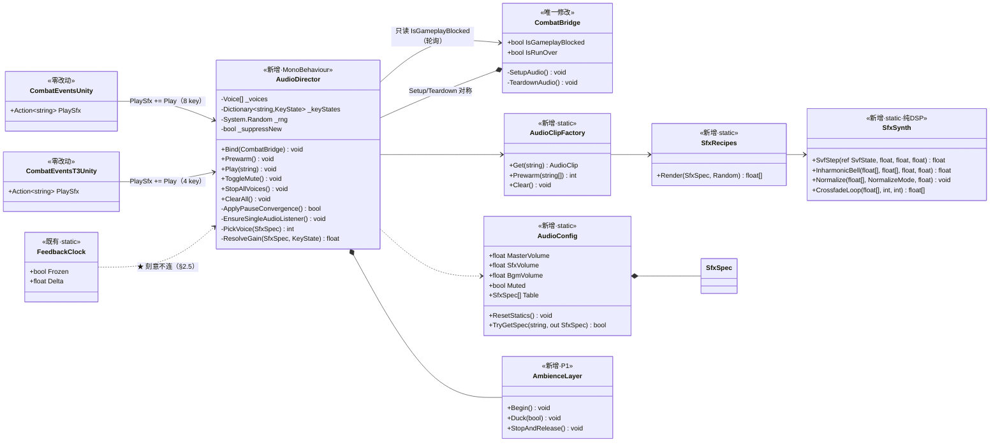
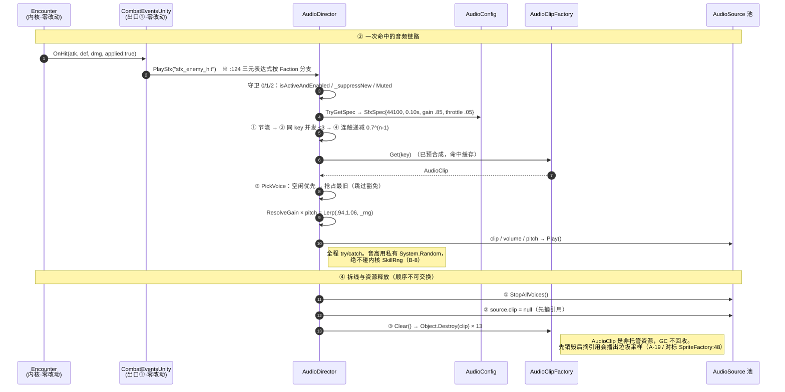
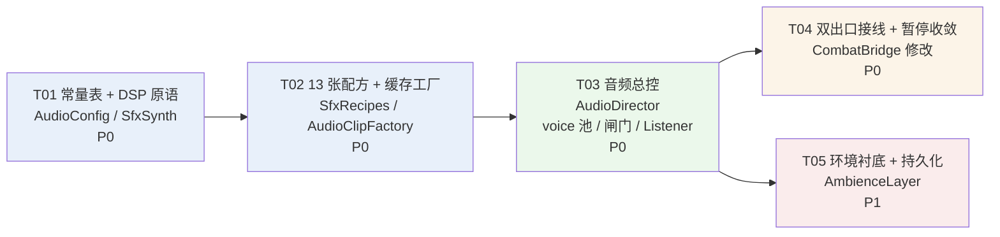

# P1-3 音效系统 —— 系统设计与任务分解

> 版本：v1.0　｜　作者：高见远（架构师）　｜　对应 PRD：`docs/unity-p1-3-audio-prd.md`（许清楚）
> 唯一工程根：`F:/AI-project/ancientGame/shuimofeng/shuimofeng`。与 `F:/AI-project/xianxia-rpg/`（已废弃的 Godot/Web 原型仓）无关。
> ⚠️ **本环境无 Unity、无 dotnet，本文所有代码与数值均未经编译、未经实听验证。** 凡无法静态验证的点均已就地标注「**待用户本地验证**」。
> 配套图：`docs/audio-class-diagram.mermaid`、`docs/audio-sequence-diagram.mermaid`

---

## 0. TL;DR（给工程师的七句话）

1. **新增 6 个文件，改 1 个文件。** 全部落在 `Assets/_Project/Scripts/Runtime/`（asmdef `Xianxia.Unity.T2`）。内核 `Assets/Scripts/` **零改动**，`CombatEventsT3Unity.cs` **零改动**（Q1 采纳方案 (a)）。
2. **拓扑是 P1-2 的同构复制**：两个 `PlaySfx` 出口 → `AudioDirector` 一个订阅者 → 四层闸门 → 16 路 voice 池。参照 `HitFeedbackDirector`，不要另起一套。
3. **音频永远吃 `Time.deltaTime`，永不吃 `FeedbackClock.Delta`，也永不写 `FeedbackClock.Frozen`。** 这是本期最容易写错的一条，完整论证见 §2.5，那里有一个具体的、会导致连击静音的 bug。
4. **`AudioClip` 是非托管资源，`AudioClipFactory.Clear()` 不是可选项。** 且释放有严格三步顺序：`Stop()` → `source.clip = null` → `Destroy(clip)`，顺序不可交换（§2.10）。
5. **随机数走 `AudioDirector` 私有的 `System.Random`。** 不用 `UnityEngine.Random`（全局共享状态），更不碰内核 `SkillRng`/`PCG32`。这是 B-8 的头号嫌疑，也是唯一能让指纹 `2.5294x` 漂移的地方。
6. **12 个 key 的字符串一个字符都不许改。** 已亲自复核 `SkillConfig.cs:174/177/180/183` 与 `CombatEventsUnity.cs:124/143/160/177/196/216`，PM 给的值全对。清单见 §3.2。
7. **五个任务，`T01 → T02 → T03 → {T04, T05}`。** T04/T05 可并行。

---

## 1. 实现方案总述

### 1.1 一句话架构

> **内核喊一个字符串，`AudioDirector` 查一张表、过四层闸门、从 16 路池里挑一路 `AudioSource`，播一段开机时用 `AudioClip.Create` 逐样本合成出来的波形。**

这句话里每一个名词都对应一个文件，没有多余的间接层。

### 1.2 三个真正的技术难点（其余都是体力活）

| # | 难点 | 为什么难 | 落地位置 |
|---|---|---|---|
| **D-1** | **让程序化合成听起来像"木石水布"而不是"科幻能量"** | 这是本期唯一一个**没有正确答案、只有听感**的部分。正弦扫频天生科幻，PRD §4.3 / C-2 是一票否决项 | §3.3 把"调性"翻译成三条可执行的 DSP 硬规则 |
| **D-2** | **围攻时不糊成噪音墙、又不爆音削波** | 四层闸门（PRD R-05）解决"糊"，但**削波是另一个问题**——PRD 没有给出防护方案。16 路叠加在数学上会超过 1.0 | §2.6 归一化 + 并发补偿 + 音高去相关，三级防护 |
| **D-3** | **环境衬底的无缝循环** | A-9 一票否决。接缝处的不连续会被人耳听成周期性"咔哒"，比没有环境音更糟 | §3.4 LFO 周期整除 + **等功率**交叉淡化 |

其余（接线、缓存、释放、暂停收敛）在本工程都有现成范本，照抄即可，不构成风险。

### 1.3 范式选型：全部复用既有范本，零发明

| 关注点 | 选用范式 | 范本出处 |
|---|---|---|
| 常量表 + static 复位钩子 | `static class` + `[RuntimeInitializeOnLoadMethod(SubsystemRegistration)]` | `HitFeedbackConfig.cs:109` |
| 程序化生成 + 缓存 + 对称释放 | `Dictionary<string,T>` + `Clear()` | `SpriteFactory.cs:33` / `:48` |
| 未知资源"只警告一次" | `HashSet<string> _warned` | `SpriteFactory.cs:35`（`_pngWarned`） |
| 事件订阅 → 分档 → 派发 | 单一 `Director` MonoBehaviour | `HitFeedbackDirector.cs` |
| `isActiveAndEnabled` 入口守卫 | 委托入口第一行判定 | `HitFeedbackDirector.cs:368` / `:439`（QA 抓出的真缺陷修复） |
| 惰性依赖解析 + 节流 | `_resolveRetry -= Time.deltaTime`，0.25s | `HitFeedbackDirector.cs:198` / `:969` |
| 暂停三态收敛（轮询，不订阅） | `ApplyPauseConvergence()` 读 `IsGameplayBlocked` | `HitFeedbackDirector.cs:892` |
| 定长环形池（空闲优先 / 抢占最旧） | `PickSlot()` 双趟环形扫描 | `DamagePopupLayer.cs:641-668` |
| 装配 / 拆线严格对称 | `SetupXxx()` / `TeardownXxx()` | `CombatBridge.cs:500` / `:561` |

**这一整张表就是本设计的核心主张：本期不需要任何新范式。** 音频与视觉反馈在结构上是同一件事——订阅内核事件、分档、派发表现、对称拆线。凡是我在设计里做了跟 P1-2 不一样的选择，下面都单独给了理由。

---

## 2. 关键技术决策（每条都写明"为什么不选另一条路"）

### 2.1 voice 管理：显式 `AudioSource` 池，不用 `PlayOneShot`

**决策：16 路固定 `AudioSource` 池，挂在 `AudioDirector` 之下的 `AudioVoicePool` 子物体上，一路 voice = 一次发声。**

**为什么不选 `AudioSource.PlayOneShot`（看起来简单得多的那条路）：**

`PlayOneShot` 有四个在本期是**硬伤**的性质：

| 问题 | 后果 |
|---|---|
| **不返回句柄** | 无法抢占。R-05 ③ 要求"超出 16 路时抢占最旧的一个"，没有句柄就做不到 |
| **无法计数** | 无法实现 R-05 ② "同 key 并发 ≤ 3"，也无法实现 §2.6 的并发补偿 |
| **pitch 属于 `AudioSource` 而非 one-shot** | R-12 的音高随机化对 `PlayOneShot` **无效**——同一个 `AudioSource` 上所有 one-shot 共用一个 pitch。而音高去相关恰恰是我防削波的第三级手段（§2.6） |
| **`Stop()` 是全有全无的** | R-09 要求"重开时所有正在播放的 voice 必须被清理干净"。`Stop()` 会一次干掉该 source 上的全部 one-shot，做不到按 voice 豁免 BOSS 音效 |

也就是说，PRD 的 R-05 和 R-12 两条需求**在 `PlayOneShot` 上物理不可实现**。选择是被需求逼出来的，不是偏好。

**分配策略（逐字复用 `DamagePopupLayer.PickSlot`，`DamagePopupLayer.cs:641-668`）：**

```
① 空闲优先：从 _cursor 起环形扫一圈，第一个 !Alive 的直接用
② 全忙则抢占：再环形扫一圈，取 Age 最大者
   ★ 但跳过 voice.Exempt == true 的（sfx_boss_death / sfx_boss_shockwave）
③ 若一圈下来全是豁免音 → 丢弃本次播放，返回 -1
```

第 ③ 步是我加的，PRD 只说了"豁免抢占"没说"豁免不下时怎么办"。**宁可丢一声杂兵命中，也绝不挤掉 BOSS 冲击波**——冲击波是 US-3 的"你该躲了"信号，挤掉它是玩法伤害，丢一声命中只是听感损失。

**为什么池子大小是 16 而不是动态扩容：** 动态扩容意味着 `AddComponent<AudioSource>()` 发生在最忙的那一帧（围攻爆发时），这正是最不能承受额外开销的时刻。定长池把全部分配成本前置到装配期，运行期零分配。与 `DamagePopupLayer` 的 12 个常驻槽位、`HitEffects` 的 24 长看板是同一条理由。

**voice 存活判定用 `Age >= Length` 记账，不用 `AudioSource.isPlaying`：** `isPlaying` 在 `Play()` 后的同一帧内返回值不稳定（依赖音频线程何时接手），用它做并发计数会出现"刚播的这一路没被算进 LiveVoices"的漏计，直接击穿 R-05 ②。自己记账是确定的。

### 2.2 预合成 vs 懒合成：全量预合成，放在 `CombatBridge.Start()`

**决策：`SetupAudio()` 里同步预合成全部 12 个 P0 音效 + 环境衬底，一次做完。**

**放在这个生命周期位置的理由是实证的**，不是"感觉这里合适"：

`CombatBridge.Start()` 的末尾（`CombatBridge.cs:405-414`）无论走哪条分支，都会 `SetMenuPaused(true)` —— 要么弹主菜单，要么弹操作引导面板。也就是说：

> **`SetupAudio()` 执行完的那一刻，玩家正在看一个静态面板，玩法是冻结的。**

这是整局游戏里唯一一个"卡几十毫秒也绝对没人察觉"的窗口。合成放在这里，成本是隐形的。

**为什么不选懒合成（第一次用到才合成）：** PRD R-03 明确禁止，理由也充分——第一次命中掉帧，而第一次命中恰恰是玩家对打击感形成第一印象的那一下。更糟的是它会与 hitstop 撞车：第一次命中同时触发顿帧 + 合成，两个卡顿叠加在同一帧。

**为什么不选协程 / 分帧摊销：** `AudioClip.Create` 与 `SetData` 必须在主线程调用，分帧只能把总耗时摊开、不能减少。而分帧的代价是引入一个 **"这个 clip 还没准备好"** 的中间态，于是每一条播放路径都要多一个分支，`AudioClipFactory.Get()` 的返回值语义从"有/没有"变成"有/没有/还没好"。预合成的全部价值就是消灭这个分支，分帧等于把价值退回去。

**为什么不选后台线程合成：** DSP 计算本身（纯 `float[]` 运算）确实可以上 `System.Threading`，但 `AudioClip.Create`/`SetData` 不行，所以只能省掉一半；而引入线程就要引入同步、异常跨线程传递、以及"世界重建时线程还在跑"的生命周期问题。**为了省十几毫秒引入并发，是本工程明确不做的那类交易。**

**规模估算（待用户本地验证）：**

| 项 | 数值 |
|---|---|
| 12 个音效总时长 | ≈ 5.38 s |
| 12 个音效总样本数 | ≈ 128 k（3 个 44.1 kHz + 9 个 22.05 kHz） |
| 环境衬底样本数 | ≈ 265 k（12 s @ 22.05 kHz） |
| **总样本数** | **≈ 393 k** |
| **总内存** | **≈ 1.5 MB**（float 4 B/样本，单声道） |
| 每样本运算量 | 10 ~ 40 次浮点操作（噪声 + 1~2 级滤波 + 包络 + 振荡器） |
| **理论总耗时** | **数毫秒 ~ 30 ms** |

**逃生阀（回应 Q6）：** `AudioConfig.PrewarmAmbience`（bool，默认 `true`）。环境衬底一个人占了 **67% 的样本量**，如果用户实测启动有可感知卡顿，把这一个 bool 改成 `false` 就能砍掉三分之二的合成成本，其余 12 个 P0 音效仍然预合成。**不需要动任何合成代码。**

### 2.3 `AudioListener` 保障（R-08，P0）

**决策：保障逻辑放在 `AudioDirector.EnsureSingleAudioListener()`，在 `OnEnable()` 与每次 `Prewarm()` 时各跑一次。`WorldBuilder.cs` 零改动。**

```
listeners = FindObjectsByType<AudioListener>(FindObjectsSortMode.None)   // 只数 enabled 的
count == 1 → 什么都不做，一条日志都不打（绝大多数情况）
count == 0 → 优先挂 Camera.main；Camera.main 为 null 则挂 AudioDirector 自己
             警告一次
count >  1 → 保留 Camera.main 上那个（没有则保留第一个），其余 enabled = false
             警告一次
```

**为什么放在 `AudioDirector` 而不是 `WorldBuilder.SetupCamera()`（PRD §1.4 指出问题的地方）：**

三条理由，第三条是决定性的：

1. **B-6 更干净。** 验收要求"新增代码集中在 `_Project/Scripts/Runtime/`，改动面越小越好"。放在 Director 里，`WorldBuilder.cs` 的 diff 是 0 行。
2. **职责更对。** `WorldBuilder` 的职责是"搭场景"，"保证音频能出声"是音频系统自己的前置条件。让搭场景的人去保障听觉，就是把音频系统的不变量托付给一个不知道音频存在的模块——PRD §1.4 描述的正是这种托付失败的现状。
3. **★ 覆盖面更大。** `SetupCamera()` **只在世界重建时执行**。而 `AudioDirector` 在每次 `Prewarm()` 都重检一次。如果将来有任何一条路径（PlayMode 测试手工摆场景、Editor 下拖入第二个相机、未来的 UI 场景）绕过了 `WorldBuilder`，放在 `WorldBuilder` 的保障就静默失效了，而放在 Director 的保障仍然成立。**"保证有且仅有一个"这句话里的"保证"，应该由依赖它的人来做。**

**为什么多余的 listener 用 `enabled = false` 而不是 `Destroy`：**

`WorldBuilder.cs:638` 的注释已经把这条规矩写死了——**相机是场景自带对象，不打生成标记，不创建也不销毁**，否则 Clean And Rebuild 会把它删掉、场景变黑屏。删它身上的组件是同一类破坏：不可逆、且下次 Rebuild 补不回来。而 Unity 只对**启用中**的多个 `AudioListener` 刷警告，`enabled = false` 已经完全解决问题，还保留了可逆性。

**为什么不每帧检查：** `FindObjectsByType` 是全场景遍历。与 `HitFeedbackDirector.ResolveDependencies` 的节流是同一条理由（`HitFeedbackDirector.cs:959-963`）——"永远找不到"的场景里不节流就是每帧一次全场景遍历。这里更简单：listener 的增删只可能发生在世界重建时，而世界重建必然重走 `Prewarm()`，所以挂在那两个点上就是完备的。

### 2.4 音量分层：纯代码三级乘法

```
最终增益 = Clamp01( Master × Channel × KeyGain × 连触递减 × 随机增益 × 并发补偿 )
```

| 层 | 默认值 | 归属 |
|---|---|---|
| `Master` | **0.80** | `AudioConfig.MasterVolume`（可写 static，PlayerPrefs 持久化） |
| `Channel.Sfx` | **0.90** | `AudioConfig.SfxVolume` |
| `Channel.Bgm` | **0.50** | `AudioConfig.BgmVolume`（本期只跑环境衬底） |
| `KeyGain` | 每 key 一个 | `SfxSpec.Gain`，见 §3.2 表 |
| 连触递减 | `max(0.7^(n-1), 0.40)` | R-05 ④ |
| 随机增益 | `[0.92, 1.0]` | R-12 |
| 并发补偿 | `1/(1+0.06·(active-1))`，下限 0.45 | §2.6，我加的 |

**为什么不用 Audio Mixer：** `.mixer` 是二进制资产，破 §7.1 红线。PRD 已裁定，无异议。补充一条工程理由：Mixer 的参数在资产里，`grep` 不到——与 `HitFeedbackConfig` 文件头拒绝 ScriptableObject 的第 (c) 条理由完全相同。

**为什么静音是"跳过 `Play` 调用本身"而不是"把音量设成 0"：** 音量 0 的 `AudioSource.Play()` 仍然占用一路 voice、仍然要解码、仍然进混音总线。跳过 `Play` 则连 voice 都不分配，`_keyStates` 也不更新。R-06 明确要求这个语义，A-13/A-14 验收的就是"静音后一切照常且无开销"。

**通道音量 ≤ `1e-4` 时同样跳过 `Play`**（R-06 末条）。用 epsilon 而非 `== 0f` 比较：滑条 UI（P2 R-17）拖到底可能停在 `1e-8` 这种值上，浮点相等判断会漏掉。

### 2.5 ★ `FeedbackClock` vs `Time.deltaTime` —— 本期最容易写错的一条

> 主理人点名要求"明确给出结论和理由"，提示是"顿帧时音频是否也该冻"。这一节是完整回答。

**结论（两句话，都是绝对的）：**

> **1. 音频的播放本身永远不受顿帧影响。** `AudioSource` 一旦 `Play()`，它跑在音频线程上，与帧循环无关，本设计不做任何干预。
> **2. `AudioDirector` 与 `AmbienceLayer` 的全部内部计时一律吃 `Time.deltaTime`。全仓音频代码中 `FeedbackClock` 的命中数应为 0。**

**理由一：顿帧的时候，声音恰恰是唯一还在动的东西——这是它的作用，不是它的 bug。**

先回答提示里的那个问题。顿帧（hitstop）的语义，`FeedbackClock.cs:13` 已经写死了：

> 顿帧是**看起来停了**，不是**真的停了**。

打击感设计里，hitstop 之所以成立，是因为画面定住的那 50~120 ms 里，**听觉在继续推进**。玩家感受到的"这一下打实了"，正是"眼睛停住 + 耳朵继续"这个错位制造出来的。如果音频也一起冻住，那 120 ms 就退化成一次纯粹的掉帧——PRD §2.1 说得比我准确：

> **没有"咔"的那一声，顿帧就只是画面卡了一下。**

所以"顿帧时音频该不该冻"的答案是：**恰恰相反，音频是顿帧期间唯一不能停的通道。**

**理由二：技术上也停不了，硬停会更难听。**

`AudioSource` 由音频线程按固定采样率推进，与 `Update` 无关。想"冻"它只能 `Pause()`。而本期音效的时长量级是 80~1400 ms，顿帧是 50~120 ms —— `sfx_enemy_hit` 全长只有 100 ms，顿帧一次就把它**整个盖住**。在瞬态（前 2~15 ms 的冲击）正中间 `Pause()` 再 `UnPause()`，波形出现一个阶跃不连续，人耳听到的是一声**咔哒（click）**。也就是说，硬停不但没有收益，还会主动制造 A-10「不出现爆音」明令禁止的那种声音。

**理由三（这一条是具体的 bug，不是原则问题）：内部记账用冻结时钟会导致连击静音。**

假设节流窗口 `SinceLastPlay` 递增时吃了 `FeedbackClock.Delta`：

```
t=0ms    命中 → 播 sfx_enemy_hit（节流窗口 50ms 起算）
         → 同一帧 HitFeedbackDirector 置 FeedbackClock.Frozen = true（顿帧 90ms）
t=0~90ms Frozen == true ⇒ FeedbackClock.Delta ≡ 0
         ⇒ SinceLastPlay 一动不动，永远停在 0
t=90ms   解冻。玩家的连击第二下到了
         ⇒ SinceLastPlay 仍是 0 < 0.05 ⇒ 判定"仍在节流窗口内" ⇒ 静音丢弃
```

**顿帧时长（0.05~0.12 s，`HitFeedbackConfig.StopEnemyLight`~`StopPlayer`）系统性地长于节流窗口（0.05 s）**，所以这不是偶发竞态，而是**每一次连击都会稳定复现**：第二下必然被吃掉。症状是"连击的时候声音断断续续"，而排查的人会去看 voice 池、去看节流值，很难想到是时钟源选错了。

这与 `HitFeedbackDirector.cs:677-678` 的那句警告是同一类坑，那里写的是：

> 顿帧期间 `FeedbackClock.Delta` 恒为 0：用它递减就是拿被自己冻住的时钟去数自己还要冻多久。

本期的版本是：**用被顿帧冻住的时钟去数"音频节流还剩多久"，而顿帧和音频恰恰由同一次命中同时触发。**

**理由四：本工程已经给出了判据，照用即可。**

`HitFeedbackDirector.cs:965-967` 立了规矩：

> 【为什么倒计时吃 `Time.deltaTime` 而不是 `FeedbackClock.Delta`】这是**记账**，不是表现。

`AudioDirector` 的全部计时都属于"记账"这一侧：

| 计时项 | 性质 | 时钟源 |
|---|---|---|
| `KeyState.SinceLastPlay`（节流窗口） | 记账 | `Time.deltaTime` |
| `KeyState` 连触计数复位（200 ms） | 记账 | `Time.deltaTime` |
| `Voice.Age`（抢占用的年龄 / 存活判定） | 记账 | `Time.deltaTime` |
| `AmbienceLayer` duck 淡入淡出（300 ms） | 表现，但**必须在暂停期间继续走** | `Time.deltaTime` |
| `_resolveRetry` 惰性解析节流 | 记账 | `Time.deltaTime` |

最后一行的 `AmbienceLayer` 值得单独说一句：它虽然是"表现"，但 R-09 要求它在**菜单暂停期间**完成 30% 的 duck 淡入。而菜单暂停时 `HitFeedbackDirector.ApplyPauseConvergence()` 会主动 `ClearHitstop()` 把 `Frozen` 放开（`HitFeedbackDirector.cs:903`），所以此刻 `FeedbackClock.Delta == Time.deltaTime`，两者恰好等价。**既然在需要它的场景下两者等价，就没有任何理由引入第二个时钟源**——统一成一条规则，工程师不需要每写一个计时器就重新判断一次。

**推论（写进 §7 共享知识，并作为 code review 检查项）：**

> `Assets/_Project/Scripts/Runtime/Audio*.cs` 与 `Sfx*.cs` 中，`FeedbackClock` 的 grep 命中数必须为 **0**。
> 音频系统对顿帧是**完全无知**的，这不是疏漏，是设计。

### 2.6 归一化与削波防护（PRD 未覆盖，本设计补全）

PRD R-05 解决了"糊"，A-10 要求"不出现爆音/削波/破音"，但没有给出防护方案。这里补三级。

**第一级：合成期归一化 —— 让 12 个 clip 的响度是**已知的**。**

手写 DSP 出来的峰值是完全不可预测的：`sfx_boss_death` 三层叠加可能到 2.7，`dodge_roll` 可能只有 0.15。如果不归一化，`AudioConfig` 里的 `KeyGain` 就变成"12 个互相不可比的未知数"，调音时改一个数字的实际效果无法预期——**而"能一眼横向对比"正是常量表房规的全部意义**（`HitFeedbackConfig.cs:19`）。

所以每张配方渲染完成后强制归一化到 `SfxSpec.NormalizeTarget`。**此后 `KeyGain` 才真正表示"这个音效相对其他音效有多响"。**

**★ 但归一化必须分两种模式，这是一个真实的 DSP 陷阱：**

| 模式 | 适用 | 做法 |
|---|---|---|
| `Peak` | 12 个瞬态类音效 | 找 `max|x|`，整体缩放到目标峰值 |
| `Rms` | **环境衬底** | 算 RMS，缩放到目标 RMS，**再过一遍 `SoftClip` 兜住偶发尖峰** |

**为什么衬底不能用峰值归一化：** 噪声的峰值由极少数离群样本决定，与人耳感知的响度几乎无关。一段风声按峰值归一化到 0.89，听起来会**响得离谱**（因为它的能量密度远高于一个 100 ms 的瞬态）。噪声类内容必须按 RMS 归一化，这是响度与峰值在噪声信号上解耦的直接后果。目标 RMS 取 **0.12**（起调值，待用户本地验证）。

**第二级：并发补偿（一个不需要 Mixer 的迷你压缩器）**

```
concurrencyGain = 1 / (1 + ConcurrencyDuck × (activeVoices - 1))
                  clamped to [ConcurrencyFloor, 1.0]
ConcurrencyDuck  = 0.06
ConcurrencyFloor = 0.45
```

| 同时发声数 | 补偿系数 |
|---|---|
| 1 | 1.00 |
| 4 | 0.85 |
| 8 | 0.70 |
| 16 | 0.53 |

围攻越密，每一声越轻——这正好也是 US-5「密集的雨点而不是噪音墙」在数学上的表达：雨点之所以是雨点，就是因为单点很轻。

**第三级：音高随机化兼任去相关器**

R-12 的 `[0.94, 1.06]` 音高抖动本来是为了消除"机关枪感"，但它同时解决一个更硬的问题：**让同 key 的多路叠加在相位上去相关**。

- 完全相干叠加（同一波形同一相位）：N 路振幅 = **N** 倍
- 完全不相干叠加：N 路振幅 ≈ **√N** 倍

16 路差 4 倍。音高抖动让两路同 key voice 在几十毫秒后就完全错开相位，把最坏情况从 N 拉到 √N。

**实际最坏情况估算（待用户本地验证）：**

```
16 路 × 峰值 0.89 × Master 0.80 × Sfx 0.90 × 并发补偿 0.53
相干：  16   × 0.89 × 0.80 × 0.90 × 0.53 = 5.43   ← 会削波
不相干：√16  × 0.89 × 0.80 × 0.90 × 0.53 = 1.36   ← 仍然偏高
```

**诚实结论：三级防护之后，理论最坏情况仍然可能轻微越界。** 但要真正打到这个数，需要 16 路在同一毫秒内起振——而 R-05 ① 的 50 ms 节流和 ② 的同 key ≤ 3 已经在结构上排除了这种情形（16 路必须来自 ≥ 6 个不同的 key，而本期只有 12 个 key，其中 5 个是一局只响几次的 BOSS 音）。

**所以我不再加第四级（例如全局 limiter），而是留一个旋钮：** `AudioConfig.ConcurrencyDuck`。实测有削波就把它从 0.06 调到 0.10（16 路补偿系数降到 0.40），改一个数字。**待用户本地验证（A-10）。**

**为什么不做真正的 limiter：** 一个跨 voice 的 limiter 需要拿到混音后的总线信号，而不用 Mixer 就意味着要上 `OnAudioFilterRead`——那是音频线程回调，在上面写状态机会引入跨线程同步问题，而且它会在**每一帧的音频缓冲区**上跑，是本期唯一有真实 CPU 风险的方案。为了一个"结构上已经排除"的边界情形引入音频线程编程，不划算（A-12 要求"帧率无可感知下降"）。

### 2.7 随机源隔离（B-8，指纹漂移的头号嫌疑）

**决策：`AudioDirector` 持有一个私有 `System.Random _rng`，构造于 `Bind()`，种子取 `Environment.TickCount`。**

**为什么不用内核 `SkillRng` / `PCG32`：** 铁律 2 已裁定，无需重复。从内核流里多抽一个数，后续所有战斗随机全部错位，`2.5294x` 当场作废。

**为什么也不用 `UnityEngine.Random`（PRD 说"或 Unity Random"，但我建议不用）：**

`UnityEngine.Random` 是**进程级全局共享状态**。它现在没被战斗逻辑用到，但：

- 本工程有一条"表现层用 Unity Random"的既有用法（如飘字的水平抖动 `PopupSpawnJitterX`）；
- 如果将来任何人为了复现某个场景写下 `UnityEngine.Random.InitState(seed)`，音频每帧抽掉的几十个随机数就会**静默地**改变其他所有表现层随机的序列。

而 `System.Random` 实例是**物理隔离**的：它是 `AudioDirector` 的一个私有字段，除了 `AudioDirector` 自己没有任何代码能够触碰它。这比 PRD 要求的保证更强，代价是一行 `new System.Random(...)`。

**这个隔离性还有一个直接的验收收益：** B-4 要求"开音频跑一遍 / 关音频跑一遍，战斗结果逐位一致"。用私有实例，这一条在**结构上**就成立，不需要靠"我检查过了没人乱用"来保证。

> ⚠️ 一条纪律：`SfxRecipes` 的合成噪声**不能**用这个 `_rng`。合成用的是另一条独立的、**固定种子**的流 `new System.Random(AudioConfig.SynthSeed ^ key.GetHashCode())`。理由见 §3.1 末。

### 2.8 暂停响应：轮询 `IsGameplayBlocked`，不新增事件

**决策：`AudioDirector.LateUpdate()` 每帧读 `_bridge.IsGameplayBlocked` 与 `_bridge.IsRunOver`，与 `HitFeedbackDirector.ApplyPauseConvergence()` 逐条同构。**

**为什么不给 `CombatBridge.ApplyPauseState()` 加一个 `PauseStateChanged` 事件（看起来更"正确"的那条路）：**

1. **`IsGameplayBlocked` 是一个派生只读属性**（`= IsRunOver || _menuPaused`，`CombatBridge.cs:159`），它的值可以在**没有任何人调 `SetMenuPaused` 的情况下**发生变化——`IsRunOver` 由内核的 `Encounter.IsRunOver` 决定。要让事件不漏发，就得同时在内核终局路径上补一个通知点，那就碰内核了。
2. **轮询是本工程的既定答案。** `HitFeedbackDirector`（`:894`）与 `HeroineAnimator` 都是轮询这个闸门的。新增第二种机制意味着两套语义要保持一致，而它们迟早不一致。
3. **成本为零。** 每帧两次属性读取（一次 `null` 比较 + 一次布尔或）。
4. **PRD R-09 明令"不得新增第二个音频专用暂停标志"。** 加事件虽然不是加标志，但会引入"事件到达前的那一帧音频状态是旧的"这个隐性状态，本质相同。

**三态收敛表（注意菜单暂停与终局的关键差异）：**

| 状态 | 判据 | 新音效 | 已在播的 voice | 环境衬底 |
|---|---|---|---|---|
| **正常** | `!blocked` | 允许 | 照常 | 恢复到 100%（300 ms 平滑） |
| **菜单暂停** | `blocked && !IsRunOver` | **抑制** | **允许自然放完** | duck 到 30% |
| **终局** | `blocked && IsRunOver` | **抑制** | **立即全停** | duck 到 30% |

**为什么菜单暂停放完、终局全停（这不是不一致，是两种不同的语义）：**

- 菜单暂停是**可逆**的瞬时状态，而所有战斗音效都 < 1.4 s。强行切断会在波形中间产生阶跃 → 咔哒声（同 §2.5 理由二）。放完最多 1 秒，玩家几乎察觉不到。
- 终局**不可逆**（`IsRunOver` 一旦为真不会翻回来），"恢复后接着播"的语义根本不存在；而 A-18 明确要求"结算界面上无战斗音效"。

这与 `HitFeedbackDirector` 对飘字的处理（`HitFeedbackDirector.cs:912-925`：菜单暂停 `FreezeAll(true)` 保留信息，终局 `ClearAll()` 零残留）是**同一套三态语义**，只是"冻结"在音频上不可行（§2.5），所以退化成"让它放完"。

**正常态必须显式恢复。** 抄 `HitFeedbackDirector.cs:249-259` 的第三态纪律：`_suppressNew = false` 和 `_ambience.Duck(false)` 要在正常分支里**每帧无条件写**，不能只在"从暂停切回来"的那一帧写。漏了它就是"暂停过一次之后音效永久消失"——而这类 bug 只在暂停过之后才出现，很容易漏测。

### 2.9 key 映射表：一张表同时接受两套命名空间（Q1 方案 (a) 落地）

主理人已裁定采纳方案 (a)。落地形态：

```csharp
// AudioConfig.cs
public static readonly SfxSpec[] Table = new SfxSpec[]
{
    //          key（一个字符都不许改）        Kind              rate   dur    gain  throttle exempt normTarget
    new SfxSpec("sfx_enemy_hit",      RecipeKind.EnemyHit,      44100, 0.100f, 0.85f, 0.050f, false, 0.89f),
    ...
    new SfxSpec("skill_basic_slash",  RecipeKind.BasicSlash,    44100, 0.150f, 0.55f, 0.050f, false, 0.72f),
    new SfxSpec("dodge_roll",         RecipeKind.DodgeRoll,     22050, 0.250f, 0.45f, 0.050f, false, 0.75f),
};
```

**关键点：`Table` 里的 key 是「字符串常量」，不是「`sfx_` 前缀 + 名字」拼出来的。** 表本身对命名空间完全无知——它只是一个 `string → SfxSpec` 的字典，`sfx_enemy_hit` 和 `dodge_roll` 在它眼里没有任何区别。这就是方案 (a) 为什么"不改任何代码"：**不一致的命名从来不是问题，只有"假设了命名规则的代码"才是问题，而我们不写那种代码。**

**★ 四个技能 key 必须引用内核常量，不许写字面量：**

```csharp
new SfxSpec(SkillConfig.SKILL_BASIC_SLASH, ...)   // ✅ 编译期锁定
new SfxSpec("skill_basic_slash",           ...)   // ❌ 禁止
```

`Xianxia.Unity.T2` 的 asmdef 已经引用了 `Xianxia.Combat`（已核实 `Xianxia.Unity.T2.asmdef`），`SkillConfig` 直接可见。这样一来，PRD §1.3 ① 警告的那个"照简报写会哑掉三个技能音效、且不报错不崩溃"的事故**在编译期就不可能发生**了——内核改了常量值，这里跟着变；内核删了常量，这里编译失败。

对应地，出口 ① 的 8 个 key 在内核里是**裸字面量**（`CombatEventsUnity.cs:124` 等），没有常量可引。这 8 个只能写字面量，因此它们是本期唯一需要**逐字符人工核对**的地方。我已核对（§3.2 表格右列标注了行号），工程师落地时请再对一遍。

### 2.10 非托管资源释放：三步顺序不可交换

```
① AudioDirector.StopAllVoices()      —— 每个 voice.Source.Stop()
② 遍历 voice：Source.clip = null      —— 摘掉引用
③ AudioClipFactory.Clear()            —— Object.Destroy(clip) × 13
```

**为什么必须是这个顺序：** 如果在 `AudioSource` 仍持有并播放某个 `AudioClip` 时 `Destroy` 它，Unity 的行为是未定义的——轻则 Console 报错，重则播出垃圾采样（一段刺耳的噪声）。这个顺序在正常退出时可能看不出区别，但"在 BOSS 死亡音（1.15 s）播到一半时按 R 重开"是一条真实存在、且玩家一定会走的路径。

**为什么 voice 池的 `GameObject` 反而不手动 `Destroy`：** 沿用 `CombatBridge.cs:555-559` 对飘字层的既有裁定——场景卸载会一并回收，手动销毁反而引入销毁顺序依赖（Unity 不保证同帧内的销毁次序）。

**★ 两者的分界线要说清楚，这是本节的重点：**

> **`GameObject` / `Component` 归场景管；`AudioClip` / `Texture2D` 不归任何 `GameObject` 管，必须显式 `Destroy`。**

`AudioClip` 是通过 `AudioClip.Create()` 凭空造出来的，它不是任何 `GameObject` 的子物体、不在任何场景层级里，场景卸载**不会**碰它。这与 `SpriteFactory` 面对的 `Texture2D` 是完全相同的处境，而 `SpriteFactory.cs:9-12` 早就把这件事写在文件头了：

> `Texture2D` / `Sprite` 是**非托管资源**，GC 不会回收。世界每重建一次就 new 一批，点二十次 Clean And Rebuild 就泄漏二十份。

把这段话里的 `Texture2D` 换成 `AudioClip`，一个字都不用改。A-19 验收的就是这一条。

---

## 3. 合成算法：把听感描述翻译成可执行 DSP

### 3.1 原语库（`SfxSynth.cs`）

全部是纯函数或 `ref` 状态推进，**零 Unity 依赖**（只用 `System.Math`），因此可以被 EditMode 测试直接跑——这是本期唯一能在没有耳朵的情况下自动验证的部分（例如断言"归一化后峰值 ≤ 目标值"、"循环首尾样本差 < 阈值"）。

| 原语 | 签名要点 | 公式 |
|---|---|---|
| `WhiteNoise` | `(Random) → float` | `2·rng.NextDouble() - 1` |
| `OnePoleLP` | `(ref float y, float x, float a)` | `y += a·(x - y)`，`a = 1 - exp(-2π·fc/fs)` |
| `OnePoleHP` | `(ref float y, float x, float a)` | `hp = x - lp(x)` |
| `SvfStep` | `(ref SvfState s, float x, float f, float q)` | Chamberlin 状态变量滤波器，见下 |
| `ExpEnv` | `(t, atk, tau) → float` | `t < atk ? t/atk : exp(-(t-atk)/tau)` |
| `SweepPhase` | `(ref phase, f, fs) → float` | `phase += 2π·f/fs`，返回 `sin(phase)` |
| `ExpSweep` | `(f0, f1, t, T) → float` | `f0·(f1/f0)^(t/T)`　← **指数扫频，不是线性** |
| `InharmonicBell` | `(ratios[], decays[], f0, t) → float` | `Σ sin(2π·f0·rᵢ·t)·exp(-t/τᵢ)` |
| `CombReverb` | `(buf, delays[], g)` | 就地 IIR：`buf[i] += g·buf[i-d]`，升序遍历 |
| `Normalize` | `(buf, mode, target)` | Peak 或 RMS，见 §2.6 |
| `SoftClip` | `(x) → float` | 阈值以下线性，以上 `tanh` 压缩 |
| `CrossfadeLoop` | `(buf, L, xf) → float[]` | **等功率**交叉淡化，见 §3.4 |

**状态变量滤波器（SVF）是本期的主力，因为它的截止频率可以逐样本调制。**

```
f = 2·sin(π·fc/fs)          // fc 必须 < fs/4，否则发散
q = 1/Q
low  += f · band
high  = x - low - q · band
band += f · high
// 输出：low = 低通，high = 高通，band = 带通
```

12 张配方里有 5 张需要"带宽随时间张开/收窄"（`sfx_enemy_death`、`sfx_boss_shockwave`、`skill_basic_slash`、`skill_circle_burst`、`amb_wind_loop`），一阶滤波器做不到这一点，SVF 是最便宜的选择（每样本 3 次乘加）。

**为什么用指数扫频而不是线性扫频：** 人耳对频率的感知是对数的。`220 → 110 Hz` 线性扫下去，前半段听起来降得飞快、后半段几乎不动；指数扫频才是"匀速下滑"的听感。这一条决定了 `sfx_player_hurt` / `sfx_boss_phase` / `skill_basic_slash` 三个扫频音听起来自然还是别扭。

**★ 合成随机流必须是固定种子：**

```csharp
var rng = new System.Random(AudioConfig.SynthSeed ^ key.GetHashCode());
```

**为什么不用 `AudioDirector._rng`：** 那条流是运行期的（音高抖动），每帧被抽用，序列不可复现。而合成必须可复现——否则用户改一个 `KeyGain` 重进 Play，听到的是"改了参数 + 换了一段噪声"的叠加效果，**根本无法判断刚才那个数字改对没有**。调音是一个对比过程，被比较的两次之间只允许有一个变量。

> ⚠️ `string.GetHashCode()` 在 .NET Core / Mono 上**跨进程不稳定**（随机化哈希种子）。若发现每次启动音色略有不同，改用一个自己写的确定性哈希（如 FNV-1a）。**待用户本地验证。**

### 3.2 逐 key 配方（12 个 P0 + 1 个 P1）

> 表中所有数值均为**起调值**，落表在 `AudioConfig.Table` 与各配方的 `private const`。
> 「合成路径」一列即工程师要写的 DSP 步骤，逐层叠加后 `Normalize`。
> **key 一列已逐字符复核**（内核出处见右侧行号）。

#### 出口 ①：`CombatEventsUnity.PlaySfx`（8 个，裸字面量，需人工核对）

| key | 出处 | 时长 | 采样率 | Gain | 节流 | 合成路径（逐层叠加） |
|---|---|---|---|---|---|---|
| `sfx_enemy_hit` | `:124` | 100 ms | **44100** | 0.85 | 50 ms | ① 瞬态：3 ms 全带噪声，`ExpEnv(atk=0.5ms, τ=4ms)`，gain 0.80<br>② 主体：带通噪声 1.5–4 kHz（SVF，Q=1.2），`ExpEnv(atk=2ms, τ=18ms)`，gain 1.0<br>③ 肉感：正弦 180 Hz，`ExpEnv(atk=1ms, τ=25ms)`，gain 0.45<br>④ `Normalize(Peak, 0.89)` |
| `sfx_player_hurt` | `:124` | 185 ms | 22050 | 1.00 | **70 ms**※ | ① 瞬态：2 ms 全带噪声，τ=3 ms，gain 0.50（比敌人侧钝）<br>② 主体：低通噪声 fc=900 Hz（两级一阶级联），`ExpEnv(atk=4ms, τ=45ms)`，gain 1.0<br>③ 下滑正弦：`ExpSweep(220→110 Hz, T=150ms)`，`ExpEnv(atk=2ms, τ=60ms)`，gain 0.60<br>④ 释放尾：整体再乘一条 40 ms 线性淡出<br>⑤ `Normalize(Peak, 0.89)` |
| `sfx_enemy_death` | `:143` | 300 ms | 22050 | 0.80 | — | ① SVF 带通噪声，中心频率 `ExpSweep(2200→400 Hz, T=280ms)`<br>② **Q 同步上升 1.0 → 4.0**（带宽收窄 = "散了"）<br>③ 包络：`atk=8ms` → 平台 60 ms → 指数淡出至 300 ms<br>④ **无瞬态层**（这是"溃散"不是"爆炸"）<br>⑤ `Normalize(Peak, 0.85)` |
| `sfx_boss_death` | `:143` | 1150 ms | 22050 | 1.00 | — | ① 低频冲击：`ExpSweep(85→60 Hz, T=400ms)`，`ExpEnv(atk=3ms, τ=200ms)`，gain 1.0<br>② 石磬泛音：`InharmonicBell(f0=520, ratios=[1.0, 2.76, 5.40], τ=[700,400,240]ms)`，gain 0.45<br>③ 混响垫：低通噪声 fc=1200 Hz，τ=380 ms，gain 0.30<br>④ 整段过 `CombReverb(delays=[37,53,71,97]ms, g=0.40)`<br>⑤ `Normalize(Peak, 0.95)`　**豁免抢占** |
| `sfx_boss_phase` | `:160` | 850 ms | 22050 | 0.90 | — | ① 上行滑音：`ExpSweep(70→190 Hz, T=700ms)`，振幅按 `t²` 从 0.2 爬到 0.8（缓入 = 压迫感）<br>② 钟击（**t=520 ms 才进来**）：`InharmonicBell(f0=880, ratios=[1.0,2.76,5.40,8.93], τ=330ms)`，gain 0.50<br>③ 低通噪声垫 fc=500 Hz 同步渐强，gain 0.25<br>④ `Normalize(Peak, 0.89)` |
| `sfx_boss_summon` | `:177` | 500 ms | 22050 | 0.75 | — | ① 5 颗高频颗粒，起点 t = 0 / 60 / 130 / 210 / 300 ms<br>② 每颗 `InharmonicBell(f0 ∈ {1560,1840,2100,1720,1980}, ratios=[1.0,2.76], τ=120ms)`，gain 0.50，各带 ±2% 随机失谐<br>③ 整段过 `CombReverb(delays=[23,31,43]ms, g=0.35)` = 空间回响<br>④ **全程零低频**（HP 800 Hz）—— 这是与 `sfx_boss_phase` 区分的**唯一**手段<br>⑤ `Normalize(Peak, 0.89)` |
| `sfx_boss_shockwave` | `:196` | 650 ms | 22050 | 1.00 | — | ① 硬瞬态：4 ms 全带噪声，gain 0.90（"瞬态必须够硬"）<br>② 低频推力：`ExpSweep(90→45 Hz)`，`ExpEnv(atk=1ms, τ=110ms)`，gain 1.0<br>③ SVF 带通中心 `ExpSweep(120→5000 Hz, T=400ms)`，**Q 同步下降 6.0 → 0.8**（带宽张开，与 `enemy_death` 完全相反）<br>④ 400→650 ms 指数淡出<br>⑤ `Normalize(Peak, 0.95)`　**豁免抢占** |
| `sfx_poise_break` | `:216` | 220 ms | **44100** | 0.90 | **60 ms**※ | ① 主瞬态："咔" = 2 ms 全带噪声过 HP 2.5 kHz，`ExpEnv(τ=12ms)`，gain 1.0<br>② 裂纹：3 个失谐正弦 3.1 / 4.7 / 6.3 kHz，τ=30 ms，gain 0.40（非谐波 = 脆）<br>③ body：正弦 400 Hz，τ=45 ms，gain 0.25<br>④ 余韵：极低电平噪声环，线性淡出至 220 ms，gain 0.08<br>⑤ `Normalize(Peak, 0.90)` |

> ※ **【与 PRD 的两处有意偏离，需 PM 知悉】** PRD R-05 ① 只把 `sfx_enemy_hit` / `skill_basic_slash` / `dodge_roll` 列为高频类。我给 `sfx_player_hurt`（70 ms）和 `sfx_poise_break`（60 ms）也加了节流，理由：A-10 的验收场景是"引一群敌人围攻，**持续挨打** 10 秒"——在那个场景里玩家受击音和韧性打破音**就是**高频音，而 `sfx_player_hurt` 长达 185 ms，不节流时叠三四层就是一堵墙。PRD §6 已声明"所有数值均为产品建议初值，是调音起点，不是红线"，故按架构侧判断调整。**若 PM 认为玩家受击必须每一次都响（可读性优先于听感），把这两个值改成 0 即可，一个数字。**

#### 出口 ②：`CombatEventsT3Unity.PlaySfx`（4 个，**必须引用 `SkillConfig` 常量**）

| key（常量） | 实际值 | 出处 | 时长 | 采样率 | Gain | 节流 | 合成路径 |
|---|---|---|---|---|---|---|---|
| `SkillConfig.SKILL_BASIC_SLASH` | `skill_basic_slash` | `:127` | 150 ms | **44100** | **0.55** | 50 ms | ① SVF 带通，中心 `ExpSweep(4000→1000 Hz, T=110ms)`，Q=2.5<br>② `ExpEnv(atk=5ms, τ=35ms)`<br>③ **★ 整段过 HP 600 Hz，彻底切掉低频**<br>④ `Normalize(Peak, **0.72**)` ← 全场最低，"必须做得薄" |
| `SkillConfig.SKILL_CIRCLE_BURST` | `skill_circle_burst` | `:127` | 425 ms | 22050 | 0.80 | — | ① SVF 带通中心固定 700 Hz，**Q 从 5.0 扫到 0.6**（带宽快速张开）用时 180 ms<br>② 包络 `atk=6ms` → 保持 80 ms → `τ=110ms`<br>③ body 正弦 150 Hz，τ=90 ms，gain 0.50<br>④ `Normalize(Peak, 0.86)` |
| `SkillConfig.SKILL_BLOOD_LOTUS` | `skill_blood_lotus` | `:127` | 600 ms | 22050 | 0.85 | — | ① 低通噪声 fc=350 Hz + 正弦 90 Hz + 正弦 128 Hz（**小三度左右的失谐 = 不祥**）<br>② 整体乘 LFO：`0.72 + 0.28·sin(2π·6·t)`（6 Hz 颤动）<br>③ 包络 **`atk=25ms`**（慢起手 = 粘稠，与 circle_burst 的 6 ms 形成对比）→ `τ=200ms`<br>④ 高频薄雾：3–5 kHz 带通噪声，gain 0.08<br>⑤ `Normalize(Peak, 0.88)` |
| `SkillConfig.SKILL_DODGE_ROLL` | `dodge_roll` | `:181` | 250 ms | 22050 | **0.45** | 50 ms | ① 高通噪声 fc=1800 Hz<br>② 振幅走"掠过"窗：升余弦，峰值在 40% 处<br>③ SVF 中心 `2500 → 4500 → 2000 Hz`（过路感）<br>④ `Normalize(Peak, **0.75**)` ← "宁可偏小声，它的作用是确认'我躲了'，不是抢戏" |

#### P1 追加

| key | 时长 | 采样率 | Gain | 通道 | 合成路径 |
|---|---|---|---|---|---|
| `amb_wind_loop` | **12.0 s** | 22050 | 1.00 | **Bgm** | 见 §3.4 |

### 3.3 音色调色板的工程化落实（C-2 一票否决项）

PRD §4.3 的要求是"听起来像木石水布金石，不像电子合成器"。这是个听感判断，但可以翻译成**三条可以在 code review 里检查的硬规则**：

| # | 硬规则 | 违反的后果 | 覆盖情况 |
|---|---|---|---|
| **R-A** | **每个瞬态类音效的第一层必须是 2~5 ms 的宽带噪声冲击** | 没有瞬态 = 电子音。这是"物理撞击"与"合成器"最主要的分界 | 8 个瞬态类音效全部有瞬态层 |
| **R-B** | **纯正弦持续时间不得超过 200 ms，且必须带扫频或 LFO** | 拖长的定频正弦 = 科幻能量音，一秒就暴露 | 唯一超过 200 ms 的正弦是 `sfx_boss_phase` 的上行滑音（700 ms），但它全程在扫频，不是定频 |
| **R-C** | **金石类音色一律用非谐波泛音比**，不用整数倍 | 整数倍泛音 = 管风琴/合成器；非谐波才是钟磬 | `sfx_boss_death` / `sfx_boss_phase` / `sfx_boss_summon` / `sfx_poise_break` 用的比值 `[1.0, 2.76, 5.40, 8.93]` 是管钟的实测泛音比 |

**为什么把"钟磬"押在 BOSS 事件上（PRD 的建议，我认同并给出工程理由）：** 非谐波泛音叠加是全部原语里**最贵**的（每个泛音一次 `sin` + 一次 `exp`，4 个泛音就是 8 次超越函数/样本）。BOSS 事件一局只响几次，且都在预合成期算完，运行期零成本；把它用在每秒响十几次的 `sfx_enemy_hit` 上则会让预合成时间显著上升而收益很小（100 ms 的音效听不出泛音结构）。**成本与出场频率恰好成反比，这个分配是最优的。**

### 3.4 环境衬底与无缝循环（R-10 / A-9，D-3）

**合成（12.0 s @ 22050 Hz = 264 600 样本）：**

```
主层：白噪声 → SVF 低通
      截止频率 = 500 + 200·sin(2π·f₁·t)        // 300 ~ 700 Hz
      振幅     = 0.775 + 0.225·sin(2π·f₂·t)    // 0.55 ~ 1.0
副层：白噪声 → SVF 带通 800–1600 Hz，gain 0.18
      振幅     = 0.5 + 0.5·sin(2π·f₃·t)
```

**★ 无缝循环的两个条件，缺一不可：**

**条件一：所有 LFO 周期必须整除循环总长。**

```
f₁ = 1/12.0 = 0.0833 Hz   （整个循环内正好 1 个完整周期）
f₂ = 2/12.0 = 0.1667 Hz   （2 个周期）
f₃ = 3/12.0 = 0.2500 Hz   （3 个周期）
```

这样 `t = 12.0 s` 时三个 LFO 的相位与 `t = 0` **逐位相同**，包络层面不存在接缝。三个频率都落在 PRD 建议的 0.05~0.15 Hz 附近（f₃ 略高，是为了让副层有一点不同的呼吸节奏，避免三层同起同落听起来像"整体在脉动"）。

**条件二：噪声本身仍然是不连续的，必须交叉淡化。**

LFO 相位对齐只解决了**包络**的连续性，但底层噪声在 `t=12.0` 和 `t=0` 是两段完全无关的随机序列，直接首尾相接会有一个阶跃 → 一声"咔哒"，正是 A-9 要否决的东西。

```
合成 L + xf 个样本（L = 264600，xf = 200 ms = 4410 样本）
for i in [0, xf):
    w = i / xf
    out[i] = buf[i]·sin(π·w/2) + buf[L+i]·cos(π·w/2)     // ★ 等功率
for i in [xf, L):
    out[i] = buf[i]
截断到 L
```

**★ 为什么必须是等功率（sin/cos）而不是线性（`w` / `1-w`）交叉淡化：**

这是噪声信号特有的陷阱。两段**不相关**的噪声做线性淡化时，中点处两路各占 0.5，但不相关信号的功率是**平方相加**：

```
线性淡化中点功率 = 0.5² + 0.5² = 0.50   → 比两端低 3 dB
等功率淡化中点   = sin²(π/4) + cos²(π/4) = 1.0  → 恒定
```

线性淡化会在每个循环接缝处留下一个 **3 dB 的音量凹陷**——听起来就是每 12 秒"喘一口气"。这比阶跃咔哒更隐蔽，但 A-9 要求"听 60 秒听不出接缝"，5 次凹陷一定会被察觉。**这是本期最容易做对了 90% 却栽在最后一步的地方。**

**Q3 落地（主菜单不播）—— 这一条是免费的：**

主理人裁定"本期只在战斗场景播，主菜单不播"，并担心跨场景单例的复杂度。**实际上不需要任何跨场景机制**，因为主菜单和战斗在**同一个场景**里（`MainMenuHud` 由 `CombatBridge.Start()` 在 `:365` 创建），且主菜单期间 `IsGameplayBlocked == true`（`:412` 的 `SetMenuPaused(true)`）。

所以规则退化成一行：

```csharp
// AmbienceLayer：首次观察到 !IsGameplayBlocked 时才 Begin()
if (!_started && !blocked) { Begin(); _started = true; }
```

**零跨场景单例、零 `DontDestroyOnLoad`、零静态旗标。** 主理人担心的"再加一个 `MainMenuHud.SkipOnNextLoad` 那样的坑"完全没有发生。

---

## 4. 文件清单

### 4.1 新增文件（6 个，全部在 `Assets/_Project/Scripts/Runtime/`，asmdef `Xianxia.Unity.T2`）

| # | 相对路径 | 职责 | 预估行数 |
|---|---|---|---|
| 1 | `Assets/_Project/Scripts/Runtime/AudioConfig.cs` | 常量表：三通道音量 + 静音 + voice 参数 + 13 行 `SfxSpec` 表 + `SfxSpec`/`RecipeKind`/`Channel`/`NormalizeMode` 类型定义 + `ResetStatics()` 复位钩子 + PlayerPrefs 读写 | ~430 |
| 2 | `Assets/_Project/Scripts/Runtime/SfxSynth.cs` | 纯 DSP 原语库：噪声 / 一阶滤波 / SVF / 包络 / 扫频 / 非谐波钟 / 梳状混响 / 归一化 / 软削波 / 等功率交叉淡化。**零 Unity 依赖** | ~380 |
| 3 | `Assets/_Project/Scripts/Runtime/SfxRecipes.cs` | 13 张配方，每张一个私有函数；`Render(SfxSpec, Random) → float[]` 单一入口 | ~620 |
| 4 | `Assets/_Project/Scripts/Runtime/AudioClipFactory.cs` | `key → AudioClip` 缓存 + `Prewarm()` + **`Clear()`** + 失败黑名单 + 警告去重。对标 `SpriteFactory` | ~250 |
| 5 | `Assets/_Project/Scripts/Runtime/AudioDirector.cs` | 音频总控：voice 池 / 四层闸门 / 增益合成 / `AudioListener` 保障 / 静音键 / 暂停三态收敛 / 异常隔离 | ~700 |
| 6 | `Assets/_Project/Scripts/Runtime/AmbienceLayer.cs` | 环境衬底（R-10）：循环播放 + duck/恢复平滑 + 延迟启动（Q3） | ~260 |

新增合计 **≈ 2 640 行**。

> 每个 `.cs` 还需一个 `.meta`，由 Unity 自动生成，不手写。

### 4.2 修改文件（1 个）

| 相对路径 | 改动内容 | 预估增量 |
|---|---|---|
| `Assets/_Project/Scripts/Runtime/CombatBridge.cs` | ① 新增字段 `private AudioDirector _audio;`<br>② 新增 `SetupAudio()` / `TeardownAudio()` 两个私有方法（对称，含完整注释）<br>③ `Start()` 内在 `SetupHitFeedback();` 之后追加 `SetupAudio();`（1 行）<br>④ `OnDestroy()` 内在 `TeardownHitFeedback();` 之后追加 `TeardownAudio();`（1 行） | ~+90 |

### 4.3 新增测试文件（1 个，随 T04）

| 相对路径 | 覆盖 |
|---|---|
| `Assets/_Project/Scripts/Runtime/Tests/P1_3_AudioTests.cs` | EditMode 可跑的部分：`AudioConfig.Table` 的 12 个 key 与 `SkillConfig` 常量逐字符一致；`SfxSynth` 归一化后峰值 ≤ 目标；`CrossfadeLoop` 首尾样本差 < 阈值；四层闸门的纯逻辑（节流 / 并发 / 递减 / 抢占豁免）；`ResetStatics()` 复位完整性 |

> 命名沿用既有惯例（`P1_2_HitFeedbackTests.cs` / `P1_6_ProgressionIntegrationTests.cs`）。
> ⚠️ 涉及 `AudioClip.Create` / `AudioSource` 的部分需 PlayMode 测试，本环境无法编写验证，**待用户本地补充**。

### 4.4 明确**不动**的文件（B-2 / B-6 保障）

| 文件 | 为什么不动 |
|---|---|
| `Assets/Scripts/**`（**整个内核**） | §7.2 红线。本期内核 diff 必须为 **0 行** |
| `Assets/Scripts/Systems/Combat/Unity/CombatEventsUnity.cs` | 出口 ① 已存在且判空完备，不需要任何改动 |
| `Assets/_Project/Scripts/Runtime/CombatEventsT3Unity.cs` | **Q1 采纳方案 (a) 的直接结果**，一行不改（B-6 因此更干净） |
| `Assets/_Project/Scripts/Runtime/WorldBuilder.cs` | `AudioListener` 保障改由 `AudioDirector` 承担（§2.3） |
| `Assets/Scripts/Systems/Combat/Unity/FeedbackClock.cs` | 音频系统完全不依赖它（§2.5） |
| `Assets/_Project/Scripts/Runtime/HitFeedbackConfig.cs` / `HitFeedbackDirector.cs` | 音频参数自成一表，不塞进受击反馈的常量表 |
| `Xianxia.Unity.T2.asmdef` | 已引用 `Xianxia.Core` / `Xianxia.Combat` / `Xianxia.Combat.Unity` / `UnityEngine.UI`，音频只需 `UnityEngine` 核心模块，**无需新增引用** |

---

## 5. 数据结构与接口（类图）

> 完整图见 `docs/audio-class-diagram.mermaid`。下面是核心类型定义与图的摘要。



### 5.1 关键类型定义

```csharp
public enum RecipeKind   { EnemyHit, PlayerHurt, EnemyDeath, BossDeath, BossPhase,
                           BossSummon, BossShockwave, PoiseBreak, BasicSlash,
                           CircleBurst, BloodLotus, DodgeRoll, WindLoop }

/// BGM 通道本期只跑环境衬底；R-16 旋律 BGM 挂起，但枚举位预留（主理人 Q2 裁定）。
public enum Channel      { Sfx, Bgm }

public enum NormalizeMode { Peak, Rms }

/// 一个音效的全部静态属性。纯数据，无行为。
public readonly struct SfxSpec
{
    public readonly string        Key;              // 内核传出的字符串，一字不改
    public readonly RecipeKind    Kind;
    public readonly int           SampleRate;       // 22050 / 44100（Q4：每音效可配）
    public readonly float         DurationSec;
    public readonly float         Gain;             // 单音效增益
    public readonly float         ThrottleSec;      // 0 = 不节流
    public readonly bool          ExemptPreempt;    // BOSS 死亡 / 冲击波
    public readonly NormalizeMode NormMode;
    public readonly float         NormTarget;
    public readonly bool          Loop;
    public readonly Channel       Bus;
}

/// 一路发声。定长池的元素。
private sealed class Voice
{
    public AudioSource Source;
    public string      Key;
    public float       Age;        // 吃 Time.deltaTime（§2.5）
    public float       Length;
    public bool        Alive;
    public bool        Exempt;
}

/// 每个 key 的运行时状态。字典大小恒 ≤ 13，无需裁剪。
private sealed class KeyState
{
    public float SinceLastPlay;     // 节流窗口
    public int   ConsecutiveCount;  // 连触递减计数
    public int   LiveVoices;        // 同 key 并发
    public bool  Broken;            // 合成失败，永久跳过（R-07）
}
```

### 5.2 `AudioDirector.Play()` 的完整闸门顺序（伪代码）

> 顺序是有讲究的：**越便宜的判定越靠前**。围攻时本方法每秒被调十几次，且它跑在内核的 `OnHit` 调用栈上。

```csharp
public void Play(string key)
{
    try
    {
        // 守卫 0：组件被禁用 —— 委托不认 enabled，退订只在 Teardown。
        //         抄 HitFeedbackDirector:368 / :439（QA 抓出的真缺陷修复）。
        if (!isActiveAndEnabled) return;

        // 守卫 1：暂停 / 终局抑制（§2.8）
        if (_suppressNew) return;

        // 守卫 2：静音 / 通道音量为 0 —— 跳过 Play 本身，不是把音量设 0（R-06）
        if (AudioConfig.Muted) return;
        if (string.IsNullOrEmpty(key)) return;

        // 守卫 3：查表。未注册的 key 静默降级 + 只警告一次（R-07）
        if (!AudioConfig.TryGetSpec(key, out SfxSpec spec)) { WarnOnce(key); return; }
        if (ChannelVolume(spec.Bus) <= 1e-4f) return;

        KeyState st = StateOf(key);
        if (st.Broken) return;                                  // 合成失败，永久跳过

        // R-05 ① 同 key 节流
        if (spec.ThrottleSec > 0f && st.SinceLastPlay < spec.ThrottleSec) return;
        // R-05 ② 同 key 并发上限
        if (st.LiveVoices >= AudioConfig.PerKeyVoiceLimit) return;

        AudioClip clip = AudioClipFactory.Get(key);
        if (clip == null) { st.Broken = true; return; }         // 工厂已警告过，这里不重复

        // R-05 ③ 全局并发 + 抢占（豁免 BOSS 音效）
        int v = PickVoice(spec);
        if (v < 0) return;                                      // 全池豁免 → 丢弃新声

        float gain  = ResolveGain(spec, st);                    // R-05 ④ + R-06 + R-12 + 并发补偿
        float pitch = Lerp(PitchJitterMin, PitchJitterMax, (float)_rng.NextDouble());

        StartVoice(v, clip, spec, gain, pitch);
        st.SinceLastPlay = 0f;
        st.ConsecutiveCount++;
        st.LiveVoices++;
    }
    catch (System.Exception e)
    {
        // ★ 整条链路的异常隔离（R-07）。本方法跑在内核 OnHit 的调用栈上 ——
        //   一个音频异常把整场战斗掀了是绝对不可接受的。
        WarnOnce("EXC:" + key, e);
    }
}
```

---

## 6. 关键调用流程（时序图）

> 完整四条链路见 `docs/audio-sequence-diagram.mermaid`（① 装配期接线 ② 一次命中的音频链路 ③ 暂停/终局/重开收敛 ④ 拆线与资源释放）。
>
> 这里只摘出主链路 ② 与最容易写错的 ④。



### 6.1 装配次序的实证依据

`SetupAudio()` 必须排在 `SetupHitFeedback()` **之后**，理由不是风格偏好：

```
CombatBridge.Start()
  :331  SetupT3()            → :865 建 _eventsT3（出口 ② 的宿主）
  :337  SetupProgression()
  :344  SetupHitFeedback()
  ★     SetupAudio()          ← 此刻两个出口对象都确定存在
  :412  SetMenuPaused(true)   ← 预合成的开销落在这个静止窗口里（§2.2）
```

若排在 `SetupT3()` 之前，`_eventsT3` 还是 `null`，出口 ② 的订阅会静默跳过——**4 个技能音效永远不响，且不报错**，与 PRD §1.3 ① 警告的是同一类"最难排查的 bug"。

---

## 7. 共享知识（跨文件约定）

### 7.1 常量归属的分界线

| 类别 | 归属 | 判据 |
|---|---|---|
| 三通道音量、静音、voice 池大小、并发上限、节流窗口、连触递减、音高/增益抖动范围、duck 参数、采样率、每 key 的**时长 / 增益 / 归一化目标 / 豁免标志** | **`AudioConfig`** | 这些是**跨音效横向比较**的数字 |
| 每张配方内部的滤波截止、扫频端点、LFO 频率、泛音比、各层相对 gain | **`SfxRecipes` 就近 `private const`** | 这些**定义了这个声音是什么**，不跨音效比较 |

**为什么不把 DSP 内部数字也塞进 `AudioConfig`（房规说"任何一个可调数字在全仓只允许出现一次"）：**

先说清楚：**"只允许出现一次"这条规矩本身不打折**——上表右列的数字同样只在 `SfxRecipes` 里出现一次，不允许在别处复制。有分歧的只是"这一次应该放在哪"。

`HitFeedbackConfig.cs:19-22` 给出了房规的**目的**和它自己承认的例外：

> 铁律：任何一个手感数字在全仓只允许出现一次。……唯一的有据例外是 `CombatView.DefaultFlashDuration` —— **它定义的是行为本身**。

房规的目的是"**调手感是跨四个表现一起调的，参数就必须摆在同一屏里**"。这个目的在音频上的正确切分是：

- **会被横向比较的**：「blood_lotus 是不是比 circle_burst 长？」「dodge_roll 的增益是不是全场最低？」—— 进 `AudioConfig`，摆在同一屏。
- **不会被横向比较的**：「blood_lotus 的 LFO 是 6 Hz」—— 没有人会拿它跟 `sfx_boss_death` 的梳状混响延迟做比较。它属于 `CombatView.DefaultFlashDuration` 那一类：**定义的是这个声音本身**。

如果把约 120 个 DSP 内部数字全塞进 `AudioConfig`，那张表会从"一屏能横向对比 13 个音效"退化成"一份 500 行的、按音效分段的流水账"——**恰好摧毁房规想要的那个性质**。

### 7.2 命名规范

| 对象 | 约定 | 例 |
|---|---|---|
| 音效 key | **内核传出什么就是什么，不加工、不加前缀、不 `ToLower()`** | `sfx_enemy_hit`、`dodge_roll` |
| 技能 key 的引用方式 | **必须引 `SkillConfig` 常量**，禁止字面量 | `SkillConfig.SKILL_BASIC_SLASH` |
| 配方私有函数 | 与 `RecipeKind` 枚举同名 | `RecipeKind.BossDeath` ↔ `private static float[] BossDeath(...)` |
| voice 池物体 | `AudioVoicePool` / 子物体 `Voice00` ~ `Voice15` | 便于在 Hierarchy 里肉眼看并发 |
| 警告前缀 | `[T2·Audio]` | 与既有 `[T2]` / `[Combat]` / `[T3]` 对齐，便于 Console 过滤 |

### 7.3 单位与量纲（写错了不报错、只是难听）

| 量 | 单位 | 备注 |
|---|---|---|
| 时长 | **秒（`float`）** | 配方内部按需转样本数：`n = (int)(sec · rate)` |
| 频率 | **Hz** | 滤波器需要归一化频率时在原语内部换算，调用方永远传 Hz |
| 包络时间常数 τ | **秒** | `exp(-t/τ)`，τ 后信号衰减到 36.8% |
| 增益 / 音量 | **线性 `[0,1]`**，非 dB | 全链路统一，最终 `Clamp01` |
| pitch | **倍率**，1.0 = 原速 | Unity `AudioSource.pitch` 语义，会同时改变时长 |
| 采样率 | **Hz 整数**，仅 22050 / 44100 | 其他值未验证 |
| 声道 | **恒为 1（单声道）** | 2D 俯视角，本期不做声像（P2 R-18） |
| `spatialBlend` | **恒为 0（2D）** | 非 0 会引入距离衰减，那是 P2 |

### 7.4 时间源使用规约（最容易写错的一条，见 §2.5）

> **音频系统全部吃 `Time.deltaTime`。`Assets/_Project/Scripts/Runtime/` 下新增的音频文件中，`FeedbackClock` 的 grep 命中数必须为 0。**
>
> 这是一条 code review 检查项，不是建议。

### 7.5 静态状态的复位纪律

`AudioConfig` 有 **4 个可写 static**（`MasterVolume` / `SfxVolume` / `BgmVolume` / `Muted`），是全仓继 `FeedbackClock.Frozen`、`HitFeedbackConfig.FeedbackIntensity`、`MainMenuHud.SkipOnNextLoad` 之后的第 4~7 个。纪律与前三者**逐条对齐**：

1. `AudioConfig.ResetStatics()` 带 `[RuntimeInitializeOnLoadMethod(RuntimeInitializeLoadType.SubsystemRegistration)]`——治「Enter Play Mode without Domain Reload」下静态字段跨 PlayMode 存活。**取 `SubsystemRegistration` 而非 `AfterSceneLoad`**，理由同 `HitFeedbackConfig.cs:98-103`：它是最早的一档，早于任何 `Awake`；放晚了会出现"第一个 `Awake` 已经读到脏的音量"的窗口。
2. EditMode / PlayMode 测试的 `SetUp`/`TearDown` 必须**无条件**自己复位——`[RuntimeInitializeOnLoadMethod]` 在 EditMode 测试里不触发。这是测试文件的第一纪律。
3. `AudioClipFactory` 的三个静态集合（`_clips` / `_failed` / `_warned`）由 `Clear()` 一并清空。**`_warned` 必须跟着清**——理由与 `SpriteFactory.cs:60-62` 一字不差：缓存清空后之前"缺失"的判断不再有效，不清就再也看不到新的警告。

**★ 一处与前三者的差异：** `ResetStatics()` 在 R-11（PlayerPrefs 持久化）落地后，语义从"恢复出厂值"变成"**从 PlayerPrefs 重新加载，读不到则取出厂值**"。复位点仍然只有这一个，不要在别处再开第二个入口——这正是 `HitFeedbackConfig.cs:105-107` 预留的那句"将来接玩家设置持久化时改这里"所描述的情形，本期是它第一次真正发生。

### 7.6 静音键

`M`。**已亲自复核全仓 `KeyCode.*`，`M` 无任何命中，批准使用。**

> 顺带修正主理人清单里的一处遗漏：全仓实际占用的按键是
> `A / D / S / W / K / J / L / R / Space / Tab / F1 / Escape / Return / KeypadEnter / LeftShift / RightShift / 四个方向键 / Mouse0-2 / JoystickButton0`。
> 主理人清单未列出 **A / D / S / K** 四个（WASD 移动 + K 键）。不影响结论——`M` 依然空闲。

处理位置：`AudioDirector.Update()`（不是 `LateUpdate`），与 `CombatBridge.Update()` 直接读 `UnityEngine.Input` 的既有做法一致。

**★ 静音键不受 `_suppressNew` 与暂停闸门约束** —— 玩家最想按静音的时刻恰恰是打开暂停菜单之后。切到静音时同步 `StopAllVoices()`，否则一段 1.15 s 的 BOSS 死亡音会在"我已经按了静音"之后继续响完。

---

## 8. 任务列表（5 条，按依赖顺序）

### T01　常量表 + DSP 原语（P0，无依赖）

| 项 | 内容 |
|---|---|
| **源文件** | `AudioConfig.cs`（新增）、`SfxSynth.cs`（新增） |
| **依赖** | 无 |
| **优先级** | **P0** |

**交付内容**
1. `SfxSpec` / `RecipeKind` / `Channel` / `NormalizeMode` 四个类型定义。
2. `AudioConfig`：三通道音量 + 静音（4 个可写 static）、voice 参数、抖动范围、duck 参数、采样率常量、`MuteKey = KeyCode.M`。
3. **13 行 `SfxSpec` 静态表** + `TryGetSpec()`（内部一次性建 `Dictionary<string,int>` 索引）。**四个技能 key 必须写成 `SkillConfig.SKILL_*` 常量引用**（§2.9）。
4. `ResetStatics()` + `[RuntimeInitializeOnLoadMethod(SubsystemRegistration)]`。
5. `SfxSynth` 全部原语（§3.1 表），**零 Unity 依赖**。

**完成判据**
- 表里 12 个 key 与 §3.2 逐字符一致；4 个技能 key 为常量引用而非字面量。
- `SfxSynth` 不出现 `using UnityEngine`。
- `Normalize` 两种模式都实现；`CrossfadeLoop` 用**等功率**（`sin`/`cos`）而非线性。

---

### T02　13 张配方 + 合成缓存工厂（P0，依赖 T01）

| 项 | 内容 |
|---|---|
| **源文件** | `SfxRecipes.cs`（新增）、`AudioClipFactory.cs`（新增）、`AudioConfig.cs`（回填实测调整值） |
| **依赖** | T01 |
| **优先级** | **P0** |

**交付内容**
1. `SfxRecipes.Render(SfxSpec, System.Random)` 单一入口 + 13 个私有配方函数，逐条实现 §3.2。
2. 每张配方结束前调 `SfxSynth.Normalize(buf, spec.NormMode, spec.NormTarget)`。
3. `AudioClipFactory`：缓存字典、`Get()`、`Prewarm(string[])`、**`Clear()`**、失败黑名单 `_failed`、警告去重 `_warned`（抄 `SpriteFactory.cs:35`）。
4. `AudioClip.Create(key, n, 1, rate, stream:false)` + `SetData`；**全体包 try/catch**，失败进黑名单并只警告一次。

**完成判据**
- 13 个 `RecipeKind` 分支全部实现，`switch` 无 `default` 漏网（漏了就是静默无声）。
- `Clear()` 逐个 `Object.Destroy` 并清空全部三个集合（含 `_warned`）。
- **音色三条硬规则 R-A / R-B / R-C（§3.3）逐条自查通过。**
- 合成随机流用固定种子，不用 `AudioDirector._rng`（§3.1 末）。

---

### T03　音频总控：voice 池 / 四层闸门 / 增益 / Listener 保障（P0，依赖 T02）

| 项 | 内容 |
|---|---|
| **源文件** | `AudioDirector.cs`（新增）、`AudioConfig.cs`（补 voice 相关常量）、`Tests/P1_3_AudioTests.cs`（新增，纯逻辑部分） |
| **依赖** | T02 |
| **优先级** | **P0** |

**交付内容**
1. MonoBehaviour 骨架：`[DisallowMultipleComponent]`、`[DefaultExecutionOrder(130)]`、`Bind()`、惰性依赖解析（0.25 s 节流，抄 `HitFeedbackDirector.cs:969`）。
2. `EnsureSingleAudioListener()`（§2.3，R-08，**P0**）。
3. 16 路 voice 池的建立 / `TickVoices()` / `PickVoice()`（空闲优先 → 抢占最旧 → 豁免则丢弃）。
4. `Play()` 完整闸门链（§5.2 伪代码），含 `isActiveAndEnabled` 守卫与**全体 try/catch**。
5. `ResolveGain()`：Master × Channel × KeyGain × 连触递减 × 随机增益 × 并发补偿，`Clamp01`。
6. 私有 `System.Random _rng`（**不是 `UnityEngine.Random`**，§2.7）。
7. `Prewarm()` / `StopAllVoices()` / `ClearAll()`（三步顺序，§2.10）。
8. `Update()` 里的 `M` 键静音切换（不受暂停约束，切换时 `StopAllVoices()`）。

**完成判据**
- `Play()` 的任何路径都不可能抛出到调用方（内核 `OnHit` 栈）。
- `sfx_boss_death` / `sfx_boss_shockwave` 的 `ExemptPreempt` 在 `PickVoice` 中真正生效。
- 全文件 `grep FeedbackClock` = **0**（§2.5）。
- 全文件 `grep Time.timeScale` = **0**（B-5）。

---

### T04　双出口接线 + 暂停/终局/重开收敛（P0，依赖 T03）

| 项 | 内容 |
|---|---|
| **源文件** | `CombatBridge.cs`（修改）、`AudioDirector.cs`（补收敛段）、`Tests/P1_3_AudioTests.cs`（补接线对称性用例） |
| **依赖** | T03 |
| **优先级** | **P0** |

**交付内容**
1. `CombatBridge.SetupAudio()` / `TeardownAudio()`，参照 `:500` / `:561` 的注释密度与对称范式。
2. `Start()` 内 `SetupHitFeedback();` 之后追加调用；`OnDestroy()` 内 `TeardownHitFeedback();` 之后追加调用。
3. 两处 `+=`（`controller.EventsUnity.PlaySfx`、`_eventsT3.PlaySfx`）与两处 `-=` **严格一一对应**（B-7）。
4. `AudioDirector.ApplyPauseConvergence()` 三态（§2.8 表），**正常态必须每帧无条件恢复**。

**完成判据**
- **B-7**：`+=` 与 `-=` 数量相等、对象相同、方法相同。
- **A-18**：重开后上一局无任何声音残留。
- `TeardownAudio()` 里资源释放严格按 `Stop → clip=null → Destroy` 三步（§2.10）。
- 未新增任何音频专用暂停标志（R-09）；`Scheduler.Paused` 零直写。

---

### T05　环境衬底 + 音量持久化（P1，依赖 T03；可与 T04 并行）

| 项 | 内容 |
|---|---|
| **源文件** | `AmbienceLayer.cs`（新增）、`AudioConfig.cs`（补 `LoadPrefs`/`SavePrefs`）、`AudioDirector.cs`（挂载 ambience + Q3 延迟启动） |
| **依赖** | T03（**不依赖 T04**，可并行） |
| **优先级** | **P1** |

**交付内容**
1. `WindLoop` 配方（§3.4）：三条 LFO 频率必须是 `1/L` 的整数倍；末尾**等功率**交叉淡化 200 ms。
2. `AmbienceLayer`：`Begin()` / `Duck(bool)` / `StopAndRelease()`，duck 淡入淡出 300 ms 吃 `Time.deltaTime`。
3. **Q3 延迟启动**：首次观察到 `!IsGameplayBlocked` 才 `Begin()`（主菜单不播，§3.4 末）。
4. R-11：三通道音量 + 静音的 `PlayerPrefs` 读写；`ResetStatics()` 改为"从 Prefs 重载，读不到取出厂值"（§7.5）。

**完成判据**
- **A-9（一票否决）**：连听 60 秒听不出循环接缝。**待用户本地验证。**
- 交叉淡化用 `sin`/`cos` 等功率，不是线性（否则每 12 秒一次 3 dB 凹陷，§3.4）。
- 主菜单期间无环境音；进入战斗后才起。
- 音量设置重启游戏后保持。

---

### 任务依赖图



**关键路径 `T01 → T02 → T03 → T04` 是全部 P0。** T05 是唯一的 P1，可与 T04 并行，也可在时间紧张时整体后置——它不影响任何 P0 验收项（A-1 ~ A-8、A-10 ~ A-19、B-1 ~ B-8 全部不依赖环境衬底）。

---

## 9. 待明确事项与对 PRD Q1~Q7 的技术侧回应

### 9.1 逐条回应

| # | 问题 | 架构侧结论 |
|---|---|---|
| **Q1** | key 命名空间是否统一 | **采纳 (a)，已落地。** 映射表是纯 `string → SfxSpec` 字典，对命名规则完全无知，因此"不一致"根本不构成成本。`CombatEventsT3Unity.cs` 零改动，B-6 因此更干净。**附加保险**：4 个技能 key 引用 `SkillConfig` 常量而非字面量，PRD §1.3 ① 那类"哑掉三个且不报错"的事故在编译期即被排除（§2.9）。 |
| **Q2** | BGM 是否破例引入 ogg | **维持挂起。** 本期只做 R-10 环境衬底。扩展位已留：`Channel` 枚举保留 `Bgm` 位，`AudioConfig.BgmVolume` 与 duck 逻辑对 BGM/Ambience 一视同仁。将来接旋律 BGM 只需多一个 `SfxSpec`（或一条 `AudioClip` 加载路径），`AudioDirector` 与 `AmbienceLayer` 都不用改结构。 |
| **Q3** | 主菜单是否播环境衬底 | **本期不播，且实现代价为零。** 主菜单与战斗在同一场景，且被同一个 `IsGameplayBlocked` 覆盖，规则退化成"首次 `!blocked` 才 `Begin()`"一行。**无需任何跨场景单例 / `DontDestroyOnLoad` / 静态旗标**，主理人担心的风险不存在（§3.4 末）。 |
| **Q4** | 22050 够不够 | **按裁定做成每音效可配。** `SfxSpec.SampleRate` 逐条配置：`sfx_poise_break` / `skill_basic_slash` / `sfx_enemy_hit` 取 44100，其余 22050。实测发闷改一个数字。**待用户本地验证。** |
| **Q5** | `M` 键是否冲突 | **已亲自复核全仓 `KeyCode.*`，`M` 零命中，批准使用。** 顺带修正主理人清单遗漏的 A / D / S / K 四键（§7.6）。 |
| **Q6** | 预合成耗时 | 估算 **≈ 39 万样本、≈ 1.5 MB、数毫秒 ~ 30 ms**，且落在主菜单静止窗口内（§2.2）。**逃生阀**：`AudioConfig.PrewarmAmbience = false` 可砍掉 67% 的合成量（衬底一个人占 265k/393k 样本）。**待用户本地验证。** |
| **Q7** | 挥击与命中会不会打架 | **已在设计层面预防，而不只是留旋钮。** 手段是**频谱分离**而非单纯降增益：`skill_basic_slash` 全段过 HP 600 Hz（零低频），而 `sfx_enemy_hit` 的"肉感"层恰好在 180 Hz —— 两者在频域上不重叠，即使时域完全重合也不会糊成一声，而是听成"高频破空 + 低频闷响"两个事件。另外 `skill_basic_slash` 的归一化目标已压到全场最低的 0.72。**若实测仍糊，把 `DurationSec` 从 0.150 改到 0.090 即可（PRD 建议的退路），一个数字。待用户本地验证。** |

### 9.2 待明确事项（需 PM / 主理人确认）

| # | 事项 | 影响 | 我的建议 |
|---|---|---|---|
| **U-1** | **给 `sfx_player_hurt`（70 ms）与 `sfx_poise_break`（60 ms）加节流，与 PRD R-05 ① 的清单不符** | 极端围攻下玩家受击音会被丢弃若干次 | 建议采纳。A-10 的场景就是"被围攻持续挨打"，185 ms 的受击音不节流会叠成墙。**若 PM 认为"我挨打"必须每次都响（可读性优先），改成 0 即可** |
| **U-2** | 环境衬底循环长度取 **12.0 s**（PRD 给 8~16 s） | 内存 ≈ 1.03 MB，占总量 67% | 12 s 能被 1/2/3/4/6 整除，给 LFO 周期分配留了最多余地。若嫌内存大，改 8 s（LFO 取 1/8、2/8、3/8） |
| **U-3** | `sfx_boss_death` 时长取 **1150 ms**（PRD 给 900~1400） | 单条 ≈ 101 KB，且它豁免抢占，会长时间占用一路 voice | 无异议则保持 |
| **U-4** | **是否要为 R-12 的音高抖动做"BOSS 音效豁免"** | BOSS 死亡/阶段音带 ±6% 音高抖动，会让"全局最重的一声"每次略有不同 | **建议豁免**（BOSS 音一局只响一次，不存在"机关枪感"，而音高不稳会削弱仪式感）。PRD 未提及，需 PM 定。落地成本：`SfxSpec` 加一个 `bool NoPitchJitter` |
| **U-5** | 主菜单完全静音（Q3 的直接后果）+ UI 音效是 P1（R-15） | 若 T05 延后，主菜单会是彻底的死寂 | 提请注意：这是裁定的已知代价，不是缺陷 |

### 9.3 我认为最大的三个风险

| # | 风险 | 概率 | 后果 | 缓解 |
|---|---|---|---|---|
| **RK-1** | **C-2 主观验收不过：听起来像科幻游戏** | **中** | 一票否决，需要整轮重调音色。这是本期唯一无法靠代码正确性保证的验收项 | §3.3 的三条硬规则（必有瞬态 / 不许长定频正弦 / 金石用非谐波）把风险从"听感玄学"压成"可 review 的清单"。但**最终仍需用户实听**。若不过，最可能的元凶是 `sfx_boss_phase` 的 700 ms 上行滑音——它是全表最接近"科幻"的一条，退路是把它的正弦换成滤波噪声扫频 |
| **RK-2** | **A-9 循环接缝可闻** | **中** | R-10 一票否决 | 两个条件都实现了（LFO 整除 + 等功率交叉淡化）。最可能的失败模式是**用了线性交叉淡化**导致每 12 秒 3 dB 凹陷——已在 §3.4 单独标红，也进了 T05 完成判据 |
| **RK-3** | **围攻时削波（A-10）** | **低~中** | 需要调参，不需要改结构 | 三级防护 + `ConcurrencyDuck` 单旋钮。§2.6 已诚实给出"理论最坏仍可能轻微越界"的结论与理由，不粉饰 |

> 三个风险有一个共同点：**都只能由用户戴上耳机才能判定，本环境无法验证。** 这三条建议在用户第一次本地 Play 时优先确认。

---

## 10. 与 PRD 硬约束的逐条对照（自检）

| 验收 | 要求 | 本设计如何满足 |
|---|---|---|
| **B-1** | 仓库 `.wav`/`.ogg`/`.mp3`/`.aiff` 零命中 | 全部 `AudioClip.Create` + 逐样本合成，新增文件里无任何资源引用 |
| **B-2** | `Assets/Scripts/` 下 `AudioSource`/`AudioClip`/`AudioListener` 零命中 | 内核 diff = 0 行（§4.4） |
| **B-3** | 指纹仍为 `2.5294x` | 音频只读事件、不写内核状态；随机源物理隔离（§2.7） |
| **B-4** | 开/关音频结果逐位一致 | 同上。`AudioDirector` 无任何路径回写内核 |
| **B-5** | 新增代码 `Time.timeScale` 零命中 | 本设计全程未使用；已进 T03 完成判据 |
| **B-6** | 改动集中在 `_Project/Scripts/Runtime/`，`Assets/Scripts/` 零改动 | 新增 6 文件 + 改 1 文件（`CombatBridge.cs`），全部在 `_Project` 下 |
| **B-7** | 每处 `+=` 有严格对应的解除 | 2 处 `+=` ↔ 2 处 `-=`（§8 T04 完成判据） |
| **B-8** | 音高随机未用内核 `SkillRng`/`PCG32` | 私有 `System.Random`，比要求更严（连 `UnityEngine.Random` 也不用） |

---

> **本文档全部内容未经编译、未经实听验证**（本环境无 Unity、无 dotnet）。
> 凡标注「待用户本地验证」处，须由用户在本地 Unity 工程 Play 后逐条确认。
