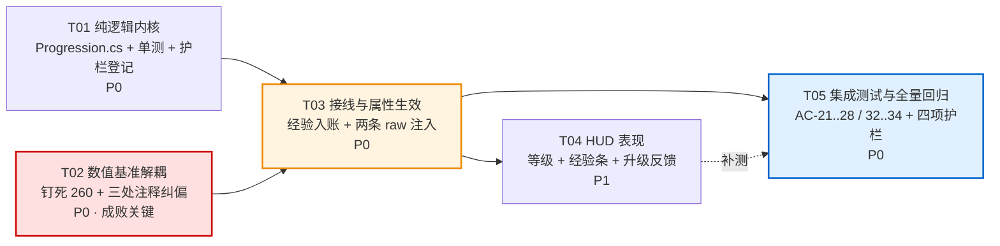

# P1-6 玩家成长曲线 —— 系统设计与任务分解

> 版本：v1.0　｜　作者：高见远（架构师）　｜　上游：`docs/unity-p1-6-progression-prd.md`（许清楚）
> 配套图：`docs/progression-class-diagram.mermaid`、`docs/progression-sequence-diagram.mermaid`
> 交付环境：**无 Unity / 无 dotnet**，本文档不含实现代码，全部符号引用均已 grep 核实（见 §9）。
> 工程根：`F:/AI-project/ancientGame/shuimofeng/shuimofeng`

---

## 0. TL;DR（给工程师的五句话）

1. **新增只有两个纯逻辑文件**：`Progression.cs` + `ProgressionTests.cs`。内核既有文件**一行可执行代码都不改**（`DifficultyBridge.cs` 只改注释）。
2. **唯一的既有可执行代码改动是 `CombatBridge.cs:387`**：把实时 `p.HpMax` 换成常量 `PlayerHpMax`。1 级时两者恒等 ⇒ 存量对拍零影响。
3. **⚠️ PRD 漏了一条伤害路径**：玩家普攻实际走的是 `AttackController.cs:219`，它的 raw 来自 `AttackController.AttackRaw = 12.0f`，**与 `SkillConfig.BASIC_RAW` 是两个彼此独立的常量**。只改技能表 = 普攻的攻击力加成完全不生效。详见 §1.3 / AD-3。
4. **⚠️ PRD 漏了一条护栏**：`t3_selfcheck.py` 有写死清单 `T3_PURE`（14 项）与 `EXPECTED_COUNT = 32`。新增纯逻辑文件必须同步登记，否则护栏直接报错。详见 §1.4 / AD-6。
5. **`Combatant.Level` 已被敌人占用**（`Combatant.cs:88` + `DifficultyBridge.cs:328 c.Level = lv`），**严禁**拿它装玩家等级。详见 AD-1 否决项 A。

---

## 1. 实现方案总述

### 1.1 问题的本质：这是一个「接线」问题，不是「计算」问题

经验的生产端已经完备：`Combatant.ExpValue`（`Combatant.cs:103`）在 `DifficultyBridge.cs:330` 被赋基础值，精英在 L342 乘 `ELITE_EXP_MULT`、BOSS 在 L413 乘 `BOSS_EXP_MULT`。事件出口也已完备：`CombatEventsUnity.EnemyDied`（`CombatEventsUnity.cs:55`）是一个已经在 `OnEnemyDeath` 里被无条件调用的 `Action<Combatant>`，当前**无人订阅**。

所以本期真正的工作量分布是：

| 工作 | 占比 | 风险 |
|---|---|---|
| 曲线表与升级判定（纯算术） | 20% | 极低，全静态表 |
| 接线（订阅 → 应用到玩家） | 25% | 中，涉及两条伤害路径 |
| **数值基准解耦 + 注释纠偏** | 15% | **高，本期成败关键** |
| HUD 表现 | 20% | 低 |
| 测试与护栏登记 | 20% | 中，易漏 `t3_selfcheck.py` |

### 1.2 分层落位

工程有两套脚本根，本期严格按下表落位，**不得越界**：

| 层 | 根目录 | asmdef | 本期内容 |
|---|---|---|---|
| **纯逻辑内核** | `Assets/Scripts/Systems/Combat/` | `Xianxia.Combat`（`noEngineReferences=true`） | `Progression.cs`（新增）、`DifficultyBridge.cs`（仅注释） |
| **纯逻辑单测** | `Assets/Scripts/Systems/Combat/Tests/` | `Xianxia.Combat.Tests`（`noEngineReferences=true`） | `ProgressionTests.cs`（新增） |
| **接线层** | `Assets/Scripts/Systems/Combat/Unity/` | `Xianxia.Combat.Unity` | `CombatController.cs`（仅注释） |
| **Unity 表现层** | `Assets/_Project/Scripts/Runtime/` | `Xianxia.Unity.T2` | `CombatBridge.cs`、`AttackController.cs`、`Hud.cs` |
| **Unity 层测试** | `Assets/_Project/Scripts/Runtime/Tests/` | `Xianxia.Unity.T2.Tests` | `P1_6_ProgressionIntegrationTests.cs`（新增） |

> **判据**：一个文件该放哪一层，看它需不需要 `UnityEngine`。`PlayerProgression` 只做整数加减与查表，**不需要**，因此必须落在纯逻辑层，这是 AC-27 / AC-28 的结构性保证，而不是靠自觉。

### 1.3 🚨 关键发现一：玩家有**两条**独立的伤害 raw 源

PRD §4.3 的表格把「水剑斩 基础 12」当成单一来源，实际 grep 结果是两条：

| 路径 | 调用点 | raw 来源 | 当前是否生效 |
|---|---|---|---|
| **A · 普攻** | `AttackController.cs:219`<br/>`DamageResolver.ResolvePlayerAttack(player, e, raw, enc.Events)` | `AttackController.cs:47` `[SerializeField] private float raw = AttackRaw;`<br/>`AttackController.cs:35` `public const float AttackRaw = 12.0f;` | ✅ **始终生效**（`WorldBuilder.cs:564` 无条件 `AddComponent<AttackController>()`；`WorldBuilder.cs:572` 注释明说「普攻走 AttackController，它自带 T2 内联退路 Swing()，即使 T3 没开启也能直接结算伤害」） |
| **B · 技能** | `Encounter.cs:893`<br/>`DamageResolver.ResolveSkillHit(p, _hitBuffer[i], def, ComboMult, SkillRng, EventsT3, Events)`<br/>内部 `DamageResolver.cs:318` `def.Raw * mult` | `SkillConfig.cs:368/387/410` 从 `BASIC_RAW/BURST_RAW/LOTUS_RAW` 装配<br/>表实例由 `CombatBridge.cs:454 _skillTable = SkillConfig.BuildDefaultTable()` 持有 | ✅ T3 开启时生效 |

**结论**：`AttackController.AttackRaw = 12.0f` 与 `SkillConfig.BASIC_RAW = 12.0f` 是**两个数值相同但彼此无引用关系的独立常量**。本期必须**两条路径都注入 `AtkBonus`**，否则玩家在最主要的输出手段（普攻）上感受不到任何攻击力成长——这会被误判为「成长系统没做完」。

### 1.4 🚨 关键发现二：`t3_selfcheck.py` 的清单是写死的

`t3_selfcheck.py:76-89` 定义 `T3_PURE`（14 项），`:93-110` 定义 `T3_UNITY`（17 项），`:114-116` 定义 `T3_BRIDGE`（1 项），随后：

```
T3_ALL = T3_PURE + T3_UNITY + T3_BRIDGE
EXPECTED_COUNT = 32
```

脚本头部（`:70-72`）明确写着「**为什么写死清单而不是纯 glob**：glob 会把 T0/T1/T2 的老文件一起卷进来……清单负责划定责任范围」。

因此新增 `Progression.cs` 后，必须：① 在 `T3_PURE` 中加一行；② 把 `EXPECTED_COUNT` 从 `32` 改为 `33`。**不改则 `t3_selfcheck.py` 直接失败，且失败原因看起来像是"文件数不对"而非"漏登记"，极易误判为回归。**

> 注：`ProgressionTests.cs` 位于 Tests 目录，不属于三张清单中的任何一张，**不需要**登记。

### 1.5 与 `t1_selfcheck.py` 的关系（可以放心）

`t1_selfcheck.py` 是一份**自包含的 Python 仿真**，它不解析任何 C# 源码：`:79` 与 `:123` 各自写死 `PLAYER_HP_MAX = 260.0`，`:1895` 用 `PLAYER_HP_MAX / DEFF_DIVISOR = 4.0` 作靶心。只要 C# 侧的 `260.0f` 常量不动，t1 的 64 条断言**结构性免疫**本期全部改动，无需任何同步。

---

## 2. 关键架构决策与否决项

### AD-1　等级状态放在**独立的纯逻辑类** `PlayerProgression`

**采纳**：新建 `Assets/Scripts/Systems/Combat/Progression.cs`，内含 `ProgressionCurve`（静态曲线表）+ `PlayerProgression`（状态机）+ `LevelUpInfo`（事件载荷）。完全对齐 `RunPhase.cs` 的「一个文件 / 一个枚举或表 / 一个 Tracker 类」范式。

#### ❌ 否决项 A：把等级塞进 `Combatant`

三条否决理由，第一条是硬性的：

1. **字段名已被占用，且语义完全不同**。`Combatant.cs:88` 已有 `public int Level = 1;`，而 `DifficultyBridge.cs:328` 写的是 `c.Level = lv;`——那是**敌人的区域等级**（zone level），用于难度缩放。若玩家等级复用该字段，两套语义共享一个名字，任何一次 `grep Level` 的结果都不再可信；若另起 `PlayerLevel` 字段，则场上 6 只怪每只都要背一个永远为 1 的死字段。
2. **`Combatant.cs` 已 22 476 字节**，是内核第三大文件。它是一个被 `t1_selfcheck.py` 逐字段对拍的数据结构，往里加字段等于扩大对拍面。
3. **生命周期不匹配**。`Combatant` 随一场遭遇创建销毁，而成长要跨波次存活；把跨波次状态挂在会被销毁的对象上，是最典型的状态丢失来源。

#### ❌ 否决项 B：做成 `Encounter` 的字段

1. **`Encounter.cs` 已 51 531 字节**，是全项目最不该继续膨胀的文件——`RunPhase.cs:12` 的文件头注释已经把这条写成了明文规约，本期没有理由破例。
2. **依赖方向会倒置**。经验的触发源是 `CombatEventsUnity.EnemyDied`（Unity 层），若成长状态住在 `Encounter` 里，就变成「内核持有状态 → Unity 层回调 → 反手写内核」的环形依赖。而现状是 `Encounter` 通过 `ICombatEvents` 单向广播、Unity 层单向消费，这个方向必须保持。
3. **`Encounter.Clear()`（`:339`）会连带 `RunState.Reset()`（`:366`）**。若成长也挂进去，则「清场」与「重置成长」被强行绑定，未来做多波次/多区域（清场但不清等级）时会被迫拆开。

#### ❌ 否决项 C：做成 `MonoBehaviour`

直接违反 AC-27（不含 `using UnityEngine`）与 AC-28（可脱离 `Encounter` 独立构造单测），且会让曲线表无法在 `Xianxia.Combat.Tests`（`noEngineReferences=true`）里被引用。

#### ❌ 否决项 D：类名叫 `ProgressionState`

PRD §7 末尾已明确：`Assets/Data/zones.json:7` 的注释提到 `ProgressionState.rank`（境界 rank），是为未来境界系统预留的**数据契约**。占用这个名字会让未来的境界系统无名可用。**采用 `PlayerProgression`**，文件名 `Progression.cs`——与 `RunPhase.cs`（文件名 = 枚举名，主类叫 `RunPhaseTracker`）的「文件名与主类名可以不同」范式一致。

---

### AD-2　`DifficultyBridge.PlayerHpMax` 正名为「平衡基准血量」，永久钉死 260

**主理人已裁定，直接执行。** 本节只交付改法与论证。

#### ① 改法（唯一的既有可执行代码改动）

`Assets/_Project/Scripts/Runtime/CombatBridge.cs:387`，现状：

```
Encounter.Bridge.PlayerHpMax = p.HpMax > 0.0f ? p.HpMax : PlayerHpMax;
```

改为**无条件取本类的 `const`**：

```
Encounter.Bridge.PlayerHpMax = PlayerHpMax;      // CombatBridge.cs:40  const 260.0f
```

- 三元表达式整体去掉：钉死之后 `p.HpMax` 不再参与，保留判空反而暗示"某些情况下会取实时值"。
- `Encounter.Bridge.PlayerDef = def;`（L388）**保持不变**——防御没有成长曲线，它仍应与玩家真实值同源。
- ⚠️ **注意 `ApplyPlayerDamageModel()` 会被反复调用**（`CombatBridge.cs:271` 在 `Start()` 中调用；方法本身是 `public`，未来任何"玩家属性变了就刷新一下"的调用都会命中）。正因为它反复执行，钉死常量才是必须的——只要有一次在升级后被调用，`d_eff` 就会漂移。

#### ② 注释纠偏（三处，缺一不可）

**这三处注释比代码改动更重要**：它们当前**主动指引后人把代码改回去**，不纠正就是在等下一次事故。

| # | 文件:行 | 现状原文 | 处置 |
|---|---|---|---|
| N-1 | `CombatBridge.cs:384` | `// 反调靶子必须与玩家真实血上限同源，否则 A1/A2 窗口失准。` | **整句替换**。新语义：反调靶子是**平衡基准血量**，永久 260，**刻意不跟随**玩家实时 `HpMax`。写明理由：跟随会形成"升级→怪变强"的反馈回路，玩家白升级且 `d_eff` 从 4.0 漂移。 |
| N-2 | `DifficultyBridge.cs:131-133` | `默认 260 与 CombatController.playerHpMax 对齐；玩家升级改血上限后，上层必须同步写回这里，否则新生成的怪还按旧血量反调。` | **整段推翻**。这是全项目最危险的一句注释——它把本期要修的 bug 写成了规约。新文案须明确：本字段是**关卡难度的标尺**，不是玩家状态；标尺不随被测量者移动；`P1-6` 已裁定永久 260。 |
| N-3 | `CombatController.cs:125-126` | `// U1：模型 B 的 d_eff 靶子分子是**玩家**血上限，必须与 Player.HpMax 同源，// 否则怪物按 260 反调、玩家实际只有 200 血，A1/A2 窗口立刻失准。` | **补注不改码**。L127 `Encounter.Bridge.PlayerHpMax = playerHpMax;` 是**构建期一次性赋值**（此时玩家必为 1 级、`playerHpMax` = 260），行为正确，**不动代码**。但注释同样在说"必须与 Player.HpMax 同源"，须补一句：此处赋的是**平衡基准**，与玩家实时血上限的耦合已在 P1-6 解除，后人不得改成运行时跟随。 |

> ⚠️ `DifficultyBridge.cs:134-137` 的另一段注释（「为什么不是敌人的 hp_max」）**依然正确、不要动**。它说的是"靶子分子必须是玩家量纲而非敌人量纲"，这一点没有被推翻。只推翻"必须跟随实时值"这半句。

#### ③ 为什么存量断言零影响（逐条论证）

| 断言集合 | 数量 | 影响分析 |
|---|---|---|
| `t1_selfcheck.py` | 64 | **结构性免疫**。该脚本不解析 C#，自带 `PLAYER_HP_MAX = 260.0`（`:79`/`:123`）。改动不触及该常量。 |
| Unity NUnit | 88 | **逐位等价**。所有既有用例均在 1 级、`baselineMode` 下运行（`CombatBridge.cs:68` 的 `baselineMode` 开关）。1 级时 `Player.HpMax` 由 `Combatant.CreatePlayer(0, playerHpMax, pos)`（`Combatant.cs:541`，`core.HpMax = hpMax`）赋为 260.0f，而 `CombatBridge.PlayerHpMax` 亦为 260.0f。两者是**同一个 IEEE-754 位模式**，三元表达式的两个分支在此条件下返回**完全相同的值**。改前改后 `Encounter.Bridge.PlayerHpMax` 一模一样，下游 `SolveEffectiveAtkMult(PlayerHpMax, baseAtkScaled, PlayerDef)`（`DifficultyBridge.cs:322`）的输入完全一致，输出必然一致。 |
| `d_eff = 4.0` | — | `260 / 65 = 4.0` 恒成立（`Difficulty.cs:29 DeffDivisor = 65.0f`）。 |
| 单挑 38.2s / 围攻 15.1s | — | 由敌人 `ContactDamage`（`DifficultyBridge.cs:323 contactDamage = baseAtkScaled * atkMultEff`）与玩家血量共同决定；两者在 1 级均未变。 |

**一句话**：这是一次**在既有测试覆盖范围内属于恒等变换**的改动。差异仅在 2 级及以上显现，而 2 级以上是本期全新引入的领域，本就不存在基线。

---

### AD-3　攻击力加成采用「**从常量基数重算**」，而非「累加改表」

`AtkBonus` 必须落到 §1.3 的两条路径上。方案对比：

| 方案 | 做法 | 判定 |
|---|---|---|
| X · 累加改表 | 每次升级 `def.Raw += 1.0f` | ❌ **否决**。① 基础值被永久覆盖，`Reset()` 无从还原；② 若升级回调被重复触发（连升多级 / 事件重入）会重复累加，无幂等性；③ AC-22 要求"1 级 raw 与 `SkillConfig.BASIC_RAW` 严格相等"，改表后常量与实例值不再同源，该断言退化为自证。 |
| Y · 改内核签名 | `ResolveSkillHit(..., float rawBonus, ...)`，内部算 `(def.Raw + bonus) * mult` | ❌ **否决**。需要改 `DamageResolver.cs:297` 签名 + `Encounter.cs:893` 调用点 + 给 `Encounter` 加一个字段，三处内核改动。与 PRD「不改内核任何一个现有文件」的承诺冲突，且扩大对拍面。 |
| **Z · 常量基数重算** | 升级回调里 `def.Raw = SkillConfig.<X>_RAW + progression.AtkBonus`；普攻侧 `ResolvePlayerAttack(..., raw + bonus, ...)` | ✅ **采纳** |

**方案 Z 的性质**：

- **幂等**：无论回调触发几次，结果恒为 `常量 + 当前等级加成`。连升两级触发两次回调，第二次直接覆盖第一次，结果正确。
- **可复位**：`Reset()` 后 `AtkBonus = 0`，重算即回到 `12/20/8`，无需重建 `SkillTable`。
- **AC-22 可真实验证**：1 级时 `AtkBonus == 0.0f`，`def.Raw = BASIC_RAW + 0.0f`。IEEE-754 下 `x + 0.0f ≡ x` 是严格位等价，断言 `def.Raw == SkillConfig.BASIC_RAW` 成立且有意义。
- **内核零改动**：`_skillTable` 由 `CombatBridge` 私有持有（`CombatBridge.cs:454`），刷新它是编排层的正当职责。
- **运算顺序固定为 `(Raw + Bonus) * ComboMult`**：即加成先入 `Raw`，再被连击倍率放大。P0 阶段 `ComboMult` 恒为 1.0f（`Encounter.cs:207` 注释），两种顺序数值相同；但**必须在文档与代码注释中钉死此顺序**，否则 P1 连击上线时会出现一次无人察觉的数值跳变。

**唯一读取出口**：在 `CombatBridge` 上暴露 `public float PlayerAtkBonus { get; }`（转发 `_progression.AtkBonus`，`_progression == null` 时返回 `0.0f`）。`AttackController` 已经持有 `CombatBridge` 引用（`AttackController.cs:54 private CombatBridge _bridge;`），读取零成本。**禁止**让 `AttackController` 直接持有 `PlayerProgression`——保持"表现层只认编排层"的既有拓扑。

---

### AD-4　经验幂等以「敌人 Id」为键，而非布尔标志

AC-35 要求同一敌人的死亡事件重复触发时经验只结算一次。`RunPhaseTracker` 用的是单个 `_phase` 枚举做幂等闸门（一局只发生一次），但经验是**每只怪各一次**，语义不同。

**采纳**：`PlayerProgression` 内部持有 `HashSet<int> _credited`，键为 `Combatant.Id`（`Combatant.cs:76`）。`DifficultyBridge.AllocId()` 保证 id 全局唯一（`DifficultyBridge.cs:148` 附近，注释原文「W-CORE 冷却表以它为 key，必须全局唯一」），因此可安全作为幂等键。

- 对外提供两个重载，复刻 `RunPhase.Evaluate` 的双重载范式：
  - `GainExp(int amount)` —— **纯查询式**，不做幂等去重，供单测直接喂数字（对应 AC-08..AC-16）。
  - `GainExpFrom(int sourceId, float expValue)` —— 生产路径，先查 `_credited` 再转发给 `GainExp`（对应 AC-32..AC-35）。
- `Reset()` 必须 `_credited.Clear()`，否则第二局沿用第一局的 id 会静默吞经验。

---

### AD-5　经验用 `int`，血量/攻击用 `float`

- `Combatant.ExpValue` 是 `float`（`Combatant.cs:103`），但曲线表全是整数（20/25/35…）。**在 `GainExpFrom` 的入口处一次性转 `int`**，之后全程整数运算。理由：整数比较无舍入风险，AC-05/AC-06 的逐项断言才能用 `==` 而非 `Within`。
- 转换规则**必须显式定为向下取整 `(int)`**（C# 的 `float→int` 显式转换即截断）。当前所有 `ExpValue` 经过 ×2.0 / ×3.0 后仍是整数（6/7/8 → 12/14/16 / 18/21/24），截断是恒等操作；写死规则是为了防止未来出现 ×1.5 倍率时行为不确定。
- `HpMax` / `AtkBonus` 保持 `float`，与 `WCoreState.HpMax`、`SkillDef.Raw` 同型，避免隐式转换。260/286/…/494 与 0..9 在 float 中均**精确可表示**。

---

### AD-6　护栏清单同步是**交付的一部分**，不是可选项

见 §1.4。`t3_selfcheck.py` 的 `T3_PURE` + `EXPECTED_COUNT` 必须同步。这是本期唯一需要改动 Python 文件的地方，改动量 2 行。

---

## 3. 文件列表

### 3.1 纯逻辑层（`Xianxia.Combat` / `Xianxia.Combat.Tests`，**禁 `UnityEngine`**）

| # | 相对路径 | 类型 | 职责 | 预估行数 |
|---|---|---|---|---|
| F1 | `Assets/Scripts/Systems/Combat/Progression.cs` | **新增** | 曲线表 `ProgressionCurve`（static）+ 状态机 `PlayerProgression` + 事件载荷 `LevelUpInfo`。文件头须写「它解决什么问题 / 为什么单独开一个文件 / 禁止事项 / 新手向导」四段，风格对齐 `RunPhase.cs`。 | **300 ~ 340**<br/>（注释约占 55%） |
| F2 | `Assets/Scripts/Systems/Combat/Tests/ProgressionTests.cs` | **新增** | NUnit，覆盖 AC-01..AC-16、AC-29..AC-31、AC-35。参照 `RunPhaseTests.cs`（19 187 字节）的组织方式。 | **380 ~ 440** |
| F3 | `Assets/Scripts/Systems/Combat/DifficultyBridge.cs` | **修改（仅注释）** | 纠正 L131-133 的过时指引（N-2）。**可执行代码 0 行改动。** | 改 ~8 行注释 |
| F4 | `Assets/Scripts/Systems/Combat/Tests/t3_selfcheck.py` | **修改** | `T3_PURE` 追加 `"Scripts/Systems/Combat/Progression.cs"`；`EXPECTED_COUNT` 32 → 33。 | 改 2 行 |

> F1、F2 均需 `.meta` 文件。Unity 会自动生成，但若走 git 提交请确认 `.meta` 一并入库（本目录既有文件全部配套 `.meta`）。

### 3.2 接线层（`Xianxia.Combat.Unity`）

| # | 相对路径 | 类型 | 职责 | 预估行数 |
|---|---|---|---|---|
| F5 | `Assets/Scripts/Systems/Combat/Unity/CombatController.cs` | **修改（仅注释）** | L125-126 补注（N-3）：此处 `Encounter.Bridge.PlayerHpMax = playerHpMax` 是构建期一次性赋值的**平衡基准**，不得改成运行时跟随。**代码 0 行改动。** | 加 ~5 行注释 |

### 3.3 Unity 表现层（`Xianxia.Unity.T2` / `Xianxia.Unity.T2.Tests`）

| # | 相对路径 | 类型 | 职责 | 预估行数 |
|---|---|---|---|---|
| F6 | `Assets/_Project/Scripts/Runtime/CombatBridge.cs` | **修改（主改造点）** | ① L387 钉死基准血量 + L384 注释（N-1）；② 新增 `_progression` 字段与 `Progression` / `PlayerAtkBonus` 只读属性；③ `Start()` 中订阅 `EventsUnity.EnemyDied` 与 `_progression.LeveledUp`；④ `OnEnemyDied` / `OnPlayerLeveledUp` / `RefreshSkillRawFromLevel` 三个私有方法；⑤ `OnDestroy` 对称退订（沿用既有 L982 的退订范式）。 | 改 3 行<br/>+ 新增 **90 ~ 110** |
| F7 | `Assets/_Project/Scripts/Runtime/AttackController.cs` | **修改** | L219 改为传 `raw + bonus`（bonus 取自 `_bridge.PlayerAtkBonus`，`_bridge == null` 时为 0）。须在文件头「raw = 12 的来历」段落补一句：12 是 **1 级基础值**，运行时实际 raw = 12 + AtkBonus。 | 改 1 行<br/>+ ~10 行注释 |
| F8 | `Assets/_Project/Scripts/Runtime/Hud.cs` | **修改** | 新增等级文本与经验进度条（参照既有 `_hpText` 在 L58/L191/L300-304 的建法）；`BindProgression()` 订阅 `LeveledUp` / `ExpGained`。R-13 / R-14。 | 新增 **70 ~ 90** |
| F9 | `Assets/_Project/Scripts/Runtime/Tests/P1_6_ProgressionIntegrationTests.cs` | **新增** | 覆盖 AC-17..AC-28、AC-32..AC-34。命名对齐既有 `P0_2_GameOverHudTests.cs` / `P0_5_MenuHudTests.cs`。**AC-23 是本文件的头号哨兵。** | **260 ~ 320** |

### 3.4 文件清单小结

```
新增 3 个（F1 F2 F9）      纯逻辑 2 + Unity 测试 1
改代码 3 个（F6 F7 F4）    Unity 2 + Python 护栏 1
仅改注释 3 个（F3 F5 + F8 的既有部分）
```

**内核（`Assets/Scripts/Systems/Combat/`）新增可执行代码文件：1 个。既有内核文件可执行代码改动：0 行。**

---

## 4. 数据结构与接口

> 完整类图见 `docs/progression-class-diagram.mermaid`。以下为契约说明。

### 4.1 `ProgressionCurve`（static，纯查表）

| 成员 | 类型 | 值 / 语义 |
|---|---|---|
| `MAX_LEVEL` | `const int` | `10` |
| `BASE_HP_MAX` | `const float` | `260.0f`，**必须与 `CombatBridge.PlayerHpMax` 同值**（见 §6.2 常量归属） |
| `HP_PER_LEVEL` | `const float` | `26.0f` |
| `ATK_PER_LEVEL` | `const float` | `1.0f` |
| `EXP_TO_NEXT` | `static readonly int[]` | 长度 10，索引 = 等级-1：`{20,25,35,50,65,90,120,165,220, 0}`。末位 0 表示封顶。 |
| `EXP_CUMULATIVE` | `static readonly int[]` | 长度 10：`{0,20,45,80,130,195,285,405,570,790}` |
| `HpMaxAt(int level)` | `static float` | `BASE_HP_MAX + HP_PER_LEVEL * (Clamp(level) - 1)` |
| `AtkBonusAt(int level)` | `static float` | `ATK_PER_LEVEL * (Clamp(level) - 1)` |
| `ExpToNext(int level)` | `static int` | 封顶或越界返回 `0` |
| `CumulativeExpAt(int level)` | `static int` | AC-06 |
| `Clamp(int level)` | `static int` | 夹到 `[1, MAX_LEVEL]`，AC-07 的越界防护 |

> **为什么曲线用公式实现而表用数组**：血量/攻击是**等差**的，公式 `260 + 26*(L-1)` 在整数域上无舍入且比数组更难写错；经验需求**非等差**，只能用数组。两者都要在 `ProgressionTests` 里被逐项钉死（AC-03/04/05/06），实现方式不影响断言强度。

### 4.2 `PlayerProgression`（状态机 + 事件源）

| 成员 | 签名 | 契约 |
|---|---|---|
| `Level` | `int { get; }` | 初值 1，范围 `[1,10]` |
| `ExpInLevel` | `int { get; }` | 当前等级内进度，`[0, ExpToNext)` |
| `ExpToNext` | `int { get; }` | 转发 `ProgressionCurve.ExpToNext(Level)`；封顶为 0 |
| `ExpTotal` | `int { get; }` | 本局累计入账。**封顶后停止增长**（AC-15） |
| `IsMaxLevel` | `bool { get; }` | `Level >= MAX_LEVEL` |
| `HpMax` | `float { get; }` | 转发 `HpMaxAt(Level)` |
| `AtkBonus` | `float { get; }` | 转发 `AtkBonusAt(Level)` |
| `LeveledUp` | `event Action<LevelUpInfo>` | 每升一级抛一次（AC-13）。**在等级/属性已更新之后抛**，订阅方读到的必为新值 |
| `ExpGained` | `event Action<int>` | 实际入账量。**入账 0 时不抛**（AC-16 的防御性要求延伸） |
| `GainExp(int amount)` | `int` | 返回实际入账；`amount <= 0` 或已封顶 → 返回 0 且状态零变化 |
| `GainExpFrom(int srcId, float expValue)` | `int` | 幂等去重后转发；重复 srcId 返回 0 |
| `Reset()` | `void` | 等级/进度/累计/幂等集合全清。**不清订阅者** |

**`Reset()` 不清订阅者**——这条直接沿用 `RunPhase.cs:153-157` 的既有约定，原文：「订阅者是上层在装配阶段挂上的，生命周期跟随**场景**，而 Reset 的生命周期跟随**一局**……谁订阅谁负责退订，是本项目统一的约定」。**同样不在 `Reset()` 里抛任何事件**，理由同 `RunPhase.cs:159-162`（清场路径抛事件会让正在销毁的 UI 收到回调）。

### 4.3 `LevelUpInfo`（readonly struct）

`PrevLevel` / `NewLevel` / `DeltaHpMax` / `NewHpMax` / `DeltaAtkBonus` / `NewAtkBonus`。

**为什么带 Delta 而不让订阅方自己算**：`Hp += ΔHpMax`（R-07）需要增量。若让 `CombatBridge` 自己用 `HpMaxAt(new) - HpMaxAt(prev)` 计算，则曲线逻辑泄漏到了 Unity 层；连升多级时更容易算错基准。**用 struct 而非 class**：每局最多抛 9 次，无 GC 压力，且值语义天然防止订阅方篡改。

### 4.4 `CombatBridge` 新增契约

| 成员 | 签名 | 说明 |
|---|---|---|
| `Progression` | `public PlayerProgression { get; }` | 供 `Hud` / 测试读取；可能为 null（`Start()` 之前） |
| `PlayerAtkBonus` | `public float { get; }` | `_progression?.AtkBonus ?? 0.0f`。**`AttackController` 的唯一读取出口** |

---

## 5. 程序调用流程

> 完整时序图见 `docs/progression-sequence-diagram.mermaid`（含装配期、主链路、两条伤害注入、重开四段）。

### 5.1 主链路文字版：从「敌人死亡」到「HpMax 生效」

```
Encounter.StepFixed()                                     [纯逻辑]
  └─ 检出 enemy.Hp <= 0
     └─ Events.OnEnemyDeath(enemy)                        [ICombatEvents.cs:34-35]
        └─ CombatEventsUnity.OnEnemyDeath(e)              [CombatEventsUnity.cs:102]
           ├─ PlaySfx("sfx_enemy_death")
           └─ EnemyDied(e)                                [CombatEventsUnity.cs:113] ★ 本期接入点
              └─ CombatBridge.OnEnemyDied(e)              [新增]
                 └─ _progression.GainExpFrom(e.Id, e.ExpValue)
                    ├─ _credited 去重（AC-35）
                    ├─ (int) 截断 → _expInLevel += n / _expTotal += n
                    └─ while (!IsMaxLevel && _expInLevel >= ExpToNext)
                       ├─ _expInLevel -= ExpToNext ; _level++
                       └─ LeveledUp(LevelUpInfo{...})     ← 每级各一次（AC-13）
                          ├─ CombatBridge.OnPlayerLeveledUp(info)
                          │  ├─ Player.HpMax = info.NewHpMax      → WCoreState.HpMax
                          │  ├─ Player.Hp    = Player.Hp + info.DeltaHpMax   （不回满，AC-18）
                          │  └─ RefreshSkillRawFromLevel()
                          │     └─ _skillTable[X].Raw = SkillConfig.X_RAW + AtkBonus
                          └─ Hud.OnLeveledUp(info) → 播提示 + 刷等级
```

**关键顺序约束**：

1. `_level++` **必须先于** `LeveledUp` 抛出——订阅方（`Hud`）会直接读 `progression.Level`，读到旧值会显示错一级。
2. `Player.HpMax` **仍要求先于** `Player.Hp` 赋值，但**理由是防御性写法，不是钳制**。
   > ⚠️ **原表述有误，2026-08-09 QA 复审期间由主理人与 QA 独立查证后订正。** 原文称「`Combatant.Hp` 的 setter 会对 `HpMax` 做钳制；先写 Hp 会被旧上限截断」——**该前提不成立**。实测：`Combatant.cs:176-205` 的 `Hp` / `HpMax` setter 均为**纯透传代理**（`WCore != null ? WCore.X : _x`），无任何钳制；终点 `WCore.cs:65 public float Hp;` 与 `WCore.cs:68 public float HpMax = 1.0f;` 是**裸公开字段，亦无钳制**。故就当前实现而言，颠倒顺序**不会**造成截血或任何行为差异。

   **保留该顺序要求的真实理由**：给血量补钳制（`Hp = Min(Hp, HpMax)`）是血量系统很常见的演进方向。先上限、后当前血的顺序，能让这段代码在**将来有人给 `WCore.Hp` 加上钳制时免于被动返工**；顺序本身零成本，保留即可。
   **真正的不变式**（优先级高于顺序）：`HpMax` 与 `Hp` **同额 `+ΔHpMax`**，缺口恒定——260/260 → 286/286，100/260 → 126/286，即 PRD R-07「不回满」的落点。QA 已验证满血升级、濒死升级、连升多级、`Reset()` 归 260 四个分支全部安全。
3. `RefreshSkillRawFromLevel()` 每级都调一次是**冗余但安全**的（幂等，见 AD-3）。不要为了"优化"改成只在循环结束后调一次——那会让"每级各抛一次事件"与"每级各生效一次"不对称，给未来的逐级动画埋坑。

### 5.2 两条伤害注入的时机差异

| 路径 | 注入时机 | 说明 |
|---|---|---|
| A · 普攻 | **读时**（每次挥砍） | `AttackController.Swing()` 每次调用都现读 `_bridge.PlayerAtkBonus`。升级后下一刀立刻生效。 |
| B · 技能 | **写时**（升级瞬间） | `_skillTable` 的 `SkillDef.Raw` 被刷新。已经在飞行中的技能（`ActionState` 已进入 active 帧）用的是命中时刻的 `def.Raw`，即升级后的新值——可接受，且不产生同帧歧义（升级发生在 `OnEnemyDeath` 回调，早于下一帧的技能结算）。 |

### 5.3 重开

P0-4 的重开是 **`SceneManager.LoadScene` 整场景重载**（`CombatBridge.cs:990-994` 注释原文：「按 R 重新加载当前场景……世界从头重建」）。因此：

- 生产路径上 `PlayerProgression` 会随 `CombatBridge` 一起被销毁重建，**天然回到 1 级**，`Reset()` 在此路径上甚至不会被调用。
- `Reset()` 仍必须实现且必须正确：① AC-29/30/31 直接测它；② 未来若做"不重载场景的软重开"，它是唯一入口。
- **`Reset()` 的完整语义 = 内部状态清零 + 由调用方补做外部复位**（`Player.HpMax`/`Hp` 回 260、`RefreshSkillRawFromLevel()`）。`PlayerProgression` 自己**不持有 `Combatant` 引用**，不能也不该去改玩家——这是"纯观察者"的边界。文档与代码注释都要写清这一点，否则工程师会误以为 `Reset()` 一调万事大吉。

---

## 6. 共享知识（跨文件约定）

### 6.1 命名约定

| 概念 | 约定名 | 禁用名 | 理由 |
|---|---|---|---|
| 成长状态类 | `PlayerProgression` | ~~`ProgressionState`~~ | 与 `zones.json:7` 的境界 rank 数据契约冲突（PRD §7） |
| 曲线表 | `ProgressionCurve` | ~~`LevelCurve`~~ | 与"经验/血/攻三条曲线"复数语义一致 |
| 文件名 | `Progression.cs` | — | 与 `RunPhase.cs` 同款（文件名 ≠ 主类名） |
| 命名空间 | `Xianxia.Combat` | — | 与 `RunPhaseTracker` 同 ns，测试可直接 `using` |
| 升级事件 | `LeveledUp` | ~~`LevelUp`~~ | `LevelUp` 像动词（易被误当方法名）；`PhaseChanged` 是既有的过去式范式 |
| 经验事件 | `ExpGained` | — | 同上，过去式 |
| Unity 层测试 | `P1_6_ProgressionIntegrationTests.cs` | — | 对齐既有 `P0_2_*` / `P0_5_*` 命名 |

### 6.2 数值常量归属（明确裁定）

| 常量 | 归属 | 判据 |
|---|---|---|
| `MAX_LEVEL` / `HP_PER_LEVEL` / `ATK_PER_LEVEL` / 两张经验表 | **`ProgressionCurve`（`Progression.cs` 内）** | 它们只服务成长曲线，无第二个消费者。**不要塞进 `CombatConfig.cs`** —— 该文件（10 348 字节）当前装的是全局战斗参数（`ELITE_EXP_MULT`、`BOSS_EXP_MULT`、`POISE_MAX_DEFAULT` 等），是被 `DifficultyBridge`/`DamageResolver` 多方共享的公共区。把单一模块的私有曲线塞进公共区，等于把"改曲线"的影响面从 1 个文件放大到全内核。 |
| `BASE_HP_MAX = 260.0f` | **`ProgressionCurve` 内再声明一份** | ⚠️ 这是一次**刻意的重复**。`ProgressionCurve` 在 `Xianxia.Combat`（`noEngineReferences=true`），而 `CombatBridge.PlayerHpMax` 在 `Xianxia.Unity.T2`——**纯逻辑层无法引用 Unity 层**，物理上不可能共享。处置：两处各自声明，并在**两边注释里互相点名**（"此值必须与 X 保持一致，改一处必须改另一处"），同时由 **AC-21 断言把两者钉在一起**（`Assert.AreEqual(CombatBridge.PlayerHpMax, ProgressionCurve.HpMaxAt(1))`）。用测试而不是用引用来保证一致性，是跨 asmdef 的标准解法。 |
| `AttackController.AttackRaw = 12.0f` | **保持原地不动** | 它是普攻的 1 级基础值。只在注释里说明"运行时实际 raw = 本值 + AtkBonus"。 |
| `SkillConfig.BASIC/BURST/LOTUS_RAW` | **保持原地不动** | 同上，它们是刷新时的基数。 |

> **既有的三处 260 口径**（`CombatBridge.cs:40` / `CombatController.playerHpMax` / `DifficultyBridge.cs:139`）本期**不合并、不重构**。`CombatBridge.cs:34-36` 的注释已声明"三处口径必须一致，后两者由 WorldBuilder 从这里注入"。本期只是让第四处（`ProgressionCurve.BASE_HP_MAX`）加入这个家族，并用断言锁死。

### 6.3 `Reset()` 语义（全项目统一）

沿用 `RunPhaseTracker.Reset()` 已确立的三条：

1. **只清自身内部状态**，不碰外部对象（不改 `Combatant`、不清 `Encounter`）。
2. **不清订阅者**。谁订阅谁负责退订。
3. **不抛任何事件**。Reset 由上层主动发起，上层不需要被自己通知。

**新增第四条（成长系统特有）**：
4. **`Reset()` 不足以完成"重开"**。调用方必须在 `Reset()` 之后自行把 `Player.HpMax`/`Hp` 复位到 260 并调 `RefreshSkillRawFromLevel()`。此约束须同时写在 `PlayerProgression.Reset()` 的 XML 注释和 `CombatBridge` 的调用处。

### 6.4 事件约定

- 事件在**状态更新完毕之后**抛出，订阅方读到的一律是新状态。
- 抛事件用**先取本地变量再判空**的标准写法（`RunPhase.cs:266-272` 原文范式），防止"判空之后、调用之前"被退订。
- 订阅在 `CombatBridge.Start()`，退订在 `OnDestroy()`，**对称成对**。既有退订范式见 `CombatBridge.cs:982-984`。
- 事件在**逻辑线程同步抛出**（与 `RunPhaseTracker` 的线程模型一致，见 `RunPhase.cs:98-100`）。UI 订阅方无需切线程。

### 6.5 注释风格（硬性要求）

`Progression.cs` 文件头必须包含四段，逐段对齐 `RunPhase.cs`：

1. **【它解决什么问题】** —— 引用 PRD §1.1「打完没有回报」，说明玩家侧零接收方的现状。
2. **【为什么单独开一个文件 / 一个类】** —— 复述 AD-1 的三条否决理由，**特别是 `Combatant.Level` 已被敌人占用**这条。
3. **【★ 最重要的设计决定】** —— "只算数，不碰战场"：`PlayerProgression` 不持有任何 `Combatant`/`Encounter` 引用，改玩家属性由 `CombatBridge` 在回调里做。
4. **【禁止事项】** —— 不得引用 `UnityEngine`；不得引入任何乘区；不得写敌人字段。
5. **【新手向导】** —— 用大白话解释：什么是"溢出经验"、为什么"连升两级要抛两次事件"、为什么"升级不回满血"、为什么"标尺不该跟着被测量的人一起变"（这条用来解释 AD-2，是全项目最需要防呆的概念）。

---

## 7. 数值安全性专章：逐条论证不动指纹

### 7.1 五条红线逐条核验

| 红线 | 值 | 本方案是否触碰 | 论证 |
|---|---|---|---|
| **`PlayerHpMax = 260`** | 260.0f | ❌ 不动 | 玩家 1 级 `HpMax = 260 + 26×0 = 260`。IEEE-754 下 `x + 0.0f ≡ x` 为严格位等价。`CombatBridge.PlayerHpMax` 常量本身一字未改，且现在被**更严格地**钉死为敌人反调的唯一分子。 |
| **`d_eff = 4.0`** | 260/65 | ❌ 不动 | `DifficultyBridge.cs:322 SolveEffectiveAtkMult(PlayerHpMax, ...)` 的第一参数改后恒为常量 260，`Difficulty.cs:29 DeffDivisor = 65.0f` 未动 ⇒ `d_eff` 在**任何等级下**都恒为 4.0。**改动后比改动前更安全**：改动前 2 级即漂移到 4.4。 |
| **`raw = 12`** | 12.0f | ❌ 不动 | 两条路径均为"基础常量 + AtkBonus"。1 级 `AtkBonus = 1.0f × 0 = 0.0f`，`12.0f + 0.0f ≡ 12.0f`。`AttackController.AttackRaw` 与 `SkillConfig.BASIC_RAW` 两个常量的字面值均未修改。 |
| **`CD = 0.4s`** | `BASIC_CD_FRAMES = 24` @60Hz | ❌ **完全未触碰** | 成长系统不读、不写任何冷却字段。`AttackController.AttackCooldown = 0.4f` 亦未动。 |
| **围攻/单挑 2.5294x** | 4.300 / 1.700 | ❌ **结构性免疫** | 该比值是 `Difficulty.SwarmFreqMeasured / SoloFreqMeasured`，即**每秒承伤次数之比**，由 W-CORE 双层闸门（0.6s 每源 + 0.2167s 全局）、固定步长 1/60、60Hz 量化边界三者唯一决定。它是**时间量**，与血量、伤害的数值大小无关。成长系统只改血上限与 raw，两者都不出现在闸门计算中。即便 10 级（494 血 / 21 raw），比值依然是 4.300/1.700。 |

### 7.2 「不引入新乘区」的形式化论证

| 改动点 | 运算形式 | 是否乘区 |
|---|---|---|
| `HpMax(L) = 260 + 26×(L-1)` | 常量 × 常量 → **加法项** | ❌ 否。`26×(L-1)` 是**编译期可求值的加数**，不与任何伤害量相乘。 |
| `AtkBonus(L) = 1×(L-1)` | 同上 | ❌ 否 |
| 普攻：`ResolvePlayerAttack(..., raw + bonus, ...)` | 加法后传入 | ❌ 否。`DamageResolver` 内部对该 raw 的处理逻辑一字未改。 |
| 技能：`def.Raw = 常量 + bonus`，随后 `def.Raw * ComboMult` | `ComboMult` 是**既有**乘区，P0 恒为 1.0f | ❌ 否。未新增乘区，只是既有乘区的被乘数变了。 |

**判据**：乘区 = 一个会与最终伤害相乘的**新因子**。本方案没有引入任何新因子，只是把两个既有的**被加数/被乘数**从常量换成了"常量 + 等级加数"。changelog:183 关于境界压制/五行克制的警告因此不适用。

### 7.3 「不写敌人字段」的机械性保证（AC-26）

`PlayerProgression` **不持有 `Combatant` 类型的任何字段、参数或局部变量**（`GainExpFrom` 只接收 `int sourceId` 和 `float expValue` 两个基元）。这是编译期可验证的：只要类里没有 `Combatant`，就物理上不可能写敌人字段。

> **这是刻意的接口设计**：PRD 建议的 `GainExpFrom(Combatant e)` 更省事，但会让"不碰敌人"降级为一条靠自觉遵守的规约。改成两个基元参数后，它变成了编译器保证的性质。拆包（`e.Id` / `e.ExpValue`）由 `CombatBridge.OnEnemyDied` 在 Unity 层完成。

### 7.4 `baselineMode` 兼容性

`CombatBridge.cs:68` 的 `baselineMode` 开启后不装配 T3（无 Skills/Action/Qi/Stamina）。本期改动在该模式下的行为：

- `_skillTable` 在 `baselineMode` 下不被装配到玩家 ⇒ `RefreshSkillRawFromLevel()` 需要**判空后静默跳过**，不得抛异常。
- `AttackController` 在 `baselineMode` 下**照常工作**（T2 内联退路），`PlayerAtkBonus` 照常读取。但基线对拍全程 1 级 ⇒ bonus 恒为 0 ⇒ `raw + 0.0f ≡ raw`，逐位等价。
- 成长系统本身在 `baselineMode` 下**不需要禁用**：它不改变执行路径条数，只在敌人死亡回调里多做几次整数加法，不影响固定步长内的任何确定性状态。

> 若工程师对确定性有疑虑，可选加一个 `progressionEnabled` 开关（默认 true，`baselineMode` 时置 false）。**架构上判定为非必需**，但若加，务必默认开启，避免出现"跑测试时成长被静默关掉"的假绿。

### 7.5 安全边界总表

| 保护对象 | 保护机制 | 强度 |
|---|---|---|
| 2.5294x 频率指纹 | 不触碰闸门参数与固定步长 | **结构性免疫** |
| `PlayerHpMax = 260` | 1 级加成为 0 | 严格位等价 |
| `raw = 12`（两条路径） | 1 级加成为 0 | 严格位等价 |
| `CD = 0.4s` | 完全未触碰 | 不适用 |
| `d_eff = 4.0` | 基准血量钉死为常量 | **比改动前更强**（原方案 2 级即漂移） |
| 不写敌人字段 | `PlayerProgression` 不含 `Combatant` 类型 | **编译期保证** |
| 不引用 `UnityEngine` | asmdef `noEngineReferences=true` + `t3_selfcheck.py` 红线 | **双重机械保证** |
| 每局开局状态 | 局内成长 + 场景重载 | 结构性保证 |

---

## 8. 任务列表

> 严格按依赖顺序。每条注明**验收方式**。本环境无 Unity / 无 dotnet，标注「本地」的验收须由主理人在本地 Unity 工程执行。

### T01 · 纯逻辑内核：曲线表 + 状态机 + 单测 + 护栏登记

| 项 | 内容 |
|---|---|
| **文件** | F1 `Progression.cs`（新增）、F2 `ProgressionTests.cs`（新增）、F4 `t3_selfcheck.py`（改 2 行） |
| **依赖** | 无（可立即开工） |
| **优先级** | **P0** |
| **要点** | ① 严格按 §4.1/§4.2/§4.3 契约实现；② 文件头五段注释（§6.5）；③ `GainExpFrom` 参数必须是 `(int, float)` 而非 `Combatant`（§7.3）；④ `t3_selfcheck.py` 的 `T3_PURE` +1 行、`EXPECTED_COUNT` 32→33 |
| **验收** | ① `python Assets/Scripts/Systems/Combat/Tests/t3_selfcheck.py` 全绿（含新增文件的红线检查）【可在本环境跑】<br/>② 本地 NUnit：`ProgressionTests` 覆盖 AC-01..AC-16、AC-29..AC-31、AC-35 全绿<br/>③ 人工核对：`Progression.cs` 全文 grep `UnityEngine` 仅出现在注释中 |

### T02 · 数值基准解耦：钉死 260 + 三处注释纠偏

| 项 | 内容 |
|---|---|
| **文件** | F6 `CombatBridge.cs`（改 L387 + L384 注释）、F3 `DifficultyBridge.cs`（仅注释 N-2）、F5 `CombatController.cs`（仅注释 N-3） |
| **依赖** | 无（与 T01 可并行） |
| **优先级** | **P0**（本期成败关键） |
| **要点** | ① L387 去掉三元表达式，直接取 `PlayerHpMax` 常量；② `PlayerDef` 那一行**不动**；③ 三处注释必须**推翻**旧指引而非叠加新说明——留着旧句子等于留着下一次事故 |
| **验收** | ① 本地 `t1_selfcheck.py` 仍 **64/64 PASS**（AC-36）<br/>② 本地 Unity NUnit 既有 **88 条全绿**（AC-39）<br/>③ 本地 `baselineMode` 下单挑 **38.2s** / 围攻 **15.1s** 复现（AC-38），围攻/单挑 **2.5294x**（AC-37）<br/>④ 人工核对：全仓 grep `PlayerHpMax`，确认无任何一处再对它写入实时血量 |

### T03 · 接线与属性生效：经验入账 → 升级应用 → 两条 raw 注入

| 项 | 内容 |
|---|---|
| **文件** | F6 `CombatBridge.cs`（新增 ~100 行）、F7 `AttackController.cs`（改 L219 + 注释） |
| **依赖** | **T01, T02** |
| **优先级** | **P0** |
| **要点** | ① `Start()` 订阅 `EventsUnity.EnemyDied` + `_progression.LeveledUp`，`OnDestroy()` 对称退订；② **`Player.HpMax` 必须先于 `Player.Hp` 赋值**（§5.1 约束 2）；③ **两条 raw 路径都要接**（§1.3）——只接技能表是本任务最容易漏的一半；④ `RefreshSkillRawFromLevel()` 从 `SkillConfig` 常量重算，**禁止 `+=`**；⑤ `_skillTable == null`（baselineMode）时静默跳过 |
| **验收** | ① 本地 PlayMode：击杀 4 只杂兵 → HUD 无需就位，但 `Progression.Level == 2`、`Player.HpMax == 286`、`Player.Hp` 相对升级前 `+26`<br/>② 本地：升到 2 级后 `AttackController` 单刀伤害相对 1 级 **+1**（验证路径 A 已接）<br/>③ 本地：升到 2 级后 `_skillTable[BASIC].Raw == 13.0f`（验证路径 B 已接）<br/>④ 本地：升到 10 级后 `Encounter.Bridge.PlayerHpMax` 仍严格 `== 260.0f`（**AC-23，核心哨兵**）<br/>⑤ 本地：同一敌人 `OnEnemyDeath` 手动重复触发，经验只入账一次（AC-35） |

### T04 · HUD 表现：等级 + 经验条 + 升级反馈

| 项 | 内容 |
|---|---|
| **文件** | F8 `Hud.cs`（新增 ~80 行） |
| **依赖** | **T03** |
| **优先级** | **P1** |
| **要点** | ① 参照既有 `_hpText`（`Hud.cs:58` 声明 / `:191` 建控件 / `:300-304` 刷新）的三段式套路；② `BindProgression()` 订阅 `LeveledUp` / `ExpGained`，`OnDestroy` 退订；③ 封顶时经验条显示「已满级」而非 `N/0`（防除零）；④ 连升两级要能连播两次提示（事件已保证抛两次，HUD 不得自己去重） |
| **验收** | ① 本地 PlayMode：HUD 常驻显示「等级 N」与经验进度条，击杀后进度条推进<br/>② 本地：一次击杀连升两级时提示播两次<br/>③ 本地：10 级时经验条不出现 `/0` 或 `NaN`<br/>④ 本地 NUnit：既有 `P0_5_MenuHudTests` 等 HUD 用例不回归 |

### T05 · 集成测试与全量回归

| 项 | 内容 |
|---|---|
| **文件** | F9 `P1_6_ProgressionIntegrationTests.cs`（新增） |
| **依赖** | **T03**（T04 完成后补测 HUD 相关，非阻塞） |
| **优先级** | **P0** |
| **要点** | ① AC-21 用断言把 `CombatBridge.PlayerHpMax` 与 `ProgressionCurve.HpMaxAt(1)` 钉在一起（跨 asmdef 一致性的唯一保证，§6.2）；② **AC-23 是头号哨兵**，必须显式测「10 级后 Bridge.PlayerHpMax == 260.0f」；③ AC-24 用同种子刷怪，对比 1 级与 10 级下 `ContactDamage` 严格相等；④ AC-27 可用反射/源码扫描，或直接依赖 `t3_selfcheck.py` 的红线（后者更可靠，二选一即可，不要重复） |
| **验收** | ① 本地 NUnit：AC-17..AC-28、AC-32..AC-34 全绿<br/>② 本地：`t1_selfcheck.py` 64/64、`t3_selfcheck.py` 全绿、Unity NUnit（88 + 新增）全绿（AC-36..AC-39）<br/>③ 本地：`baselineMode` 三项口径 38.2s / 15.1s / 2.5294x 复现<br/>④ 主理人抽查：`docs/changelog.md` 补记本期改动，特别是「`Bridge.PlayerHpMax` 语义变更」需单列一条 |

### 任务依赖图



> **T01 与 T02 无依赖关系，可并行**。T02 单独完成后即可先跑一轮 t1/NUnit 回归，把"基准解耦零影响"这个最关键的结论**提前证伪或证实**，不要等到 T05 才发现问题。

---

## 9. grep 核实清单（本文引用的全部符号）

| 符号 / 事实 | 位置 | 核实 |
|---|---|---|
| `void OnEnemyDeath(Combatant e);` | `Assets/Scripts/Systems/Combat/ICombatEvents.cs:34-35` | ✅ 主理人已核 |
| `public Action<Combatant> EnemyDied;` | `Unity/CombatEventsUnity.cs:55` | ✅ 本人核实 |
| `EnemyDied(e)` 调用点 | `Unity/CombatEventsUnity.cs:113` | ✅ |
| `public float ExpValue;` | `Combatant.cs:103` | ✅ |
| **`public int Level = 1;`（已被敌人占用）** | `Combatant.cs:88` | ✅ **本人新发现** |
| `c.Level = lv;`（敌人区域等级） | `DifficultyBridge.cs:328` | ✅ **本人新发现** |
| `c.ExpValue = bs.Exp;` | `DifficultyBridge.cs:330` | ✅ |
| 精英 `c.ExpValue * ELITE_EXP_MULT` | `DifficultyBridge.cs:342` | ✅ |
| `public int Id;` / `public Faction Faction` | `Combatant.cs:76` / `:79` | ✅ |
| `public float HpMax`（属性，代理 WCore） | `Combatant.cs:193-207` | ✅ |
| `CreatePlayer(int, float, Vec2)` → `core.HpMax = hpMax` | `Combatant.cs:541-545` | ✅ |
| **实时 HpMax 回写（本期改点）** | `_Project/Scripts/Runtime/CombatBridge.cs:387` | ✅ 主理人已核 |
| 过时注释「必须与玩家真实血上限同源」 | `CombatBridge.cs:384` | ✅ |
| `const float PlayerHpMax = 260.0f` | `CombatBridge.cs:40` | ✅ |
| `ApplyPlayerDamageModel()` 定义 / 调用 | `CombatBridge.cs:373` / `:271` | ✅ **会被反复调用** |
| `_skillTable = SkillConfig.BuildDefaultTable();` | `CombatBridge.cs:454` | ✅ 唯一持有点 |
| 过时注释「上层必须同步写回这里」 | `DifficultyBridge.cs:131-133` | ✅ **本 PRD 推翻之** |
| `public float PlayerHpMax = 260.0f;` | `DifficultyBridge.cs:139` | ✅ |
| `SolveEffectiveAtkMult(PlayerHpMax, baseAtkScaled, PlayerDef)` | `DifficultyBridge.cs:322` | ✅ |
| 构建期一次性赋值 + 过时注释 | `Unity/CombatController.cs:125-127` | ✅ |
| `public CombatEventsUnity EventsUnity { get; private set; }` | `Unity/CombatController.cs:91` | ✅ |
| **`public const float AttackRaw = 12.0f;`（第二条 raw 源）** | `_Project/.../AttackController.cs:35` | ✅ **本人新发现** |
| `[SerializeField] private float raw = AttackRaw;` | `AttackController.cs:47` | ✅ |
| `ResolvePlayerAttack(player, e, raw, enc.Events)` | `AttackController.cs:219` | ✅ |
| `private CombatBridge _bridge;` | `AttackController.cs:54` | ✅ |
| `go.AddComponent<AttackController>();`（无条件挂载） | `WorldBuilder.cs:564` | ✅ |
| 注释「普攻走 AttackController……即使 T3 没开启也能直接结算伤害」 | `WorldBuilder.cs:572` | ✅ |
| `BASIC_RAW = 12.0f` / `BURST_RAW = 20.0f` / `LOTUS_RAW = 8.0f` | `Skills/SkillConfig.cs:190` / `:230` / `:273` | ✅ |
| `basic.Raw = BASIC_RAW;` 等装配 | `SkillConfig.cs:368` / `:387` / `:410` | ✅ |
| `BASIC_CD_FRAMES = 24` | `SkillConfig.cs:202` | ✅ |
| `ResolveSkillHit(...)` 定义 | `DamageResolver.cs:297` | ✅ |
| `def.Raw * mult` | `DamageResolver.cs:318` | ✅ |
| `ResolveSkillHit(p, _hitBuffer[i], def, ComboMult, ...)`（唯一调用点） | `Encounter.cs:893` | ✅ |
| `public float ComboMult`（既有乘区，P0 恒 1.0） | `Encounter.cs:207-209` | ✅ |
| `Encounter.Clear()` → `RunState.Reset()` | `Encounter.cs:339` / `:366` | ✅ |
| `RunPhaseTracker` 范式（不清订阅 / 不抛事件 / 双重载 / 标准抛事件写法） | `RunPhase.cs:12-17` / `:153-162` / `:229-235` / `:266-272` | ✅ 全文已读 |
| **`T3_PURE` 写死清单（14 项）+ `EXPECTED_COUNT = 32`** | `Tests/t3_selfcheck.py:76-89` / `:117-118` | ✅ **本人新发现** |
| 「为什么写死清单而不是纯 glob」 | `t3_selfcheck.py:70-72` | ✅ |
| `t1_selfcheck.py` 自带 `PLAYER_HP_MAX = 260.0`（不解析 C#） | `t1_selfcheck.py:79` / `:123` / `:1895` | ✅ |
| `Xianxia.Combat.asmdef` `noEngineReferences: true` | `Combat/Xianxia.Combat.asmdef` | ✅ |
| `Xianxia.Combat.Tests.asmdef` `noEngineReferences: true` | `Combat/Tests/Xianxia.Combat.Tests.asmdef` | ✅ |
| Unity 层测试目录与命名 | `_Project/Scripts/Runtime/Tests/P0_2_*.cs` / `P0_5_*.cs` | ✅ |
| `Hud._hpText` 三段式（声明/建控件/刷新） | `Hud.cs:58` / `:191` / `:300-304` | ✅ |
| P0-4 重开 = 场景重载 | `CombatBridge.cs:990-994`（注释「按下即重载场景，世界从头重建」） | ✅ |
| 既有退订范式 | `CombatBridge.cs:982-984` | ✅ |
| `baselineMode` 开关 | `CombatBridge.cs:68` / `:165` | ✅ |
| `Progression`/`LevelCurve`/`PlayerLevel`/`GainExp`/`LevelUp` 类 | 全仓 | ✅ 均不存在 |

---

## 10. 待明确事项

| # | 问题 | 我的建议 | 阻塞性 |
|---|---|---|---|
| **A-1** | **两条 raw 路径是否都要接？**（§1.3）PRD 只覆盖了技能表。普攻走 `AttackController.AttackRaw`，是当前玩家最主要的输出手段。 | **必须都接**。已按此设计（T03 要点③）。若主理人认为普攻不该吃等级加成，需要显式裁定——但那会导致"升级后打怪手感毫无变化"。 | **高**，直接决定 T03 范围 |
| **A-2** | **`RefreshSkillRawFromLevel()` 是否需要覆盖第 4 个技能槽（踏雪闪避）？** `SkillConfig.BuildDefaultTable()` 注册 4 项，第 3 槽是闪避（`SkillConfig.cs:352` 注释）。闪避无伤害，`Raw` 应为 0 或未设。 | **不覆盖**。只刷新明确有 `*_RAW` 常量的三项（BASIC/BURST/LOTUS）。给闪避加攻击力加成会凭空造出一个"闪避也能打人"的行为。 | 中 |
| **A-3** | **是否需要 `progressionEnabled` 开关？**（§7.4） | **建议不加**。成长系统不改变执行路径条数，`baselineMode` 下全程 1 级、加成恒 0。加开关反而制造"测试时被静默关掉"的假绿风险。若主理人坚持要，须默认 true。 | 低 |
| **A-4** | **`ExpValue` 的 `float → int` 截断规则**（AD-5）。当前所有取值经倍率后仍是整数，截断是恒等操作。 | **明确定为向下取整 `(int)`** 并写进注释。未来若引入 ×1.5 类倍率，行为已预先确定，不会出现"某次改倍率后经验莫名少 1"。 | 低 |
| **A-5** | **`ProgressionCurve.BASE_HP_MAX` 与 `CombatBridge.PlayerHpMax` 的重复声明**（§6.2）。跨 asmdef 物理上无法共享。 | **接受重复 + 用 AC-21 断言锁死 + 两边注释互相点名**。这是跨 asmdef 常量一致性的标准解法。若主理人希望彻底消除重复，唯一办法是把常量下沉到 `Xianxia.Core`——**建议不做**，本期不值得动 asmdef 拓扑。 | 中 |
| **A-6** | **HUD 升级提示的具体形式**（R-14）。PRD 只说"提示文字 / 音效"。 | 建议复用 `CombatEventsUnity.PlaySfx` 出口（`CombatEventsUnity.cs:46`）播一个 `sfx_level_up`，文字走 `Hud` 自建。音效资源是否已有需美术确认。 | 低，不阻塞 T03 |
| **A-7** | **`docs/changelog.md` 是否需要单列「`Bridge.PlayerHpMax` 语义变更」一条？** | **强烈建议单列**。这是一次语义级变更，且推翻了原有注释指引。不记录的话，半年后有人读到 `DifficultyBridge` 会以为是 bug 又改回去。 | 中，T05 验收项④ |
| **A-8** | **经验节奏是否需要按实测微调？**（PRD Q-6，约 20 杀到 5 级） | 待本地实测。曲线是静态数组，调整只需改 `EXP_TO_NEXT` 一行 + 同步 `ProgressionTests` 的 AC-05/AC-06 断言，成本极低。**不阻塞本期交付。** | 低 |

---

*—— 高见远（架构师），P1-6 系统设计完*
