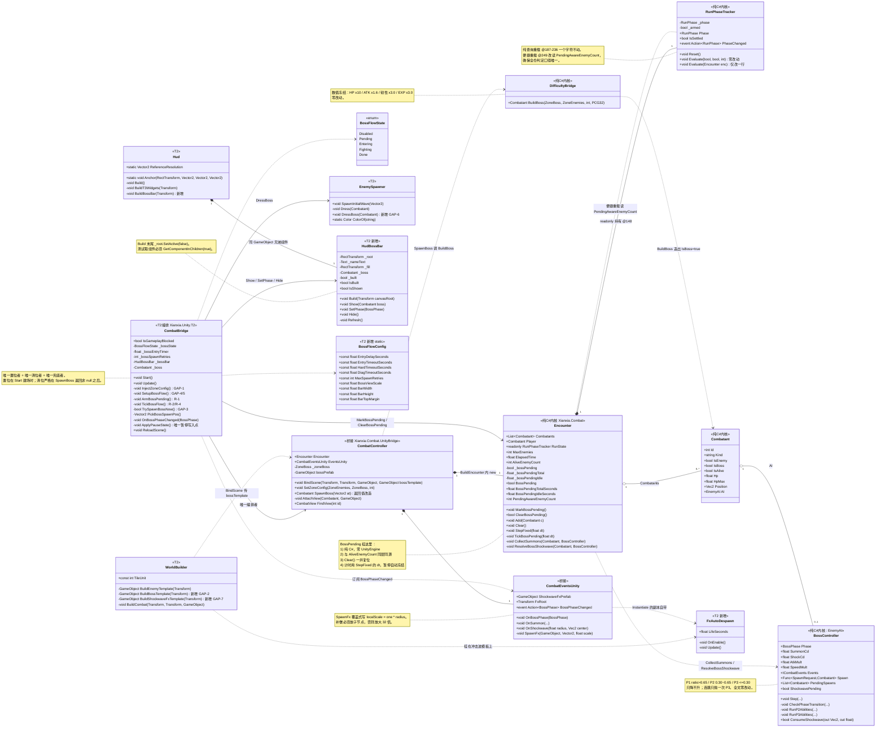
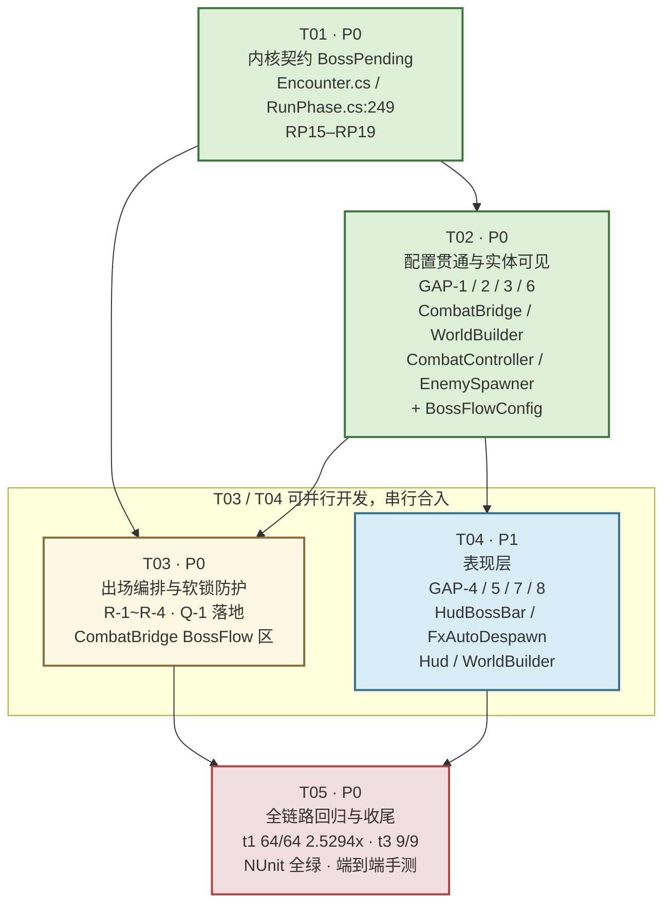

# P2-1「BOSS 战接线」系统设计与任务分解

| 项目 | 内容 |
|---|---|
| 文档 | `docs/unity-p2-1-boss-architecture.md` |
| 上游 | `docs/unity-p2-1-boss-prd.md`（许清楚，372 行） |
| 架构 | 高见远（Gao） |
| 工程根 | `F:/AI-project/ancientGame/shuimofeng/shuimofeng`（唯一） |
| 配套 | `docs/boss-class-diagram.mermaid`、`docs/boss-sequence-diagram.mermaid` |
| 环境声明 | 本轮无 Unity、无 dotnet。**只出设计，不写生产代码**；所有行号均由 Read 逐一上盘核验 |

---

## 0. 先说三句话

1. **这不是造轮子，是接线。** BOSS 内核（`BossController` 三阶段 FSM、`DifficultyBridge.BuildBoss` 数值、`Encounter.CollectSummons/ResolveBossShockwave` 结算、`CombatController.SpawnBoss` 生成、`CombatEventsUnity` 四条事件）**已 100% 就绪且被 t1 的 64 条镜像对拍锁死**。缺的只是六根线没插上。
2. **唯一有设计含量的地方是"不许早判胜利"。** 采用 PM 方案 A′：在 `Encounter` 上加一个纯 C# 的 `BossPending` 虚拟计数，判定口径改为 `AliveEnemyCount + (BossPending ? 1 : 0)`。`RunPhase.cs` 的**纯查询重载一行不动**，14 条 NUnit 护栏一条不改。
3. **本设计对 PRD 做了 5 处实质性纠正**（详见 §1.2 / §6 / §7），其中 **Q-1 的"10 秒"若照抄会制造一个比软锁更隐蔽的新 Bug**——必须改。

---

## 1. 实现方案总述（Implementation Approach）

### 1.1 事实基线复核（我自己跑的，不是转述）

| 核验对象 | 结论 | 证据 |
|---|---|---|
| 三阶段阈值 | P1 `ratio>0.65`／P2 `0.30<ratio≤0.65`／P3 `ratio≤0.30` | `BossController.cs:25-32` |
| 连跳只抛一次 | `CheckPhaseTransition` 一步从 P1 直落 P3 时只抛 P3 | `BossController.cs:137-173` |
| P2 召唤 | 每 8.0s 召 2 只，进位式冷却复位 | `BossController.cs:181-186, 208-221` |
| P3 冲击波 | 每 6.0s，半径 `CombatConfig.BOSS_P3_SHOCK_RADIUS = 200.0f` | `BossController.cs:263-280`、`CombatConfig.cs:106` |
| 数值冻结 | `BuildBoss` HP×10 / ATK×1.6 / 韧性×3.0 / EXP×3.0，`c.IsBoss = true` | `DifficultyBridge.cs:389-420` |
| `SpawnBoss` 已实现 | 建怪 + 挂召唤委托 + AttachView，**零调用者** | `CombatController.cs:423-454` |
| 判定唯一现场 | `Encounter.StepFixed` 步 ⑦ | `Encounter.cs:507-511` |
| 幂等闸门 | `RunPhaseTracker` 只从 Playing 单向落定，永不回退 | `RunPhase.cs:187-236` |
| `Encounter.Add` 同步入列 | **直接 `Combatants.Add`，不走 `_pendingAdd`** | `Encounter.cs:307-336` |
| 重开路径 | `ReloadScene()` → `SceneManager.LoadScene(buildIndex)` | `CombatBridge.cs:1618` |
| 全仓零跨场景残留 | 全 Assets 树 **`DontDestroyOnLoad` 命中 0 次** | Grep 全树，仅 `AudioDirector.cs:648` 注释提及 |
| 唯一暂停写入点 | `ApplyPauseState()` 是全仓唯一写 `Scheduler.Paused` 处 | `CombatBridge.cs:1571` |
| t1 护栏 | **64/64 PASS，围攻倍率 2.5294x** | 本轮实跑 `t1_selfcheck.py` |
| t3 护栏 | **9/9 PASS**，`EXPECTED_COUNT = 33` | 本轮实跑 `t3_selfcheck.py` |
| NUnit 护栏 | **RP01–RP14 共 14 条**（PRD §7 称"11 条"，**已过时**） | `RunPhaseTests.cs:1-433` |

### 1.2 缺口清单：PRD 五处 + 我补三处

| # | 缺口 | 位置 | 现状 | 来源 |
|---|---|---|---|---|
| GAP-1 | zone BOSS 配置被硬传 `null` | `CombatBridge.cs:912` | `SetZoneConfig(_zone.Enemies, null, ...)` | PRD |
| GAP-2 | `bossTemplate` 被硬传 `null` | `WorldBuilder.cs:729` | `ctrl.BindScene(player, enemyRoot.transform, enemyTemplate, null)` | PRD |
| GAP-3 | `SpawnBoss` 零调用者 | `CombatController.cs:423` | 实现完整，无人调 | PRD |
| GAP-4 | `BossPhaseChanged` 零订阅者 | `CombatEventsUnity.cs:69` | 事件真实抛出，无人听 | PRD |
| GAP-5 | `ShockwaveFxPrefab` 零装配 | `CombatEventsUnity.cs:40` | 全树零赋值点 | PRD |
| **GAP-6** | **BOSS 视图永不激活** | `WorldBuilder.cs:709` + `EnemySpawner.cs:168-171` | 见 §1.2.1 | **本文档新增** |
| **GAP-7** | **冲击波特效缩放差 32 倍** | `CombatEventsUnity.cs:229-241` | 见 §1.2.2 | **本文档新增** |
| **GAP-8** | **BOSS 血条与既有 HUD 位置冲突** | `HudStatusIcons.cs:105-106` | 见 §5.2 | **本文档新增** |

#### 1.2.1 GAP-6：把 BOSS 生出来，但玩家看不见

链路是这样断的：

```
WorldBuilder.BuildEnemyTemplate()  @699-711
    └─ go.SetActive(false)                       // 模板未激活（有意为之，见 @694-698 注释）
         │
         ▼  Instantiate 出来的副本同样未激活
CombatController.AttachView()      @457-475
         │
         ▼  谁来 SetActive(true)？
EnemySpawner.Dress()               @140-172
    └─ @168-171  if (!go.activeSelf) go.SetActive(true);
```

`Dress()` 只在 `SpawnInitialWave()` @90 与召唤路径里被调。而 `SpawnBoss` @453 走的是
`AttachView(boss, bossPrefab != null ? bossPrefab : enemyPrefab)`：

- 修完 GAP-2 之前：`bossPrefab == null` → 回落 `enemyPrefab`（未激活模板）→ **BOSS 隐形**；
- 只修 GAP-2 不管激活：新建的 `bossTemplate` 若照抄 `BuildEnemyTemplate` 的 `SetActive(false)` → **BOSS 仍然隐形**。

这是一个"内核全对、日志全对、伤害照吃、就是屏幕上什么都没有"的极难排查故障。必须显式修。

**约束：不能在 `CombatController` 里直接激活。** 上色要用 `SpriteFactory` / `EnemySpawner.ColorOf`，两者在 `Xianxia.Unity.T2` 程序集；`CombatController` 在 `Xianxia.Combat.Unity`。当前依赖方向是 **T2 → Combat.Unity**，反向引用即循环依赖，Unity 直接编译失败。

**解法**：把 `SpawnBoss` 的签名从 `void` 扩成 `Combatant`（返回生成的 BOSS 或 `null`），由 T2 侧拿到实体后调 `EnemySpawner.DressBoss(boss)` 完成上色 + 放大 + 激活。因为 GAP-3 保证它**零调用者**，签名扩展是零破坏改动。

#### 1.2.2 GAP-7：冲击波特效会放大 6400 单位（差 32 倍）

`CombatEventsUnity.SpawnFx` @229-241 的最后一步是：

```csharp
go.transform.localScale = Vector3.one * scale;   // @239，scale = radius = 200
```

注意它是**整体覆盖赋值**，不是相乘。而 `@190-191` 的注释约定"预制体建模半径约定为 1 单位"。

问题在于：`SpriteFactory.Circle` 生成的是 **64×64 像素、PPU = 1.0** 的贴图
（`SpriteFactory.cs:43` `ShapePixels = 64`，`:197-198` `Sprite.Create(..., 1.0f, ...)`）。
也就是说一个"占位圆"在世界里的**半径是 32 个世界单位**，不是 1。

若照直用它当冲击波模板：`32 × 200 = 6400` 单位半径。而世界宽 = `Width × TileUnit(32)`
（`WorldBuilder.cs:65,108-116`），典型 60×34 格 → 1920×1088 单位。**特效会比整张地图还大 3 倍多**，等价于全屏死白。

**解法（补偿子节点）**：模板做成两层，把补偿系数放在**子节点**上——因为 `SpawnFx` 只覆盖根节点的 `localScale`，子节点的缩放会被完整保留：

```
ShockwaveFxTemplate   (根：localScale 会被 SpawnFx 覆盖为 200，不要在这里预缩放)
└── Ring              (子：localScale = 1/32 = 0.03125，SpriteRenderer 挂 64px 圆环)
                       最终有效半径 = 32 × 0.03125 × 200 = 200 ✓
```

补偿系数必须写成 `1.0f / (SpriteFactory.ShapePixels * 0.5f)` 而不是硬编码 `0.03125f`，
这样将来有人把 `ShapePixels` 从 64 调到 128，特效不会悄悄缩水一半。

**附带发现**：`SpawnFx` 只 `Instantiate` 不销毁 → 每次冲击波泄漏一个 GameObject 到
`FxRoot`（= `enemyRoot`，`CombatController.cs:116`）。P3 每 6s 一发，一局下来几十个空对象常驻。
需要给模板挂一个自毁组件（见 §2 的 `FxAutoDespawn.cs`）。

#### 1.2.3 关于"零调用者"这件事的正面评价

GAP-3/4/5 三处"实现完整但无人调用"，看起来像烂尾，实际上是**上一棒（P1-04 切片）刻意留的干净接缝**——
`CombatBridge.cs:910-911` 白纸黑字写着"BOSS 刻意传 null：T2 切片不含 BOSS。传了配置，任何一处误调
`SpawnBoss` 就会在切片里刷出竹魈王"。这说明前面的人是**主动关掉阀门**而不是忘了接。
本次接线的性质因此是"开阀"，而不是"补漏"。这条判断直接决定了任务分解的粒度可以很粗（见 §10）。

---

### 1.3 核心难点：为什么会"早判胜利"

`Encounter.StepFixed` 的步 ⑦（`Encounter.cs:507-511`）每个固定步都调一次
`RunState.Evaluate(this)`。`RunPhase.cs:220` 的胜利分支是：

```csharp
if (_armed && aliveEnemyCount <= 0)   // → Won
```

而 `RunPhaseTracker` 是**单向幂等闸门**：一旦落定 `Won`，`RunPhase.cs:190` 的守卫会让后续所有
`Evaluate` 直接 return。**Won 是不可撤销的。**

于是产生这个致命时序：

```
第 N 步  ⑥ RemoveDead   → 最后 3 只杂兵被血莲/范围技一次性带走
         ⑦ Evaluate     → aliveEnemyCount = 0 → 【当场判 Won】← 闸门永久锁死
─────────────────────────────────────────────────────────────
第 N 帧  CombatBridge.Update() 才发现"清场了，该出 BOSS 了"
第 N+1 帧 SpawnBoss()   → BOSS 进场，但结算面板早就弹出来了
```

**关键点是"零跨越"**：`aliveEnemyCount` 不是逐 1 递减的，它可以**一步从 3 跳到 0**。
任何"等它变成 0 再置位"的方案都必然慢一步，而慢一步 = 永久错过。
（`Encounter.cs:503-511` 的步序 ⑥收尸 → ⑦判定 是同一个固定步内的连续两行，中间插不进任何 Unity 层代码。）

**结论：`BossPending` 必须在建场时就置位，不能等清场。**

### 1.4 方案比选

| 方案 | 做法 | 致命问题 |
|---|---|---|
| A. 改 `RunPhase` | 给 `Evaluate` 加 `bool bossPending` 第四参 | 动纯查询重载 = 动裁判本身。14 条 NUnit 全要改签名；`RunPhase.cs` 在 t3 的 `T3_PURE` 清单里；"只观察不干预"的文件头契约被稀释 |
| B. 延迟判定 | 判胜后等 2s 再抛事件 | 把幂等闸门改成有状态延迟，`IsSettled` 语义崩坏，`RP14`（判负后内核照常空转）直接红 |
| C. 占位假敌人 | 先 `Add` 一只 HP=1 的隐形怪 | 污染 `Combatants`；会被 AI 索敌、被范围技命中、被 `CollectSummons` 的 `MaxEnemies` 名额算进去；`DeterminismDump` 指纹漂移 |
| **A′（采纳）** | **`Encounter` 侧加虚拟计数，判定口径 = `AliveEnemyCount + (BossPending?1:0)`** | 无 |

**A′ 的语义一句话**：*BOSS 是"这局还欠玩家的一只敌人"。* 债没还清，就不算赢。

A′ 的优势不只是"改动小"，而是**它把这件事表达在了正确的抽象层**：
"场上还剩几个敌人"本来就是 `Encounter` 的职责（`AliveEnemyCount` @370 就住在这），
裁判 `RunPhaseTracker` 只负责"给我一个数，我判胜负"。让 `Encounter` 报一个更诚实的数，
比让裁判学会一条新规则要正确得多。

### 1.5 A′ 的落地形态：改哪一行？（α vs β）

`RunPhase.cs` 里有两个重载：

- `Evaluate(bool playerPresent, bool playerAlive, int aliveEnemyCount)` @187 —— **纯查询，判定的唯一所在**
- `Evaluate(Encounter enc)` @239 → @249 `Evaluate(present, alive, enc.AliveEnemyCount)` —— **便捷重载**

两条落地路径：

| | α：改 `Encounter.cs:511` | β：改 `RunPhase.cs:249` |
|---|---|---|
| 改法 | `RunState.Evaluate(this)` → 显式三参调用 | `enc.AliveEnemyCount` → `enc.PendingAwareEnemyCount` |
| `RunPhase.cs` diff | **0 行** | 1 行（便捷重载内部） |
| 纯查询重载 | 不动 | **不动** |
| 口径一致性 | ❌ 便捷重载留下"不含 pending 的旧口径"，未来误用即静默早判 | ✅ **口径唯一，物理上无法误用** |
| t3 风险 | 无 | 极低（纯 C# 属性改名；不触 C1 UnityEngine 红线、不改括号配平） |

**采纳 β。** 理由：α 省下的是"文件级 0 diff"这个心理安慰，付出的是一个**永久性的语义分叉**——
两条路径读两个不同的数，谁也不知道下一个人会调哪个。这种"看起来更安全、实际上埋雷"的选择是
架构层面最该拒绝的。而 β 的风险已被逐项核验为零：

- **纯查询重载 @187-236 一个字符不动** → 主理人"纯查询重载零改动"的要求完全满足；
- `RunPhase.cs` 便捷重载**本来就已经耦合 `Encounter` 类型**（@249 已在读 `enc.AliveEnemyCount`），
  换成读同一个类的另一个属性，不引入任何新依赖；
- t3 的 C1 红线查的是"纯逻辑层是否引用 `UnityEngine`"，`PendingAwareEnemyCount` 是纯 int 属性，
  不可能触发；B 项括号配平不变；D 项跨文件类型解析所需的 `Encounter` 类型引用本来就在。

于是最终改动落点极其干净：

- **`RunPhase.cs`：仅 @249 一行 + 注释**（纯查询重载零改动）
- **`Encounter.cs:511` 判定行：零改动**（仍是 `RunState.Evaluate(this)`）
- `Encounter.cs`：新增字段/属性/方法 + `Clear()` 复位 + `StepFixed` 内推进计时

### 1.6 为什么计时器必须住在内核，而不是 `CombatBridge`

软锁兜底要计时。计时器放哪，是本设计第二个有含量的决定。

若放 Unity 层用 `Time.deltaTime` 累计：玩家按 ESC 开暂停菜单看 30 秒 →
`Scheduler.Paused = true`，内核不推进，但 `Time.deltaTime` 照常累计 → **误判软锁，强行清位** →
BOSS 永远不会出场。这是把"防 Bug 的机制"变成"造 Bug 的机制"。

放内核用 `StepFixed(dt)` 的 `dt` 累计，则：

- `Scheduler.Paused` 时 `StepFixed` 根本不被调 → 计时**自动冻结**，与暂停闸门天然同步，无需任何额外判断；
- `Clear()` 时随 `_bossPending` 一起复位，无需额外维护；
- 是纯 C# 状态，可被 `Xianxia.Combat.Tests` 的 NUnit 直接覆盖，不需要 PlayMode 测试。

**这条同时回答了"为什么不要绕过统一暂停闸门"**——不是"不许绕"，而是设计得当就**没有绕的动机**。

---

## 2. 文件清单（Files List）

> 图例：🆕 新增　✏️ 修改　🔒 零改动但受影响（须回归）
> 行号锚点均为**改动前**的当前行号，已逐一 Read 核验。

### 2.1 纯 C# 内核层 · `Assets/Scripts/Systems/Combat/`
> 铁律：本目录零 `UnityEngine` 依赖（`Xianxia.Combat.asmdef` → `noEngineReferences: true`）

| 状态 | 文件 | 锚点 | 职责与改动 |
|---|---|---|---|
| ✏️ | `Encounter.cs` | 新增区紧贴 `@148` `RunState` 之后 | 新增 `BossPending` 状态机：`_bossPending` / `_bossPendingTotal` / `_bossPendingIdle` 三个私有字段 + 只读属性 + `MarkBossPending()` / `ClearBossPending()` / `PendingAwareEnemyCount` |
| | | `@339-367` `Clear()` | 在 `@366` `RunState.Reset()` **之前**插入 `ClearBossPending()`（R-3） |
| | | `@503-511` `StepFixed` 步⑥⑦之间 | 插入 `TickBossPending(dt)`：`_bossPendingTotal += dt`；`_bossPendingIdle` 在 `AliveEnemyCount<=0` 时累加、否则归零。**必须在 ⑥ 收尸之后**，否则读到的是本步的陈旧敌人数 |
| | | `@511` 判定行 | **零改动**，保持 `RunState.Evaluate(this)` |
| ✏️ | `RunPhase.cs` | `@239-250` 便捷重载 | `@249` 单行：`enc.AliveEnemyCount` → `enc.PendingAwareEnemyCount`，并补一段注释说明"欠玩家一只敌人"的语义 |
| | | `@187-236` 纯查询重载 | **零改动**（硬约束） |
| | | `@164-177` `Reset()` | **零改动** |
| 🔒 | `BossController.cs` | 全文 | 零改动。三阶段/召唤/冲击波已被 t1 锁死 |
| 🔒 | `DifficultyBridge.cs` | `@389-420` `BuildBoss` | **零改动（数值冻结）**。HP×10 / ATK×1.6 / 韧性×3.0 / EXP×3.0 一个都不许碰 |
| 🔒 | `CombatConfig.cs` | `@106` | 零改动。`BOSS_P3_SHOCK_RADIUS = 200.0f` 是 t1 与 Python 镜像双向锁死的常量 |

### 2.2 桥接层 · `Assets/Scripts/Systems/Combat/Unity/`
> `Xianxia.Combat.Unity.asmdef` → `noEngineReferences: false`；namespace `Xianxia.Combat.UnityBridge`

| 状态 | 文件 | 锚点 | 职责与改动 |
|---|---|---|---|
| ✏️ | `CombatController.cs` | `@423` 签名 | `public void SpawnBoss(Vector2 at)` → `public Combatant SpawnBoss(Vector2 at)`；`@425-428` 早退返回 `null`；`@454` 之后 `return boss`。**修 GAP-6 的前置**（零调用者，无破坏） |
| | | `@453` | 增补守卫：`bossPrefab` 为空时打一条 `Debug.LogWarning` 再回落 `enemyPrefab`，让 GAP-2 复发时立刻可见 |
| | | `@112-118` `BuildEncounter` | **零改动**。`new Encounter()` 是 Q-5 的答案所在，不要动 |
| 🔒 | `CombatEventsUnity.cs` | `@40` `ShockwaveFxPrefab`、`@69` `BossPhaseChanged` | **零改动**。两者都已真实现，只是没人赋值/订阅——那是 T2 层的事 |

### 2.3 Unity 编排 / 表现层 · `Assets/_Project/Scripts/Runtime/`
> `Xianxia.Unity.T2.asmdef`

| 状态 | 文件 | 锚点 | 职责与改动 |
|---|---|---|---|
| ✏️ | `CombatBridge.cs` | `@902-913` `InjectZoneConfig` | **修 GAP-1**：`@912` 改 `controller.SetZoneConfig(_zone.Enemies, _zone.Boss, _zone.BaseLevel)`。同步**重写 @910-911 注释**（那两行现在写的是"刻意传 null"，改完必须改注释，否则下一个人会照着注释改回去） |
| | | `@322-340` `Start()` | 在 `SpawnFirstWave()` @340 **之后**插 `ArmBossPending()`（建场即置位，R-1） |
| | | `@378-384` 之后 | **修 GAP-4/5**：新增 `SetupBossFlow()`——订阅 `controller.EventsUnity.BossPhaseChanged`、装配 `ShockwaveFxPrefab`、建 `HudBossBar`。放在 `_gameOverHud` 建完之后、`_mainMenuHud` @391 之前 |
| | | 新增私有区（建议置于 `@1571 ApplyPauseState` 之前） | 新增 BOSS 出场编排段：`_bossState` / `_bossEntryTimer` / `_bossSpawnRetries` / `ArmBossPending()` / `TickBossFlow()` / `TrySpawnBossNow()` / `PickBossSpawnPos()` / `OnBossPhaseChanged()` |
| | | `Update()` 内 | 挂 `TickBossFlow()`。**必须先判 `if (IsGameplayBlocked) return;`**，与 `@174` 的统一闸门对齐 |
| | | `@1488-1502` `OnDestroy` | 退订 `BossPhaseChanged`（与 `@1502` `EnemyDied -=` 同款套路）。漏退订 = 场景重载后旧委托指向已销毁对象 |
| | | `@1571` `ApplyPauseState` | **零改动**。BOSS 流程一律经 `SetMenuPaused` / `IsGameplayBlocked`，**不得直写 `Scheduler.Paused`** |
| | | `@1618` `ReloadScene` | **零改动**（Q-5 依据） |
| ✏️ | `WorldBuilder.cs` | `@699-711` 之后 | **修 GAP-2**：新增 `BuildBossTemplate(Transform parent)`，产出 `SetActive(false)` 的 BOSS 模板（与敌人模板同款"先建后色再放"约定） |
| | | `@717-731` `BuildCombat` | `@729` 改 `ctrl.BindScene(player, enemyRoot.transform, enemyTemplate, bossTemplate)` |
| | | `BuildCombat` 内 | **修 GAP-7**：新增 `BuildShockwaveFxTemplate(Transform parent)`，两层结构（根 + 补偿子节点 `localScale = 1/(ShapePixels*0.5f)`），挂 `FxAutoDespawn`。模板根 `activeSelf = true`，但挂在一个 `SetActive(false)` 的 `FxTemplates` 容器下 —— 见 §7-C4 |
| ✏️ | `EnemySpawner.cs` | `@139-172` `Dress` 之后 | **修 GAP-6**：新增 `public void DressBoss(Combatant boss)`——深红描边 + `BossScale` 放大 + `SetActive(true)`。复用 `ColorOf` @175 与 `SpriteFactory.Circle` |
| ✏️ | `Hud.cs` | `@132-157` `Build()` | `@156` `BuildT3Widgets` 之后追加 `BuildBossBar(canvasGo.transform)`（同款 `GetComponent` 兜底 + `AddComponent` 模式，见 @167-169 注释理由） |
| | | `@817` `Anchor` | **零改动**，`HudBossBar` 复用这个 public static 助手 |
| 🆕 | `HudBossBar.cs` | — | BOSS 血条组件。`Build(Transform canvasRoot)` / `Show(Combatant)` / `Hide()` / `SetPhase(BossPhase)` / `Refresh()`。布局约定见 §5 |
| 🆕 | `BossFlowConfig.cs` | — | BOSS 接线全部魔数的唯一出处（入场延迟、兜底超时、重试次数、血条尺寸、BOSS 视图缩放/配色）。**一个常量都不许散落在别处** |
| 🆕 | `FxAutoDespawn.cs` | — | 12 行的一次性特效自毁组件（`OnEnable` 起计时，`Update` 到点 `Destroy(gameObject)`）。修 §1.2.2 的泄漏 |

### 2.4 测试与护栏

| 状态 | 文件 | 改动 |
|---|---|---|
| ✏️ | `Assets/Scripts/Systems/Combat/Tests/RunPhaseTests.cs` | 追加 **RP15–RP19** 五条（详见 §10 T01 验收判据）。**RP01–RP14 一条不改** |
| 🆕 | `Assets/_Project/Scripts/Runtime/Tests/P2_1_BossWiringTests.cs` | T2 层集成测试：配置贯通、视图激活、血条布局不重叠、事件订阅/退订 |
| 🔒 | `Assets/Scripts/Systems/Combat/Tests/t1_selfcheck.py` | **零改动**。回归须复现 64/64 与围攻 **2.5294x** |
| 🔒 | `Assets/Scripts/Systems/Combat/Tests/t3_selfcheck.py` | **默认零改动**（`EXPECTED_COUNT = 33` 不动）。理由见 §8 |
| 🔒 | `Assets/_Project/t2_static_check.py`、`audio_syntax_check.py` | 零改动，回归须全绿 |

### 2.5 数据与文档

| 状态 | 文件 | 说明 |
|---|---|---|
| 🔒 | `Assets/StreamingAssets/.../zones.json` | **零改动**。`zone_youhuang` 的 boss 段（witch / `level_offset=2` / `hp_mult=10` / `atk_mult=1.6`）已就绪，本次只是把它读出来用 |
| 🆕 | `docs/boss-class-diagram.mermaid` | 本文档 §3 的独立副本 |
| 🆕 | `docs/boss-sequence-diagram.mermaid` | 本文档 §4 的独立副本 |
| ✏️ | `docs/changelog.md` | 收尾追加 P2-1 条目 |

---

## 3. 数据结构与接口（Class Diagram）

> 独立副本见 `docs/boss-class-diagram.mermaid`



### 3.1 `BossPending` 的生命周期与不变量

```
     new Encounter()            ── _bossPending = false（C# 字段默认值，无需显式初始化）
            │
            ▼
     MarkBossPending()          ── 唯一置位者：CombatBridge.ArmBossPending()（Start 内，建场即置位）
            │                      幂等：已置位时直接 return，不重置计时
            │
   ┌────────┴─────────────────────────────────┐
   │  PendingAwareEnemyCount = Alive + 1       │  ← 这段区间内 RunPhase 永远判不出 Won
   │  _bossPendingTotal += dt   （每固定步）    │
   │  _bossPendingIdle  += dt   （仅当 Alive==0）│
   │  _bossPendingIdle   = 0    （当 Alive>0）  │
   └────────┬─────────────────────────────────┘
            │
     ClearBossPending()         ── 清位者共三个，且只有这三个：
            │                      ① CombatBridge.TrySpawnBossNow() 成功后（正常路径）
            │                      ② CombatBridge.TickBossFlow() 硬超时兜底（R-4）
            │                      ③ Encounter.Clear() 内（R-3，重开复位）
            ▼
     PendingAwareEnemyCount == AliveEnemyCount  ── 恢复原语义，裁判照常工作
```

**四条不变量（实现时必须逐条成立，测试逐条覆盖）**

| # | 不变量 | 违反后果 |
|---|---|---|
| I-1 | `PendingAwareEnemyCount >= AliveEnemyCount` 恒成立 | 判定口径倒挂 |
| I-2 | `BossPending == true` ⟹ `RunPhase` 不可能落定 `Won`（`Lost` 不受影响） | 早判 |
| I-3 | `ClearBossPending()` **必须**发生在 `Encounter.Add(boss)` **之后** | 中间态"债清了怪没到"→ 早判 |
| I-4 | `Clear()` ⟹ `BossPending == false && _bossPendingTotal == 0 && _bossPendingIdle == 0` | 第二局起手就带着旧债 |

**关于 I-3 的时序保证**：已核验 `Encounter.Add` @307-336 是**直接 `Combatants.Add`**，
不经 `_pendingAdd` 队列。因此 `SpawnBoss()` 内 `@452 Encounter.Add(boss)` 一返回，
`AliveEnemyCount` 立刻 +1。`TrySpawnBossNow()` 里 `SpawnBoss` 与 `ClearBossPending` 是
同一个 `Update` 内的连续两行，中间不可能插入 `StepFixed`。**握手区间内 `PendingAwareEnemyCount` 始终 ≥ 1。**

**关于 `Lost` 不受影响**：`RunPhase.cs` 的失败分支只看 `playerAlive`，与敌人数无关。
所以 BOSS 没出场时玩家被杂兵打死，照常判负，`GameOverHud` 照常弹。这是对的——
"欠玩家一只怪"不该变成"玩家死不了"。

---

## 4. 调用时序（Sequence Diagram）

> 独立副本见 `docs/boss-sequence-diagram.mermaid`

```mermaid
sequenceDiagram
    autonumber
    participant WB as WorldBuilder<br/>(T2)
    participant CB as CombatBridge<br/>(T2 编排)
    participant SPW as EnemySpawner<br/>(T2)
    participant BAR as HudBossBar<br/>(T2 新增)
    participant CC as CombatController<br/>(桥接)
    participant EVU as CombatEventsUnity<br/>(桥接)
    participant ENC as Encounter<br/>(纯C#内核)
    participant RP as RunPhaseTracker<br/>(纯C#内核)
    participant BOSS as BossController<br/>(纯C#内核)

    rect rgb(238,244,252)
    Note over WB,ENC: 阶段一 建场（Awake 期）
    WB->>WB: BuildEnemyTemplate() @699 SetActive(false)
    WB->>WB: BuildBossTemplate() 新增 GAP-2
    WB->>WB: BuildShockwaveFxTemplate() 新增 GAP-7 补偿子节点 1/32
    WB->>CC: BindScene(player, enemyRoot, enemyTemplate, bossTemplate) @729
    CC->>ENC: BuildEncounter() @112 → new Encounter() @118
    ENC-->>ENC: _bossPending = false（字段默认值）
    CC->>EVU: FxRoot = enemyRoot @116
    end

    rect rgb(240,248,240)
    Note over CB,ENC: 阶段二 建场即置位（Start 期，早于第一次 FixedUpdate）
    CB->>CC: InjectZoneConfig → SetZoneConfig(enemies, _zone.Boss, baseLevel) @912 修 GAP-1
    CB->>SPW: SpawnFirstWave() @340 → 6 只杂兵 + Dress 激活
    CB->>ENC: ArmBossPending() → MarkBossPending() ★R-1
    Note right of ENC: BossPending = true<br/>此刻起 PendingAwareEnemyCount = Alive + 1
    CB->>EVU: SetupBossFlow：订阅 BossPhaseChanged 修 GAP-4
    CB->>EVU: ShockwaveFxPrefab = 冲击波模板 修 GAP-5
    CB->>BAR: Build(hudCanvas) → 末尾 _root.SetActive(false)
    CB->>CB: MainMenuHud.Show + SetMenuPaused(true) → Scheduler.Paused
    end

    rect rgb(252,246,236)
    Note over CB,RP: 阶段三 清杂兵（每固定步）—— 证明"不会早判"
    loop 每个 StepFixed(dt)
        ENC->>ENC: ①~⑤ AI / 技能 / 伤害
        ENC->>ENC: ⑥ FlushPendingAdds + RemoveDead @503-505
        ENC->>ENC: TickBossPending(dt) 新增：Total += dt；Alive==0 时 Idle += dt 否则 Idle = 0
        ENC->>RP: ⑦ RunState.Evaluate(this) @511【本行零改动】
        RP->>ENC: 读 enc.PendingAwareEnemyCount @249【本行是唯一改动】
        ENC-->>RP: Alive + 1
        RP-->>RP: aliveEnemyCount >= 1 → 不满足 @220 胜利条件 → 保持 Playing
    end
    Note over ENC,RP: ★零跨越竞态兜底：血莲/范围技一步把 3 只全带走，<br/>本步 ⑦ 读到的仍是 0 + 1 = 1 → 不判 Won。<br/>幂等闸门未被触发，Won 仍可在将来正确落定。
    end

    rect rgb(252,238,238)
    Note over CB,BOSS: 阶段四 BOSS 出场（Update 帧，非固定步）
    CB->>CB: Update → if (IsGameplayBlocked) return; @174 统一闸门
    CB->>ENC: 读 AliveEnemyCount == 0 && BossPending
    CB->>CB: _bossState = Entering；_bossEntryTimer = EntryDelaySeconds (1.5s)
    loop 倒计时
        CB->>CB: _bossEntryTimer -= Time.deltaTime
    end
    CB->>CC: TrySpawnBossNow → SpawnBoss(PickBossSpawnPos()) 修 GAP-3
    CC->>ENC: Bridge.BuildBoss(_zoneBoss, ...) @430 → IsBoss=true，HP x10
    CC->>BOSS: boss.AI = BossController；ctrl.Events = EventsUnity；ctrl.Spawn = 召唤委托 @434-450
    CC->>ENC: Encounter.Add(boss) @452【同步入列，AliveEnemyCount 立刻 +1】
    CC->>CC: AttachView(boss, bossPrefab) @453 → 副本未激活
    CC-->>CB: return boss【签名改造：void → Combatant】
    CB->>SPW: DressBoss(boss) 修 GAP-6 → 上色 + 放大 + SetActive(true)
    CB->>ENC: ClearBossPending() ★严格在 Add 之后（不变量 I-3）
    Note right of ENC: 握手区间内 PendingAware 始终 >= 1，<br/>因为 Add 已 +1 才 -1，从不归零
    CB->>BAR: Show(boss) → _root.SetActive(true)
    end

    rect rgb(246,240,252)
    Note over BOSS,BAR: 阶段五 三阶段战斗
    loop BOSS 存活期间每固定步
        BOSS->>BOSS: CheckPhaseTransition @142（只降不升，连跳只抛一次）
        alt ratio 跌破 0.65
            BOSS->>EVU: Events.OnBossPhase(P2) @173
            EVU->>CB: BossPhaseChanged(P2) @69【曾经零订阅者】
            CB->>BAR: SetPhase(P2) → 血条染色 + 提示
            BOSS->>BOSS: RunP2Abilities：每 8.0s 召 2 只，进位式冷却复位 @208-221
            BOSS->>ENC: PendingSpawns
            ENC->>ENC: CollectSummons @1045 → _pendingAdd（受 MaxEnemies=32 限额）
        else ratio 跌破 0.30
            BOSS->>EVU: Events.OnBossPhase(P3)
            EVU->>CB: BossPhaseChanged(P3) → BAR.SetPhase(P3)
            BOSS->>BOSS: RunP3Abilities：每 6.0s 冲击波 r=200 @263-272
            BOSS->>ENC: ShockwavePending = true
            ENC->>ENC: ResolveBossShockwave @1071 → DamageResolver.ResolveShockwave
            ENC->>EVU: Events.OnShockwave(200, center) @186
            EVU->>EVU: SpawnFx(ShockwaveFxPrefab, at, 200) @192<br/>根 localScale = 200，子节点 1/32 补偿 → 有效半径 200 ✓
        end
        BAR->>ENC: Refresh 读 boss.Hp / HpMax
    end
    end

    rect rgb(236,250,244)
    Note over ENC,CB: 阶段六 击杀与判胜
    ENC->>ENC: ⑥ RemoveDead 移除 BOSS @505
    ENC->>ENC: TickBossPending：BossPending 已为 false，无操作
    ENC->>RP: ⑦ RunState.Evaluate(this) @511
    RP->>ENC: 读 PendingAwareEnemyCount = 0 + 0 = 0
    RP->>RP: _armed && 0 <= 0 → 落定 Won @220（幂等闸门首次也是唯一一次触发）
    RP->>CB: PhaseChanged(Won) @383 订阅
    CB->>BAR: Hide()
    CB->>CB: GameOverHud.Show(Won) @1477
    CB->>CB: ApplyPauseState() @1571 唯一暂停写入点
    Note over ENC: RP14 红线：判胜后内核照常空转，<br/>阶段 ⑥ 收尸继续执行，不 return
    end

    rect rgb(255,244,232)
    Note over CB,ENC: 阶段七 软锁兜底 R-4（异常路径）
    loop TickBossFlow 每帧
        CB->>ENC: 读 BossPendingIdleSeconds【内核固定步计时，暂停自动冻结】
        alt Idle > 4.0s 且 重试 < 2 次
            CB->>CB: Debug.LogWarning + _bossSpawnRetries++
            CB->>CC: 重试 TrySpawnBossNow()
        else Idle > 12.0s（三次机会耗尽）
            CB->>ENC: ClearBossPending() 强制清位
            CB->>CB: Debug.LogError("BOSS 出场失败，已解除胜利抑制")
            Note right of ENC: 下一固定步 ⑦ 读到 0 → 正常判 Won。<br/>宁可这局没打到 BOSS，也绝不软锁。
        end
        alt Total > 600s
            CB->>CB: Debug.LogWarning 一次（仅诊断留痕，不改状态）
        end
    end
    end

    rect rgb(242,242,242)
    Note over CB,ENC: 阶段八 重开（Q-5）
    CB->>CB: ReloadScene() @1618 → SceneManager.LoadScene(buildIndex)
    Note over WB,ENC: 整场景销毁重建 → CombatController.Awake → BuildEncounter()<br/>→ new Encounter() @118 → _bossPending = false（字段默认值）<br/>全仓零 DontDestroyOnLoad，无任何跨场景残留
    CB->>ENC: 新 Encounter 上重新 ArmBossPending()
    Note over ENC: Encounter.Clear() 内的 ClearBossPending()（R-3）<br/>在当前代码路径下是防御性冗余，但必须写 —— 见 §6 Q-5
    end
```

---

## 5. BOSS 血条 UI 布局约定

### 5.1 既有 HUD 占位实测（1920×1080 参考分辨率，`CanvasScaler.matchWidthOrHeight = 0.5`）

全部由 Read 逐行核验，非估算：

| 控件 | 文件:行 | anchor / pivot | anchoredPosition | sizeDelta | 换算后占位（相对屏幕） |
|---|---|---|---|---|---|
| 左上面板 `LeftTop` | `Hud.cs:206-208` | (0,1) | (28, −24) | 420×150 | 左上，x∈[28,448]，距顶 24~174 |
| 右上面板 `RightTop` | `Hud.cs:354-356` | (1,1) | (−28, −24) | 420×210 | 右上，距右 28~448，距顶 24~234 |
| 连击数 `Combo` | `Hud.cs:195-198` | (0.5,0) | (0, 124) | 420×44 | 底部中央，距底 124~168 |
| 升级提示 | `Hud.cs:313-315` | (0.5,0) | (0, 260) | 560×52 | 底部中央，距底 260~312 |
| 技能栏 | `HudSkillBar.cs` | (0.5,0) | (0, 34) | W×76 | 底部中央，距底 34~110 |
| 我方状态行 | `HudStatusIcons.cs:102-103` | (0,1) | (28, −150) | 294×34 | 左上，距顶 150~184 |
| **目标状态行** | **`HudStatusIcons.cs:105-106`** | **(0.5,1)** | **(0, −28)** | **294×34** | **⚠️ 顶部中央，x∈[−147,+147]，距顶 28~62** |

### 5.2 ⚠️ 核实结论：给定的"距顶 40"方案**与既有 HUD 冲突**，必须调整

任务书给的约定是「顶部中央 anchor(0.5,1)、720×28、距顶 40」。我按上表逐一比对，
结论是**与 `HudStatusIcons` 的「目标状态行」直接压在一起**：

```
                    ── 屏幕顶边 ──────────────────────────────
     距顶 28  ┌──────────── 目标状态行 294×34 ────────────┐   ← HudStatusIcons.cs:105-106
              │                                          │
     距顶 40  ╔══════════════ BOSS 血条 720×28 ══════════════════╗  ← 原方案
              │            ▓▓▓ 重叠 22px ▓▓▓            │       ║
     距顶 62  └──────────────────────────────────────────┘       ║
     距顶 68  ╚══════════════════════════════════════════════════╝
```

- 纵向：血条 `[40,68]` ∩ 状态行 `[28,62]` = **重叠 22 像素**；
- 横向：血条 `x∈[−360,+360]` **完全包住** 状态行 `x∈[−147,+147]`。

结果就是"打 BOSS 时目标状态图标被血条盖住"——而**打 BOSS 恰恰是最需要看目标 DEBUFF 的时候**。
这不是审美问题，是功能问题。

**采纳方案：BOSS 血条下移到「距顶 72」，让位既有控件。**

为什么让新组件让路，而不是把状态行推下去：

1. `HudStatusIcons` 的布局是 T3 切片定稿的，已有玩家肌肉记忆；
2. 让路 = 既有文件**零布局改动** = 既有 T3 测试零风险；
3. 血条下移 32px 在 1080p 上视觉几乎无感，代价接近零。

已核验：`Assets/_Project/Scripts/Runtime/Tests/` 全目录 **无任何测试断言 `HudStatusIcons` 的
`anchoredPosition`**（仅 `P1_2_HitFeedbackTests.cs:509` 提到 NaN 防护），所以两种方案在测试层
都不会破；但让路方案在**产品层**明显更优。

### 5.3 最终布局定稿

```
                              ── 屏幕顶边 ──
  距顶 28  ┌─────── 目标状态行 294×34 ───────┐         （既有，不动）
  距顶 62  └──────────────────────────────────┘
           ↕ 10px 呼吸间隙
  距顶 72  ╔══════════ BossBarRoot 720×64 ══════════╗
           ║  「竹魈王」                    Lv.5     ║  NameText  720×24
  距顶 96  ║ ┌──────────────────────────────────┐   ║
           ║ │████████████████░░░░░░│░░░░░│░░░░░│   ║  Bar 720×28
           ║ └──────────────────────────────────┘   ║   ├ 0.65 刻度线
  距顶 124 ╚════════════════════════════════════════╝   └ 0.30 刻度线
```

| 元素 | 名称 | anchorMin/Max | pivot | anchoredPosition | sizeDelta | 说明 |
|---|---|---|---|---|---|---|
| 根 | `BossBar` | (0.5,1) | (0.5,1) | **(0, −72)** | 720×64 | `BossFlowConfig.BarTopMargin = 72f` |
| 名字 | `BossName` | (0,1) | (0,1) | (0, 0) | 720×24 | 相对根；`TextAnchor.UpperCenter`；文案 = `boss.DisplayName`（`AttachView` @467 已用同一字段命名 GameObject） |
| 槽底 | `BarBg` | (0,1) | (0,1) | (0, −28) | **720×28** | 深墨底 + 1px 描边 |
| 血条 | `BarFill` | (0,1) | **(0,1)** | (0, −28) | 720×28 | **pivot.x 必须为 0**，否则 `sizeDelta.x = 720 * ratio` 会从中心两头缩 |
| 刻度 | `TickP2` | (0,1) | (0.5,1) | (720×0.65, −28) | 2×28 | 对应 `BossPhase` 阈值 0.65 |
| 刻度 | `TickP3` | (0,1) | (0.5,1) | (720×0.30, −28) | 2×28 | 对应阈值 0.30 |

**冲突复核（全部通过）**

| 对手 | 判定 |
|---|---|
| 目标状态行 `[28,62]` | 血条起于 72，**留 10px 间隙** ✓ |
| 左上面板 x∈[28,448] → 中心系 x∈[−932,−512] | 血条 x∈[−360,360]，**差 152px** ✓ |
| 右上面板 距右 28~448 → 中心系 x∈[512,932] | 同上，**差 152px** ✓ |
| 我方状态行 距顶 150~184，x∈[28,322] | 血条纵向止于 124，**差 26px** ✓ |
| 所有底部控件 | 血条在顶部，无交集 ✓ |

**16:9 之外的安全性**：`matchWidthOrHeight = 0.5`（`Hud.cs:148`）意味着 21:9 超宽屏下
UI 整体按宽高各半权重缩放。血条半宽 360 vs 左右面板内边界 512，余量 152px ≈ 半宽的 42%，
即使在 21:9 下也不会撞上。4:3 下 UI 整体放大，相对关系不变。✓

### 5.4 组件归属与 Build 约定

**归属**：`HudBossBar` 作为 `Hud` 的**兄弟 MonoBehaviour**挂在同一 GameObject 上，
由 `Hud.Build()` @156 之后调用 `BuildBossBar(canvasGo.transform)` 装配。

理由完全照抄 `Hud.cs:162-169` 已经写好的两条：
① 它有自己的每帧刷新节奏与一堆控件引用，塞进 `Hud` 会让文件继续膨胀；
② 用 `GetComponent` 兜底再 `AddComponent`，防止 WorldBuilder 代码装配路径重复挂两份。

**Build 约定（三条铁律）**

```csharp
public void Build(Transform canvasRoot)
{
    if (_built || canvasRoot == null) { return; }   // ① 幂等守卫，同 HudSkillBar.cs:102 / HudStatusIcons.cs:97
    ... 建控件 ...
    _root.gameObject.SetActive(false);              // ② 默认隐藏：没打 BOSS 时不该有空血条
    _built = true;                                  // ③ 最后置位
}
```

> ⚠️ **测试注意**：因为 ② 的存在，`_root` 及其所有子控件在 `Build()` 之后是**非激活**的。
> 单测里取组件**必须**带 `includeInactive`：
> ```csharp
> var bar = hudGo.GetComponentInChildren<HudBossBar>(true);   // ← true 不能漏
> var fill = hudGo.transform.Find("HudCanvas/BossBar/BarFill");// Find 对非激活对象有效
> ```
> 这条与 `P0_5_MenuHudTests.cs:20` 记录的 `MainMenuHud/PauseMenuHud` 同款陷阱一致。

**刷新节奏**：`Update()` 内 `if (!IsShown || _boss == null) return;`，避免非战斗期空转。
`_boss.IsAlive == false` 时自动 `Hide()`（不依赖事件，防止漏事件导致血条挂死在屏幕上）。

**BOSS 视图外观（`EnemySpawner.DressBoss`）**：
`BossFlowConfig.BossViewScale = 1.9f`（精英是 `EliteScale`，BOSS 必须明显更大）；
描边取深红 `(0.86, 0.20, 0.22, 1)` 与精英的金色 `(0.95,0.82,0.35,1)` 区分；
本体色沿用 `EnemySpawner.ColorOf(boss.Kind)`（`zone_youhuang` 的 boss kind = `witch` → 巫蛊紫）。

---

## 6. §7 待确认问题答复

### ★ Q-1：软锁兜底超时取多少？

> **答：不是一个数，是两个数；而且 PRD 建议的"10 秒"若照抄会制造新 Bug，必须改计时基准。**

#### 先说为什么 PRD 的 10s 不能用

PRD 建议"BossPending 置位后超过 10s 仍无 BOSS 进场则强制清位"。但在**建场即置位**
（§1.3 论证的必然选择）的语义下，置位发生在 `CombatBridge.Start()`，而 BOSS 出场发生在
**玩家清完 6 只杂兵之后**——那中间是**几十秒到几分钟**的正常游戏时间。

```
t=0s     Start() → MarkBossPending()
t=0~90s  玩家正常清杂兵          ← BossPending = true 且完全正常
t=10s    ⚠️ 照抄 10s 兜底 → 强制 ClearBossPending()
t=90s    杂兵清完 → 但 pending 早被清了，
         下一固定步 ⑦ 读到 0 → 【当场判 Won】→ BOSS 永远不出场
```

**照抄 10s 的结果不是"防住软锁"，而是"100% 复现打不到 BOSS"。**
这个 Bug 比软锁更隐蔽——软锁玩家会立刻报障，"BOSS 没出现就通关了"很多人只会以为是设计如此。

#### 正确做法：把计时基准从「已置位」改为「已置位 **且** 场上无敌」

只有在 `BossPending == true && AliveEnemyCount <= 0` 这个状态下滞留，才是真的出事了。
正常路径下这个状态只应该存在 `EntryDelaySeconds = 1.5s`。

因此内核维护**两个**计时器（`Encounter.TickBossPending`）：

| 计时器 | 累加条件 | 归零条件 | 用途 |
|---|---|---|---|
| `BossPendingIdleSeconds` | `_bossPending && AliveEnemyCount <= 0` | `AliveEnemyCount > 0` 时立刻归零；`ClearBossPending()` | **真正的软锁判据** |
| `BossPendingTotalSeconds` | `_bossPending`（无条件） | `ClearBossPending()` / `Clear()` | 仅诊断留痕 |

#### 三档取值（写在 `BossFlowConfig`）

| 常量 | 取值 | 判据对象 | 动作 | 依据 |
|---|---|---|---|---|
| `EntryDelaySeconds` | **1.5 s** | — | 清场后延迟出场 | PRD 既定；给玩家一个"喘口气 + 意识到有事要发生"的窗口 |
| `EntryTimeoutSeconds` | **4.0 s** | `BossPendingIdleSeconds` | `LogWarning` + **重试** `TrySpawnBossNow()`（`MaxSpawnRetries = 2`） | = 1.5s × 2 + 1.0s 余量。覆盖：① 一次 GC 尖峰（低端机典型 200~500ms）② `SpriteFactory.Circle` 首次生成 BOSS 贴图的同步开销（64×64 逐像素，几十 ms）③ `FindSpawnableNear` 螺旋搜索最坏路径。**4s 也落在人类"等待异常"的感知阈值 3~5s 内**——玩家会觉得"卡了一下"，不会觉得"游戏坏了" |
| `HardTimeoutSeconds` | **12.0 s** | `BossPendingIdleSeconds` | `ClearBossPending()` + **`LogError`** | = 4.0 × 3（首次 + 两次重试都失败）。到这里认定 BOSS 系统不可用，**主动放弃 BOSS 战、放行胜利判定**。宁可"这局没打到 BOSS"，绝不软锁 |
| `DiagTimeoutSeconds` | **600.0 s** | `BossPendingTotalSeconds` | `LogWarning` 一次（`_diagLogged` 去重），**不改任何状态** | 纯留痕。用于"玩家挂机 10 分钟"这类非缺陷场景在日志里可分辨 |

#### 两条配套保证

1. **计时器住在内核，用 `StepFixed(dt)` 的 `dt` 累加**（§1.6）。玩家开暂停菜单
   → `Scheduler.Paused = true` → `StepFixed` 不被调 → 计时**自动冻结**。
   这一条让 4.0s 这么短的窗口变得安全——它计的是"游戏世界里真实流逝的 4 秒"。
2. **兜底清位后，`_bossState` 必须落到 `Done`**，防止下一帧又被 `TickBossFlow` 重新置位，
   形成"清位—置位—清位"的抖动。

> **一句话回答 Q-1**：`EntryTimeoutSeconds = 4.0s`（触发重试，上限 2 次）、
> `HardTimeoutSeconds = 12.0s`（强制清位 + LogError）；
> 且**判据必须是 `BossPending && AliveEnemyCount == 0` 的持续时长**，
> 而非 PRD 原文的"自置位起的总时长"——后者在建场即置位语义下必然误触发。

---

### ★ Q-5：P0-4 重开路径下 `Encounter` 是否必然重建？

> **答：是，必然重建。`BossPending` 作为实例字段自动复位，无任何残留。**
> **但 `Clear()` 里的复位（R-3）仍然必须写。**

#### 上盘证据链（四步，逐条核验）

**第 1 步：重开只有两条路径，都走整场景重载**

| 入口 | 位置 | 落点 |
|---|---|---|
| 暂停菜单「重新开始」 | `CombatBridge.cs:413-417` | → `ReloadScene()` |
| 结算面板「重开」 | `GameOverHud` 回调 | → `ReloadScene()` |

```csharp
// CombatBridge.cs:1618
SceneManager.LoadScene(SceneManager.GetActiveScene().buildIndex);
```

**第 2 步：场景重载销毁一切**

`CombatController` 与 `CombatBridge` 都挂在 `WorldBuilder.BuildCombat` @724 建的
场景对象 `"Combat"` 上，随场景卸载被销毁。

**第 3 步：全仓零跨场景残留**

对整个 `Assets/` 树 Grep `DontDestroyOnLoad` —— **零命中**。
唯一提及是 `AudioDirector.cs:648` 的注释，原文正是
「零跨场景单例、零 `DontDestroyOnLoad`、零静态旗标」。

现存静态残留只有三处，逐一排查与 `BossPending` 无关：

| 静态字段 | 位置 | 影响 |
|---|---|---|
| `MainMenuHud.SkipOnNextLoad` | `CombatBridge.cs:416,422,430,1558` | 只控制重载后跳不跳主菜单 |
| `Bootstrap.ZoneId / ZoneVisits / IsSafeZone` | `WorldBuilder.cs:730` | 重建后由 `WorldBuilder` 重新注入 |
| `SpriteFactory` 贴图缓存 | `SpriteFactory.cs:46` | 有显式 `Dispose`，且与战斗状态无关 |

**第 4 步：新 `Encounter` 必然是干净的**

```
LoadScene → CombatController.Awake
          → BuildEncounter()            @112
          → Encounter = new Encounter() @118   ← 全新对象
          → _bossPending = false（C# bool 字段默认值，无需显式初始化）
```

`RunState` 也随之是全新的 `RunPhaseTracker`（`Encounter.cs:148` `readonly ... = new`），
`_phase = Playing`、`_armed = false`。**幂等闸门不可能带着上一局的 `Won/Lost` 进来。**

#### 那为什么 R-3 还是必须写？

因为 `Encounter.Clear()` @339 是**公开 API**，它的契约是"清空整场战斗 = 重开一局"。
@363-365 那三行注释已经把这个道理讲透了：

> *"★P0-3：清场 = 重开一局，裁判必须回到'比赛进行中'并撤销布防。不重置的话，上一局判过负之后，
> 这个 Encounter 被复用来打第二局时幂等闸门会一直卡在 Lost —— 第二局无论怎么打都不会再有任何胜负回调。"*

`BossPending` 和 `RunState` 是**同一类状态**（对局级、跨局必须清零）。
今天靠"重开必定重载场景"侥幸不出事，明天只要有人加一条**不重载场景的路径**——
换区、波次推进、`RP13` 那样的"同一 Encounter 打第二局"——就会出现
**第二局起手就带着上一局欠下的 BOSS 债**，表现为"第二局永远赢不了"。

而 `RP13_Encounter_ClearAllowsSecondRun`（`RunPhaseTests.cs:356`）证明**测试层面已经存在
"复用同一 Encounter 打第二局"的用法**。R-3 不是防御性冗余，它是给这条已存在的用法兜底。

> **一句话回答 Q-5**：`ReloadScene()` → `LoadScene(buildIndex)` → 整场景销毁重建 →
> `BuildEncounter()` 内 `new Encounter()` → `_bossPending` 取字段默认值 `false`；
> 全仓零 `DontDestroyOnLoad`、零相关静态残留，**Encounter 必然重建，BossPending 自动正确复位**。
> R-3（`Clear()` 内复位）在当前路径下不会被触发，但因 `Clear()` 是公开 API 且 `RP13` 已在用
> "复用 Encounter 打第二局"，**必须实现**。

---

### Q-2 ~ Q-7 逐条答复

| # | 问题 | 答复 |
|---|---|---|
| **Q-2** | BOSS 出场位置怎么定？ | `PickBossSpawnPos()`：以玩家为中心、半径 `SpawnRingMax`（沿用 `EnemySpawner` 首波口径）圆环采样，用 `Encounter.Rng` 抽样保持确定性；随后**必须**过一遍 `WorldBuilder.IsWalkableWorld` + `FindSpawnableNear`（照抄 `EnemySpawner.RelocateIfBlocked` @109-137），否则 BOSS 会刷进水里/岩石里。**不要用 `UnityEngine.Random`**——会破坏 `DeterminismDump` 的同种子重放 |
| **Q-3** | 出场要不要冻结玩法？ | **不要。** 冻结只能走 `SetMenuPaused(true)`（唯一闸门），而它会同时冻结 `StepFixed`，导致内核计时停摆、`BossPendingIdleSeconds` 停止推进——软锁兜底当场失效。1.5s 的入场延迟期间让玩家自由走位即可；需要仪式感就用 `HudBossBar` 淡入 + `CameraShake`，两者都不碰 `Scheduler.Paused` |
| **Q-4** | 召唤小怪要不要计入胜利判定？ | **要，且已自动成立。** 召唤物经 `CollectSummons` @1045 → `_pendingAdd` → 步 ⑥ `FlushPendingAdds` 正式入列，天然计入 `AliveEnemyCount`。所以"BOSS 死了但小怪还活着"不会判胜——这是对的。`MaxEnemies = 32` @125 的限额也自动生效，无需额外处理 |
| **Q-5** | 见上 | 必然重建 ✓ |
| **Q-6** | BOSS 死亡的经验/掉落走既有链路吗？ | 走。`BuildBoss` @420 已设 `IsBoss = true` 且 EXP×3.0；`CombatEventsUnity.cs:143` 已按 `e.IsBoss` 分流 `sfx_boss_death`；`CombatBridge.OnEnemyDied` @757 已订阅并入账。**本次零改动**——这也是 §1.2.3 说的"接缝很干净"的又一例证 |
| **Q-7** | 需要 BOSS 专属 BGM 吗？ | **本切片不做。** `AudioConfig.cs:627` 的音效清单已含 `sfx_boss_phase` / `sfx_boss_shockwave` / `sfx_boss_death` 且 `audio_syntax_check.py` 在守。BGM 切换涉及 `AmbienceLayer` 的交叉淡入，属独立议题，本切片只保证不破坏现有音频护栏 |

---

## 7. 软锁防护矩阵（R-1 ~ R-4 + 新增 C 类）

**头号风险**：`BossPending` 置位了，BOSS 却没进场 → `PendingAwareEnemyCount` 永远 ≥ 1 →
**永远判不出 Won** → 玩家清光全场却卡在空地图上。这是整个切片唯一的致命故障模式。

### 7.1 四道纵深防线

| # | 防线 | 落点 | 机制 |
|---|---|---|---|
| **R-1** | 置位与出场条件强绑定 | `CombatBridge.ArmBossPending()` | 只有 `_zone != null && _zone.Boss != null && controller.Encounter != null` 三者全真才置位。任一为假 → `_bossState = Disabled`，**BossPending 从头到尾都是 false**，退化为 P1 行为 |
| **R-2** | 状态机单向推进 | `_bossState: Disabled→Pending→Entering→Fighting→Done` | 只进不退，杜绝"清位后又被置位"的抖动 |
| **R-3** | 重开必复位 | `Encounter.Clear()` 内 `ClearBossPending()` | 见 Q-5 |
| **R-4** | 双层兜底超时 | `TickBossFlow()` | 4.0s 重试（≤2 次）→ 12.0s 强制清位 + `LogError`。判据是 `BossPendingIdleSeconds`（见 Q-1） |

### 7.2 新增 C 类防线：让故障"响"出来

软锁最可怕的不是发生，是**发生了没人知道**。四条：

- **C1**｜`SpawnBoss` 内 `bossPrefab == null` 回落 `enemyPrefab` 时打 `LogWarning`（`CombatController.cs:453`）——GAP-2 若被人改回去，第一局就会在 Console 里叫。
- **C2**｜`TrySpawnBossNow()` 返回 `null` 时打 `LogError` 并带上 `_zoneBoss == null` / `Encounter == null` 的具体判定结果（对应 `CombatController.cs:425-428` 的两个早退分支），一眼定位是哪个缺口复发。
- **C3**｜`Hud` 右上调试面板（`Hud.cs:354-367`，420×210 已有空间）增加一行：
  `boss: {state} pending={0/1} idle={x.x}s`。开发期肉眼可见，零成本。
- **C4**｜**FX 模板激活约定**：`SpawnFx` @235-240 只 `Instantiate` 不 `SetActive`，
  副本的 `activeSelf` 完全继承模板。若把冲击波模板建成 `SetActive(false)`，
  **特效会一个都不出，且完全静默**（和 GAP-6 同款陷阱）。
  正确做法：模板根 `activeSelf = true`，但挂在一个 `SetActive(false)` 的 `FxTemplates`
  容器节点下——模板自身不显示（`activeInHierarchy == false`），而 `Instantiate` 到
  `FxRoot`（活跃）之后副本立刻是活的。这条必须写进注释，否则下一个加特效的人 100% 踩。

---

## 8. 护栏影响评估

> 围攻倍率 **2.5294x** 是本项目的生命线。以下逐项论证为什么它不会漂移。

### 8.1 `t1_selfcheck.py` —— 64/64，围攻 2.5294x

| 维度 | 结论 |
|---|---|
| 它是什么 | **自包含的 Python 数值镜像**，不解析任何 `.cs` 文件 |
| 本次是否改它 | **否，零改动** |
| 会不会受影响 | **不会。** 论证如下 |

三条独立论证：

1. **物理隔离**：t1 是把 C# 战斗数学在 Python 里重写一遍做对拍。
   它的输入是 `t1_selfcheck.py` 内部的常量（如 `:113 BOSS_P3_SHOCK_RADIUS = 200.0`），
   **不读 Assets 里的任何 C# 源码**。我们改 C# 不可能改到它。
2. **数值零触碰**：本设计对**所有影响伤害/血量/韧性/围攻的量**保持零改动——
   `DifficultyBridge.BuildBoss` @389-420、`CombatConfig.cs:106`、
   `Encounter` 的 ①~⑤ 战斗阶段、`DamageResolver` 全家。
   新增的 `_bossPending` / `_bossPendingTotal` / `_bossPendingIdle` 是三个
   **只被读、不参与任何算式**的字段。
3. **判定层只读**：`RunPhase.cs` 的文件头契约是"只观察，不干预"，@507-509 的注释
   也明确写着"不碰任何战斗数值，也不提前 return，因此对 U1 平衡口径
   （HP 260 / d_eff 4.0 / raw 12 / CD 0.4s）零影响"。我们改的是**它读哪个数**，
   不是**它做什么**。

> **结论：t1 应保持 64/64 PASS，围攻倍率精确复现 2.5294x。**
> 若实施后出现任何偏移，说明有人越界改了数值层，必须回滚而不是改基线。

### 8.2 `t3_selfcheck.py` —— 9/9，`EXPECTED_COUNT = 33`

它是**会真解析 Assets 树的静态 C# 表面自检**，所以要逐项过：

| 检查项 | 内容 | 本次影响 | 论证 |
|---|---|---|---|
| A | 33 个文件存在性 | ✅ 无 | 不删不改名。新增的 `HudBossBar.cs` / `BossFlowConfig.cs` / `FxAutoDespawn.cs` 全在 `Assets/_Project/Scripts/Runtime/`，**不在 T3 的三张清单里**，`EXPECTED_COUNT` 仍是 33 |
| B | 括号配平 | ⚠️ 需注意 | `Encounter.cs` / `RunPhase.cs` / `CombatController.cs` 三个受改文件都在扫描范围。**只要新增代码括号成对即可**——这本来就是编译前提 |
| C1 | 纯逻辑层零 `UnityEngine` 红线 | ✅ 无 | **本设计最关键的一条纪律。** `Encounter.cs` 新增的三个字段全是 `bool`/`float`，方法全是纯 C#；`RunPhase.cs` 只改一个属性名。**任何一行 `using UnityEngine` 进内核 = C1 当场红 + Unity 编译期就被 `Xianxia.Combat.asmdef` 的 `noEngineReferences: true` 拦死** |
| C2 | Unity 层确引 `UnityEngine` 反向自检 | ✅ 无 | `CombatController.cs` 本来就引，改返回值类型 `void → Combatant` 不影响 |
| D | 跨文件类型解析 | ✅ 无 | `RunPhase.cs` 对 `Encounter` 的引用本来就存在（@249 已在读 `enc.AliveEnemyCount`），换成读同一类型的另一个属性不新增任何类型依赖 |

**关于要不要把新文件加进 T3 清单**：

> **建议不加，`EXPECTED_COUNT` 保持 33。**
> 三个新文件都在 `Assets/_Project/Scripts/Runtime/`（T2 层），而 T3 的三张清单
> （`T3_PURE` 15 + `T3_UNITY` 17 + `T3_BRIDGE` 1）覆盖的是 T3 切片的资产边界。
> 把 P2-1 的文件塞进 T3 清单，会让"T3 表面自检"这个名字名不副实，
> 也会让将来读 t3 的人误以为 BOSS 是 T3 的一部分。
> **P2-1 的静态守卫应由新增的 `P2_1_BossWiringTests.cs` 承担**，各司其职。

### 8.3 `RunPhaseTests.cs` —— RP01 ~ RP14 全绿

> ⚠️ **PRD §7 称"RP01–RP11 共 11 条"，与实际不符。上盘核实为 RP01–RP14 共 14 条。**
> 后续所有文档与验收单以 **14 条**为准。

| 分类 | 用例 | 是否受影响 | 理由 |
|---|---|---|---|
| RP01–RP10 | 纯查询重载的各种组合 | **否** | 直接调 `Evaluate(bool,bool,int)`，该重载 @187-236 **零改动** |
| RP11 `Encounter_PlayerDies_Lost` @315 | 便捷重载判负 | **否** | 失败分支只看 `playerAlive`，与敌人数无关 |
| RP12 `Encounter_AllEnemiesDead_Won` @335 | 便捷重载判胜 | **否** | 该测试的 `enc.BossPending == false` → `PendingAwareEnemyCount == AliveEnemyCount`，读到的数一模一样 |
| RP13 `Encounter_ClearAllowsSecondRun` @356 | 复用 Encounter 打第二局 | **否**（且被 R-3 加固） | `Clear()` 新增的 `ClearBossPending()` 只会让状态更干净 |
| RP14 `KernelKeepsTickingAfterSettled` @394 | 判负后内核照常空转 | **否** | 我们不改 `StepFixed` 的**控制流**，只在步⑥⑦之间插一行纯赋值的 `TickBossPending(dt)`，**不加任何 `return`** |

**新增 RP15–RP19 五条**（覆盖 §3.1 的四条不变量，见 §10 T01 验收判据）。

### 8.4 其他护栏

| 护栏 | 影响 | 说明 |
|---|---|---|
| `Assets/_Project/t2_static_check.py` | ⚠️ 需回归 | `:31` 显式包含 `Unity/CombatEventsUnity.cs`。我们**不改该文件**，但 `CombatController.cs` 若也在其清单内需确认签名改动不破解析 |
| `Assets/_Project/audio_syntax_check.py` | ✅ 无 | `:226-248` 解析 `CombatEventsUnity.cs` 的 `PlaySfx` 字面量。**本次零改动该文件**，三条 boss 音效字面量原样保留 |
| `CombatKernelTests.cs` (T1 NUnit) | ✅ 无 | `:690` 断言半径 200、`:799` 断言 `IsBoss` —— 两者都不动 |
| `DeterminismDump` 同种子重放 | ⚠️ 需注意 | **BOSS 出场位置必须用 `Encounter.Rng` 抽样**（Q-2）。用 `UnityEngine.Random` 会当场破坏重放一致性 |

### 8.5 护栏影响一句话结论

> **t1 64/64 + 围攻 2.5294x 不受任何影响（物理隔离 + 数值零触碰）；
> t3 9/9 不受任何影响（`EXPECTED_COUNT` 保持 33，前提是内核零 `UnityEngine`）；
> RunPhaseTests RP01–RP14 全绿（纯查询重载零改动）。
> 唯一需要主动守住的纪律只有两条：内核不许 `using UnityEngine`；
> BOSS 落点必须用 `Encounter.Rng`。**

---

## 9. 依赖包（Required Packages）

```
无新增第三方依赖。
```

本切片全部基于工程既有能力：

| 依赖 | 版本/来源 | 用途 |
|---|---|---|
| Unity UGUI（`UnityEngine.UI`） | 工程内置，`Hud.cs` 已在用 | `HudBossBar` 的 `Image` / `Text` |
| NUnit（`UnityEngine.TestTools`） | 工程内置，`Xianxia.Combat.Tests.asmdef` 已配 | RP15–RP19 |
| Python 3（标准库） | 无第三方包 | `t1_selfcheck.py` / `t3_selfcheck.py` 回归 |

**明确不引入**：DOTween（淡入用 `Mathf.Lerp` + `Update` 即可，`DamagePopupLayer` 已有先例）、
TextMeshPro（`Hud` 全线用 `UnityEngine.UI.Text`，混用会造成字体资产不一致）、
任何美术资产（全代码搭场景是本工程铁律，`SpriteFactory` 已够用）。

---

## 10. 任务列表（Task List）

> **共 5 个任务。** 首任务按"项目基础设施"精神适配为**内核契约先行**——
> 它是唯一被其余全部任务依赖的地基（`BossPending` 的语义与 API 一旦定下，
> T02/T03/T04 才有稳定接口可写）。

### T01 · 内核契约：`BossPending` 语义落地 + 内核护栏

| 项 | 内容 |
|---|---|
| **优先级** | **P0** |
| **依赖** | 无（地基） |
| **归属文件** | ① `Assets/Scripts/Systems/Combat/Encounter.cs`（✏️ 新增状态机 + `Clear()` @366 复位 + `StepFixed` @503-511 间插计时）<br/>② `Assets/Scripts/Systems/Combat/RunPhase.cs`（✏️ **仅 @249 一行**，纯查询重载零改动）<br/>③ `Assets/Scripts/Systems/Combat/Tests/RunPhaseTests.cs`（✏️ 追加 RP15–RP19，RP01–RP14 一条不改）<br/>④ `Assets/Scripts/Systems/Combat/Tests/t1_selfcheck.py`（🔒 零改动，跑一次）<br/>⑤ `Assets/Scripts/Systems/Combat/Tests/t3_selfcheck.py`（🔒 零改动，跑一次） |
| **实现顺序** | 字段/属性 → `MarkBossPending`/`ClearBossPending` → `PendingAwareEnemyCount` → `Clear()` 复位 → `TickBossPending` → `RunPhase.cs:249` → 写测试 |

**验收判据（逐条可执行）**

| 判据 | 内容 |
|---|---|
| AC-T01-1 | **RP15**：`MarkBossPending()` 后，即使 `AliveEnemyCount == 0`，连推 100 个 `StepFixed` 仍保持 `Phase == Playing`（**不变量 I-2**） |
| AC-T01-2 | **RP16 零跨越竞态**：场上 3 只敌人，一次性全部置死后单步 `StepFixed` → 仍 `Playing`；随后 `ClearBossPending()` → 下一步 `StepFixed` → `Won`（**本切片的核心回归用例**） |
| AC-T01-3 | **RP17**：`ClearBossPending()` 后 `PendingAwareEnemyCount == AliveEnemyCount`（**I-1**） |
| AC-T01-4 | **RP18**：`Clear()` 后 `BossPending == false && BossPendingTotalSeconds == 0 && BossPendingIdleSeconds == 0`（**I-4 / R-3 / Q-5**） |
| AC-T01-5 | **RP19 计时语义**：`BossPending` 期间，`AliveEnemyCount > 0` 时推 60 步 → `IdleSeconds == 0` 且 `TotalSeconds ≈ 1.0`；清空敌人后再推 60 步 → `IdleSeconds ≈ 1.0`（**Q-1 判据基础**） |
| AC-T01-6 | RP01–RP14 **14 条全绿，且源文件一个字符未改** |
| AC-T01-7 | `t1_selfcheck.py` **64/64 PASS，围攻倍率精确 2.5294x** |
| AC-T01-8 | `t3_selfcheck.py` **9/9 PASS**，`EXPECTED_COUNT` 仍为 33 |
| AC-T01-9 | `Encounter.cs` / `RunPhase.cs` 全文 **`UnityEngine` 出现次数 = 0** |

---

### T02 · 配置贯通与实体可见：GAP-1 / GAP-2 / GAP-3 / GAP-6

| 项 | 内容 |
|---|---|
| **优先级** | **P0** |
| **依赖** | T01 |
| **归属文件** | ① `Assets/_Project/Scripts/Runtime/CombatBridge.cs`（✏️ @902-913 `InjectZoneConfig`，含 @910-911 注释重写）<br/>② `Assets/_Project/Scripts/Runtime/WorldBuilder.cs`（✏️ 新增 `BuildBossTemplate`；@729 `BindScene` 传参）<br/>③ `Assets/Scripts/Systems/Combat/Unity/CombatController.cs`（✏️ @423 签名 `void→Combatant`；@453 增补 `LogWarning`）<br/>④ `Assets/_Project/Scripts/Runtime/EnemySpawner.cs`（✏️ 新增 `DressBoss`）<br/>⑤ `Assets/_Project/Scripts/Runtime/BossFlowConfig.cs`（🆕 常量集中） |
| **实现顺序** | `BossFlowConfig` → `BuildBossTemplate` → `BindScene` 传参 → `SpawnBoss` 返回值 → `DressBoss` → `InjectZoneConfig` |

**验收判据**

| 判据 | 内容 |
|---|---|
| AC-T02-1 | `InjectZoneConfig` 后 `controller` 内 `_zoneBoss != null`，且 kind == `witch`、`level_offset == 2`、`hp_mult == 10`、`atk_mult == 1.6`（`zone_youhuang`） |
| AC-T02-2 | `SpawnBoss` 返回非 `null`，返回实体 `IsBoss == true`、等级 `= BaseLevel(3) + 2 = 5`、`HpMax == 同级 normal × 10` |
| AC-T02-3 | **GAP-6 回归**：`SpawnBoss` + `DressBoss` 之后 `FindView(boss.Id).gameObject.activeInHierarchy == true`，且 `localScale ≈ 1.9`、描边为深红（与精英金色可区分） |
| AC-T02-4 | `bossTemplate` 为 `null` 时 `SpawnBoss` 仍不抛异常，回落 `enemyPrefab` 并打出 `LogWarning`（C1 防线） |
| AC-T02-5 | BOSS 落点 100% 满足 `WorldBuilder.IsWalkableWorld`；落点抽样**只用 `Encounter.Rng`**（Grep 确认新增代码零 `UnityEngine.Random`） |
| AC-T02-6 | 所有新增魔数**全部**来自 `BossFlowConfig`（Grep 确认改动文件里无裸浮点常量） |

---

### T03 · 出场编排与软锁防护：R-1 ~ R-4 + Q-1 落地

| 项 | 内容 |
|---|---|
| **优先级** | **P0** |
| **依赖** | T01、T02 |
| **归属文件** | ① `Assets/_Project/Scripts/Runtime/CombatBridge.cs`（✏️ `Start()` @340 后置位；新增 BossFlow 私有区；`Update` 挂 `TickBossFlow`；`OnDestroy` @1488 退订）<br/>② `Assets/_Project/Scripts/Runtime/BossFlowConfig.cs`（✏️ 补齐四档超时常量）<br/>③ `Assets/_Project/Scripts/Runtime/Hud.cs`（✏️ @354-367 右上调试面板加 boss 状态行，C3 防线）<br/>④ `Assets/_Project/Scripts/Runtime/Tests/P2_1_BossWiringTests.cs`（🆕 编排层测试） |
| **实现顺序** | `BossFlowState` 枚举 → `ArmBossPending` → `TickBossFlow` 状态机 → `TrySpawnBossNow` → `PickBossSpawnPos` → 兜底分支 → 调试行 |

**验收判据**

| 判据 | 内容 |
|---|---|
| AC-T03-1 | **R-1**：`_zone.Boss == null` 时 `BossPending` 全程为 `false`，`_bossState == Disabled`，游戏行为与 P1 完全一致 |
| AC-T03-2 | **置位时机**：`Start()` 返回后 `Encounter.BossPending == true`（早于第一次 `FixedUpdate`） |
| AC-T03-3 | **不变量 I-3**：`ClearBossPending` 的调用点在**代码顺序上**严格位于 `SpawnBoss` 返回非 `null` 判断之后（代码审查 + 测试双查） |
| AC-T03-4 | **R-4 一级**：模拟 `SpawnBoss` 持续失败，`IdleSeconds > 4.0` 触发重试，重试次数上限 2 |
| AC-T03-5 | **R-4 二级**：`IdleSeconds > 12.0` 触发 `ClearBossPending()` + `LogError`，且**下一固定步内核正常判 `Won`**（软锁不成立） |
| AC-T03-6 | **暂停不误伤**：`SetMenuPaused(true)` 后 `IdleSeconds` **停止增长**（验证 §1.6 的内核计时设计） |
| AC-T03-7 | **唯一闸门**：新增代码 Grep `Scheduler.Paused` **命中 0 次**（只准经 `SetMenuPaused` / `IsGameplayBlocked`） |
| AC-T03-8 | **R-2**：`_bossState` 只单向推进，用状态转移表覆盖全部非法跃迁 |
| AC-T03-9 | `OnDestroy` 后 `BossPhaseChanged` 订阅者数归零（防重载后野委托） |

---

### T04 · 表现层：BOSS 血条 + 阶段事件 + 冲击波特效（GAP-4 / GAP-5 / GAP-7 / GAP-8）

| 项 | 内容 |
|---|---|
| **优先级** | **P1** |
| **依赖** | T02（需要 `BossFlowConfig` 与 BOSS 实体）；**与 T03 并行开发、串行合入** |
| **归属文件** | ① `Assets/_Project/Scripts/Runtime/HudBossBar.cs`（🆕）<br/>② `Assets/_Project/Scripts/Runtime/Hud.cs`（✏️ @156 后 `BuildBossBar`）<br/>③ `Assets/_Project/Scripts/Runtime/WorldBuilder.cs`（✏️ 新增 `BuildShockwaveFxTemplate` 两层补偿结构）<br/>④ `Assets/_Project/Scripts/Runtime/FxAutoDespawn.cs`（🆕）<br/>⑤ `Assets/_Project/Scripts/Runtime/CombatBridge.cs`（✏️ `SetupBossFlow` 订阅 + 装配 + `OnBossPhaseChanged`） |
| **实现顺序** | `FxAutoDespawn` → `BuildShockwaveFxTemplate` → `HudBossBar` → `Hud.BuildBossBar` → `SetupBossFlow` 订阅装配 |

**验收判据**

| 判据 | 内容 |
|---|---|
| AC-T04-1 | **GAP-8 布局**：`BossBar` 根 anchor(0.5,1)、pivot(0.5,1)、pos(0,−72)、size 720×64；与 `HudStatusIcons` 目标行 `[28,62]` **无像素重叠**，间隙 ≥ 10px（用 `RectTransform` 世界角点做数值断言，不靠肉眼） |
| AC-T04-2 | `BarFill` 的 `pivot.x == 0`；`boss.Hp/HpMax = 0.5` 时 `sizeDelta.x == 360`（从左往右缩，不是两头缩） |
| AC-T04-3 | `Build()` 末尾 `_root.activeSelf == false`；测试用 `GetComponentInChildren<HudBossBar>(true)` 能取到 |
| AC-T04-4 | `Build()` 二次调用幂等（`_built` 守卫），控件不重复 |
| AC-T04-5 | **GAP-4**：`BossPhaseChanged` 订阅者数 ≥ 1；P1→P3 连跳时血条只收到**一次** `SetPhase(P3)`（对齐 `BossController.cs:136-140`） |
| AC-T04-6 | **GAP-7**：`OnShockwave(200, c)` 后，特效实例的**子节点世界有效半径 ≈ 200 单位**（断言 `SpriteRenderer.bounds.extents.x` ∈ [190,210]）。补偿系数必须写作 `1f/(SpriteFactory.ShapePixels*0.5f)`，Grep 确认**无硬编码 `0.03125`** |
| AC-T04-7 | **C4**：冲击波模板 `activeSelf == true` 且挂在 `SetActive(false)` 的 `FxTemplates` 下；`Instantiate` 出的副本 `activeInHierarchy == true` |
| AC-T04-8 | **泄漏**：连发 10 次冲击波后等待 `LifeSeconds`，`FxRoot` 下特效实例数归零 |
| AC-T04-9 | 刻度线位置对应 `0.65` / `0.30`（与 `BossController.cs:25-32` 同源，不许各写一份） |

---

### T05 · 全链路回归与收尾

| 项 | 内容 |
|---|---|
| **优先级** | **P0**（放行闸门） |
| **依赖** | T01、T02、T03、T04 |
| **归属文件** | ① `Assets/Scripts/Systems/Combat/Tests/t1_selfcheck.py`（🔒 跑）<br/>② `Assets/Scripts/Systems/Combat/Tests/t3_selfcheck.py`（🔒 跑）<br/>③ `Assets/_Project/t2_static_check.py` + `Assets/_Project/audio_syntax_check.py`（🔒 跑）<br/>④ `Assets/_Project/Scripts/Runtime/Tests/P2_1_BossWiringTests.cs`（✏️ 补端到端用例）<br/>⑤ `docs/changelog.md`（✏️ 追加 P2-1 条目，含本文档对 PRD 的 5 处纠正） |

**验收判据**

| 判据 | 内容 |
|---|---|
| AC-T05-1 | `t1_selfcheck.py` **64/64 PASS，围攻倍率 2.5294x**（逐字符比对基线） |
| AC-T05-2 | `t3_selfcheck.py` **9/9 PASS** |
| AC-T05-3 | `t2_static_check.py`、`audio_syntax_check.py` 全绿 |
| AC-T05-4 | NUnit 全量绿：`RunPhaseTests` RP01–RP19、`CombatKernelTests`、`P0_5_MenuHudTests`、`P1_2_HitFeedbackTests`、`P1_6_ProgressionIntegrationTests`、`P2_1_BossWiringTests` |
| AC-T05-5 | **端到端手测（AC-06）**：进入 `zone_youhuang` → 清 6 只杂兵（含用范围技一次带走最后 3 只）→ **不早判** → 1.5s 后 BOSS 现身且**肉眼可见** → 血条出现 → 打到 65% 变 P2 且开始召唤 → 打到 30% 变 P3 且放冲击波（**特效尺寸正常，不满屏**）→ 击杀 → 判 `Won` → 结算面板弹出 |
| AC-T05-6 | **重开回归（Q-5）**：结算后点「重开」→ 新一局 `BossPending` 正确复位 → 重复 AC-T05-5 全流程通过 |
| AC-T05-7 | **软锁回归**：临时把 `zones.json` 的 boss 段改成非法值 → 12s 后 `LogError` + 正常判 `Won`（不卡死）→ 改回 |
| AC-T05-8 | **暂停回归**：BOSS 战中途 ESC 暂停 30s → 恢复后 BOSS 行为、冷却、计时全部连续，无跳变 |

---

## 11. 共享知识 / 跨文件约定（Shared Knowledge）

工程师动手前请把这一节读完。

### 11.1 分层铁律

| 层 | 目录 | asmdef | `UnityEngine` |
|---|---|---|---|
| 纯 C# 内核 | `Assets/Scripts/Systems/Combat/` | `Xianxia.Combat` | **`noEngineReferences: true` —— 一行都不许有** |
| 桥接 | `Assets/Scripts/Systems/Combat/Unity/` | `Xianxia.Combat.Unity` | 允许（namespace `Xianxia.Combat.UnityBridge`，刻意规避遮蔽） |
| 编排/表现 | `Assets/_Project/Scripts/Runtime/` | `Xianxia.Unity.T2` | 允许 |

**依赖方向单向：T2 → Combat.Unity → Combat → Core。** 反向引用即循环依赖，编译直接失败。
GAP-6 之所以要靠"`SpawnBoss` 返回 `Combatant`"绕一圈，根因就在这条。

### 11.2 十二条硬约定

| # | 约定 |
|---|---|
| 1 | **内核零 `UnityEngine`。** `BossPending` 全套必须是 `bool`/`float`/纯方法 |
| 2 | **暂停只有一个写入点**：`CombatBridge.ApplyPauseState()` @1571。任何地方需要暂停一律 `SetMenuPaused(bool)`；**永远不要直写 `controller.Scheduler.Paused`**（会绕过 `IsRunOver` 取或，破坏"终局后恒为暂停"不变量） |
| 3 | **判定口径唯一**：全仓只有 `PendingAwareEnemyCount` 这一个"给裁判看的敌人数"。看到有人写 `Evaluate(..., enc.AliveEnemyCount)` 就是 Bug |
| 4 | **`ClearBossPending` 必须在 `Encounter.Add(boss)` 之后**（不变量 I-3） |
| 5 | **计时用内核 `dt`，不用 `Time.deltaTime`**（§1.6） |
| 6 | **随机只用 `Encounter.Rng`**。`UnityEngine.Random` 会破坏 `DeterminismDump` 同种子重放 |
| 7 | **HUD 的 `Build()` 三件套**：幂等守卫 → 建控件 → `SetActive(false)` + `_built = true`。测试取组件带 `includeInactive: true` |
| 8 | **FX 模板必须 `activeSelf = true`**，靠父容器 `SetActive(false)` 隐藏（§7-C4）。`SpawnFx` 不会帮你激活 |
| 9 | **FX 缩放补偿放子节点**。`SpawnFx` 覆盖式写根节点 `localScale`，根上的预缩放会被抹掉（§1.2.2） |
| 10 | **敌人视图模板未激活**，谁生成谁负责 `Dress` + `SetActive(true)`（GAP-6） |
| 11 | **数值冻结区**：`DifficultyBridge.BuildBoss` @389-420、`CombatConfig` 的 BOSS 常量、`BossController` 全文。**一个字符都不许改** |
| 12 | **改代码必须同步改注释**。`CombatBridge.cs:910-911` 现在写着"BOSS 刻意传 null"，修完 GAP-1 若不改注释，下一个人会照着注释改回去 |

### 11.3 关键常量对照

| 常量 | 值 | 出处 | 谁引用 |
|---|---|---|---|
| P2 阈值 | `ratio ≤ 0.65` | `BossController.cs:28` | `HudBossBar` 刻度线 |
| P3 阈值 | `ratio ≤ 0.30` | `BossController.cs:31` | `HudBossBar` 刻度线 |
| 召唤周期 | 8.0s / 2 只 | `BossController.cs:208-221` | — |
| 冲击波 | 6.0s / r=200 | `BossController.cs:263`、`CombatConfig.cs:106` | `BuildShockwaveFxTemplate` 补偿计算 |
| 场上敌人上限 | 32 | `Encounter.cs:125` | `CollectSummons` @1052 |
| 贴图边长 | 64 px，PPU=1.0 | `SpriteFactory.cs:43,197-198` | **FX 补偿系数 = 1/(64×0.5) = 1/32** |
| 地块单位 | 32 | `WorldBuilder.cs:65` | 世界尺寸换算 |
| UI 参考分辨率 | 1920×1080，match=0.5 | `Hud.cs:144-148` | 全部 HUD 布局 |
| 血条距顶 | **72**（非 40，见 §5.2） | `BossFlowConfig.BarTopMargin` | `HudBossBar` |
| 入场延迟 | 1.5s | `BossFlowConfig.EntryDelaySeconds` | `TickBossFlow` |
| 兜底/硬超时 | **4.0s / 12.0s** | `BossFlowConfig` | R-4 |

### 11.4 本文档对 PRD 的 5 处纠正（务必同步给 PM）

| # | PRD 原文 | 实际 / 修正 |
|---|---|---|
| 1 | 「RP01–RP11 共 11 条 NUnit 护栏」 | **实际 RP01–RP14 共 14 条**（`RunPhaseTests.cs`） |
| 2 | 「五处真实缺口」 | **实际八处**：新增 GAP-6（BOSS 视图不激活）、GAP-7（FX 缩放差 32 倍）、GAP-8（血条与 HUD 位置冲突） |
| 3 | Q-1 建议「10 秒兜底」 | **不可用**。计时基准必须从"自置位起"改为"置位且场上无敌"，取值改 **4.0s 重试 / 12.0s 硬清位**（§6 Q-1） |
| 4 | 血条「距顶 40」 | **必须改为 72**，否则压住 `HudStatusIcons` 目标状态行（§5.2） |
| 5 | R-3「Clear 复位」被视为主要防线 | 实际重开走整场景重载，`Encounter` 必然重建（Q-5）。R-3 是为 `RP13` 那类"复用 Encounter 打第二局"兜底，**仍必须实现**，但不是主防线 |

---

## 12. 任务依赖图（Task Dependency Graph）



**合入顺序注意**：`CombatBridge.cs` 被 T02 / T03 / T04 三个任务触及，
但三者改的是**互不重叠的区段**：

| 任务 | `CombatBridge.cs` 改动区 |
|---|---|
| T02 | `@902-913 InjectZoneConfig` |
| T03 | `@340` 之后一行 + `@1571` 之前新增私有区 + `Update` + `@1488 OnDestroy` |
| T04 | `@378-384` 之后 `SetupBossFlow` 内的订阅/装配 |

建议按 **T02 → T03 → T04** 顺序合入，避免三方冲突。

---

## 13. Anything UNCLEAR（不确定项与假设）

| # | 事项 | 我的假设 | 需要谁确认 |
|---|---|---|---|
| U-1 | `zones.json` 的 `zone_youhuang.boss` 是否有 `display_name` 字段供血条显示 | 假设有；若无则回落 `boss.Kind` 的中文名（`DifficultyBridge.cs:102` 的 `"巫蛊"`），并在血条显示「竹魈王」需要新增字段 | 许清楚（PM）+ 数据 |
| U-2 | BOSS 出场是否需要专属音效 `sfx_boss_spawn` | 假设**不需要**。现有清单只有 `phase / shockwave / death` 三条，且 `audio_syntax_check.py` 在守。新增字面量需同步改校验脚本 | 音频负责人 |
| U-3 | `t2_static_check.py:31` 的清单是否包含 `CombatController.cs` | 未逐行读该脚本全文。若包含且做签名解析，T02 的 `void→Combatant` 需先跑一次确认 | T02 实施者，动手前先跑一次基线 |
| U-4 | `BossViewScale = 1.9` 的具体手感 | 拍脑袋值（精英是 `EliteScale`，BOSS 应明显更大）。已收进 `BossFlowConfig`，改一个常量即可调 | 手测后由策划定 |
| U-5 | 冲击波特效的视觉形态（实心圆 / 圆环 / 双环扩散） | 假设**单层圆环**（`SpriteFactory.Circle` 透明填充 + 描边），最省且不遮挡战场。若要扩散动画需扩 `FxAutoDespawn` 做 `Lerp` | 美术/策划 |
| U-6 | 击杀 BOSS 后是否立即判胜，还是留 1~2s 演出窗口 | 假设**立即判胜**（不改 `RunPhase` 时序，风险最低）。若要演出窗口，正确做法是延迟 `GameOverHud.Show`，**绝不是**延迟 `Evaluate` | 策划 |
| U-7 | 多 BOSS / BOSS 复活是否在路线图内 | 假设**否**。当前 `BossPending` 是 `bool` 而非 `int`。若将来要多 BOSS，改成 `int _bossPendingCount` 即可，`PendingAwareEnemyCount` 公式不变 | 主理人 |

---

## 附录 A · 全部行号锚点索引（便于实施时逐条对照）

| 文件 | 行 | 内容 | 本次 |
|---|---|---|---|
| `Encounter.cs` | 125 | `MaxEnemies = 32` | 🔒 |
| | 148 | `readonly RunPhaseTracker RunState = new()` | 🔒（新增字段紧贴其后） |
| | 307-336 | `Add(Combatant)` 同步入列 | 🔒（I-3 依据） |
| | 339-367 | `Clear()`，@366 `RunState.Reset()` | ✏️ 前插 `ClearBossPending()` |
| | 370-385 | `AliveEnemyCount` | 🔒 |
| | 503-505 | 步⑥ `FlushPendingAdds` + `RemoveDead` | 🔒（`TickBossPending` 插其后） |
| | 507-511 | 步⑦ `RunState.Evaluate(this)` | 🔒 判定行零改动 |
| | 1045-1068 | `CollectSummons` | 🔒 |
| | 1071-1084 | `ResolveBossShockwave` | 🔒 |
| `RunPhase.cs` | 164-177 | `Reset()` | 🔒 |
| | 187-236 | 纯查询重载（@190 幂等闸门 / @220 胜利分支） | 🔒 **硬约束** |
| | 239-250 | 便捷重载，@249 读 `enc.AliveEnemyCount` | ✏️ **唯一改动行** |
| `BossController.cs` | 25-32 | 阶段阈值 0.65 / 0.30 | 🔒 |
| | 137-173 | `CheckPhaseTransition`（连跳只抛一次） | 🔒 |
| | 208-221 | P2 召唤 8.0s×2 | 🔒 |
| | 263-280 | P3 冲击波 6.0s / r=200 | 🔒 |
| `DifficultyBridge.cs` | 389-420 | `BuildBoss`，@420 `IsBoss = true` | 🔒 **数值冻结** |
| `CombatConfig.cs` | 106 | `BOSS_P3_SHOCK_RADIUS = 200.0f` | 🔒 |
| `CombatController.cs` | 112-118 | `BuildEncounter` → `new Encounter()` | 🔒（Q-5 依据） |
| | 116 | `EventsUnity.FxRoot = enemyRoot` | 🔒 |
| | 167 | `BindScene(..., GameObject bossTemplate)` | 🔒 |
| | 213 | `SetZoneConfig(ZoneEnemies, ZoneBoss, int)` | 🔒 |
| | 423-454 | `SpawnBoss`，@452 `Add`、@453 `AttachView` | ✏️ 签名 + 守卫 |
| | 457-475 | `AttachView` | 🔒 |
| `CombatEventsUnity.cs` | 40 | `ShockwaveFxPrefab` | 🔒（T2 侧赋值） |
| | 69 | `BossPhaseChanged` | 🔒（T2 侧订阅） |
| | 143 | `e.IsBoss ? "sfx_boss_death" : ...` | 🔒 |
| | 186-202 | `OnShockwave` → `SpawnFx(..., radius)` | 🔒 |
| | 229-241 | `SpawnFx`，@239 覆盖式 `localScale` | 🔒（GAP-7 根因） |
| `CombatBridge.cs` | 174 | `IsGameplayBlocked` | 🔒 |
| | 322-340 | `Start()`，@339 `InjectZoneConfig`、@340 `SpawnFirstWave` | ✏️ @340 后置位 |
| | 378-384 | 建 `GameOverHud` + 订阅 `PhaseChanged` | ✏️ 其后加 `SetupBossFlow` |
| | 413-425 | 暂停菜单回调（重开路径） | 🔒 |
| | 902-913 | `InjectZoneConfig`，@912 传 `null` | ✏️ **GAP-1** |
| | 1477 | `_gameOverHud.Show(p)` | 🔒 |
| | 1488-1502 | `OnDestroy` 退订 | ✏️ 加退订 |
| | 1571-1582 | `ApplyPauseState()` **唯一暂停写入点** | 🔒 |
| | 1583 | `SetMenuPaused` | 🔒 |
| | 1618 | `ReloadScene()` → `LoadScene` | 🔒（Q-5 依据） |
| `WorldBuilder.cs` | 65 | `TileUnit = 32` | 🔒 |
| | 108-116 | `WorldWidth/Height` | 🔒 |
| | 694-711 | `BuildEnemyTemplate`，@709 `SetActive(false)` | 🔒（GAP-6 根因） |
| | 717-731 | `BuildCombat`，@729 传 `null` | ✏️ **GAP-2** |
| `EnemySpawner.cs` | 62-103 | `SpawnInitialWave`，@90 `Dress` | 🔒 |
| | 109-137 | `RelocateIfBlocked`（落点校验范本） | 🔒 |
| | 139-172 | `Dress`，@168-171 `SetActive(true)` | ✏️ 其后加 `DressBoss` |
| | 175+ | `ColorOf` | 🔒（复用） |
| `Hud.cs` | 132-157 | `Build()`，@156 `BuildT3Widgets` | ✏️ 其后加 `BuildBossBar` |
| | 144-148 | `referenceResolution` / `match = 0.5` | 🔒 |
| | 162-169 | 子 HUD 拆分理由（`HudBossBar` 照抄） | 🔒 |
| | 203-208 | 左上面板 (0,1)(28,−24) 420×150 | 🔒（冲突核实） |
| | 354-367 | 右上面板 (1,1)(−28,−24) 420×210 | ✏️ 加调试行（C3） |
| | 817 | `public static Anchor(...)` | 🔒（复用） |
| `HudStatusIcons.cs` | 102-103 | 我方状态行 (0,1)(28,−150) | 🔒 |
| | **105-106** | **目标状态行 (0.5,1)(0,−28) 294×34** | 🔒 **GAP-8 根因** |
| `HudSkillBar.cs` | 102 | `Build` 幂等守卫范本 | 🔒 |
| `SpriteFactory.cs` | 43 | `ShapePixels = 64` | 🔒（FX 补偿依据） |
| | 197-198 | `Sprite.Create(..., PPU = 1.0f, ...)` | 🔒（FX 补偿依据） |
| `RunPhaseTests.cs` | 315 / 335 / 356 / 394 | RP11 / RP12 / RP13 / RP14 | ✏️ 追加 RP15–RP19 |

---

*—— 高见远（Gao），架构*
