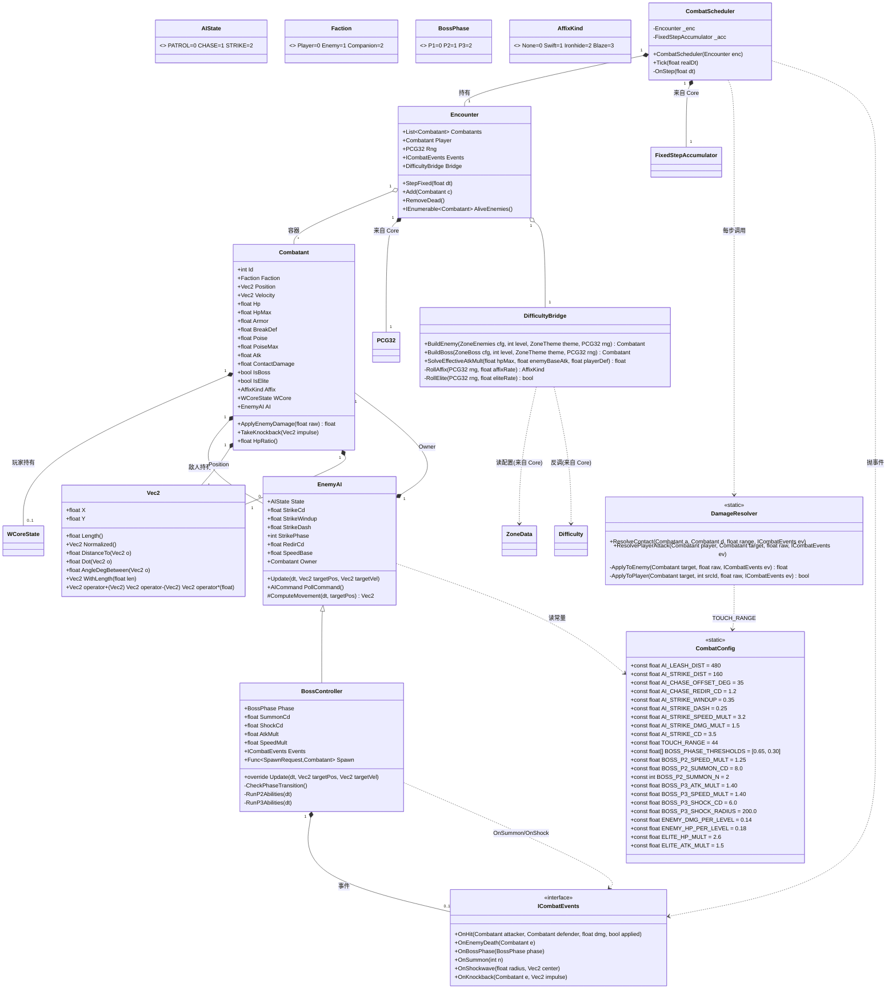
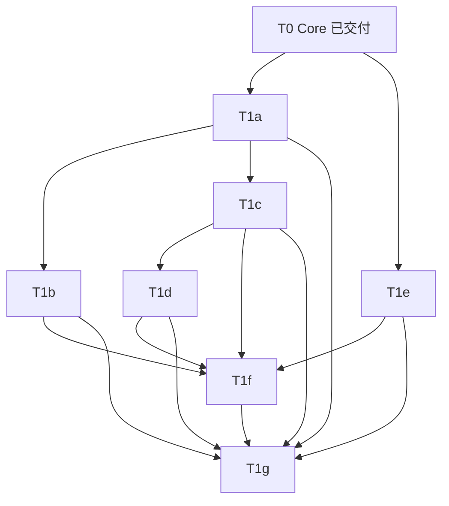
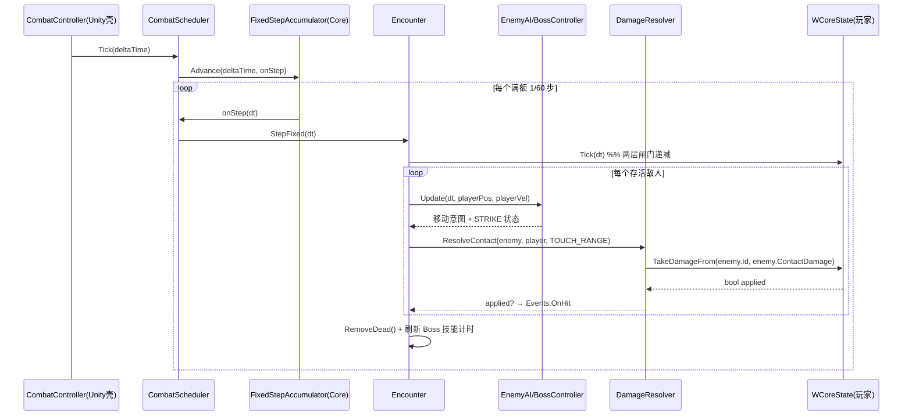

# T1 战斗逻辑内核 · 细化设计文档

> 项目：仙侠 RPG（Unity 重开）　|　阶段：T1「战斗逻辑内核」　|　作者：游戏架构师 高见远
> 依赖基线：T0 已交付的引擎无关 Core（`Xianxia.Core`：WCoreState / FixedStepAccumulator / PCG32 / Difficulty / ZoneData / ZoneSeed）
> 约束红线：**战斗内核禁止引用 `UnityEngine`**，必须是纯 C#，可被 `dotnet test` 独立编译，也可被 Python 对拍（t1_selfcheck.py）独立验证。仅在「Unity 驱动适配壳」里可引用 UnityEngine，且壳必须薄（只调用内核的 `Tick(dt)`）。

---

## 0. 核心摘要（一句话结论）

- **模块边界**：战斗的全部**逻辑**（AI 状态机、伤害结算、BOSS 阶段、难度反调）都收敛在 `Assets/Scripts/Systems/Combat/`（纯 C#，`Xianxia.Combat`），Unity 侧只在 `Assets/Scripts/Systems/Combat/Unity/` 放一个薄壳把 `transform` 喂进内核、把 `Tick(dt)` 结果反映到 `GameObject`，**内核不认 GameObject、不认 Transform、不认物理引擎**。
- **类清单**（7 个核心类 + 2 个枚举 + 1 个结构体 + 1 个事件接口）：`Vec2`、`CombatConfig`、`Combatant`、`EnemyAI`、`BossController`、`DamageResolver`、`DifficultyBridge`、`Encounter`、`CombatScheduler`、`ICombatEvents`，枚举 `AIState`/`Faction`/`BossPhase`/`AffixKind`。
- **任务列表总览**：T1a 基础设施（Vec2/CombatConfig/Combatant 骨架/Unity 空壳）→ T1b 减法承伤+DamageResolver+WCORE 接入 → T1c EnemyAI 三态 → T1d BossController 三阶段 → T1e DifficultyBridge 分级与反调 → T1f Encounter+CombatScheduler 编排+对拍基线 → T1g Unity 壳整合（需本地编译）。其中 T1a–T1f 全为**纯 C# 可 Python 对拍**，仅 T1g 为**Unity 壳需本地 Unity 编译**。
- **对拍基线要点**：t1_selfcheck.py 复刻 Godot 量化节奏，验收 ①Vec2 几何与 Godot `distance_to`/点积一致；②敌人接触伤害经 `WCoreState.TakeDamageFrom` + `FixedStepAccumulator(1/60)` 后，单挑频率 **1.700 次/s**、4 怪围攻 **4.300 次/s**、围攻/单挑比 **2.53x**（与 T0 基线逐位对齐）；③减法承伤 `real=max(1, d-max(0, armor-breakDef))`；④BOSS 阶段阈值 **[0.65, 0.30]**；⑤分级缩放 `hp_scale=1+0.18*(lv-1)`、`dmg_scale=1+0.14*(lv-1)`、精英 HP×2.6/ATK×1.5、词缀 swift/ironhide/blaze，且模型 B 反调后 `d_eff≈hp_max/65`。

---

## 1. 模块边界

```
Assets/Scripts/Systems/Combat/        ← 引擎无关内核（Xianxia.Combat，禁止 UnityEngine）
├── Vec2.cs             纯几何向量（替代 UnityEngine.Vector2）
├── CombatConfig.cs     全部 AI/BOSS 战斗常量（对齐 game_config.gd）
├── Combatant.cs        统一战斗实体（玩家含 WCoreState，敌人含减法承伤）
├── EnemyAI.cs          普通/精英三态 FSM（PATROL/CHASE/STRIKE）
├── BossController.cs   BOSS 三阶段控制器（继承 EnemyAI）
├── DamageResolver.cs   伤害路由：玩家→WCoreState，敌人→减法模型+霸体/击退
├── DifficultyBridge.cs zones.json → 分级缩放 + 模型 B atk_mult 反调
├── Encounter.cs        战斗状态容器（combatant 列表/RNG/配置快照）
├── CombatScheduler.cs  固定步长驱动（包 FixedStepAccumulator）
├── ICombatEvents.cs    供 Unity 壳注入的 FX/音效/生成回调接口
└── Unity/              ← 仅此处可引用 UnityEngine（薄壳）
    ├── CombatController.cs   MonoBehaviour：Update→scheduler.Tick(deltaTime)
    ├── CombatView.cs         Combatant ↔ GameObject transform 双向同步
    └── CombatEventsUnity.cs  ICombatEvents 的 Unity 实现（特效/音效/生成敌人）

Assets/Scripts/Systems/Combat/Tests/   ← 验收（纯 C# 与 Python 双轨）
├── CombatKernelTests.cs   NUnit dotnet test
└── t1_selfcheck.py        Python 对拍基线（本环境无 dotnet，对拍靠它）
```

**边界纪律（硬约束）**
- 内核任何类不得 `using UnityEngine;`。CI 加一条 grep 守卫：若 `Combat/` 下（除 `Unity/`）出现 `UnityEngine` 引用即构建失败。
- 内核不持有 `GameObject`/`Transform`/`Rigidbody2D` 引用；位置用自有 `Vec2`。
- 移动与命中判定在**内核内用纯几何 + 欧拉积分**完成（与 Godot 原型一致），Unity 壳只做「镜像渲染 + 可选墙体碰撞修正」，不得反向驱动逻辑。
- 一切「需要引擎能力」的动作（生成敌人、播放特效、AoE 命中判定）通过**注入的委托/接口**（`Func<SpawnRequest,Combatant>`、`ICombatEvents`）完成，内核保持可脱机运行。

---

## 2. 类图（Mermaid classDiagram）



> 注：`WCoreState` / `FixedStepAccumulator` / `PCG32` / `Difficulty` / `ZoneData` 均来自 T0 的 `Xianxia.Core`，此处不重复定义，仅以「来自 Core」标注复用关系。

---

## 3. 敌人分级方案（对齐 zones.json：normal / elite / boss）

### 3.1 三级定义与数值来源

| 级别 | zones.json 来源 | AI 类型 | 关键倍率 | 词缀 | 备注 |
|---|---|---|---|---|---|
| **normal** | `enemies.count/kinds/hp_mult/atk_mult/armor_add` | `EnemyAI` 三态 | 基础值 + 按级缩放 | 可带（受 `affix_rate`） | 主力杂兵 |
| **elite** | 以 `elite_rate` 概率从 normal 升级 | `EnemyAI` 三态（与 normal **同构**，仅数值更厚） | HP×2.6、ATK×1.5、EXP×2.0（叠加在级缩放之上） | 可带（受 `affix_rate`，且 ironhide 更常见） | 不换 AI，难度全来自数值 |
| **boss** | `boss.boss_id/display_name/kind/level_offset/hp_mult/atk_mult/drop_extra` | `BossController` 三阶段 | 见 §4 | 不带词缀 | poise×3，专属技能 |

### 3.2 逐级缩放公式（与 Godot `main.gd` `spawn_wave`/`spawn_boss` 逐值对齐）

```
lv_eff       = level + (isBoss ? boss.level_offset : 0)
hp_scale     = 1 + ENEMY_HP_PER_LEVEL * (lv_eff - 1)      // 0.18/级
dmg_scale    = 1 + ENEMY_DMG_PER_LEVEL * (lv_eff - 1)     // 0.14/级

normal:
  max_hp   = base_hp * zone.hp_mult * hp_scale
  damage   = base_dmg * atk_mult_seed * dmg_scale          // atk_mult 为种子，模型 B 反调见 §3.3
  armor   += zone.armor_add

elite（在 normal 结果上再乘）:
  max_hp  *= ELITE_HP_MULT   (2.6)
  damage  *= ELITE_ATK_MULT  (1.5)
  exp     *= 2.0

boss:
  max_hp   = base_hp * zone.hp_mult * hp_scale * boss.hp_mult
  damage   = base_dmg * atk_mult_seed * dmg_scale * boss.atk_mult
  exp     *= 3.0
```

### 3.3 模型 B 反调（atk_mult 只是种子，不是终值）

`d_eff` 靶子 = `hp_max / 65`（来自 `Difficulty.ComputeDeff`）。`DifficultyBridge.SolveEffectiveAtkMult` 反解：

```
目标 d_eff = hp_max / 65
实际 d_eff = base_dmg * atk_mult_eff * dmg_scale * (1 - MitigationOf(playerDef, K))
⇒ atk_mult_eff = (hp_max/65) / ( base_dmg * dmg_scale * keep )
   其中 keep = 1 - playerDef/(playerDef+K), K=100
```

> ⚠️ `zones.json` 里那 5 个 `atk_mult`（1.6/1.7/1.8/1.9/2.0）只是**种子**；最终 `atk_mult_eff` 由上式反解得到，逐区必须在 Unity headless 实测复核（蓝图 §F3）。Python 对拍只验证「反调后 `d_eff ≈ hp_max/65` 落在 `DeffLowerBound~DeffUpperBound` 区间内」。

### 3.4 词缀表（AFFIX_TABLE，对齐 game_config.gd）

| 词缀 | 效果 | 实现位置 |
|---|---|---|
| `swift`   | 移动速度 ×1.35 | `EnemyAI.SpeedBase *= 1.35` |
| `ironhide`| 护甲 `armor += 12` | `Combatant.Armor += 12`（减法模型更硬） |
| `blaze`   | 伤害 ×1.25 | `Combatant.ContactDamage *= 1.25` |

> 词缀由 `DifficultyBridge.RollAffix` 用 `PCG32`（与 Godot `randf` 同构）按 `affix_rate` 抽取，保证可复现。

### 3.5 AI 差异小结

- **normal 与 elite 共用同一套 `EnemyAI`**：行为（PATROL/CHASE/STRIKE 的距离阈值、蓄力时长、突进倍率）**完全一致**，差异仅在 `SpeedBase`/`Hp`/`ContactDamage`/`Armor` 等数值。这样最大程度保真 Godot，也避免引入未经验证的「精英特殊行为」。
- **boss 替换为 `BossController`**：PATROL 基本不触发（进场即锁定玩家），STRIKE 被阶段技能（召唤/冲击波）部分覆盖，见 §4。

---

## 4. BOSS 阶段设计（对齐 Godot `enemy.gd` 狂暴逻辑）

### 4.1 触发与状态

- 阶段阈值为 **血量比例** `HpRatio = Hp/HpMax`：
  - `P1`：`ratio > 0.65`
  - `P2`：`0.30 < ratio ≤ 0.65`
  - `P3`：`ratio ≤ 0.30`
- 阈值常量 `BOSS_PHASE_THRESHOLDS = [0.65, 0.30]`（来自 `CombatConfig`，与 `game_config.gd` 一致）。
- `BossController.CheckPhaseTransition()` 在 `StepFixed` 每步检测，仅在**向下跨阈值**时触发一次 `Events.OnBossPhase(phase)`，避免重复触发。

### 4.2 各阶段行为（C# 版状态/事件）

| 阶段 | 速度 | 攻击 | 周期技能（计时器，走 1/60 步） | 触发事件 |
|---|---|---|---|---|
| P1 | ×1.0 | STRIKE 基础（DMG×1.0） | 无 | `OnBossPhase(P1)` |
| P2 | ×`BOSS_P2_SPEED_MULT`(1.25) | STRIKE（DMG×1.0） | 每 `BOSS_P2_SUMMON_CD`(8.0s) 召唤 `BOSS_P2_SUMMON_N`(2) 只小怪 | `OnSummon(2)` |
| P3 | ×`BOSS_P3_SPEED_MULT`(1.40) | STRIKE（DMG×`BOSS_P3_ATK_MULT`(1.40)） | 每 `BOSS_P3_SHOCK_CD`(6.0s) 释放冲击波，半径 `BOSS_P3_SHOCK_RADIUS`(200) | `OnShockwave(200, center)` |

- **霸体（poise）**：BOSS 的 `PoiseMax = base_poise * 3.0`（对齐 `enemy.gd` 的 `poise_max *= 3.0`），硬直/击退抗性更强。
- **召唤**：`BossController` 持有一个注入的 `Func<SpawnRequest, Combatant> Spawn` 委托（由 Unity 壳或测试桩提供）。内核只生产 `Combatant` 并加入 `Encounter`，不涉及 `GameObject`。
- **冲击波（AoE）**：`OnShockwave` 事件携带中心点与半径；Unity 壳据半径做视觉，内核侧「是否命中玩家」由 `DamageResolver` 用纯几何（`Vec2.DistanceTo(center, player.Position) <= radius`）判定，玩家可闪避（`WCore.Iframe`）规避。

### 4.3 C# 关键伪码

```csharp
public override void Update(float dt, Vec2 targetPos, Vec2 targetVel)
{
    CheckPhaseTransition();                 // 跨阈值→Events.OnBossPhase + 设置 SpeedMult/AtkMult
    base.Update(dt, targetPos, targetVel);  // 复用 EnemyAI 三态移动/STRIKE
    if (Phase >= BossPhase.P2) RunP2Abilities(dt);
    if (Phase >= BossPhase.P3) RunP3Abilities(dt);
}

private void RunP3Abilities(float dt)
{
    ShockCd -= dt;
    if (ShockCd <= 0f)
    {
        ShockCd = CombatConfig.BOSS_P3_SHOCK_CD;
        Events.OnShockwave(CombatConfig.BOSS_P3_SHOCK_RADIUS, Owner.Position);
        // 命中判定在 CombatScheduler 收到事件后，用 DamageResolver 对玩家做 AoE
    }
}
```

---

## 5. 文件清单与相对路径

| 文件（相对工程根 `shuimofeng/`） | 类型 | 引擎无关 | 说明 |
|---|---|---|---|
| `Assets/Scripts/Systems/Combat/Vec2.cs` | 内核 | ✅ | 纯几何向量，替代 `UnityEngine.Vector2` |
| `Assets/Scripts/Systems/Combat/CombatConfig.cs` | 内核 | ✅ | 全部 AI/BOSS 常量（对齐 game_config.gd） |
| `Assets/Scripts/Systems/Combat/Combatant.cs` | 内核 | ✅ | 统一实体；玩家含 `WCoreState`，敌人含减法承伤 |
| `Assets/Scripts/Systems/Combat/EnemyAI.cs` | 内核 | ✅ | 三态 FSM（PATROL/CHASE/STRIKE） |
| `Assets/Scripts/Systems/Combat/BossController.cs` | 内核 | ✅ | 三阶段控制器，继承 `EnemyAI` |
| `Assets/Scripts/Systems/Combat/DamageResolver.cs` | 内核 | ✅ | 伤害路由 + 减法模型 + 霸体/击退 |
| `Assets/Scripts/Systems/Combat/DifficultyBridge.cs` | 内核 | ✅ | zones.json 分级缩放 + 模型 B 反调 |
| `Assets/Scripts/Systems/Combat/Encounter.cs` | 内核 | ✅ | 战斗状态容器 |
| `Assets/Scripts/Systems/Combat/CombatScheduler.cs` | 内核 | ✅ | 固定步长驱动（包 `FixedStepAccumulator`） |
| `Assets/Scripts/Systems/Combat/ICombatEvents.cs` | 内核 | ✅ | FX/音效/生成回调接口 |
| `Assets/Scripts/Systems/Combat/Unity/CombatController.cs` | 壳 | ❌ | MonoBehaviour：`Update→scheduler.Tick(deltaTime)` |
| `Assets/Scripts/Systems/Combat/Unity/CombatView.cs` | 壳 | ❌ | `Combatant ↔ GameObject` transform 同步 |
| `Assets/Scripts/Systems/Combat/Unity/CombatEventsUnity.cs` | 壳 | ❌ | `ICombatEvents` 的 Unity 实现 |
| `Assets/Scripts/Systems/Combat/Tests/CombatKernelTests.cs` | 验收 | ✅ | NUnit `dotnet test` |
| `Assets/Scripts/Systems/Combat/Tests/t1_selfcheck.py` | 验收 | ✅（Python） | 对拍基线，本环境主验证手段 |

> 复用的 T0 内核（不在此新建）：`Assets/Scripts/Core/{WCore,FixedStepAccumulator,PCG32,Difficulty,ZoneData,ZoneSeed}.cs`，命名空间 `Xianxia.Core`。

---

## 6. 任务列表（有序、含依赖，标注纯 C# / Unity 壳）

> 标注说明：**【纯 C#·可 Python 对拍】**= 不引用 UnityEngine、可脱机编译与对拍；**【Unity 壳·需本地编译】**= 引用 UnityEngine，需 Unity 工程本地编译验证。

| 任务 | 名称 | 依赖 | 类型 | 主要产出文件 |
|---|---|---|---|---|
| **T1a** | 基础设施：Vec2 + CombatConfig + Combatant 骨架 + ICombatEvents + Unity 空壳 | T0(Core 已存在) | 【纯 C#】+ 1 个【Unity 壳】空壳 | `Vec2.cs` `CombatConfig.cs` `Combatant.cs` `ICombatEvents.cs` `Unity/CombatController.cs`(空壳只调 Tick) |
| **T1b** | 减法承伤模型 + DamageResolver + WCORE 接入 | T1a | 【纯 C#·可 Python 对拍】 | `DamageResolver.cs`（`Combatant.ApplyEnemyDamage` 减法模型、`TakeKnockback`、玩家走 `WCore.TakeDamageFrom`） |
| **T1c** | EnemyAI 三态 FSM（PATROL/CHASE/STRIKE，默认 CHASE） | T1a | 【纯 C#·可 Python 对拍】 | `EnemyAI.cs` |
| **T1d** | BossController 三阶段（阈值/提速/召唤/冲击波） | T1c | 【纯 C#·可 Python 对拍】 | `BossController.cs` |
| **T1e** | DifficultyBridge 分级缩放 + 模型 B atk_mult 反调 | T0(Core) | 【纯 C#·可 Python 对拍】 | `DifficultyBridge.cs` |
| **T1f** | Encounter + CombatScheduler 编排 + 对拍基线(t1_selfcheck.py + CombatKernelTests.cs) | T1b, T1c, T1d, T1e | 【纯 C#·可 Python 对拍】 | `Encounter.cs` `CombatScheduler.cs` `Tests/CombatKernelTests.cs` `Tests/t1_selfcheck.py` |
| **T1g** | Unity 壳整合：移动镜像 / 渲染 / 事件 / FX / 生成敌人 | T1a…T1f | 【Unity 壳·需本地编译】 | `Unity/CombatController.cs`(完整) `Unity/CombatView.cs` `Unity/CombatEventsUnity.cs` |

**依赖图（mermaid）**



**优先级建议**：T1a/T1b/T1c/T1e 可并行启动（均只依赖 T0 或 T1a 骨架）；T1d 依赖 T1c；T1f 收口全部内核并交付对拍基线（**里程碑节点**，本环境验收点）；T1g 最后接入 Unity。

---

## 7. Python 对拍基线（t1_selfcheck.py 验收标准）

> 风格与 `Assets/Scripts/Core/wcore_selfcheck.py` 一致：纯 Python 重写内核等价算法 → 跑固定场景 → 断言与 Godot/T0 基线逐位对齐。本环境无 dotnet，**T1f 的 `t1_selfcheck.py` 是主要验收手段**；`CombatKernelTests.cs` 为同语义的 NUnit 版，待有 dotnet 环境再跑。

### 7.1 常量（与 CombatConfig / WCore / Difficulty 逐值对齐）

```python
# ---- W-CORE（来自 Xianxia.Core.WCore）----
PER_SOURCE_HIT_CD = 0.6
GLOBAL_HIT_GAP    = 0.2167
FIXED_STEP        = 1.0 / 60.0      # 绝不写 0.01667 字面量
MAX_STEPS_PER_ADVANCE = 8
# ---- 频率基线（T0 实测，Godot 60Hz 量化）----
FREQ_SOLO   = 1.700
FREQ_SWARM  = 4.300
SWARM_MULT  = FREQ_SWARM / FREQ_SOLO   # = 2.53
# ---- AI / BOSS（来自 CombatConfig）----
AI_LEASH_DIST = 480.0
AI_STRIKE_DIST = 160.0
AI_STRIKE_WINDUP = 0.35
AI_STRIKE_DASH = 0.25
AI_STRIKE_SPEED_MULT = 3.2
AI_STRIKE_DMG_MULT = 1.5
AI_STRIKE_CD = 3.5
TOUCH_RANGE = 44.0
BOSS_PHASE_THRESHOLDS = [0.65, 0.30]
BOSS_P2_SPEED_MULT = 1.25
BOSS_P3_ATK_MULT = 1.40
BOSS_P3_SPEED_MULT = 1.40
# ---- 难度（来自 Xianxia.Core.Difficulty）----
DEFF_DIVISOR = 65.0
DEF_SOFTCAP_K = 100.0
DAMAGE_FLOOR = 1.0
ENEMY_HP_PER_LEVEL = 0.18
ENEMY_DMG_PER_LEVEL = 0.14
ELITE_HP_MULT = 2.6
ELITE_ATK_MULT = 1.5
```

### 7.2 必过的验收用例（每组一个断言，失败即回归）

| 用例 | 验证点 | 期望结果 |
|---|---|---|
| **T1-01 Vec2 几何** | `DistanceTo` / `Dot` / 夹角 vs Godot `distance_to`、`Vector2.dot` | 与 Godot 逐位一致（含 TOUCH_RANGE=44 判定边界） |
| **T1-02 单挑频率** | 1 敌接触玩家，走 `FixedStepAccumulator`，玩家 `WCore.TakeDamageFrom` | 实测频率 **1.700 次/s**（±0.02） |
| **T1-03 围攻频率** | 4 敌接触玩家，同链路 | 实测频率 **4.300 次/s**（±0.02） |
| **T1-04 围攻倍率** | 4.300 / 1.700 | **2.53x**（±0.03） |
| **T1-05 高刷不变性** | 用 144Hz 的 `deltaTime` 喂 `Tick`，仍走 1/60 累加 | 频率与 60Hz 一致（证明与帧率解耦） |
| **T1-06 减法承伤** | `ApplyEnemyDamage(d)`，`real=max(1, d-max(0, armor-breakDef))` | armor=10,breakDef=0,d=4→1；d=20→10；d=100,armor=5→95 |
| **T1-07 AI 状态转移（距离）** | dist>480→PATROL；dist≤160→STRIKE；其余→CHASE | 三态切换点精确 |
| **T1-08 AI STRIKE 时序** | 进入 STRIKE 后 windup 0.35s + dash 0.25s，CD 3.5s | 相位与 CD 与 CombatConfig 一致 |
| **T1-09 BOSS 阶段阈值** | 逐次扣血跨越 0.65 / 0.30 | `Phase` P1→P2→P3 各触发一次 `OnBossPhase` |
| **T1-10 BOSS P2 提速/召唤** | 进入 P2，`SpeedMult=1.25`，每 8.0s `OnSummon(2)` | 事件按时触发、参数正确 |
| **T1-11 BOSS P3 冲击波** | 进入 P3，`AtkMult=1.40`、`SpeedMult=1.40`，每 6.0s `OnShockwave(200, center)` | 事件按时触发、半径正确 |
| **T1-12 分级缩放** | `BuildEnemy`：hp_scale/dmg_scale、精英 ×2.6/×1.5、词缀 swift/ironhide/blaze | 数值与 §3.2/§3.4 逐位一致 |
| **T1-13 模型 B 反调** | `SolveEffectiveAtkMult` 后 `d_eff = base_dmg*atk_mult_eff*dmg_scale*keep` | `d_eff ≈ hp_max/65` 且落在 `DeffLowerBound~DeffUpperBound` 区间 |
| **T1-14 端到端锁步** | 固定种子（seed=20260730，djb2 派生 zone 种子）跑一场 4 怪围攻 | 承伤序列与 T0 `wcore_selfcheck.py` 的 4 怪序列逐位一致（证明内核正确路由到 WCORE） |

### 7.3 对拍约定（与 T0 保持一致）

- **RNG 同构**：Python 端用与 `PCG32` 同构的实现（`Multiplier=6364136223846793005`，`DefaultIncrement=1442695040888963407`，`DefaultSeed=20260730`，播种后强制推进一次）；zone 种子用 `GodotHash.Djb2` 派生。
- **默认关闪避**：对拍纯承伤频率时 `WCore.DodgeEnabled=false`，避免随机闪避污染统计（与 T0 一致）。
- **位置/移动**：纯欧拉积分 `pos += vel*dt`，开阔地无墙；与 Godot 接触伤害基线一致。
- **断言容差**：频率 ±0.02、倍率 ±0.03、几何/数值逐位（浮点用 `math.isclose(rel_tol=1e-6)`）。

---

## 8. 风险与待明确事项

### 8.1 Unity 侧物理/移动未实现时，内核如何 mock 位置与命中判定 ✅（已定方案）

- **位置**：内核自持 `Vec2 Position`，由 Unity 壳每帧在 `CombatController.Update` 里把 `GameObject.transform.position` → `Vec2` 写入 `Combatant`；反过来内核算出的 `Position` 经 `CombatView` 写回 transform。**内核永不读 transform**。
- **命中判定（纯几何，与 Godot 一致）**：接触伤害用 `Vec2.DistanceTo(attacker.Position, player.Position) <= TOUCH_RANGE(44)`；STRIKE 朝向、CHASE 侧向偏移用 `Vec2.Dot`/夹角（对齐 Godot `distance_to` + 点积）。**不依赖任何物理碰撞体**。
- **移动积分**：内核用纯欧拉 `Position += Velocity * dt` 自驱（对齐 Godot `world.try_move` 的速度脉冲思路）；墙体碰撞/推挤是 Unity 壳的可选增强，**T1 内核按开阔地模拟**，保证对拍确定性。
- **mock 方式（单元测试/对拍）**：直接 `new Combatant()` 并设 `Position`/`ContactDamage`/`Id`，无需 `GameObject`，即可驱动 `CombatScheduler.Tick` 跑完整战斗。

### 8.2 待明确 / 需 team-lead 拍板的事项

| # | 事项 | 当前建议 | 影响 |
|---|---|---|---|
| R1 | **玩家攻击敌人（普攻/技能/R-07 前冲）的伤害公式**是否在 T1 范围？ | T1 先只做「敌人→玩家」接触伤害；玩家输出走 `DamageResolver.ResolvePlayerAttack` 钩子，`break_def` 默认 0，公式留待 T2 | 不阻塞 T1 验收 |
| R2 | **击退（knockback）碰撞解算**（Godot 的 `world.try_move` 防穿墙） | T1 仅作速度脉冲（`TakeKnockback`），墙体解算推迟到物理壳/后续阶段 | 不影响对拍 |
| R3 | **闪避/真气/R-07 输入层** | T1 内核只暴露 `WCore.DodgeEnabled / DodgeRoll / DamageFilter` 钩子；具体骰子和 `Difficulty.DamageTaken` 减伤由上层注入 | 对拍默认关闪避 |
| R4 | **zones.json 的 `atk_mult` 反调复核** | 模型 B 反解得到种子值，逐区须在 Unity headless 实测复核（蓝图 §F3） | 数值手感验收点 |
| R5 | **BOSS 召唤的小怪种类/等级** | 暂定召唤「当前 zone 的 normal 敌人降一级」，由 `Spawn` 委托实现 | 不影响内核结构 |
| R6 | **Companion（同伴）受 0.5x 伤害** | `Combatant.Faction=Companion` 时 `DamageResolver` 对玩家路径乘 0.5 | 小改动 |

### 8.3 已知技术风险（来自蓝图）

- **固定步长不可省**：攻击尝试**必须**走 `FixedStepAccumulator(1/60)`，绝不能让敌人每帧尝试——否则 144Hz 下围攻倍率从 2.53x 漂到 2.7x+。Unity 壳在 `Update` 里调 `scheduler.Tick(deltaTime)`，不使用 `Physics2D` 做移动决策（蓝图最大隐藏风险）。
- **`FixedStep` 常量写法**：必须写 `1.0f/60.0f`，**禁止字面量 `0.01667f`**（13×0.01667=0.21671>0.2167 会让闸门第 13 步放行，倍率变 2.74x）。已固化在 `CombatScheduler` 与 `CombatConfig`。
- **instance_id 复用**：切区/重生必须 `WCore.Reset()` 清冷却表，否则旧敌人 id 残留冷却导致「新区怪打不动我」。内核 `Encounter.RemoveDead` + 切区时统一 `Reset`。

---

## 附：单步调用时序（Mermaid sequenceDiagram）



> 文档结束。所有数值常量均逐值与 Godot 原型（`enemy.gd`/`player.gd`/`game_config.gd`/`main.gd`）及 T0 Core 对齐；内核零 `UnityEngine` 依赖，T1a–T1f 可经 `t1_selfcheck.py` 独立对拍验证。
