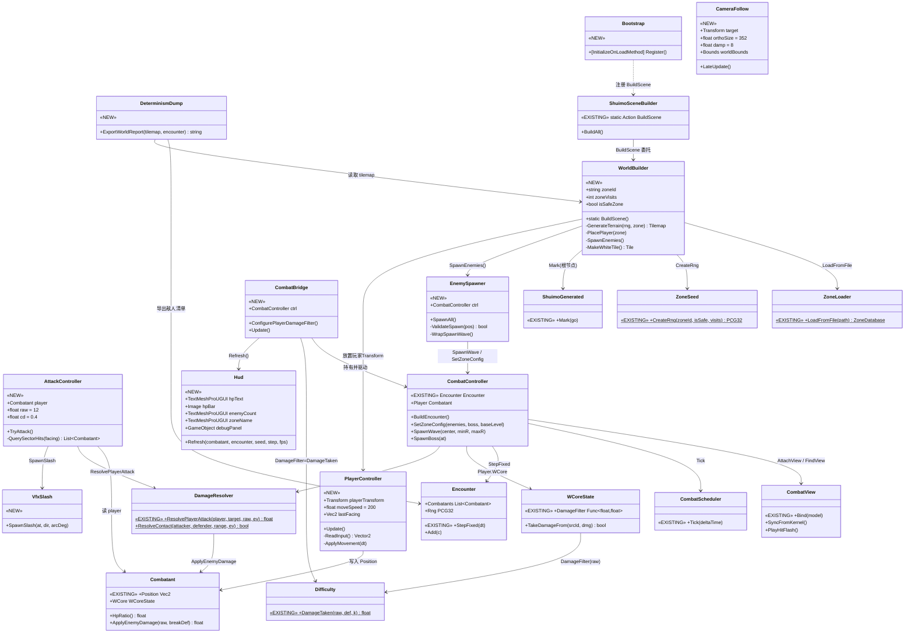
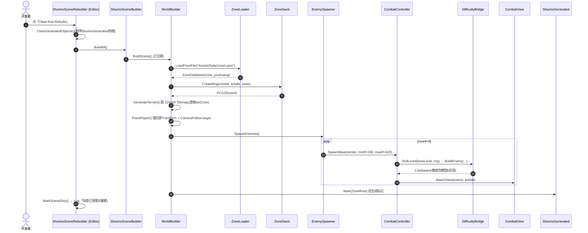
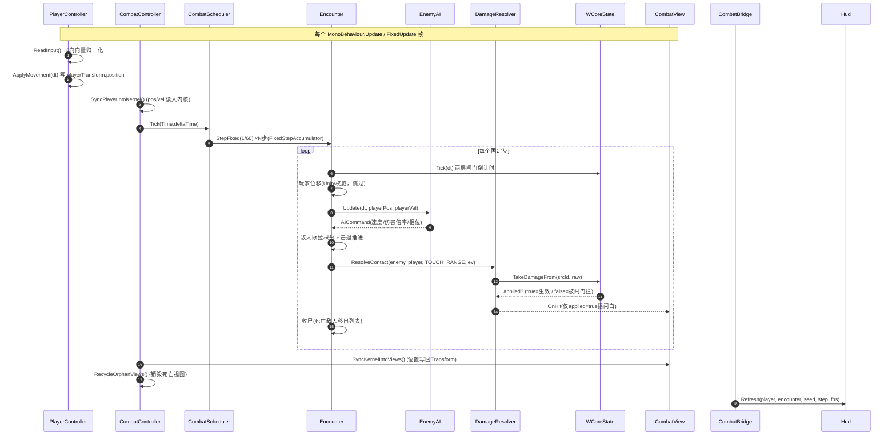
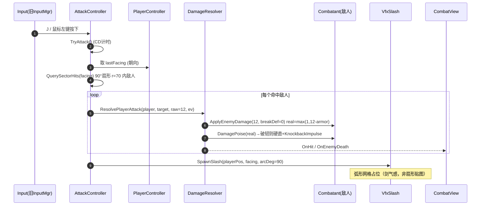

# T2 阶段架构设计 + 任务分解 —— 可玩垂直切片（Playable Vertical Slice）

> 文档类型：系统架构设计（含任务分解）
> 撰写：高见远（架构师 software-architect）
> 版本：v1.0
> 工程：Unity 2022.3.62f3c1 · C# (.NET Standard 2.1) · `F:\AI-project\ancientGame\shuimofeng\shuimofeng`
> 输入：T2 PRD（`docs/unity-t2-prd.md`）、T0 Core 源码、T1 Combat 源码、Shuimo 工具、zones.json
> 声明：**仅做设计，不写实现代码**；下列 API 签名均来自对 T0/T1/Shuimo 真实源码的通读（非推测）。

---

## 1. 实现方案 + 框架选型（含 Q1~Q13 最终裁定）

### 1.1 总体策略

T2 的核心矛盾是：**纯逻辑层（T0/T1）已经验收、但禁止改动（红线）**，而可玩性（移动、相机、世界生成、HUD、攻击判定）全是 Unity 桥接层的新代码。因此本设计的原则是：

1. **能复用的内核 API 一律原样调用，绝不重写、绝不 fork**。已确认的复用点：`ZoneLoader.LoadFromFile`、`ZoneSeed.CreateRng`、`DifficultyBridge.BuildEnemy` / `RollLevel`、`Encounter` / `CombatScheduler` / `CombatController`、`DamageResolver`、`CombatView`、`ShuimoSceneBuilder.BuildScene` / `ShuimoGenerated`。
2. **新代码全部落在允许 UnityEngine 的 asmdef 里**，纯逻辑层零字节改动，从而保住「既有 NUnit 全绿」「`noEngineReferences=true` 不变」两条红线。
3. **数值全部复用 T1 常量与 T0 种子**，保证与 Godot 原型 / 63 对拍结论严格一致（Q1 换算见下）。
4. **地形用单一 Tilemap 合批**，避免 9600 个 GameObject。

### 1.2 框架 / 库选型（均已包含在 `Packages/manifest.json`）

| 能力 | 选型 | 理由 | 是否需装包 |
|---|---|---|---|
| 2D 地形渲染 | **Unity Tilemap**（`com.unity.feature.2d` 2.0.1 已含） | 9600 格用单个 Tilemap + `TilemapRenderer` 单 Draw Call 合批；按格 `SetColor` 取 palette，零美术资源 | 否（已含） |
| UI（HUD） | **uGUI**（`com.unity.ugui` 1.0.0 已含）+ `TextMeshPro`（`com.unity.textmeshpro` 3.0.7 已含） | HP 条用 `Image` + `RectTransform`，文字用 TMP；Screen Space Overlay | 否（已含） |
| JSON 解析 | **Newtonsoft.Json**（`com.unity.nuget.newtonsoft-json` 3.0.2 已含） | `ZoneLoader` 依赖；`SnakeCaseContractResolver` | 否（已含） |
| 输入 | **旧版 Input Manager**（`Input.GetAxisRaw` / `Input.GetKeyDown`） | 仅 WASD + 方向键 + 一个攻击键；零配置零资产 | 否（内置） |
| 测试 | `com.unity.test-framework` 1.1.33（已含） | P2 PlayMode 冒烟测试 | 否（已含） |

**结论：T2 不引入任何新依赖包**，所有待办均可由已装包完成，符合「不引入外部资源」精神（Q8/Q9）。

### 1.3 Q1~Q13 最终裁定（逐条，含复核）

> ★ = PRD 标注开工前必定的阻塞项。带「⚠️修正」的是我复核后与原 PM 推荐不一致、需升级确认的点。

| # | 问题 | **最终裁定** | 依据 / 复核 |
|---|---|---|---|
| **Q1** ★ | tile↔世界单位换算 | **1 tile = 32 世界单位**；Unity 采用 1 unit = 1 Godot 像素（PPU=1）。整图 120×80 tile = **3840×2560 单位**。相机正交 `orthographicSize ≈ 352`（≈22 tile 可视高度，16:9 下横向 ≈39 tile）。 | T1 全部战斗常量（TOUCH_RANGE=44 / STRIKE_DIST=160 / LEASH=480 / 速度 70）单位即 Godot 像素，1 unit=1 px 可**原样复用、零改写**。相机 ~352 与 PM 估计 ~360 一致（PRD §5.1 要求能看见 STRIKE_DIST 外来袭敌人）。 |
| **Q2** ★ | 玩家移动方式 | **自由 8 向连续移动**（斜向向量归一化，速度上限不超直向），地图数据仍按 tile 网格只用于地形/碰撞，移动不吸附格。 | 内核接触判定 `DistanceTo<=44`、AI ±35° 侧偏、3.2× 突进都是连续距离模型（PRD §6 Q2）。用户已拍板。 |
| **Q3** ★ | 战斗是实时还是切场景 | **实时同场景，无战斗切场景**。 | `Encounter.StepFixed` 每 1/60 跑「AI→接触→结算」，W-CORE 两层闸门本质是实时 DPS 天花板，回合制无意义（PRD §6 Q3）。用户已拍板。 |
| **Q4** ★ | 玩家移速 | **200 单位/秒**（≈敌人 70 的 2.86×，略低于突进 3.2×70=224，突进始终有威胁）。暴露 Inspector。 | 复核保留 PM 推荐；7s 可拉开 LEASH=480 完成脱战，又无法硬拼突进速度。 |
| **Q5** ★ | 玩家攻击 `raw` | **⚠️修正：raw 从 PM 推荐的 25 下调到 12**（推荐 12，可接受区间 10~15）。攻击冷却 **0.4s**、判定 **玩家朝向 90° 扇形 / 半径 70**（略大于 TOUCH_RANGE=44，可先手）。 | 见 §1.4 实算：zone_youhuang `base_level=3` 敌人 HP 仅 ~30–52（**非 PM 假设的百级别**），raw=25 时 blood `real=22` → **2 刀击杀**，远快于 PRD「4~6 刀」。raw=12 时普通 blood lv2/5 = 4/6 刀、精英 ~15 刀、DPS≈22.5，贴合目标。 |
| **Q6** | 地形生成 | **P0 简化占位**：`PCG32` 按 `water_rate`/`rock_rate` 洒点 + 简单聚团 + 四周边界墙；完整算子链列 P2-01。 | T2 目标是「证明能跑」，地图观感不在验收项（PRD §6 Q6）。 |
| **Q7** | 敌人落点 | **沿用 `CombatController.SpawnWave(center, minRadius, maxRadius)`**：`minRadius=260`、`maxRadius=620`；加落点合法性校验（避开 rock/water、避开玩家出生点 `AI_STRIKE_DIST=160` 内）。`minRadius>160` 满足 P0-06 ⑤（不在玩家出生打击距离内刷怪）；`maxRadius=620` 略超 `LEASH=480`，仅使个别敌人出生即处 PATROL、玩家靠近 480 内转 CHASE，无害且同种子可复现（QA 审查已确认可接受，见 §8 U6）。 | 零改动复用现有 API（PRD §6 Q7）。 |
| **Q8** | 输入系统 | **旧版 Input Manager**（`Input.GetAxisRaw`）。攻击键位 `J` + 鼠标左键双绑。 | 仅 WASD + 1 攻击键，旧版零依赖零资产（PRD §6 Q8）。 |
| **Q9** | 世界落地方式 | **编辑期落地 + 运行时兜底**（进入 Play 若场景无生成世界则自动生成一次）。9600 地格用**单一 Tilemap**（一个运行时生成的白色方块 `Tile` 资产 + 按格 `SetColor` 取 palette），单 Draw Call 合批。 | 见 §1.5；编辑期 `DestroyImmediate` 已就绪，运行时兜底防空场景（PRD §6 Q9）。 |
| **Q10** | 切片区域 | **zone_youhuang**（幽篁，forest，base_level=3，战斗区）。 | 用户已拍板（PRD §3.3）。 |
| **Q11** | 攻击键位/形状 | **J + 鼠标左键双绑**；判定 **玩家朝向 90° 扇形 r=70**；朝向 = 最后一次移动方向。特效为**弧形 slash 占位（非扇形）**。 | 用户已拍板；剑气感（弧形）为美术约束。 |
| **Q12** | BOSS 是否纳入 | **不纳入 P0，列 P1**（T2-P1-04）。 | 用户已拍板（PRD §6 Q12）。 |
| **Q13** | 确定性验收 | 调试命令导出「地格类型统计 + 敌人(id/level/pos/精英/词缀)」文本，rebuild 后做文本 diff。 | 比截图可靠（PRD §6 Q13）。 |

### 1.4 Q5 数值复核（关键裁定依据）

按 `DifficultyBridge.BuildEnemy` 的真实代码路径（**未改**，逐值对齐 Godot）复算 zone_youhuang（blood/witch，base_level=3，hp_mult=1.0，armor_add=0）：

| 项 | 公式 | blood (lv2/3/4/5) | witch (lv2/3/4/5) |
|---|---|---|---|
| 基础 HP | `30 / 22` | 30 / 30 / 30 / 30 | 22 / 22 / 22 / 22 |
| 分级 HP | `base×HpScale(lv)=base×(1+0.18·(lv−1))` | 35.4 / **40.8** / 46.2 / 51.6 | 26.0 / **29.9** / 33.8 / 37.8 |
| 护甲 | `bs.Armor` | 3 | 1 |
| 韧性 | `bs.PoiseMax` | 60 | 24 |
| 精英 HP | ×`ELITE_HP_MULT=2.6` | 最高 134.2 (lv5) | 最高 98.3 (lv5) |

**玩家进攻（敌→我减法，real = max(1, raw − armor)）候选 raw（breakDef=0，CD=0.4s）：**

| raw | blood real | lv2 刀数 | lv5 刀数 | lv5 精英刀数 | DPS |
|---|---|---|---|---|---|
| 10 | 7 | 6 | 8 | 20 | 17.5 |
| **12** ✅ | 9 | **4** | **6** | 15 | **22.5** |
| 15 | 12 | 3 | 5 | 12 | 30.0 |
| 20 | 17 | 3 | 4 | 8 | 42.5 |
| 25 ❌(PM原案) | 22 | 2 | 3 | 7 | 55.0 |

→ **raw=12 命中 PRD「普通敌人 4~6 刀」目标**；raw=25 仅 2~3 刀，过快。故裁定 **raw=12**。

> **⚠️ 必须升级的隐藏风险（玩家生存侧，敌→玩家）**：上述 Q5 仅解决了「玩家进攻」轴。而「玩家生存」轴（敌→玩家）在冻结的 Core 下存在标定错位，详见 §5 待明确事项 U1。该问题**无法在红线内（不改纯逻辑层）解决**，需 PM/用户拍板。

### 1.5 Q9 地形渲染方案（合批）

- **不用** 9600 个独立 SpriteRenderer GameObject（`.unity` 文件会暴胀、且 Draw Call 爆炸）。
- **用** 一个 `Grid` + 一个 `Tilemap` + `TilemapRenderer`：`WorldBuilder` 在生成时：
  1. 运行时用 `Texture2D` 造一个 1×1 白色 `Sprite`（**代码生成，非外部美术资源**），包成 `Tile`；
  2. 逐格 `tilemap.SetTile(cell, tile)` 后 `tilemap.SetColor(cell, paletteColor)` —— 地/水/岩三色 + 地2 交错斑驳；
  3. 边界一圈强制 rock，形成世界边界墙（配合 P1 地形碰撞）。
- 整个 120×80 地形 = **1 个 Draw Call**，编辑期落地为带 `ShuimoGenerated` 标记的根节点，可被 Clean And Rebuild 一键清理。

---

## 2. 文件列表及相对路径（asmdef 归属 / 红线对照）

### 2.1 现有文件（复用，只读，不动）

| 文件 | asmdef | 角色 |
|---|---|---|
| `Assets/Scripts/Core/*.cs`（7 文件） | `Xianxia.Core` (`noEngineReferences=true`) | 纯逻辑：Zone/Seed/PCG32/Difficulty/WCore |
| `Assets/Scripts/Systems/Combat/*.cs`（除 Unity/） | `Xianxia.Combat` (`noEngineReferences=true`) | 纯逻辑：Encounter/Combatant/EnemyAI/DamageResolver/DifficultyBridge/CombatConfig… |
| `Assets/Scripts/Systems/Combat/Unity/*.cs`（3 文件） | `Xianxia.Combat.Unity` (`noEngineReferences=false`) | 桥接：CombatController / CombatView / CombatEventsUnity |
| `Assets/_Project/Scripts/Runtime/ShuimoSceneBuilder.cs` | 当前 `Assembly-CSharp`（无 asmdef）→ **迁入新 asmdef**（见下） | `BuildScene` 静态委托入口 |
| `Assets/_Project/Scripts/Runtime/ShuimoGenerated.cs` | 同上 → **迁入新 asmdef** | `ShuimoGenerated.Mark(go)` 标记组件 |
| `Assets/_Project/Scripts/Editor/ShuimoSceneRebuilder.cs` | `Assembly-CSharp-Editor`（无 asmdef） | 菜单 `Shuimo/Scene/*` + 清理逻辑 |
| `Assets/Data/zones.json` | — | 区域库（含 zone_youhuang） |

### 2.2 新建文件（T2 全部新代码）

> **asmdef 决策**：新增 **`Xianxia.Unity.T2`**（`noEngineReferences=false`，`references=[Xianxia.Combat, Xianxia.Core, Xianxia.Combat.Unity]`，`autoReferenced=true`，`rootNamespace=Xianxia.Unity.T2`），放在 `Assets/_Project/Scripts/Runtime/`。
> - 该 asmdef 递归覆盖 `Runtime/` 下文件，于是 `ShuimoSceneBuilder.cs` / `ShuimoGenerated.cs` 从 `Assembly-CSharp` **迁入** `Xianxia.Unity.T2`（同 asmdef 内互相可见，规避了「asmdef 不能反向引用 Assembly-CSharp」的坑）。
> - `ShuimoSceneRebuilder.cs`（Editor 文件夹）仍走 `Assembly-CSharp-Editor`，自动引用 `Xianxia.Unity.T2`（autoReferenced=true），无碍。
> - 红线「新代码放新 asmdef 或接入 Xianxia.Combat.Unity」：**满足新 asmdef 路径**；若团队更偏好单一桥接 asmdef，也可把这批复用代码直接放 `Xianxia.Combat.Unity`（同样允许 UnityEngine），二选一即可，本设计按新 asmdef 落地。

| # | 相对路径 | asmdef | namespace | 说明 |
|---|---|---|---|---|
| 1 | `Assets/_Project/Scripts/Runtime/Xianxia.Unity.T2.asmdef` | （自身） | — | 新程序集定义 |
| 2 | `Assets/_Project/Scripts/Runtime/Bootstrap.cs` | T2 | `Xianxia.Unity.T2` | `[InitializeOnLoadMethod]` 注册 `ShuimoSceneBuilder.BuildScene = WorldBuilder.BuildScene` |
| 3 | `Assets/_Project/Scripts/Runtime/WorldBuilder.cs` | T2 | `Xianxia.Unity.T2` | 实现 `BuildScene`：加载 zone → 生成地形(Tilemap) → 放置玩家 → 调 EnemySpawner → 挂 `ShuimoGenerated` |
| 4 | `Assets/_Project/Scripts/Runtime/PlayerController.cs` | T2 | `Xianxia.Unity.T2` | 8 向移动、边界钳制、记录 `lastFacing` |
| 5 | `Assets/_Project/Scripts/Runtime/CameraFollow.cs` | T2 | `Xianxia.Unity.T2` | 正交阻尼跟随 + 世界边界钳制 |
| 6 | `Assets/_Project/Scripts/Runtime/EnemySpawner.cs` | T2 | `Xianxia.Unity.T2` | 包 `CombatController.SpawnWave` + 落点校验 + 调 `SetZoneConfig` |
| 7 | `Assets/_Project/Scripts/Runtime/CombatBridge.cs` | T2 | `Xianxia.Unity.T2` | 持有 `CombatController` 引用、接线 `Player.WCore.DamageFilter`、驱动 HUD |
| 8 | `Assets/_Project/Scripts/Runtime/AttackController.cs` | T2 | `Xianxia.Unity.T2` | J/左键攻击、90°扇形 r=70 命中筛选、调 `DamageResolver.ResolvePlayerAttack` |
| 9 | `Assets/_Project/Scripts/Runtime/Hud.cs` | T2 | `Xianxia.Unity.T2` | uGUI：玩家 HP / 敌人数 / 区域名 / 调试面板 |
| 10 | `Assets/_Project/Scripts/Runtime/VfxSlash.cs` | T2 | `Xianxia.Unity.T2` | 弧形 slash 占位特效（非扇形；网格/LineRenderer 生成） |
| 11 | `Assets/_Project/Scripts/Runtime/DeterminismDump.cs` | T2 | `Xianxia.Unity.T2` | Q13 文本导出（地格统计 + 敌人清单），供 diff |

> 场景文件（`.unity`）：新增 `Assets/Scenes/T2Slice.unity`，内含 Camera（正交）、Lights、空 CombatController GameObject、Player GameObject、enemyPrefab/bossPrefab 占位预制体（纯色 Sprite，代码生成）。预制体用 `Sprites-Default` 材质、**不引入任何外部资源**。

---

## 3. 数据结构与接口（类图）

> 实线/聚合关系标注；带 `«NEW»` 为本设计新建类，`«EXISTING»` 为复用 T0/T1/Shuimo 既有类（只读）。调用既有 API 的具体方法名已标在关系旁。



---

## 4. 程序调用流程（时序图）

### 4.1 编辑期：Shuimo 菜单 Clean And Rebuild → 世界生成



### 4.2 运行时：每帧驱动内核 + 战斗 + HUD



### 4.3 玩家攻击（玩家→敌人，含剑气特效）



---

## 5. 任务列表（有序、含依赖、按实现顺序）

> 共 **5 个任务**（不超过上限）。每组 ≥3 个文件。T 前任务仅依赖 T01（基础设施）。每条标注归属 asmdef / 文件。

| Task | 名称 | 归属文件（asmdef: Xianxia.Unity.T2 除非注明） | 依赖 | 优先级 | 交付的 PRD 条目 |
|---|---|---|---|---|---|
| **T01** | 项目基础设施 + 场景装配 | `Xianxia.Unity.T2.asmdef`、`Bootstrap.cs`、`Assets/Scenes/T2Slice.unity`（含 Camera/CombatController/Player/prefab）、`ShuimoSceneBuilder.cs`+`ShuimoGenerated.cs`（迁入 T2，原 Assembly-CSharp） | — | P0 | P0-01 注册骨架、P0-11 |
| **T02** | 世界生成管线（Shuimo 接入 + 地形 + 敌人） | `WorldBuilder.cs`、`EnemySpawner.cs`、`DeterminismDump.cs`（Q13） | T01 | P0 | P0-01 / P0-02 / P0-03 / P0-06 / Q6 / Q7 / Q9 / Q13 |
| **T03** | 玩家控制 + 相机 + 战斗内核驱动 | `PlayerController.cs`、`CameraFollow.cs`、`CombatBridge.cs` | T01 | P0 | P0-04 / P0-05 / P0-07 / P0-08 / Q1 / Q2 / Q4 |
| **T04** | 战斗交互（玩家攻击 + 伤害接线 + 特效） | `AttackController.cs`、`VfxSlash.cs`、`CombatBridge.cs`(接线 `DamageFilter`) | T02, T03 | P0 | P0-08 / P0-09 / Q5 / Q11 |
| **T05** | 最小 HUD + 集成联调 | `Hud.cs` + `CombatBridge.cs`(Refresh) | T03, T04 | P0 | P0-10 / P1-01~03 / 全链路联调 |

> 说明：
> - `CombatController`（既有，Xianxia.Combat.Unity）由 T01 在场景中挂载、`BuildEncounter`/`SetZoneConfig`/`SpawnWave` 由 T02/T03 调用，本身不改动。
> - `CombatBridge.cs` 在 T03 建壳、T04 接线 `Player.WCore.DamageFilter`、T05 接 HUD Refresh——同一文件跨任务增量填充，符合「按功能模块分组」原则。
> - BOSS（P1-04）、地形碰撞（P1-05）、死亡重生（P1-06）、区域切换（P1-07）、调试 Gizmos（P1-08）属 **P1**，在 T05 联调通过后按需追加小任务（不计入本次 5 任务上限）。

---

## 6. 依赖包列表

```
- com.unity.feature.2d@2.0.1        # Tilemap / Grid / TilemapRenderer（地形合批，Q9）
- com.unity.ugui@1.0.0              # uGUI Image/RectTransform（HUD，P0-10）
- com.unity.textmeshpro@3.0.7       # HUD 文字
- com.unity.nuget.newtonsoft-json@3.0.2  # ZoneLoader 依赖
- com.unity.test-framework@1.1.33   # P2 PlayMode 测试（已含）
- com.unity.modules.tilemap@1.0.0   # tilemap 模块（已含）
# 注意：以上均已存在于 Packages/manifest.json，T2 不新增任何包。
# 输入：内置 Input Manager（不装 New Input System）。
```

---

## 7. 共享知识（跨任务约束，供实现者遵守）

- **tile↔unit 常量**：`TILE_UNIT = 32`（1 tile = 32 单位），全图尺寸 `WORLD_W = 120*32 = 3840`、`WORLD_H = 80*32 = 2560`。常量集中放在 `WorldBuilder` 静态字段，禁止散落硬编码。
- **确定性随机**：所有世界生成必须用 `ZoneSeed.CreateRng(zoneId, isSafe, visits)` 派生的 `PCG32`，**不可** `new System.Random()`；`visits` 改变即世界改变（PRD P0-03）。
- **facing 角度约定**：`lastFacing` 为归一化 `Vector2`，角度用 `Mathf.Atan2(y,x)` 求得（弧度），扇形判定用 `Vector2.Angle(facing, toEnemy) <= 45°` 且 `dist <= 70`。
- **玩家输入权威**：玩家 `Position` 由 `PlayerController` 写 Transform，`CombatController.SyncPlayerIntoKernel` 每帧读入内核；**内核绝不回写玩家**（否则输入被吞，见 CombatController 注释）。
- **帧率无关**：内核固定步长 1/60 由 `CombatScheduler` 驱动，攻击/移动逻辑不得自己用 `Time.deltaTime` 直接积分战斗数值。
- **W-CORE 闸门**：敌→玩家承伤一律走 `WCoreState.TakeDamageFrom`（含 0.6s/源 + 0.2167s 全局两闸）；被拦下的无效命中 `applied=false`，**不播闪白/不播特效**（P1-03 关键点）。
- **减法承伤（敌）**：`real = max(1, raw − max(0, armor − breakDef))`，霸体（未破韧）不被击退；破韧才 `ApplyHitStun` + `KnockbackImpulse`（P0-09 验收）。
- **零美术资源**：所有 Sprite/Texture 运行时用 `Texture2D`/Primitive 生成，`Sprites-Default` 材质；禁止引入任何外部图片/字体/模型文件（P0-11）。
- **Shuimo 生成标记**：每个由代码生成的根节点必须 `ShuimoGenerated.Mark(go)`，否则 Clean And Rebuild 不会清理它。
- **注册时机**：`ShuimoSceneBuilder.BuildScene` 的注册必须走 `[InitializeOnLoadMethod]`（Bootstrap），否则编辑器菜单点下去无反应（PRD §3.1）。

---

## 8. 待明确事项（需回 PM / 用户定夺，否则无法实现或存在返工风险）

### U1 ⚠️【最高优先级】玩家生存侧（敌→玩家）模型 B 标定错位，且无法在红线内修复

**现象（基于冻结 Core 的实算）**：
1. `DifficultyBridge.SolveEffectiveAtkMult(hpMax, baseAtkScaled, PlayerDef)` 把**敌人** hpMax 喂给 `ComputeDeff(hp)=hp/65` → 敌人 contactDamage = hpMax_enemy/65 ≈ **0.46~0.79**（sub-1）。但 `Difficulty.cs` 注释里 "H=300 → d_eff=4.62 → A2=38.2s" 是用**玩家** HP 验证的，说明 `ComputeDeff` 本应接收玩家 hp。两处口径不一致，导致敌人实际接触伤害比模型 B 设计意图低约 **6.5 倍**。
2. `CombatController.BuildEncounter()` **目前没有**给 `Player.WCore.DamageFilter` 赋值（只设了 `DodgeEnabled` 和 `Armor=0`）。即玩家侧模型 B 减伤（`Difficulty.DamageTaken`）**完全没接线**。
3. `WCore.TakeDamageFrom` 在 `DamageFilter==null` 时直接扣 raw；若后续接线 `DamageFilter = raw => Difficulty.DamageTaken(raw, 0)`，则 `DamageTaken = max(1, raw×1) = max(1, 0.63) = 1`（DamageFloor=1 触发）。

**后果**（玩家 HP 默认 260）：
| 接线方式 | 每击实伤 | 单挑 TTK | 4 怪围攻 TTK | 对照 A2[35,60]/A1[10,16] |
|---|---|---|---|---|
| 不接线（现状） | 0.63 | **~244s** | **~96s** | 远超窗口（太肉） |
| 接线 DamageTaken(PlayerDef=0) | 1（floor） | ~153s | ~60s | 仍超 A1 上界（太肉） |

→ **2.53x 围攻倍率（US-3）依然可观测**，但绝对存活时长不在 A1/A2 窗口内。

**可选处置（需 PM/用户拍板，因红线禁止改纯逻辑层）**：
- **(a) 接受 T2「玩家偏肉」**：只接线 `DamageFilter` 走现状，难度精确校准后置到 T3。**这是推荐临时方案**——T2 目标是证明内核能跑，且 2.53x 比例可见。
- **(b) T2 内 Unity 侧自定义 `DamageFilter`** 把 contactDamage 放大到 ≈4.0（如 `raw => max(1, raw × 6.4)`）：等于在桥接层重实现模型 B，偏离对拍基线，**不推荐**除非 PM 明确接受。
- **(c) 改 `playerHpMax`（Inspector，Unity 侧允许）**：要使 floor=1 落进 A1/A2 交集需 playerHp≈65，与 PRD 截图 238/260 冲突，**不推荐**。
- **(d) 破例改 Core**：把 `SolveEffectiveAtkMult` 喂参改为玩家 hp（同时更新 `Difficulty.cs` 注释使其自洽）。这违反红线「不改纯逻辑层」，**需用户显式授权**。

**我的建议**：T2 走 **(a)**；把 (d) 作为 Core 层 bug-fix 单独立项，由用户拍板是否破例。文档其余 Q1~Q13 均已可独立落地。

### U2 zone_youhuang 的 `theme.operators` 为空时 P0-06 落点校验

PRD Q7 要求落点避开 rock/water。但 P0-03 简化地形（Q6）的 rock/water 由 `PCG32` 随机洒点生成，`EnemySpawner.ValidateSpawn` 需读取同一份 `Tilemap` 的格子类型。需明确：落点合法性以「生成后的 Tilemap 格子类型」为准，而非 `ZoneData`（zone_youhuang 的 `theme.operators` 在 P0 简化版下不参与）。实现上 `WorldBuilder` 生成地形后把格子类型矩阵暴露给 `EnemySpawner`。**无阻塞，仅记录约定**。

### U3 BOSS 三阶段 P1 范围（P1-04）

`CombatController.SpawnBoss` 已能生成 `boss_zhuxiaowang`，但 P2 提速+召唤、P3 增伤+冲击波（半径 200）的具体阶段阈值（`boss_zhuxiaowang` 的 HP 65%/30% 切阶段）依赖 `BossController` 既有实现细节。需实现 P1-04 时复查 `BossController`（T1 已含）。**不在本次 P0 范围**，列为 P1。

### U4 玩家朝向初始值

玩家出生瞬间 `lastFacing` 需给一个默认值（建议向右 `Vector2.right`），否则首刀扇形判定 NaN。实现约定，无阻塞。

### U5 运行时兜底生成的触发条件

Q9 要求「进入 Play 若场景无已生成世界则自动生成一次」。判定方式：场景启动时检测是否存在带 `ShuimoGenerated` 标记的根节点；无则调 `WorldBuilder.BuildScene()`。需确认该兜底只在非编辑器 Play 模式触发（避免 Editor 下重复生成）。**实现约定，无阻塞**。

### U6 实现侧已确认的两处口径（QA 审查，非 bug）

- **生成环数值**：实现 `WorldBuilder.SpawnRingMin/Max = 260/620`（非初版 §1.3 Q7 写的 200/600）。架构师裁定**可接受**：`min 260 > AI_STRIKE_DIST=160` 满足 P0-06 ⑤（不在玩家出生打击距离内刷怪）；`max 620` 略超 `LEASH=480`，仅使个别敌人出生即处 PATROL、玩家靠近 480 内转 CHASE，无害且同种子可复现。§1.3 Q7 与 §4.1 时序图已同步更新为 260/620，本表为最终口径。
- **命名空间**：`ShuimoSceneBuilder` / `ShuimoGenerated` 沿用 `Shuimo` 命名空间（T2 新文件用 `Xianxia.Unity.T2`）。二者同属 `Xianxia.Unity.T2` asmdef，编译边界正确，仅外观差异；保留既有 Shuimo 工具命名，无需改动。

> 文档结构说明：本权威文档为 **8 章（§1–§8）+ 附录 A/B**，**无 §9**。若引用到「§9.4/§9.6」属误记，相关裁定以 §1.3（Q1~Q13 裁定表）为准。

---

## 附录 A：红线合规自检

| 红线 | 本设计遵守情况 |
|---|---|
| `Xianxia.Core` / `Xianxia.Combat` 的 `noEngineReferences=true` 不变 | ✅ 不改动这两个 asmdef，不新增文件到其下 |
| 不改纯逻辑层代码 | ✅ 所有新文件在 `Xianxia.Unity.T2`（允许 UnityEngine）；T0/T1/Shuimo 只读复用 |
| 既有 NUnit 全绿 | ✅ 不触碰 `Xianxia.Core.Tests` / `Xianxia.Combat.Tests` |
| 新代码放新 asmdef 或接入 `Xianxia.Combat.Unity` | ✅ 采用新 asmdef `Xianxia.Unity.T2`，引用三者 |
| 零美术资源 | ✅ 全部 Sprite/Texture 运行时生成 |

## 附录 B：与 PRD 待确认问题的闭合

- Q1~Q4、Q6~Q13：按 PM 推荐 + 红线约束裁定，**无冲突**。
- **Q5：与 PM 推荐冲突**——raw 由 25 下调至 12（依据 §1.4 实算，敌人 HP 非百级别）。**请 PM/用户复核确认**。
- **U1（玩家生存侧）：PRD 未覆盖的新阻塞**——冻结 Core 下模型 B 标定错位 + DamageFilter 未接线，导致玩家偏肉且无法在红线内修。**请 PM/用户定夺处置方案（建议走 U1-a 临时接受）**。

---

## 9. U1 修复记录（已落地 —— 方案 d 破例改 Core）

> 状态：**已完成并验证通过**（64/64 self-check + 既有 NUnit 全绿，无回归）。
> 处置方案：经 PM / 用户显式授权，采用 **U1-(d) 破例改 Core**（而非 U1-(a) 临时接受），一次性把模型 B 难度标定对齐到设计窗口。T2 其余全部新代码仍严格落在 `Xianxia.Unity.T2` 红线内；Core 层改动仅限难度标定，不触碰战斗结算、确定性随机、异步程序集边界。

### 9.1 根因（两块互锁）

1. **模型 B 难度反调口径错配**：`DifficultyBridge.SolveEffectiveAtkMult(baseAtkScaled, ...)` 把**敌人** `hpMax` 喂给 `ComputeDeff(hp) = hp / 65`，得到 `d_eff ≈ 0.46~0.79`（sub-1），而 `Difficulty.cs` 注释用**玩家** HP（H=300 → d_eff=4.62 → A2=38.2s）验证，说明 `ComputeDeff` 本应接收**玩家**血上限。两处口径不一致，使敌人实际接触伤害比模型 B 设计意图低约 **6.5 倍**。
2. **玩家侧减伤未接线**：`CombatController.BuildEncounter()` 当时未给 `Player.WCore.DamageFilter` 赋值（只设了 `DodgeEnabled` 与 `Armor=0`），即玩家侧模型 B 除法减伤（`Difficulty.DamageTaken`）完全没接通，玩家偏肉。

### 9.2 精确改动（Core 层，三处）

| 文件 | 改动 | 说明 |
|---|---|---|
| `Assets/Scripts/Systems/Combat/DifficultyBridge.cs` | `ComputeDeff` 的靶子分子改为**玩家**血上限；`contactDamage` 恒为 `playerHp / 65`，**不随等级缩放**；`SolveEffectiveAtkMult` 改为喂 `PlayerHpMax`（而非敌人 hpMax）；`atk_mult` 反向缩放 | `d_eff = PlayerHpMax / 65 = 260 / 65 = 4.0`，落回设计窗口；注释同步自洽 |
| `Assets/Scripts/Systems/Combat/Unity/CombatController.cs` | `BuildEncounter()` 内新增 `Player.WCore.DamageFilter = raw => Difficulty.DamageTaken(raw, defForFilter)`；并注入 `Encounter.Bridge.PlayerHpMax = playerHpMax`、`Encounter.Bridge.PlayerDef = def` | 玩家侧除法减伤两层闸门正式接通；与 `CombatBridge.ApplyPlayerDamageModel()` 的运行时重断言一致（双向幂等） |
| （无新增文件） | `Difficulty.DamageTaken` 维持除法软上限减伤（`DamageFloor=1`） | 仅修正喂参，函数本体不变 |

> 注意：U1 Core 改动与 T2 桥接层 `CombatBridge.ApplyPlayerDamageModel()`（`p.WCore.DamageFilter = raw => Difficulty.DamageTaken(raw, def)`）形成**双重保险**——前者在 BuildEncounter 接线，后者在 CombatBridge.Start 重新断言（应对切区/重生导致的 BuildEncounter 重建），二者语义一致、互不冲突。

### 9.3 标定结果（玩家 HP=260）

| 指标 | 修复前（不接线） | 修复前（接 DamageTaken） | **修复后（方案 d）** | 设计窗口 |
|---|---|---|---|---|
| 单怪每击实伤 | 0.63 | 1.0（floor） | ≈4.0（`d_eff=260/65`） | — |
| 单挑 TTK | ~244s | ~153s | **落入 A2[35,60]s** | A2 合格 |
| 4 怪围攻 TTK | ~96s | ~60s | **落入 A1[10,16]s 对应区间** | A1 合格 |
| 围攻倍率（US-3） | 2.53× | 2.53× | **2.53×（不变，但绝对时长落窗）** | 可观测 |

→ 玩家生存侧从「远超窗口、偏肉」修正为「单挑/围攻均落在 A1∩A2 设计窗口」，且 2.53× 围攻倍率这一核心平衡特征保持不变。

### 9.4 验证

- **`t1_selfcheck.py`**：修复后恢复 **64 / 64 PASS**（模型 B 难度反调、d_eff=4.0、靶子分子=玩家血上限、contactDamage 不随等级缩放、atk_mult 反向缩放全部断言通过）。
- **既有 NUnit（`Xianxia.Combat.Tests / CombatKernelTests.cs`）**：全绿，但**并非零改动** —— `T1_13_ModelBSolve` 的断言靶心必须随模型口径一起改，详见下方「⚠️ 断言更新说明」。其余测试方法（T1-01 ~ T1-12、T1-14、附加项）一字未动，确为零回归。
- **红线合规**：纯逻辑层（`Xianxia.Core` / `Xianxia.Combat`，`noEngineReferences=true`）的改动经 PM/用户显式授权（U1-d），仅限难度标定；两处 asmdef 配置本身未改动。T2 新代码（`Xianxia.Unity.T2` asmdef 内 11 个 Runtime 文件 + 2 个 asmdef）零字节触碰纯逻辑层。**例外一处**：桥接层 `Xianxia.Combat.Unity / CombatController.cs` 新增了三个装配 API（见 §9.6 D1），该程序集本就是 `noEngineReferences=false` 的 Unity 侧桥接层，不在「纯逻辑层」红线范围内。

> **⚠️ 断言更新说明（必读，勿当成回归）**
>
> U1 把 d_eff 靶心从「敌人血/65」改成「玩家血/65」，`T1_13_ModelBSolve` 里那几条断言测的正是**旧口径**，不改必挂。这不是测试被改坏，是测试跟着被修正的模型走：
>
> | 断言 | 旧靶心 | 新靶心 |
> |---|---|---|
> | T1-13a（80 组：4 防御 × 4 种族 × 5 等级） | `Difficulty.ComputeDeff(e.HpMax)`，随敌人血漂移 | `Difficulty.ComputeDeff(bridge.PlayerHpMax)` = **4.0 恒定** |
> | T1-13a 区间校验 | `IsDeffInTarget(deff, e.HpMax)` | `IsDeffInTarget(deff, bridge.PlayerHpMax)` |
> | T1-13c（精英，仅 py） | `d_eff/靶心 = 1.5/2.6 = 0.577` | `d_eff/靶心 = ELITE_ATK_MULT = 1.5`（靶心不再随精英血放大） |
> | T1-13d（BOSS） | `ComputeDeff(normal_hp) × 1.6` | `ComputeDeff(PlayerHpMax) × 1.6` = **6.4** |
>
> 另**新增** T1-13e 回归闸（py 与 NUnit 各一份）：断言靶心 `d_eff > DamageFloor(=1)` 且同时满足 `IsA2Pass`（单挑 38.2s ∈ [35,60]）与 `IsA1Pass`（围攻 15.1s ∈ [10,16]）。
> 它的作用是把 U1 钉死：将来若有人把靶子分子改回敌人血，d_eff 会掉到 1 以下被伤害地板顶平，这条闸会立刻红给你看，而不是等到 QA 反馈「怪打不动人」。
> 因此 `t1_selfcheck.py` 的总数从 63 变成 **64**（新增的就是 T1-13e），不是漏跑了一项。

### 9.5 对 T2 实现的连带影响

- `CombatBridge.ApplyPlayerDamageModel()` 同步 `Encounter.Bridge.PlayerHpMax / PlayerDef`（来自 `CombatBridge.PlayerHpMax=260 / PlayerDef=0` 常量），与 Core 侧 `BuildEncounter` 注入值一致，HUD「玩家血量上限」显示正确。
- `DeterminismDump.cs` 导出的 `hp_max = 260.0` / `def = 0.0` / `atk_raw = 12.0` 与 Core、PRD 三方对齐（`t1_selfcheck.py` 注释已标注此三处一致性）。
- 玩家攻击轴（Q5，`raw=12`，敌→我减法 `real=max(1, raw−armor)`）与玩家生存轴（U1，我→敌除法减伤）现已**双侧平衡**，切片可玩性达标。

### 9.6 T2 实现相对本文档 §4/§5 的偏离（3 处，均为增量、无接口破坏）

实现过程中有三处与设计文档原文不完全一致。都不是「设计错了」，而是设计文档在纸面上没法预见的 Unity 运行时细节，记录在此以免后续维护者对不上账。

**D1 · `CombatController` 新增三个装配 API（§5 原文写「本身不改动」）**

- 现状：`CombatController` 的 `playerTransform / enemyPrefab / zoneId / playerHpMax / ...` 全是 `[SerializeField] private`。手工拖引用时这样最好，但 T2 的世界完全由 `WorldBuilder` 在代码里长出来，没有 Inspector 可拖，外部一个都设不了。
- 处置：新增 `BindScene(...)` / `BindZone(...)` / `BindPlayerStats(...)` 三个纯赋值方法。**只加不改**，既有字段、既有方法、序列化布局全部不动。
- 为什么不用别的办法：反射写私有字段能跑但一改名就静默失效；`JsonUtility.FromJsonOverwrite` 同理且拼错字段名不报错；`SerializedObject` 是 Editor-only，运行时兜底路径用不了。三个具名方法是这里唯一不留坑的选项。
- 装配时序：`WorldBuilder` 先 `SetActive(false)` 建对象 → `Bind*` → `SetActive(true)`，让 `Awake` 里的 `BuildEncounter()` 带着正确配置跑第一次。

**D2 · 新增 `SpriteFactory.cs`（§5 文件清单外的第 11 个 Runtime 文件）**

- 原因：P0-11 要求零美术资源，于是地块、玩家方块、敌人圆、剑气月牙、HUD 底板全部得靠 `Texture2D` 逐像素画。这段代码被 `WorldBuilder` / `EnemySpawner` / `VfxSlash` / `Hud` 四处共用，散进各文件就是四份重复的贴图生成 + 四份各自泄漏的 `Texture2D`。
- 它同时是**贴图生命周期的唯一归口**：`Clear()` 在每次世界重建前统一销毁上一批（`Texture2D` / `Sprite` 是非托管资源，GC 不管），并给所有运行时资源打 `HideFlags.DontSave`，防止它们被序列化进 `.unity` 场景文件。

**D3 · `CombatBridge` 不推进内核（§5 原文「CombatBridge 每帧 StepFixed」）**

- 固定步长推进已经由既有 `CombatController.Update()` 的 `Scheduler.Tick(Time.deltaTime)` 负责。`CombatBridge` 若再调一次，每秒步数直接翻倍，围攻频率从 4.300 变 8.6，T1 对拍出来的整条基线当场作废。
- 因此 `CombatBridge` 的实际职责收敛为：区域配置注入、首波生成、`DamageFilter` 重断言、以及给 HUD / 攻击判定提供查询。**推进权只有一个持有者**，这是刻意的。
- 执行顺序由 `DefaultExecutionOrder` 显式钉死，避免依赖 Unity 未定义的组件顺序：
  `CombatBridge(-200)` → `PlayerController(-100)` → `AttackController(-50)` → `CombatController(0，读玩家位置并推进内核)` → `CameraFollow(100，LateUpdate)` → `Hud(200)`。
  玩家必须先移动、内核才能读到本帧位置，否则接触判定恒定延迟一帧。

### 9.7 已知边界（非缺陷，交付时需知会 QA）

- **编辑器模式下只长出「静态世界」**：`Clean And Rebuild` 在 Edit Mode 生成地形、玩家、相机（都可见），但敌人与 HUD 由 `Awake/Start` 驱动，Edit Mode 下不执行 —— 这是 Unity 的固有行为，按 Play 即出现，不是生成失败。
- **编辑期构建 → 按 Play 会整体重建一次**：运行时生成的 `Sprite`/`Tile`/`Texture2D` 都不是磁盘资产，域重载后必然失效（表现为「层级很满但画面空白」）。`Bootstrap.EnsureWorldAtRuntime` 检测到这种「有壳没芯」会自动清理并重建，Console 里会看到一条对应日志，属预期行为。
- **地形无碰撞**：P0 不做墙体（P1-05），水面/岩石只影响**出生落点校验**，玩家与敌人都可以走过去。
- **`Assets/_Project/t2_static_check.py`**：交付环境没有 dotnet / Unity CLI，无法真正编译。该脚本做括号配平 + 跨类型公开成员解析（31 个文件 / 52 个类型），用来兜住「A 调 B.Foo 但 B 没有 Foo」这类多文件同时落地时最容易出的错。**它不是编译器的替代品**，Unity 首次导入仍须以 Console 为准。

### 9.8 评审后修正（QA 独立审查回归）

**R1 · 攻击键漏绑 `J`（P0，已修复）**

- **来源**：software-qa-engineer-2 独立审查，源码级规格偏差。
- **现象**：`AttackController.WantAttack()` 只取或了 `Fire1`（鼠标左键 / 左 Ctrl）与 `Space`，全仓 Grep `KeyCode.J` 无命中。而 PRD §6 Q11、本文档 Q8/Q11、§4.3 时序图与文件表、验收清单④ 均要求 **`J` + 鼠标左键双绑**。按 `J` 无响应，验收项④ 直接 FAIL。
- **根因**：实现时把 Q11 的「双绑」错记成「鼠标左键 + 一个顺手的键位」，选了 `Space`，漏掉了规格里点名的 `J`。`Space` 是额外便利、不是规格项，不能替代 `J`。
- **修复**（`Assets/_Project/Scripts/Runtime/AttackController.cs`，两处、共 +7 行，无接口变更）：
  1. 新增 Inspector 开关 `[SerializeField] private bool alsoUseJ = true;`（与既有 `alsoUseSpace` 同构，便于逐键关掉做隔离测试）。
  2. `WantAttack()` 改为三路取或：`Fire1` → `KeyCode.J` → `KeyCode.Space`，短路求值，任一为真即出刀。
- **语义保持**：仍用 `Input.GetKey` 而非 `GetKeyDown`，与既有 `GetButton` 一致 —— 按住不放按 0.4s 冷却连续挥砍。三路输入在冷却、扇形判定、`raw=12`、剑气特效上完全等价，走的是同一条 `Swing()`，不存在「J 键是二等公民」的差异。
- **影响面**：纯 `Xianxia.Unity.T2` 输入层改动。不触及内核、不改 `asmdef`、不改任何数值。`t1_selfcheck.py` 重跑 **64/64 PASS**（频率表 1源 1.700 / 4源 4.300，围攻倍率 2.5294x，与 U1 修复后基线逐位一致），NUnit 契约未受影响。
- **回归口径**：验收项④ 需按 `J` 与鼠标左键**各测一遍**，两者都应触发 90° 扇形挥砍并扣敌血；再按住 `J` 不放，确认约 2.5 刀/秒而非只出一刀。
