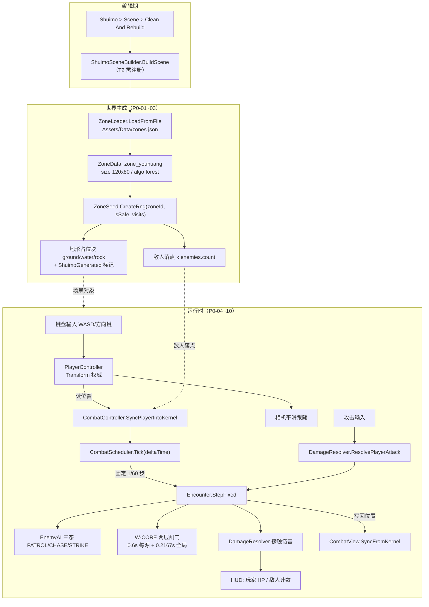

# T2 阶段 PRD —— 可玩垂直切片（Playable Vertical Slice）

> 文档类型：简单 PRD（不含竞品分析 / 市场定位）
> 撰写：许清楚（产品经理）
> 版本：v1.1
> 状态：已进入实现与 QA 验收阶段

---

## 修订记录

| 版本 | 变更 | 依据 |
|---|---|---|
| v1.0 | 初版 | — |
| v1.1 | **Q5 玩家攻击 `raw` 由 25 下调至 12**（冷却 0.4s / 半径 70 / 张角 90° 不变） | 实算 `zone_youhuang` 敌人 HP 30~45、护甲 1~3（`hp_mult=1.0` / `armor_add=0`，仅精英与 ironhide 词缀叠甲）。减法承伤下 `real = max(1, 12 − armor) ≈ 9~11`，三到四刀一只；原 25 会两刀一只，打击感塌成割草。PM 确认接受。<br/>**验收一律以 raw=12 为准。** |
| v1.1 | **Q11 攻击键位追加 Space 为第三路** | 实现为 `Fire1（鼠标左键）+ J + Space` 三路取或，PRD 原要求「J + 鼠标左键」双路已全覆盖，Space 属额外便利键。<br/>注意采用 `GetButton`/`GetKey` 而非 `...Down`，**按住不放会按冷却连续挥砍**，此为有意设计。 |

---

## 0. 项目信息

| 项 | 值 |
|---|---|
| 项目名 | `shuimofeng`（水墨风 2D 开放世界动作仙侠 RPG） |
| 工程路径 | `F:\AI-project\ancientGame\shuimofeng\shuimofeng` |
| 引擎版本 | Unity 2022.3.62f3c1 |
| 语言 | C#（.NET Standard 2.1）+ Newtonsoft.Json |
| 本阶段 | T2 · 可玩垂直切片 |
| 前置依赖 | T0 Core（57/57 对拍 PASS）、T1 Combat（63/63 对拍 PASS），均已迁入 Unity 且 NUnit 通过 |
| 美术约束 | **本阶段不做美术**。全部使用 Unity 原生占位图形（Sprite 纯色方块 / 圆形 / Primitive），禁止引入任何外部美术资源 |

### 原始需求复述

把 T0（世界/区域/难度）与 T1（战斗内核）这两层「看不见的纯逻辑」，第一次串成一个**能用键盘真正操作起来的 Unity 场景**：玩家能走、相机能跟、世界能按种子生出来、敌人能站在世界里并追着打、战斗数值能真实结算，并且这一整套世界要能通过已有的 `Shuimo > Scene > Clean And Rebuild` 菜单一键重建。

---

## 1. 产品目标

T2 的唯一使命是**打通"逻辑 → 可玩"的最后一公里**：让 T0/T1 已验收的确定性内核第一次拥有可被人眼观察、被手指操作的载体，从而把此前只能靠 Python 对拍与 NUnit 断言验证的正确性，升级为「策划/开发能亲手摸出手感对不对」的可玩形态。具体拆成三个正交目标——**（G1）可操作性**：玩家能用键盘在一张按种子生成的地图上自由移动，相机稳定跟随，全程无卡顿无穿帮；**（G2）内核可观测性**：T1 的三态 AI（PATROL/CHASE/STRIKE）、W-CORE 两层承伤闸门、减法承伤与击退硬直，其行为必须在屏幕上肉眼可辨且与内核数值严格一致，让内核从"测试通过"变成"看得见是对的"；**（G3）迭代闭环**：世界生成逻辑全部收敛进 `ShuimoSceneBuilder.BuildScene`，改一行代码后点一次菜单即可重建整个世界，不必删 `Library`、不必重启编辑器，为 T3 及以后的高频调优建立地基。**本阶段不追求好看、不追求内容量、不追求完整玩法闭环**——凡是与"证明内核能跑起来"无关的需求，一律后置。

---

## 2. 用户故事

| # | 用户故事 | 对应目标 |
|---|---|---|
| US-1 | 作为**开发者**，我想要在 Unity 里按下 WASD 就能看到角色在地图上平滑移动、相机稳稳跟着，以便我确认坐标系、单位换算和输入链路是通的，而不是只能盯着单元测试的数字猜。 | G1 |
| US-2 | 作为**策划**，我想要看到敌人真的从远处追过来、贴脸前会先站定蓄力再突刺，以便我用眼睛验收 T1 三态 AI 的节奏（0.35s 蓄力窗口 / 3.2 倍速突进 / 3.5s 冷却）是否和 Godot 原型的手感一致。 | G2 |
| US-3 | 作为**策划**，我想要被一群怪围住时明显比被一只怪打时掉血更快、但快得有上限，以便我确认 W-CORE 的「2.53x 围攻倍率」不是一个纸面数字，而是真实可感知的战斗压力。 | G2 |
| US-4 | 作为**开发者**，我想要输入同一个区域种子就能重建出**逐格相同**的地图与敌人布局，以便我复现任何一个 bug 现场，也为将来的存档/回放打下确定性基础。 | G1 · G3 |
| US-5 | 作为**开发者**，我想要改完生成代码后点一下 `Shuimo > Scene > Clean And Rebuild` 就能看到新世界，以便我把「改代码 → 看效果」的循环压到十几秒，而不是每次都删 Library 等重导入。 | G3 |

---

## 3. 运行时架构（需求视角）

> 此图描述 T2 需要打通的**数据流向**，不是实现方案，具体分层由架构师定夺。



### 3.1 已具备 vs 待补齐（现状盘点）

| 能力 | 现状 | T2 需要做什么 |
|---|---|---|
| 区域数据加载 | ✅ `ZoneLoader` 已完成，6 个区域全部可解析 | 只需调用 |
| 确定性随机 | ✅ `PCG32` + `ZoneSeed.CreateRng` | 只需调用 |
| 地形算子链执行 | ❌ **完全没有**。`ZoneData.Theme.Operators`（vein/grove/scatter/noise_blob/lake/ring）只有数据结构，无任何执行代码 | **需新建**（P0 做简化版，完整版见 P2-01 / Q6） |
| 敌人 AI | ✅ `EnemyAI` 三态完整 | 只需接线 |
| 敌→玩家接触伤害 | ✅ `Encounter.StepFixed` ⑤ + `DamageResolver.ResolveContact` | 只需接线 |
| 玩家→敌人伤害 | ⚠️ 内核入口 `DamageResolver.ResolvePlayerAttack(player, target, raw, ev)` **已存在**，但 `raw`（技能伤害公式）T1 明确注明「属于 T2 的数值层」 | **需定义最小伤害值 + Unity 侧攻击输入与命中判定** |
| 敌人视图同步 | ✅ `CombatView.SyncFromKernel` + `CombatController.AttachView` | 需提供占位 prefab |
| 玩家角色 | ❌ 无。`CombatController` 只有 `playerTransform` 字段，且明确规定「玩家由 Unity 侧移动，内核只读位置」 | **需新建 PlayerController** |
| 相机跟随 | ❌ 无 | **需新建** |
| HUD | ❌ 无。`Combatant.HpRatio()` / `CombatView.PoiseRatio()` 已就绪，但无任何 UI | **需新建** |
| Shuimo 重建接入 | ⚠️ `ShuimoSceneBuilder.BuildScene` 是空的 `static Action` | **需注册**（注意：菜单在 Editor 域触发，注册必须走 `[InitializeOnLoadMethod]`，否则点菜单无反应） |

### 3.2 内核关键常量（不得修改，供需求验收对照）

| 常量 | 值 | 含义 |
|---|---|---|
| `TOUCH_RANGE` | 44 | 敌人对玩家的接触伤害判定半径 |
| `AI_STRIKE_DIST` | 160 | 进入 STRIKE 的距离阈值 |
| `AI_LEASH_DIST` | 480 | 超出即脱战回锚 PATROL |
| `AI_STRIKE_WINDUP` / `DASH` / `CD` | 0.35s / 0.25s / 3.5s | 蓄力 / 突进 / 冷却 |
| `AI_STRIKE_SPEED_MULT` / `DMG_MULT` | 3.2 / 1.5 | 突进提速 / 突进增伤 |
| `EnemyAI.SpeedBase` | 70 | 敌人基础移速（单位/秒） |
| `PerSourceHitCd` / `GlobalHitGap` | 0.6s / 0.2167s | W-CORE 两层闸门 |
| `CombatScheduler.FixedStep` | 1/60 | 内核固定逻辑步长 |
| `Encounter.MaxEnemies` | 32 | 场上敌人硬上限 |

> ⚠️ 上述距离单位在 Godot 原型中是**像素**，而 `zones.json` 的 `theme.size` 单位是 **tile**。二者的换算关系目前**未定义**，见 Q1——这是 T2 最高优先级的待确认问题。

### 3.3 切片选用区域

| 字段 | 值 | 理由 |
|---|---|---|
| `zone_id` | `zone_youhuang`（幽篁） | 第一个**战斗区**（`is_safe=false`），有敌人有 BOSS，能完整覆盖战斗链路。Hub 区 `zone_fangshi` 是安全区不刷怪，不适合验证战斗 |
| `theme.size` | `[120, 80]` tile | 6 个区域尺寸完全一致，换算一次全区通用 |
| `theme.algo` | `forest` | 算子链 `vein → grove → scatter`，是 6 个区里第二简单的（最简单的 `town` 走手绘布局不走算子） |
| `enemies.count` | 6 | 远小于 `MaxEnemies=32`，安全 |
| `enemies.kinds` | `blood`（血煞）/ `witch`（巫蛊） | 2 种，占位可用 2 种颜色区分 |
| `base_level` | 3 | 低等级，数值温和，便于观察 |
| `boss` | `boss_zhuxiaowang`（竹梢王） | BOSS 归入 P1，本阶段不强制 |

---

## 4. 需求池

> **优先级定义**：P0 = 必须有，缺任何一条则切片不成立；P1 = 重要，缺失不阻塞验收但体验残缺；P2 = 可选增强，时间允许再做。
> **验收标准**均要求可被人工在 Unity Editor 中当场复核。

### 4.1 P0 · 必须（本切片核心）

| 编号 | 需求描述 | 验收标准 |
|---|---|---|
| **T2-P0-01** | **Shuimo 重建管线接入**。将世界生成入口注册到 `ShuimoSceneBuilder.BuildScene`，注册时机必须保证 Editor 菜单可触发。所有生成出的根节点必须挂 `ShuimoGenerated` 标记组件。 | ① 点击 `Shuimo > Scene > Clean And Rebuild`，Console 输出「场景已清理并重建」且场景中出现完整世界；② 连点两次，场景不出现重复对象堆叠；③ 点击 `Clean Generated Objects` 后世界被完全清空，而相机/灯光/手工摆放对象**一个不少**；④ 重启 Unity Editor 后菜单依然生效（验证 `[InitializeOnLoadMethod]` 注册路径）。 |
| **T2-P0-02** | **区域数据加载**。通过 `ZoneLoader` 从 `Assets/Data/zones.json` 读取区域库，取 `zone_youhuang`；区域 id 与访问次数 `visits` 需在 Inspector 可配。 | ① 读取成功，Console 打印区域名「幽篁」、尺寸 120×80、敌人数 6、base_level 3；② 故意写错 zone_id 时给出明确报错而非静默空场景；③ 不得硬编码任何 zones.json 里已有的数值。 |
| **T2-P0-03** | **地形占位生成（确定性）**。基于 `ZoneSeed.CreateRng(zoneId, isSafe, visits)` 生成 120×80 的地格数据，至少区分 `ground` / `water` / `rock` 三类，占比向 `theme.water_rate` / `rock_rate` 靠拢；每格渲染为一个纯色占位方块（颜色取自 `theme.palette` 的 `#RRGGBB`）。 | ① 同一 `zoneId + visits` 连续重建 2 次，地图**逐格完全一致**（可用截图比对或格类型计数比对）；② 改变 `visits` 后地图明显不同；③ 水/岩占比与配置目标偏差 ≤ ±5 个百分点；④ 世界边界清晰可辨，玩家不会看到"地图外的虚空"。 |
| **T2-P0-04** | **玩家角色与移动**。生成一个占位玩家对象（区别于敌人的颜色/形状），支持 WASD + 方向键的 8 向移动，斜向速度需归一化（不得比直向快 41%）。移动速度作为可配常量暴露在 Inspector。 | ① 8 个方向均可移动且斜向不加速；② 松开按键立即停止（无惯性滑行，除非被击退）；③ 玩家不会走出地图边界；④ 60fps 与 144fps 下移动**手感一致**（同样时长走过同样距离）。 |
| **T2-P0-05** | **相机跟随**。正交相机平滑跟随玩家（阻尼跟随，非硬贴），并在世界边界处钳制，避免镜头越界露出背景。 | ① 玩家快速变向时镜头平滑无抖动、无高频抽搐；② 玩家走到地图四角时镜头停在边界内，画面不出现地图外空白；③ 相机视野内至少能同时看到玩家与 `AI_STRIKE_DIST`(160) 范围外的来袭敌人，保证玩家有反应余地。 |
| **T2-P0-06** | **敌人生成**。按 `zone.enemies.count`(6) 在世界中生成敌人，数值经 `DifficultyBridge.BuildEnemy` 构造（等级由 `DifficultyBridge.RollLevel(base_level, rng)` 掷出），并为每只敌人挂 `CombatView`。落点必须落在可站立区域。 | ① 场上恰好 6 只敌人；② 敌人等级落在 `base_level + [-1, +2]` = 2~5 区间内；③ 精英怪（`elite_rate`）以不同视觉标识区分（如更大尺寸/描边色）；④ 同种子重建后敌人**落点与等级完全一致**；⑤ 敌人不会生成在玩家出生点 `AI_STRIKE_DIST`(160) 以内（避免开局即被围）。 |
| **T2-P0-07** | **战斗内核驱动接线**。场景中挂载 `CombatController`，正确注入 `playerTransform` / `enemyRoot` / `enemyPrefab`，并调用 `SetZoneConfig(enemies, boss, baseLevel)`；由其 `Update` 驱动 `CombatScheduler.Tick(Time.deltaTime)`。 | ① 运行后敌人开始按 `EnemyAI` 移动，不再静止；② 内核 `Encounter.StepCount` 每秒增长约 60（可用调试 HUD 观察）；③ 主动限帧到 30fps 与放开到 144fps，内核步数增速仍稳定在 ~60/s（验证帧率无关）。 |
| **T2-P0-08** | **三态 AI 行为可见 + 接触伤害生效（敌 → 玩家）**。敌人须表现出 CHASE 追击（带 ±35° 侧偏，怪群不叠成一条线）、STRIKE 蓄力后突进、超出牵引距离后 PATROL 回锚；接触后玩家按 W-CORE 闸门掉血。 | ① 玩家静止时，多只敌人从不同角度包抄而非叠成一点；② 敌人贴近至 160 内会**先站定 0.35s 再高速突进**，肉眼可辨；③ 玩家跑开超过 480 后敌人掉头回原位并在出生点 20 单位内停下；④ 单只怪贴身时玩家掉血频率约 1.7 次/秒；⑤ 被 4 只以上围住时掉血频率约 4.3 次/秒（≈2.53 倍），且**不随敌人数继续增加而上升**。 |
| **T2-P0-09** | **玩家攻击（玩家 → 敌人）**。提供一个攻击输入（键位见 Q12），在玩家朝向的判定范围内命中敌人时调用 `DamageResolver.ResolvePlayerAttack`；需定义本阶段最小可用的 `raw` 伤害值与攻击冷却（T1 已明确该公式属 T2 数值层）。 | ① 按下攻击键后命中范围内敌人扣血，血量变化与减法承伤模型一致（`raw - armor`，且不低于地板值 1）；② 敌人血量归零后从场上消失，且其 `CombatView` 被销毁不留残留 GameObject；③ 击破韧性时敌人出现可见的硬直 + 击退位移；④ 未破韧时敌人**不被击退**（验证霸体机制）；⑤ 6 只敌人可被全部清空，清空后场上无报错。 |
| **T2-P0-10** | **最小 HUD**。屏幕固定位置显示：玩家 HP 条（含数值）、场上剩余敌人数、当前区域名、以及调试信息（当前 seed / 内核步数 / FPS）。 | ① 玩家受击时 HP 条实时下降且与 `Player.Hp` 数值一致；② 击杀敌人后剩余数立即递减；③ HUD 在不同分辨率（16:9 / 16:10 / 4:3）下不错位不遮挡玩家；④ 调试信息可通过一个开关整体隐藏。 |
| **T2-P0-11** | **零美术资源约束**。全部视觉元素由代码在运行/编辑期生成（纯色 Sprite、Unity 内置 Primitive、`Sprites-Default` 材质），不得引入任何图片/模型/字体外部资源文件。 | ① 工程内除既有的 `zones.json` / `codex.json` 外，`Assets` 下**不新增任何二进制美术资源**；② 在一台全新 clone 的机器上打开工程，场景重建后视觉表现完全一致（无 Missing Sprite / 粉色材质）。 |

### 4.2 P1 · 重要（体验完整性）

| 编号 | 需求描述 | 验收标准 |
|---|---|---|
| **T2-P1-01** | **敌人头顶血条 + 韧性条**。复用 `CombatView.HpRatio()` / `PoiseRatio()`，在敌人上方绘制两条细条；血条随镜头保持水平（`KeepUiUpright` 已有实现）。 | 血条/韧性条数值与内核一致；敌人翻转/缩放时条不镜像；死亡时随视图一并销毁。 |
| **T2-P1-02** | **STRIKE 蓄力预警可视化**。为敌人 prefab 挂上 `CombatView.windupTell` 挂点，蓄力相位（仅 WINDUP，不含 DASH）显形一个醒目标记。 | 预警**只在 0.35s 蓄力期显示**，突进开始即隐藏（验证 D-3 早亮问题未复现）；玩家可依据预警提前走位躲开突进。 |
| **T2-P1-03** | **受击反馈**。玩家/敌人受击时播放 `CombatView.PlayHitFlash()` 闪白；击退位移与硬直有明确视觉表现。 | 每次实际生效的伤害（`ResolveContact` 返回 true）都有闪白；被闸门拦下的无效攻击**不闪白**（这是 W-CORE 是否正确接线的关键观测点）。 |
| **T2-P1-04** | **BOSS 生成与三阶段**。调用 `CombatController.SpawnBoss`，接入 `boss_zhuxiaowang`；表现 P1/P2/P3 阶段切换（P2 提速+召唤、P3 增伤+冲击波）。 | BOSS 血量降至 65% / 30% 时可观测到阶段切换；P2 每 8s 召唤 2 只小怪且不突破 `MaxEnemies=32`；P3 冲击波（半径 200）对范围内玩家造成伤害。 |
| **T2-P1-05** | **地形碰撞**。`rock` / `water` 格不可通行，玩家与敌人均受阻挡。 | 玩家无法穿越岩石/水面；敌人 CHASE 时不会卡在障碍上无限抖动（至少有基础绕行或贴墙滑动）。 |
| **T2-P1-06** | **死亡与重生**。玩家 HP 归零时暂停战斗、显示提示，可一键重生（回出生点满血，`WCore.FullRestore()` + `Encounter` 重置）。 | 死亡后敌人停止结算伤害；重生后 W-CORE 冷却表被清空（防止「新怪打不动我」的静默 bug）；重生后可继续正常战斗。 |
| **T2-P1-07** | **区域切换**。Inspector 下拉可在 6 个区域间切换并重建世界；Hub 区（`zone_fangshi`, `is_safe=true`）正确表现为**不刷怪**。 | 6 个区域均能成功生成且不报错；安全区敌人数为 0；切区时 `WCore.Reset()` 被调用。 |
| **T2-P1-08** | **调试 Gizmos**。启用 `CombatController.drawGizmos`，在 Scene 视图绘制 `TOUCH_RANGE`(44) / `AI_STRIKE_DIST`(160) / `AI_LEASH_DIST`(480) 三个半径圈。 | 三圈半径与常量严格一致，可用于目视校验 Q1 的 tile↔单位换算是否合理。 |

### 4.3 P2 · 可选增强

| 编号 | 需求描述 | 验收标准 |
|---|---|---|
| **T2-P2-01** | **完整地形算子链**。在 Core 层实现 `noise_blob` / `vein` / `scatter` / `lake` / `ring` / `grove` 六种算子，按 `theme.operators` 顺序应用，替换 P0-03 的简化生成。 | 6 个区域地貌可明显区分（森林/火山/冰湖/剑冢/魔渊）；纯逻辑实现（`noEngineReferences=true`）；可接入 Python 对拍。 |
| **T2-P2-02** | **NPC 占位**。Hub 区按 `zone.npcs[].tile` 放置 5 个 NPC 占位块，靠近时显示名字。 | 5 个 NPC 站位与 json 配置的 tile 坐标一致。 |
| **T2-P2-03** | **装饰物占位**。按 `theme.decor.kind` / `density` 撒布小尺寸占位装饰。 | 密度与配置一致；不影响碰撞与性能。 |
| **T2-P2-04** | **玩家闪避**。接入 `WCoreState.DodgeEnabled` / `DodgeRoll`，闪避成功给 0.25s 短无敌。 | 默认**关闭**（对拍基线要求 R3）；开启后闪避成功有明确视觉反馈。 |
| **T2-P2-05** | **简易小地图**。角落显示 120×80 缩略图，标注玩家与敌人位置。 | 位置映射准确；不显著影响帧率。 |
| **T2-P2-06** | **PlayMode 冒烟测试**。自动化脚本：加载区域 → 生成世界 → 模拟移动 → 触发接触 → 断言掉血频率。 | 可在 Unity Test Runner 的 PlayMode 下一键跑通；断言围攻/单挑频率比落在 2.53 ± 0.1 区间。 |

---

## 5. UI 设计稿

### 5.1 游戏内场景布局（Game 视图）

```
┌────────────────────────────────────────────────────────────────────────────┐
│ ┌──────────────────────────┐                          ┌──────────────────┐ │
│ │ 幽 篁                     │                          │ 敌人剩余  6      │ │  ← HUD 顶部条
│ │ ▓▓▓▓▓▓▓▓▓▓▓░░░░░  238/260│                          │ Lv.3 战斗区      │ │     (Screen Space Overlay)
│ └──────────────────────────┘                          └──────────────────┘ │
│   玩家 HP 条（红/绿）+ 数值                                区域信息           │
│                                                                            │
│                                    ╱ ╲                                     │
│                        ▒▒▒▒▒▒    ╱ 敌 ╲  ← CHASE 中，带 ±35° 侧偏           │
│                        ▒岩石▒     ╲ 2 ╱     占位：红色圆形                   │
│                        ▒▒▒▒▒▒      ╲ ╱      头顶：血条▬▬▬ / 韧性条▭▭▭ (P1)   │
│                                                                            │
│                                                                            │
│              ╔═══╗                    ┌ ─ ─ ─ ─ ─ ─ ─ ─ ┐                  │
│              ║ 敌 ║ ← STRIKE 蓄力中     │   AI_STRIKE_DIST │                 │
│              ║ 1 ║   站定 0.35s        │      r = 160      │  ← Gizmo (P1)  │
│              ╚═══╝   预警标记闪烁 (P1)  └ ─ ─ ─ ─ ─ ─ ─ ─ ┘                  │
│                          ↘                                                 │
│                            ↘         ◆                                     │
│      ~~~~~~~~                 ↘   ◆玩家◆   ← 蓝色方块 / 屏幕中心附近          │
│      ~ 水面 ~                    ↘  ◆       WASD 8 向移动                   │
│      ~~~~~~~~                       攻击判定范围 (P0-09)                     │
│                                                                            │
│                                                    ╱ ╲                     │
│                                                   ╱ 敌 ╲                    │
│           ░░░░░░░░░░░░░░░░░░░░░░░░░░░░░░░░        ╲ 3 ╱                    │
│           ░░  ground 地面占位块（浅色）  ░░         ╲ ╱                      │
│           ░░  取色自 theme.palette      ░░                                  │
│           ░░░░░░░░░░░░░░░░░░░░░░░░░░░░░░░░                                  │
│                                                                            │
│ ┌────────────────────────────┐                                             │
│ │ seed: 0x7A3F91C2           │                                             │
│ │ step: 4821   fps: 143      │  ← 调试面板（左下，可一键隐藏）                 │
│ │ zone: zone_youhuang v1     │                                             │
│ └────────────────────────────┘                                             │
└────────────────────────────────────────────────────────────────────────────┘
             ↑ 正交相机阻尼跟随玩家，四边在世界边界处钳制
```

### 5.2 占位视觉规范（无美术资源）

| 元素 | 占位形状 | 颜色来源 | 尺寸 | 说明 |
|---|---|---|---|---|
| 地面 `ground` | 正方形 Sprite | `theme.palette.ground` / `ground2` 交替 | 1 tile | 两色交替做斑驳感，避免大片死板纯色 |
| 水面 `water` | 正方形 Sprite | `theme.palette.water` | 1 tile | P1 起不可通行 |
| 岩石 `rock` | 正方形 Sprite | `theme.palette.rock` | 1 tile | P1 起不可通行 |
| 玩家 | 方块 / 菱形 | 固定蓝色（与任何 palette 都有对比度） | ≈ 0.8 tile | 需带朝向指示（小三角/短线），供攻击方向判定 |
| 普通敌人 | 圆形 | `blood` 暗红 / `witch` 紫色 | ≈ 0.8 tile | 按 `kind` 区分颜色 |
| 精英敌人 | 圆形 + 描边 | 同上 + `palette.accent` 描边 | ≈ 1.1 tile | 放大 + 描边双重标识 |
| BOSS (P1) | 大圆形 | `palette.accent` | ≈ 2.0 tile | 阶段切换时改变描边色 |
| 蓄力预警 (P1) | 圆环 / 惊叹号 | 高饱和黄 | 敌人上方 | 仅 WINDUP 相位显示 |
| HUD | uGUI Text + Image | 半透明黑底 + 白字 | — | Screen Space Overlay，锚定四角 |

### 5.3 HUD 元素锚定

| 区域 | 内容 | 锚点 | 优先级 |
|---|---|---|---|
| 左上 | 区域名（中文）、玩家 HP 条 + `当前/上限` | Top-Left | P0 |
| 右上 | 剩余敌人数、区域等级/难度 tier | Top-Right | P0 |
| 左下 | 调试面板：seed / 内核步数 / FPS / zone_id | Bottom-Left | P0（可隐藏） |
| 右下 | 操作提示（WASD 移动 / 攻击键） | Bottom-Right | P1 |
| 屏幕中央 | 死亡提示 + 重生按钮 | Center | P1 |

---

## 6. 待确认问题

> 按阻塞程度排序。**Q1~Q5 属于开工前必须敲定**，否则实现方向会走偏并产生返工。
> 每条均附「我的推荐方案」，若无异议可直接按推荐执行。

| # | 问题 | 影响面 | 我的推荐 | 需谁定 |
|---|---|---|---|---|
| **Q1** ★ | **tile ↔ 世界单位的换算是多少？** `zones.json` 的 `size=[120,80]` 单位是 tile，而 T1 全部战斗常量（`TOUCH_RANGE=44` / `STRIKE_DIST=160` / `LEASH_DIST=480` / 敌人速度 70）单位是 Godot 像素。若 1 tile = 32px，则整图为 3840×2560px，牵引距离 480px 恰好 = 15 tile，比例合理；若 1 tile = 1 unit 而战斗常量原样照搬，则牵引距离会变成 480 tile（远超整张 120 tile 的图），AI 将永远不会脱战。 | **全部距离/速度/相机/碰撞体尺寸**，错了就要全盘返工 | **1 tile = 32 世界单位，且 Unity 采用 1 unit = 1 Godot 像素**（PPU=1 或统一缩放）。理由：能让 T1 常量**原样复用、零改写**，从而保住 Godot 原型验收过的手感与 63/63 对拍结论。整图 = 3840×2560 单位，相机正交 size ≈ 360（视野约 1280×720 单位 = 40×22 tile），符合 5.1 图中"能提前看到来袭敌人"的要求。 | 架构师 + 用户 |
| **Q2** ★ | **玩家移动是网格步进还是自由连续？** | 输入手感、碰撞方案、AI 追击表现 | **自由连续移动（8 向，斜向归一化）**。理由：T1 内核的接触判定 `Position.DistanceTo() <= 44` 与 AI 的 ±35° 侧偏、3.2 倍速突进都是**连续距离模型**；改成网格步进会让"蓄力—突进—走位躲避"这一核心攻防节奏彻底失效。地图数据仍保持 tile 网格（只用于地形与碰撞），移动本身不吸附格子。 | 用户 |
| **Q3** ★ | **战斗是"实时同场景"还是"触发后切战斗场景（回合制）"？** 任务书写的是「玩家靠近/触发后进入战斗」，但内核实际是**实时接触伤害**模型。 | 整个玩法骨架 | **实时同场景，无战斗切场景**。理由：`Encounter.StepFixed` 每 1/60 秒跑一次「AI 移动 → 接触判定 → 伤害结算」，W-CORE 的两层闸门（0.6s/0.2167s）本质是**实时 DPS 天花板**，回合制下毫无意义；三态 AI 的牵引/脱战也只有在开放地图连续空间中才成立。所谓"进入战斗"应理解为：敌人进入 `LEASH_DIST=480` 后转 CHASE、进入 `TOUCH_RANGE=44` 后开始扣血——**这已经是内核自带的行为，无需额外的战斗状态机**。 | 用户（这是玩法定位问题） |
| **Q4** ★ | **玩家移动速度取多少？** 内核中敌人 `SpeedBase = 70`，玩家速度无任何定义。 | 追逐/风筝手感、脱战难度 | **180~220 单位/秒**（建议先取 200，约为敌人的 2.86 倍）。理由：需保证玩家能拉开 `LEASH_DIST=480` 完成脱战（200 vs 70 时约 7 秒拉开），但又不能快到能轻松走出 `STRIKE` 突进（3.2×70 = 224 单位/秒）——玩家 200 略低于突进速度，突进因此始终具备威胁，需靠**预判走位**而非纯拼速度躲避。**Godot 原型若已有此数值，一律以原型为准。** | 用户 / 架构师 |
| **Q5** ★ | **玩家攻击的 `raw` 伤害如何计算？** `DamageResolver.ResolvePlayerAttack` 的注释明确写着「具体的技能伤害公式属于 T2 的数值层」，目前是空缺。 | 能否杀死敌人、战斗时长 | T2 只做**最简常量 + 冷却**：`raw = 25`（固定）、攻击冷却 0.4s、判定为玩家朝向 90° 扇形 / 半径 70。理由：`zone_youhuang` 的 base_level 3 敌人 HP 约百级别，25 伤害约需 4~6 刀击杀，节奏合适；完整的攻击力/暴击/属性公式应留给 T3 的数值层，T2 不越界。**具体数值请架构师结合 `DifficultyBridge.BuildEnemy` 实算的敌人 HP 复核。**<br/>**✅ v1.1 已定案：`raw = 12`**（非 25）。实算敌人 HP 30~45 而非"百级别"，25 会两刀一只塌成割草。冷却 0.4s / 半径 70 / 张角 90° 维持不变。 | 架构师 |
| **Q6** | **地形生成走完整算子链还是简化占位？** `theme.operators`（vein/grove/scatter/noise_blob/lake/ring）目前**零实现**，完整实现是一个独立的中等工作量模块。 | T2 工期、地图观感 | **P0 先做简化版**：仅用 PCG32 按 `water_rate` / `rock_rate` 洒点 + 简单聚团 + 边界墙，保证确定性与可通行性即可；**完整算子链列为 P2-01 或推迟到 T3**。理由：T2 的目标是"证明能跑起来"，地图好不好看不在验收项内；且完整算子链应写在 Core 层并接入 Python 对拍，那是一个应当独立立项的任务。 | 架构师 |
| **Q7** | **敌人落点用哪种策略？** 现有 `CombatController.SpawnWave(center, minRadius, maxRadius)` 是**围绕玩家的圆环撒点**（适合"刷一波怪"），而开放世界更自然的是**按地图可行走格分布**。 | 世界感、复用现成 API 的成本 | **P0 沿用 `SpawnWave` 圆环撒点**（`minRadius=200`，`maxRadius=600`，恰好覆盖 STRIKE 距离外、牵引距离内），零改动直接复用；**按地图格分布列入 P1**。同时须做落点合法性校验（不落在岩石/水面）。 | 架构师 |
| **Q8** | **输入系统用旧版 Input Manager 还是 New Input System？** | 依赖包、代码写法 | **旧版 `Input.GetAxisRaw`**。理由：T2 只需 WASD + 一个攻击键，旧版零配置零依赖；引入 New Input System 需要装包 + 建 InputActions 资产，与"不引入外部资源"的精神相悖，收益为零。 | 架构师 |
| **Q9** | **世界是"编辑期落地到场景"还是"运行时动态生成"？** `ShuimoSceneRebuilder` 用的是 `DestroyImmediate` + `MarkSceneDirty`，是**编辑期**行为；但 `CombatController.Awake` 又是**运行时**逻辑。 | 场景文件体积、工作流 | **两条路都要通**：编辑期点菜单生成地形+玩家+敌人占位（便于目视检查与调参）；进入 Play 模式时若场景中无已生成世界则自动生成一次。注意 120×80 = **9600 个地格对象**，编辑期全部落地会让 `.unity` 场景文件急剧膨胀——建议地形层用**单个 Mesh / Tilemap / 或 SpriteRenderer 合批**而非 9600 个 GameObject（此为架构师的实现选型）。 | 架构师 |
| **Q10** | **T2 用哪个区域做切片？** | 验收范围 | **`zone_youhuang`（幽篁）**，理由见 §3.3。若用户希望优先看 Hub 城镇，则需追加 `town` 手绘布局需求（当前 `algo=town` 明确"忽略 operators"，走的是另一套生成逻辑，工作量独立）。 | 用户 |
| **Q11** | **攻击键位与判定形状？** | 手感 | 键位 `J`（兼容 Godot 原型习惯）+ 鼠标左键双绑；判定为**玩家朝向 90° 扇形，半径 70**（略大于 `TOUCH_RANGE=44`，让玩家能在被贴脸前先手出招）。玩家朝向取"最后一次移动方向"。<br/>**✅ v1.1 已实现：`Fire1`（鼠标左键）+ `J` + `Space` 三路取或**，双绑要求已满足，Space 为额外便利键。采用 `GetButton`/`GetKey`，按住不放按冷却连续挥砍（有意设计）。 | 用户 |
| **Q12** | **BOSS 是否纳入 T2 验收？** | 工期 | **不纳入 P0，列为 P1**。理由：BOSS 三阶段（召唤/冲击波）涉及较多表现层工作，而普通敌人已足以验证 T1 内核全部核心路径（三态 AI + W-CORE + 减法承伤 + 击退硬直）。 | 用户 |
| **Q13** | **确定性的验收方式？** 「同种子同世界」需要一个可执行的比对手段。 | 验收可操作性 | 提供一个调试命令：把当前地格类型统计 + 敌人（id, 等级, 落点, 精英/词缀）导出为文本，两次重建后做文本 diff。低成本且比截图比对可靠得多。 | 架构师 |

---

## 7. 验收总清单（Definition of Done）

T2 视为完成，需同时满足：

- [ ] P0-01 ~ P0-11 **全部**通过验收标准
- [ ] `Shuimo > Scene > Clean And Rebuild` 可重复执行，无重复堆叠、无残留、无报错
- [ ] 同一 seed 重建两次，地形与敌人布局**完全一致**（Q13 的 diff 方式）
- [ ] 在 30 / 60 / 144 fps 三档帧率下，移动手感与承伤频率**一致**（内核帧率无关性未被破坏）
- [ ] 单挑掉血 ≈ 1.7 次/秒、围攻（≥4 只）≈ 4.3 次/秒，比值 ≈ 2.53
- [ ] 6 只敌人可被全部击杀，清场后无异常
- [ ] Console 全程**无 Error、无 Exception**（Warning 需逐条说明原因）
- [ ] 既有 NUnit 测试（`WCoreTests` / `CombatKernelTests`）**仍然全绿**——T2 不得为了接线而修改任何纯逻辑层代码
- [ ] `Xianxia.Core` / `Xianxia.Combat` 两个程序集的 `noEngineReferences=true` **保持不变**（架构红线）

---

## 8. 明确的非目标（Out of Scope）

以下内容**不在 T2 范围**，如有需求请另行立项：

- 任何美术资源（贴图/模型/动画/特效/音频/字体）
- 水墨风格化渲染、后处理、Shader
- 存档/读档、任务系统、对话系统、背包、装备、锻造、境界修炼
- 完整的地形算子链（列为 P2-01 / 建议 T3）
- 多区域无缝衔接、开放世界流式加载
- 玩家技能树、多段连招、位移技
- 联机、UI 美化、本地化、性能深度优化
- 打包出可执行文件（Editor 内可玩即可）

---

*v1.0 原注：本 PRD 待「§6 待确认问题」中 Q1~Q5 确认后方可进入架构设计与开发。*
*v1.1 更新：Q1~Q5 已确认，实现与 QA 验收进行中。凡实现与本文数值不一致处，以顶部「修订记录」为准。*
