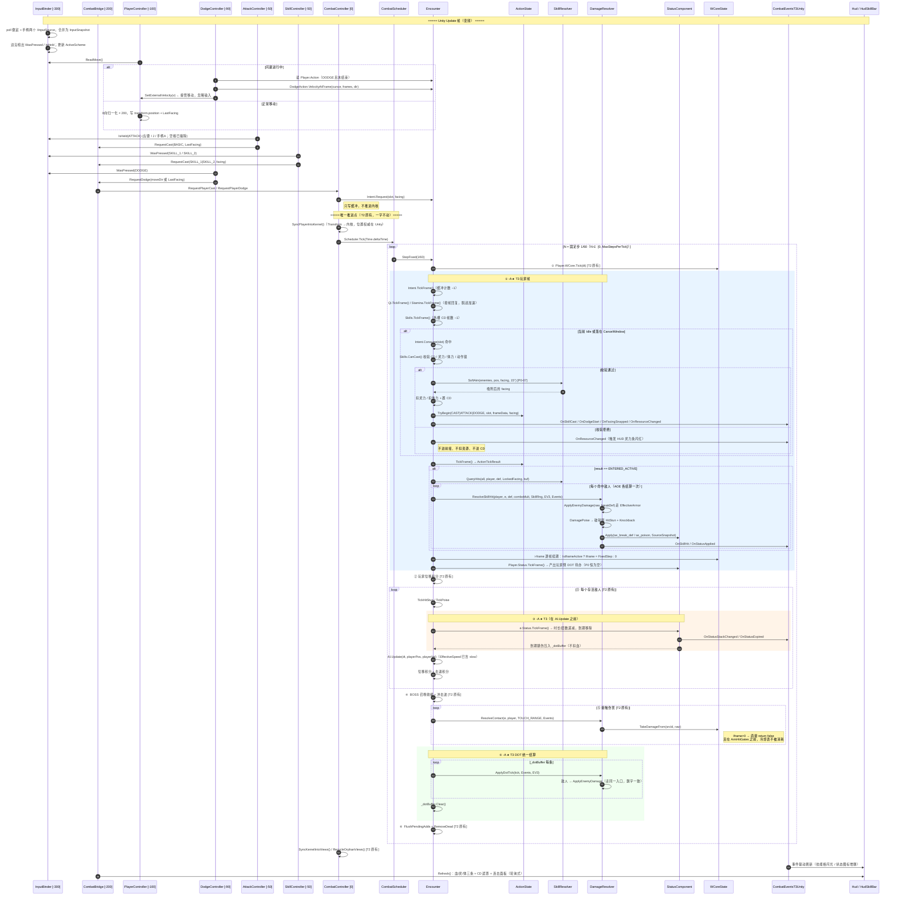
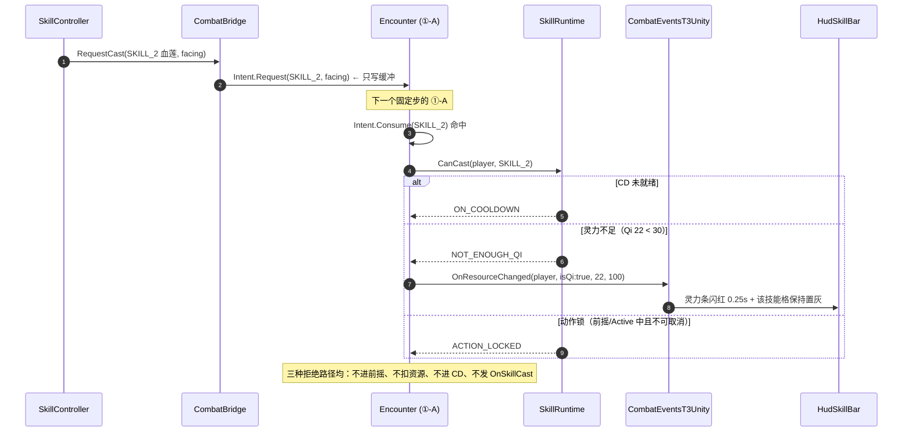
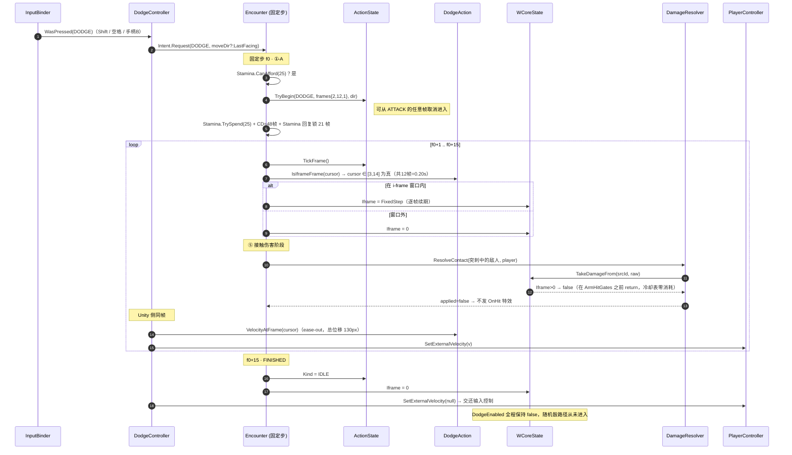

# T3 阶段架构设计 + 任务分解 —— 战斗系统深化（Combat Depth）

> 文档类型：系统架构设计（含任务分解）
> 撰写：高见远（架构师 software-architect）
> 版本：v1.0
> 工程：Unity 2022.3.62f3c1 · C# (.NET Standard 2.1) · `F:\AI-project\ancientGame\shuimofeng\shuimofeng`
> 输入：T3 PRD（`docs/unity-t3-prd.md` v1.0）、T2 架构（`docs/unity-t2-architecture.md` v1.0 含 §9 U1 修复记录）、T0/T1/T2 真实源码通读
> 声明：**仅做设计，不写实现代码**。下列 API 签名、字段名、行号引用均来自对现有源码的逐文件通读（非推测）。

---

## 0. 用户已拍板决策的落地口径（本文档的前置约束）

| # | 决策 | 本设计的落地方式 |
|---|---|---|
| **Q1** | 普攻 = 左键 + J（摘除空格）；K / 右键 = 法阵冲击；L = 血莲；Shift = 闪避（空格备用）；Tab = 锁定（P1）；**含手柄支持 → 需输入抽象层** | 新增 `Input/` 子目录 6 个文件的 **自定义 InputBinder**（不装 Input System 包，理由见 §1.2）。`AttackController` / `SkillController` / `DodgeController` / `PlayerController` 全部改为向 `InputBinder` 取语义化动作，不再直接调 `Input.GetKey`。**列为 T3-T01，最先做**。 |
| **Q2** | **灵力(Qi) + 体力(Stamina) 双池**（推翻 PRD 单池默认）。灵力管技能、体力管闪避 | `ResourcePool.cs` 定义**一个**可复用的池结构（含独立回复曲线 + 回复锁），`Combatant` 挂两个实例。两条 HUD 条 + 两套常量分区（`SkillConfig.Qi*` / `SkillConfig.Stam*`）。闪避改扣体力（`StaminaCost=25`），不再碰灵力。数值见 §1.3。 |
| **Q3** | BOSS 与锁定索敌均列 **P1**，不进 T3 P0；但架构须预留接口 | `BossController` 内核不动（狂暴计时留 P1 任务）；`LockOnController.cs` 在文件清单中列出但排入 P1 追加任务；`SkillController` 取朝向走 `IFacingProvider` 抽象，锁定接入时只换实现，P0 代码零改动。 |

> PRD §7 的 Q1/Q2/Q3 已闭合，本文档不再复列为待定。其余 Q4~Q12 的裁定见 §9.1。

---

## 1. 实现方案 + 框架选型

### 1.1 总体策略（三条铁律）

T3 的核心矛盾与 T2 不同：T2 是"内核冻结、外面全新建"；**T3 要在一个已经通过 64/64 对拍 + 88 条 NUnit + U1 平衡验收的内核上做侵入式增量**。因此策略是：

1. **空组件即原路径**。所有 T3 新增能力都以「`Combatant` 上的一个可空组件」形式存在（`Action` / `Skills` / `Status` / `Qi` / `Stamina`）。既有 88 条 NUnit 与 `t1_selfcheck.py` 构造的 `Combatant` 不会挂这些组件，`Encounter.StepFixed` 里所有新增阶段一律以 `if (xxx == null) 跳过` 开头 —— **未装配 T3 时，执行路径与 T2 逐指令一致**，这是"既有断言一字不改"的机制性保证，而不是靠人工小心。
2. **随机流物理隔离**。新增逻辑**严禁触碰 `Encounter.Rng`**。技能概率类判定走独立的 `Encounter.SkillRng`（独立 seed + 独立 increment）。⚠️ 特别地，**禁止用 `Encounter.Rng.Fork()`** —— 读过 `PCG32.cs:174` 就知道 `Fork` 内部调了一次 `NextUInt()`，会消耗父流一次抽样，直接把所有敌人的 `ChaseOffsetDeg` 推偏，同种子 diff 当场作废。
3. **推进权唯一**。内核推进仍**只有** `CombatController.Update()` 里那一句 `Scheduler.Tick(Time.deltaTime)`（`CombatController.cs:227`）。T3 新增的所有 Unity 控制器一律只做「读输入 → 投递意图 → 读内核状态刷 UI/VFX」，**任何一个都不许调 `StepFixed` / `Tick` / `StepExact`**。这是 T2 §9.6 D3 用血换来的结论（多调一次 = 围攻频率 4.300 变 8.6，整条基线作废）。

### 1.2 输入抽象层选型：自定义 `InputBinder`（不引入 Unity Input System）

| 维度 | 方案 A：`com.unity.inputsystem` | **方案 B：自定义 InputBinder ✅ 选定** |
|---|---|---|
| 新增依赖 | 需装包（当前 `manifest.json` 无此包） | **零新增包** |
| 项目设置改动 | 必须把 `Active Input Handling` 改为 Both 或 New，**触发编辑器重启**；改为 New 会让 T2 已验收的 `Input.GetAxisRaw` / `Input.GetButton` 全线失效 | 无 |
| 对 T2 已验证手感的风险 | **高**（移动、普攻三路输入全部要重写并重新验收） | **零**（底层仍是 Legacy Input，仅加一层语义封装） |
| 手柄支持 | 原生、映射规范 | Legacy 已够用：左摇杆走默认 `Horizontal/Vertical` 轴（`InputManager.asset` 默认条目本就含 joystick 绑定），按键走 `KeyCode.JoystickButton0..19` |
| 重绑定 UI | 内置 | 需自研（T3 不做，`InputBindingProfile` 已把键位数据化，T4 接 UI 只是读写这份数据） |
| 引入成本 | 1~2 天 + 全量回归 | 0.5 天，且回归面只在输入层 |

**裁定：方案 B。** 关键理由是第三行 —— T3 的验收红线是「U1 平衡口径一字不改」，而 Input System 的切换会让 T2 的移动与普攻手感需要重新标定，这是拿一个已验收的东西去换一个本阶段不需要的能力。抽象接口 `IInputSource` 留在那里，T4 若要做重绑定 UI，加一个 `InputSystemSource : IInputSource` 即可，上层零改动。

**P0 手柄键位（Xbox/XInput 布局，Windows）—— 零 ProjectSettings 改动**：

| 动作 | 键鼠 | 手柄 | 备注 |
|---|---|---|---|
| 移动 | WASD / 方向键 | 左摇杆（默认 `Horizontal`/`Vertical` 轴已含 joystick 绑定） | 无需改 `InputManager.asset` |
| 普攻 | 鼠标左键 / `J` | `JoystickButton0`(A) | **空格已摘除**（Q1） |
| 法阵冲击 | `K` / 鼠标右键 | `JoystickButton3`(Y) | |
| 血莲侵蚀 | `L` | `JoystickButton2`(X) | |
| 闪避 | `Shift`（`空格`备用） | `JoystickButton1`(B) | |
| 锁定（P1） | `Tab` | `JoystickButton5`(RB) | |

> ⚠️ 扳机（LT/RT）与右摇杆需要在 `ProjectSettings/InputManager.asset` 新增 axis 条目。**P0 刻意不用它们**，把 ProjectSettings 改动降为零。P1 做右摇杆瞄准时再单独加，届时属独立可回滚变更。

### 1.3 双资源池（Q2）数据结构与曲线

`ResourcePool` 是一个**纯值语义的小结构**（class，便于引用式读写），不区分灵力/体力 —— 差异全在注入的常量上。这样两套曲线共用一份经过单测的推进代码，避免"体力那条忘了写脱战加速"这类不对称 bug。

```
ResourcePool {
    float Current, Max;
    float RegenPerSec;          // 战斗中
    float OutOfCombatMult;      // 脱战倍率
    int   OutOfCombatFrames;    // 多少逻辑帧未活动算脱战
    int   IdleFrames;           // 已空闲帧数（内部）
    int   RegenLockFrames;      // 消耗后的回复锁（内部倒计时）
    int   RegenLockOnSpend;     // 每次消耗后锁多少帧
}
```

| 项 | **灵力 Qi**（管技能） | **体力 Stamina**（管闪避） | 设计意图 |
|---|---|---|---|
| Max | 100 | 100 | |
| 战斗中回复 | 8.0 / s | 18.0 / s | 体力回得快 —— 闪避是保命手段，不该因为没资源而死 |
| 脱战倍率 | ×2.0（=16/s） | ×1.5（=27/s） | 灵力脱战恢复更激进，鼓励"拉开 → 攒蓝 → 再进" |
| 脱战判定 | 2.0s（120 帧）未施法且未受击 | 1.2s（72 帧）未闪避且未受击 | |
| 消耗 | 水剑斩 0 / 法阵冲击 25 / 血莲 30 | 闪避 25 | |
| 消耗后回复锁 | 0（不锁） | 0.35s（21 帧） | 防止"贴地连滚"把闪避变成位移技 |

**推导校验**：满体力可连续翻 4 次（4×25=100）；持续战斗下稳态翻滚间隔 = 25 /（18×(1−21/60 的锁定占比)）≈ **1.39s/次**，略长于 CD 0.8s → **体力才是闪避的真实约束，CD 只是防抖**，符合 G1「攻守取舍」的诉求。灵力侧：连放法阵冲击 25×4=100 → 4 次耗尽；血莲 30×3=90 → 3 次耗尽，命中 PRD P0-03 ②「≤3 次内耗尽」。

**回复推进必须按逻辑帧**：`Current += RegenPerSec * CombatScheduler.FixedStep`，在 `Encounter.StepFixed` 的 ①-A 阶段执行。**绝不允许**在 Unity 的 `Update` 里用 `Time.deltaTime` 累加（帧率越高回蓝越多，是最典型的"性能即数值"漏洞）。

### 1.4 动作帧机 `ActionState` 在 1/60 固定步下的驱动方式

**帧数据单位锁 60Hz 整数帧**（PRD Q6 采纳）。理由不只是"对齐 FixedStep"，更关键的是：整数帧递减 `_cursor++` 是**精确运算**，不存在 float 累减的舍入漂移；同一动作在 30/60/144 fps 下经历的帧数必然相同（P0-01 验收 ①），这是 float 计时器给不了的保证。

```
FrameData { int Startup, Active, Recovery, IframeStart, IframeLen, CancelFrom; }
   Total = Startup + Active + Recovery
   CancelFrom：从动作第几帧起允许被打断（绝对帧号，落在 Recovery 段内）
```

**每逻辑帧的推进**（`ActionState.TickFrame()`，纯整数运算）：

```
_cursor++;
Phase = _cursor <= Startup            ? Startup
      : _cursor <= Startup+Active     ? Active
      : _cursor <= Total              ? Recovery : None(回 Idle)
IsIframeActive = (IframeLen > 0) && (_cursor >= IframeStart) && (_cursor < IframeStart + IframeLen)
返回 ActionTickResult { EnteredActive, Finished, None }
```

`EnteredActive` 是**命中结算的唯一触发点**：`Encounter` 收到它才去调 `SkillResolver.QueryHits` + `DamageResolver.ResolveSkillHit`。这样"前摇期间不结算、一次动作只结算一次"是结构保证，不靠标志位。

**取消规则**（P0-01 验收 ②③）：
- `TryBegin(newKind, ...)` 内部判 `CanCancelInto(newKind)`：`Idle` → 全放行；`Recovery && _cursor >= CancelFrom` → 放行；`Startup/Active` → 仅 `Dodge` 可取消 `Attack`（P0-05 验收 ②要求"闪避可从普攻后摇取消"，我放宽到 Attack 全程可被闪避取消，手感更好且不影响平衡，因为闪避不产出伤害）；`HitStun` → 全拒。
- `ForceHitStun(frames)`：破韧硬直**强制**打断任何动作 → `Kind=HitStun`，并**回滚已扣资源？不回滚**（已经放出去的技能不退蓝，这是 ARPG 惯例，也避免"被打断就白嫖"的博弈退化）。

**关键：普攻的帧数据必须让 T2 手感一字不差**

| 技能 | Startup | Active | Recovery | CancelFrom | CD(帧) | 说明 |
|---|---:|---:|---:|---:|---:|---|
| `skill_basic_slash` | **0** | 1 | 5 | 3 | **24**（=0.4s） | **Startup=0 是硬要求**：T2 的 `AttackController.Swing()` 是按下当帧立即结算，加任何前摇都会改变已验收的手感。Recovery=5 帧（83ms）远小于 CD 24 帧，只用来提供"后摇可被闪避取消"的语义，不影响 2.5 刀/秒的节奏。 |
| `skill_circle_burst` | 10 | 2 | 16 | 20 | 156（=2.6s） | 前摇 0.167s，肉眼可辨的"起手" |
| `skill_blood_lotus` | 14 | 2 | 20 | 24 | 300（=5.0s） | 前摇 0.233s，最慢最重 |
| `dodge_roll` | 2 | 12 | 1 | 12 | 48（=0.8s） | 总 15 帧 = 0.25s ≈ PRD 的 0.24s；iframe 从第 3 帧起持续 12 帧 = **0.20s**，精确命中 PRD |

> **手感一致性的验收判据**：T2 是真实时间 CD（`Time.deltaTime` 累减），T3 是逻辑帧 CD（24 帧）。两者在不掉帧时等价，掉帧时 T3 更稳。因此 P0-04 ①的判据应为「**4 刀清 lv2 blood、6 刀清 lv5**（刀数不变）」，而非毫秒级完全相同 —— 后者本就不可测。

### 1.5 输入缓冲：为什么缓冲窗必须放在内核

Unity 的 `Update` 与内核的 1/60 逻辑步是**非同步**的：144fps 下一个 Update 可能推进 0 个逻辑步，30fps 下可能推进 2~3 个。如果在 Unity 侧用 `GetKeyDown` 直接触发施法，144fps 时会出现"按了但那一帧没有逻辑步，意图丢失"。

**解法**：`PlayerIntent`（纯逻辑）持有每个动作槽的缓冲计数：

- Unity 侧：`InputBinder` 检出按下 → `CombatBridge.RequestCast(slot, facing)` → `PlayerIntent.Request(slot, facing)` 把 `_buffer[slot] = INPUT_BUFFER_FRAMES(=6)`。**只写值，不消费**，所以一个 Unity 帧内调 N 次等价于调 1 次。
- 内核侧：`PlayerIntent.TickFrame()` 每逻辑帧递减；`ActionState` 在可接受输入时 `Consume(slot)` 并清零。

于是：① 帧率无关（P0-01 ①）；② 后摇末尾提前按下会被 6 帧缓冲接住（手感）；③ 按住不放 = 持续 Request = 由 CD 与帧机决定节奏，与 T2 的 `GetButton` 连挥语义**完全等价**（这是保住 T2 普攻手感的另一半）。

### 1.6 与 W-CORE / Encounter 的集成点（逐个说清楚）

**(a) 闪避 i-frame —— 零 Core 改动，且天然满足"不消耗冷却表"**

读 `WCore.cs:207-250` 的 `TakeDamageFrom` 判定顺序：

```
① if (Iframe > 0) return false;      ← 在 ArmHitGates 之前！
② if (_globalGap > 0) return false;
③ if (sourceCd > 0) return false;
④ ArmHitGates(sourceId);             ← 落闸在这里
⑤ DodgeEnabled && DodgeRoll() ...    ← 随机骰，与我们无关
```

`Iframe` 分支在**落闸之前**直接 return false，**冷却表完全不被消耗** —— P0-05 验收①的后半句（"不能出现翻滚吃掉下一次真实伤害的冷却"）**是现成的，不需要改 `WCore.cs` 一个字**。同时 `ResolveShockwave` 也走 `ApplyToPlayer → TakeDamageFrom`，所以 BOSS 冲击波同样被 i-frame 挡下，验收①前半句也自动成立。

**i-frame 的逐帧续期写法（关键技巧）**：不要在闪避开始时一次性写 `WCore.Iframe = 0.20f`。因为 `WCore.Tick(dt)` 在 ① 阶段会按 float 累减，多次累减存在舍入。正确做法是**每个逻辑帧续期**：

```
// ①-A 阶段，位于 WCore.Tick(①) 之后、接触伤害(⑤) 之前
if (action.IsIframeActive) player.WCore.Iframe = CombatScheduler.FixedStep;
else if (justLeftIframe)   player.WCore.Iframe = 0f;
```

`Tick` 在下一步把它减到 ≤ `GateEpsilon` 归零，本步的 ①-A 再重新置上 —— i-frame 的起止**精确到帧**，零漂移，且 `DodgeEnabled` 全程保持 `false`（P0-05 验收④），两条路径物理隔离。

**(b) 闪避位移 —— 内核给意图，Unity 做执行**

玩家位置的权威在 Unity（`CombatController.SyncPlayerIntoKernel()`，`CombatController.cs:243-259`，内核算出的玩家位置每帧会被 Transform 覆盖）。所以闪避位移**不能**在内核里改 `Player.Position`（下一帧就被冲掉）。

设计与 `EnemyAI.DesiredVelocity` 同构：内核 `DodgeAction.VelocityAtFrame(cursor)` 给出**位移意图**（Vec2，px/s，ease-out 曲线 —— 前段快后段慢，翻滚手感的来源），Unity 侧 `DodgeController` 每个 `Update` 读它并**接管** `PlayerController` 的移动（`PlayerController.SetExternalVelocity(v)`，闪避期间忽略输入）。曲线是纯函数、可 headless 单测；执行在 Unity，位置权威不变。

**(c) `Encounter.StepFixed` 新增阶段的插入位置（P0-09 ① 要求显式声明）**

```
① 玩家 W-CORE 闸门 tick                                   [T2 原有 · 不动]
①-A ★T3 玩家帧：PlayerIntent.TickFrame → ActionState.TickFrame
     → 技能 CD 递减 → 双资源池回复 → i-frame 续期
     → EnteredActive 时：SoftAim → QueryHits → ResolveSkillHit（玩家→敌人）
     → 玩家自身 StatusComponent.TickFrame（只递减，产出 DOT 待办）
② 玩家位移积分                                            [T2 原有 · 不动]
③ 敌人循环：TickHitStun → TickPoise → AI.Update → 位移积分   [T2 原有 · 不动]
③-A ★T3 敌人 StatusComponent.TickFrame（在 AI.Update 之前）
     只递减时长/层数/属性修饰失效，产出 DOT 待办；不结算伤害
④ BOSS 技能收编（召唤 / 冲击波）                            [T2 原有 · 不动]
⑤ 接触伤害 ResolveContact                                  [T2 原有 · 不动]
⑤-A ★T3 DOT 待办统一结算（DamageResolver.ApplyDotTick）
⑥ 入列新召唤 + 收尸                                        [T2 原有 · 不动]
```

**四个顺序决策的理由**（这些是"顺序即语义"的地方，评审必须逐条过）：

1. **①-A 在 ① 之后**：i-frame 续期必须晚于 `WCore.Tick` 的衰减，否则本帧刚置的值就被减掉。
2. **①-A 的命中结算早于 ⑤ 接触伤害**：与 T2 一致 —— T2 的 `AttackController.Update`（`DefaultExecutionOrder(-50)`）跑在 `CombatController.Update`（0）之前，玩家伤害本就先于内核推进。保持"玩家先手"的既有语义。被玩家本帧打死的敌人在 ③/⑤ 会因 `!IsAlive` 跳过，与 T2 行为一致。
3. **③-A 在 `AI.Update` 之前**：迟滞（移速 −30%）要在本帧就影响速度；P1 的硬控要能在本帧就掐掉 AI 的输出。
4. **DOT 的"tick 与结算分离"**：③-A 只递减计时并把到期的跳伤压进 `_dotBuffer`，真正扣血放在 ⑤-A。如果在 ③-A 里直接扣血，敌人可能在 ③ 中途死亡，改变它在 ⑤ 是否造成接触伤害 —— 那就动了 U1 的承伤链路。分离之后，DOT 只影响"玩家→敌人"方向，⑤ 的接触判定看到的存活集合与 T2 完全一致。

**(d) `ICombatEvents` 的扩展方式 —— ⚠️ 与 PRD §6.1 的偏离，请 PM 确认**

PRD 建议直接在 `ICombatEvents` 上加 5 个方法。**我不建议**，理由是硬的：`ICombatEvents` 当前有 **3 个实现**，其中一个是 `Assets/Scripts/Systems/Combat/Tests/CombatKernelTests.cs:37` 的 `RecorderEvents`。扩展接口 = 必须动这个文件 —— 而它正是「88 条断言一字不改」的那个文件。虽然"补几个空方法"不算改断言，但它会让 QA 在 diff 里看到测试文件被改动，凭空制造一次信任成本。

**改为**：新增独立接口 `ICombatEventsT3`（含 `OnSkillCast / OnSkillHit / OnDodgeStart / OnStatusApplied / OnStatusStackChanged / OnStatusExpired / OnResourceChanged / OnFacingSnapped / OnComboChanged`）+ `NullCombatEventsT3.Instance` 空实现，`Encounter` 加一个字段 `EventsT3 = NullCombatEventsT3.Instance`。于是：

- `ICombatEvents.cs` / `NullCombatEvents` / `CombatEventsUnity` / `RecorderEvents` **四个文件零改动**；
- Unity 侧新增 `CombatEventsT3Unity.cs`（落在 `Xianxia.Unity.T2`，不用改 `Xianxia.Combat.Unity`）；
- T4 若要合并两个接口，让 `ICombatEventsT3 : ICombatEvents` 即可，无迁移成本。

**(e) 状态修饰的回滚方式 —— 不改基准值，改成"按需求值"**

`se_slow`（移速 −30%）/ `se_break_def`（护甲 −40%）**绝不**去写 `Combatant.MoveSpeed` / `Armor` 的基准值。经典 bug 就在这儿：多个来源叠加后按顺序回滚会产生浮点漂移（`v*0.7/0.7 ≠ v`），P0-06 验收④要的 `<1e-4` 会随机失败。

正确做法是**基准值只读、修饰按需聚合**：
- `StatusComponent.MoveSpeedMult` / `ArmorDelta` 由在体状态实时聚合（带 `_dirty` 缓存，只在状态增删时重算）；
- `EnemyAI.EffectiveSpeed` 改为 `Status?.HasSpeedMod == true ? SpeedBase * Status.MoveSpeedMult : SpeedBase`；
- `Combatant.EffectiveArmor` 新增只读属性，`ApplyEnemyDamage` 内部改用它。

状态到期即从列表移除 → 聚合值自然回到 `1.0f` / `0.0f`，**误差恒为 0**（不是 <1e-4，是 0）。

> **注意这里的短路写法**：`Status == null || !Status.HasSpeedMod` 时**直接返回 `SpeedBase`，不做 `* 1.0f`**。虽然 IEEE754 下乘 1.0f 是精确的，但短路能让"未装配 T3 时 IL 走原路径"这件事在代码评审中一眼可见，不需要靠浮点知识去论证。所有新增修饰点一律照此写。

**(f) 技能概率附着与 `SkillRng`**

PRD §4.4 给 `skill_circle_burst` 配了 `se_break_def` **60%** 概率。任何概率都要摇骰，摇骰就要随机流。

- 独立流：`Encounter.SkillRng = new PCG32(seed ^ SKILL_STREAM_MIX, SKILL_STREAM_INC)`，其中 `seed` 由 `ZoneSeed.Derive(zoneId, isSafe, visits)`（`ZoneSeed.cs:39`）产出，**由 Unity 装配阶段一次性注入**。
- 代码路径：`if (app.Chance >= 1.0f) 直接附着; else if (SkillRng.NextFloat() < app.Chance) 附着;` —— 概率为 1 时**不摇骰**，所以 100% 附着的技能连 `SkillRng` 都不碰。
- ⚠️ **绝对禁止** `Encounter.Rng.Fork()`（`PCG32.cs:174-177` 会消耗父流）。

> 我的建议是把 `se_break_def` 也改成 **100% 但时长减半**（1.5s → 破防更可靠、更好读、且 P0 全程不摇骰）。这条列入 §10 待明确 N4，由 PM 拍板；无论怎么定，`SkillRng` 基础设施都要有（P2-05 暴击必然用得上）。

### 1.7 架构模式

- **纯逻辑层**：数据驱动的 ECS-lite —— `Combatant` 是实体，`ActionState`/`SkillRuntime`/`StatusComponent`/`ResourcePool` 是可空组件，`Encounter.StepFixed` 是唯一的 System 调度点，`SkillDef`/`StatusEffectDef` 是只读数据表。
- **Unity 表现层**：MVC 的 View/Controller 分离 —— 控制器只做「输入→意图」与「内核状态→表现」的双向搬运，**不持有任何战斗状态**（唯一真源在内核）。
- **跨层通信**：命令下行走 `PlayerIntent`（缓冲式，容忍帧率错配），事件上行走 `ICombatEventsT3`（推送式，只在事件发生的那一帧触发）。

---

## 2. 文件列表及相对路径

### 2.1 纯逻辑层 `Xianxia.Combat`（`noEngineReferences=true`，全局无 `using UnityEngine`）

> asmdef 位于 `Assets/Scripts/Systems/Combat/Xianxia.Combat.asmdef`，**递归覆盖** `Skills/` 与 `Status/` 子目录（`Unity/` 与 `Tests/` 有各自的 asmdef，不受影响）。**不新建任何 asmdef。**

**新增（13 个文件）**

| # | 相对路径 | 主要类型 | 对应 PRD |
|---|---|---|---|
| 1 | `Assets/Scripts/Systems/Combat/Skills/ActionState.cs` | `ActionKind` / `ActionPhase` / `FrameData` / `ActionTickResult` / `ActionState` | P0-01 |
| 2 | `Assets/Scripts/Systems/Combat/Skills/PlayerIntent.cs` | `IntentSlot` / `PlayerIntent`（输入缓冲，§1.5） | P0-01/02/05 |
| 3 | `Assets/Scripts/Systems/Combat/Skills/DodgeAction.cs` | `DodgeAction`（位移曲线 + i-frame 窗口，静态纯函数） | P0-05 |
| 4 | `Assets/Scripts/Systems/Combat/Skills/SkillDef.cs` | `SkillShape` / `StatusApplication` / `SkillDef` / `SkillTable` | P0-02/04 |
| 5 | `Assets/Scripts/Systems/Combat/Skills/SkillRuntime.cs` | `CastRejectReason` / `SkillRuntime`（每单位 CD + 施法校验） | P0-02/03 |
| 6 | `Assets/Scripts/Systems/Combat/Skills/SkillResolver.cs` | 形状命中纯几何 + 软索敌（`SoftAim`） | P0-02/07 |
| 7 | `Assets/Scripts/Systems/Combat/Skills/SkillConfig.cs` | **T3 技能/资源常量唯一集中地** + `BuildDefaultTable()` | P0-02/03/04/05 |
| 8 | `Assets/Scripts/Systems/Combat/Status/StatusEffectDef.cs` | `StatusKind` / `StackRule` / `StatId` / `StatModifier` / `StatusEffectDef` / `StatusTable` | P0-06 |
| 9 | `Assets/Scripts/Systems/Combat/Status/ActiveStatus.cs` | `SourceSnapshot` / `ActiveStatus` | P0-06 |
| 10 | `Assets/Scripts/Systems/Combat/Status/StatusComponent.cs` | 每单位容器 + `TickFrame` + 修饰聚合（`_dirty` 缓存） | P0-06 |
| 11 | `Assets/Scripts/Systems/Combat/Status/StatusConfig.cs` | **T3 状态常量唯一集中地** + `BuildDefaultTable()` | P0-06 |
| 12 | `Assets/Scripts/Systems/Combat/ResourcePool.cs` | 灵力/体力共用池结构（§1.3） | P0-03 |
| 13 | `Assets/Scripts/Systems/Combat/ICombatEventsT3.cs` | `ICombatEventsT3` + `NullCombatEventsT3`（§1.6d） | P0-02/05/06/08 |

**修改（5 个文件，全部增量式）**

| 文件 | 精确改动点 | 风险 |
|---|---|---|
| `Combat/Combatant.cs` | ① 追加 5 个可空组件字段：`ActionState Action` / `SkillRuntime Skills` / `StatusComponent Status` / `ResourcePool Qi` / `ResourcePool Stamina`；② 新增只读属性 `EffectiveArmor => Status != null && Status.HasArmorMod ? Armor + Status.ArmorDelta : Armor`（带下限 0）；③ `ApplyEnemyDamage` 内部 `Armor` 改读 `EffectiveArmor`；④ `FullRestore()` 追加组件复位 | **低**。全部纯追加；③ 在 `Status==null` 时短路回原路径，逐指令一致 |
| `Combat/Encounter.cs` | ① 追加字段 `PlayerIntent Intent` / `PCG32 SkillRng` / `ICombatEventsT3 EventsT3` / `List<DotTick> _dotBuffer`；② `StepFixed` 插入 ①-A / ③-A / ⑤-A 三段（§1.6c）；③ `Clear()` 追加清理 | **中 —— 顺序即语义。必须重跑全量对拍 + 逐字节 diff** |
| `Combat/DamageResolver.cs` | 新增 2 个静态方法：`ResolveSkillHit(caster, target, SkillDef, comboMult, SkillRng, EventsT3, Events)` 与 `ApplyDotTick(in DotTick, Events, EventsT3)`。**既有 5 个方法签名与函数体一字不动** | 低 |
| `Combat/EnemyAI.cs` | `EffectiveSpeed` 加 `Status.MoveSpeedMult` 短路分支（§1.6e）。P1-02 的四个新状态**不在 P0 范围** | **中**（影响移速 → 影响交战节奏，需回归 TTK；但 P0 阶段只有玩家能施加 `se_slow`，敌→我方向不受影响） |
| `Combat/BossController.cs` | **P0 不动**。狂暴计时属 P1-03 | — |

**明确不动（红线）**：`Core/WCore.cs`、`Core/PCG32.cs`、`Core/ZoneSeed.cs`、`Core/Difficulty.cs`、`Combat/CombatConfig.cs`、`Combat/CombatScheduler.cs`、`Combat/Vec2.cs`、`Combat/DifficultyBridge.cs`、`Combat/ICombatEvents.cs`、`Combat/Tests/CombatKernelTests.cs`、`Combat/Tests/t1_selfcheck.py`。

**测试新增（不改既有测试文件）**

| 文件 | 说明 |
|---|---|
| `Assets/Scripts/Systems/Combat/Tests/T3CombatDepthTests.cs` | NUnit 新增用例，落在既有 `Xianxia.Combat.Tests` asmdef |
| `Assets/Scripts/Systems/Combat/Tests/t3_selfcheck.py` | Python 对拍新增用例（技能/状态/闪避/双池/U1 回归闸） |

### 2.2 Unity 表现层 `Xianxia.Unity.T2`（`noEngineReferences=false`，复用，**不新建 asmdef**，PRD Q11）

> asmdef 位于 `Assets/_Project/Scripts/Runtime/Xianxia.Unity.T2.asmdef`，**递归覆盖** `Input/` 子目录。

**新增（14 个文件）**

| # | 相对路径 | 职责 | 对应 PRD |
|---|---|---|---|
| 1 | `Runtime/Input/GameAction.cs` | `GameAction` 枚举 + `InputSnapshot` 结构 | Q1 |
| 2 | `Runtime/Input/IInputSource.cs` | 输入源抽象：`ReadMove()` / `IsHeld(GameAction)` / `WasPressed(GameAction)` / `IsPresent` | Q1 |
| 3 | `Runtime/Input/InputBindingProfile.cs` | `[Serializable]` 键位表（键鼠 KeyCode[] + 手柄 JoystickButton[]），可在 Inspector 编辑 | Q1 |
| 4 | `Runtime/Input/KeyboardMouseInputSource.cs` | 键鼠实现（`Input.GetAxisRaw` / `GetKey` / `GetMouseButton`） | Q1 |
| 5 | `Runtime/Input/GamepadInputSource.cs` | 手柄实现（`Input.GetJoystickNames()` 探测 + `KeyCode.JoystickButtonN`） | Q1 |
| 6 | `Runtime/Input/InputBinder.cs` | **`[DefaultExecutionOrder(-300)]`** 聚合器：多源合并、边沿检出、`ActiveScheme` 自动切换、对外唯一入口 | Q1 |
| 7 | `Runtime/SkillController.cs` | 技能输入 → `CombatBridge.RequestCast(slot, facing)`；持有 `IFacingProvider`（P1 锁定接入点） | P0-02/04 |
| 8 | `Runtime/DodgeController.cs` | 闪避输入 → 请求；每帧读内核 `DodgeAction` 速度意图并接管 `PlayerController` 移动 | P0-05 |
| 9 | `Runtime/VfxSkill.cs` | 法阵冲击（圆环扩散）/ 血莲（扇形花瓣）占位 VFX，沿用 `VfxSlash` + `SpriteFactory` 范式 | P0-04 |
| 10 | `Runtime/VfxStatus.cs` | 状态着色（中毒泛绿 / 灼烧泛红 / 迟滞泛蓝 / 破防泛紫），按层数调 alpha | P0-06 |
| 11 | `Runtime/HudSkillBar.cs` | 4 格技能栏（3 技能 + 1 闪避）+ 扇形 CD 遮罩 + 资源不足置灰 | P0-08 |
| 12 | `Runtime/HudStatusIcons.cs` | 玩家/敌人 Debuff 图标条（图标 + 层数 + 剩余时长收缩，超 3 个折叠 `+N`） | P0-08 |
| 13 | `Runtime/CombatEventsT3Unity.cs` | `ICombatEventsT3` 的 Unity 实现（VFX/HUD/音效钩子出口） | P0-02/05/06/08 |
| 14 | `Runtime/LockOnController.cs` | 锁定索敌 —— **P1，文件先列不实现** | P1-05 |

**修改（7 个文件）**

| 文件 | 精确改动点 |
|---|---|
| `Runtime/AttackController.cs` | **降级为 `skill_basic_slash` 的调用方**：删除 `raw/cooldown/radius/arcDeg` 四个字段的**使用**（常量保留并加 `[Obsolete]` 注释指向 `SkillConfig`，便于 diff 时核对口径未变）、删除 `ResolveHits()`（判定迁入内核 `SkillResolver`）、`WantAttack()` 改走 `InputBinder.IsHeld(GameAction.Attack)`（**摘除空格，保留 J + 鼠标左键**，Q1）、`Swing()` 改为 `bridge.RequestCast(SkillSlot.Basic, facing)` |
| `Runtime/PlayerController.cs` | ① 输入改走 `InputBinder.ReadMove()`；② 新增 `SetExternalVelocity(Vector2?)`，闪避期间由 `DodgeController` 接管移动；③ 新增 `SetFacingOverride(Vector2)` 供软索敌/锁定回写朝向 |
| `Runtime/Hud.cs` | 追加灵力条 + 体力条（紧贴血条下方，PRD §5 布局）、连击面板（combo≥5 才显示）、装配 `HudSkillBar` / `HudStatusIcons`；调试面板追加「动作态 / 帧游标 / 在体状态数」 |
| `Runtime/CombatBridge.cs` | ① `Start()` 装配 T3：给 `Player` 挂 `ActionState`/`SkillRuntime`/`StatusComponent`/`Qi`/`Stamina`，注入 `SkillTable`/`StatusTable`/`SkillRng`/`EventsT3`；② 新增转发 API `RequestCast(slot, facing)` / `RequestDodge(dir)`；③ 新增查询 API（`QiRatio` / `StaminaRatio` / `SkillCdRatio(slot)` / `PlayerStatuses()` / `StatusesOf(id)` / `Combo`）供 HUD 读 |
| `Runtime/DeterminismDump.cs` | 新增 `ExportWorldReport(bool legacyOnly)` 重载。`legacyOnly=true` 输出与 T2 **逐字节相同**的段落（P0-09 ① 的比对口径）；`false` 追加 `qi/stamina/action/skill_cd/status` 段落用于 T3 自身的同种子复现验证 |
| `Combat/Unity/CombatController.cs` | 追加 2 个**纯转发**方法 `RequestPlayerCast(slot, facing)` / `RequestPlayerDodge(dir)`（内部只写 `Encounter.Intent`），以及 `BindT3(SkillTable, StatusTable, long seed)` 装配方法。**`Update()` 一字不动，`Scheduler.Tick` 仍是唯一推进点** |
| `Combat/Unity/CombatView.cs` | 追加状态图标挂点 `Transform statusAnchor`（血条下方一行），供 `HudStatusIcons` 定位 |

**执行顺序（`DefaultExecutionOrder`，在 T2 基础上插入）**

```
InputBinder(-300) → CombatBridge(-200) → PlayerController(-100) → DodgeController(-90)
→ AttackController(-50) → SkillController(-50) → CombatController(0，唯一推进内核)
→ CameraFollow(100, LateUpdate) → Hud(200) → HudSkillBar(210) → HudStatusIcons(210)
```

> `InputBinder` 必须在所有消费者之前跑完 poll；`DodgeController` 必须在 `PlayerController` 之后（接管其速度）、在 `CombatController` 之前（本帧位移要能被内核读到）。

---

## 3. 数据结构与接口（类图）

> `«NEW»` = T3 新建，`«MOD»` = T3 修改的既有类，`«KEEP»` = 既有且不动。

```mermaid
classDiagram
    %% ================= 动作帧机 =================
    class ActionKind {
        <<enumeration>>
        IDLE
        ATTACK
        CAST
        DODGE
        HITSTUN
    }
    class ActionPhase {
        <<enumeration>>
        NONE
        STARTUP
        ACTIVE
        RECOVERY
    }
    class FrameData {
        «NEW» struct
        +int Startup
        +int Active
        +int Recovery
        +int IframeStart
        +int IframeLen
        +int CancelFrom
        +int Total
    }
    class ActionTickResult {
        <<enumeration>>
        NONE
        ENTERED_ACTIVE
        FINISHED
    }
    class ActionState {
        «NEW»
        +ActionKind Kind
        +ActionPhase Phase
        +int Cursor
        +FrameData Frames
        +int SkillSlot
        +Vec2 LockedFacing
        +bool IsIframeActive
        +bool IsBusy
        +bool TryBegin(ActionKind, int slot, FrameData, Vec2 facing) bool
        +ActionTickResult TickFrame()
        +void ForceHitStun(int frames)
        +bool CanCancelInto(ActionKind) bool
        +void Reset()
    }

    %% ================= 输入意图 =================
    class IntentSlot {
        <<enumeration>>
        BASIC
        SKILL_1
        SKILL_2
        DODGE
    }
    class PlayerIntent {
        «NEW»
        -int[] _buffer
        -Vec2[] _facing
        +int BufferFrames = 6
        +void Request(IntentSlot, Vec2 facing)
        +bool Consume(IntentSlot, out Vec2 facing) bool
        +bool HasPending(IntentSlot) bool
        +void TickFrame()
        +void Clear()
    }

    %% ================= 资源池 =================
    class ResourcePool {
        «NEW»
        +float Current
        +float Max
        +float RegenPerSec
        +float OutOfCombatMult
        +int OutOfCombatFrames
        +int RegenLockOnSpend
        -int _idleFrames
        -int _lockFrames
        +float Ratio
        +bool CanAfford(float cost) bool
        +bool TrySpend(float cost) bool
        +void TickFrame(float fixedStep)
        +void NotifyActivity()
        +void Fill()
    }

    %% ================= 技能 =================
    class SkillShape {
        <<enumeration>>
        SECTOR
        CIRCLE
    }
    class StatusApplication {
        «NEW» struct
        +string StatusId
        +float Chance
        +int Level
    }
    class SkillDef {
        «NEW»
        +string Id
        +string DisplayName
        +SkillShape Shape
        +float Range
        +float ArcDeg
        +float ForwardOffset
        +float Raw
        +float PoiseDamage
        +int CooldownFrames
        +float QiCost
        +float StaminaCost
        +FrameData Frames
        +StatusApplication[] Effects
        +HitReaction Reaction
    }
    class SkillTable {
        «NEW»
        -Dictionary~string,SkillDef~ _byId
        -SkillDef[] _bySlot
        +SkillDef Get(string id) SkillDef
        +SkillDef GetSlot(IntentSlot) SkillDef
        +void Register(SkillDef)
        +int SlotCount = 4
    }
    class CastRejectReason {
        <<enumeration>>
        NONE
        ON_COOLDOWN
        NOT_ENOUGH_QI
        NOT_ENOUGH_STAMINA
        ACTION_LOCKED
        SILENCED
    }
    class SkillRuntime {
        «NEW»
        +SkillTable Table
        -int[] _cdFrames
        +int CdRemain(IntentSlot) int
        +float CdRatio(IntentSlot) float
        +CastRejectReason CanCast(Combatant, IntentSlot) CastRejectReason
        +bool BeginCast(Combatant, IntentSlot, Vec2 facing) bool
        +void TickFrame()
    }
    class SkillResolver {
        «NEW» static
        +int QueryHits(List~Combatant~, Combatant caster, SkillDef, Vec2 facing, List~Combatant~ outHits)$ int
        +bool InSector(Vec2 o, Vec2 facing, float r, float halfArc, Vec2 p)$ bool
        +bool InCircle(Vec2 c, float r, Vec2 p)$ bool
        +Vec2 SoftAim(List~Combatant~, Vec2 origin, Vec2 facing, float maxDeg)$ Vec2
    }
    class DodgeAction {
        «NEW» static
        +Vec2 VelocityAtFrame(int cursor, FrameData, Vec2 dir)$ Vec2
        +bool IsIframeFrame(int cursor, FrameData)$ bool
        +FrameData Frames$
    }
    class SkillConfig {
        «NEW» static
        +float QI_MAX = 100
        +float QI_REGEN = 8
        +float QI_OOC_MULT = 2.0
        +float STAM_MAX = 100
        +float STAM_REGEN = 18
        +float STAM_OOC_MULT = 1.5
        +float DODGE_STAMINA_COST = 25
        +int INPUT_BUFFER_FRAMES = 6
        +float SOFT_AIM_MAX_DEG = 15
        +ulong SKILL_STREAM_MIX
        +SkillTable BuildDefaultTable()$ SkillTable
    }

    %% ================= 状态 =================
    class StatusKind {
        <<enumeration>>
        DOT
        STAT_MOD
        CONTROL
    }
    class StackRule {
        <<enumeration>>
        REFRESH
        STACK
    }
    class StatId {
        <<enumeration>>
        MOVE_SPEED
        ARMOR
    }
    class StatModifier {
        «NEW» struct
        +StatId Stat
        +bool IsMultiplicative
        +float Value
    }
    class StatusEffectDef {
        «NEW»
        +string Id
        +string DisplayName
        +StatusKind Kind
        +int DurationFrames
        +StackRule Rule
        +int MaxStacks
        +int TickIntervalFrames
        +float TickDamage
        +StatModifier[] Modifiers
    }
    class StatusTable {
        «NEW»
        +StatusEffectDef Get(string id) StatusEffectDef
        +void Register(StatusEffectDef)
    }
    class SourceSnapshot {
        «NEW» struct
        +int SourceId
        +float BreakDef
        +float PowerScale
    }
    class ActiveStatus {
        «NEW»
        +StatusEffectDef Def
        +int Stacks
        +int RemainFrames
        +int NextTickFrames
        +SourceSnapshot Source
        +float RemainSeconds
    }
    class DotTick {
        «NEW» struct
        +Combatant Target
        +float Damage
        +SourceSnapshot Source
        +string StatusId
    }
    class StatusComponent {
        «NEW»
        -List~ActiveStatus~ _active
        -bool _dirty
        -float _speedMult
        -float _armorDelta
        +StatusTable Table
        +int Count
        +bool HasSpeedMod
        +bool HasArmorMod
        +float MoveSpeedMult
        +float ArmorDelta
        +bool Apply(StatusEffectDef, SourceSnapshot, ICombatEventsT3) bool
        +void TickFrame(Combatant owner, List~DotTick~ outDots, ICombatEventsT3)
        +ActiveStatus Find(string id) ActiveStatus
        +void Clear()
    }

    %% ================= 事件 =================
    class ICombatEventsT3 {
        <<interface>>
        +OnSkillCast(Combatant, SkillDef)
        +OnSkillHit(Combatant, Combatant, SkillDef, float dmg)
        +OnDodgeStart(Combatant, Vec2 dir)
        +OnStatusApplied(Combatant, ActiveStatus)
        +OnStatusStackChanged(Combatant, ActiveStatus)
        +OnStatusExpired(Combatant, string id)
        +OnResourceChanged(Combatant, bool isQi, float cur, float max)
        +OnFacingSnapped(Combatant, Vec2 facing)
        +OnComboChanged(int combo, float mult)
    }
    class NullCombatEventsT3 {
        «NEW» +static Instance
    }
    class CombatEventsT3Unity {
        «NEW» Unity层
        +VfxSkill vfx
        +HudSkillBar bar
        +HudStatusIcons icons
    }

    %% ================= 既有类（改/不改） =================
    class Combatant {
        «MOD»
        +ActionState Action
        +SkillRuntime Skills
        +StatusComponent Status
        +ResourcePool Qi
        +ResourcePool Stamina
        +float EffectiveArmor
        +WCoreState WCore
        +EnemyAI AI
        +float ApplyEnemyDamage(raw, breakDef) float
    }
    class Encounter {
        «MOD»
        +PlayerIntent Intent
        +PCG32 SkillRng
        +ICombatEventsT3 EventsT3
        -List~DotTick~ _dotBuffer
        +void StepFixed(dt)
        -void StepPlayerAction(dt)
        -void StepStatusTick(Combatant, dt)
        -void FlushDotTicks()
    }
    class DamageResolver {
        «MOD» static
        +float ResolveSkillHit(caster, target, SkillDef, comboMult, PCG32, ICombatEventsT3, ICombatEvents)$ float
        +void ApplyDotTick(DotTick, ICombatEvents, ICombatEventsT3)$
        +float ResolvePlayerAttack(...)$ float
        +bool ResolveContact(...)$ bool
        +bool ApplyToPlayer(...)$ bool
    }
    class EnemyAI {
        «MOD»
        +float EffectiveSpeed
        +AICommand PollCommand()
    }
    class WCoreState {
        «KEEP» 零改动
        +float Iframe
        +bool DodgeEnabled = false
        +bool TakeDamageFrom(srcId, dmg) bool
        +void Tick(dt)
    }
    class CombatScheduler {
        «KEEP» 零改动
        +static float FixedStep = 1/60
        +int Tick(realDt) int
    }

    %% ================= Unity 输入层 =================
    class GameAction {
        <<enumeration>>
        ATTACK
        SKILL_1
        SKILL_2
        DODGE
        LOCK_ON
        TOGGLE_DEBUG
    }
    class IInputSource {
        <<interface>>
        +bool IsPresent
        +Vector2 ReadMove()
        +bool IsHeld(GameAction) bool
        +bool WasPressed(GameAction) bool
    }
    class InputBindingProfile {
        «NEW» [Serializable]
        +KeyCode[] keysFor(GameAction)
        +int[] padButtonsFor(GameAction)
        +GamepadLayout layout
    }
    class KeyboardMouseInputSource {
        «NEW» implements IInputSource
    }
    class GamepadInputSource {
        «NEW» implements IInputSource
        +bool IsPresent  // Input.GetJoystickNames()
    }
    class InputBinder {
        «NEW» MonoBehaviour [-300]
        +InputBindingProfile profile
        -List~IInputSource~ _sources
        +Vector2 Move
        +bool IsHeld(GameAction) bool
        +bool WasPressed(GameAction) bool
        +string ActiveScheme
        +static InputBinder I
    }

    %% ================= Unity 控制器 =================
    class SkillController {
        «NEW» [-50]
        +IFacingProvider facing
        +void Update()
    }
    class DodgeController {
        «NEW» [-90]
        +void Update()
    }
    class AttackController {
        «MOD» [-50]
        +void Swing()  // 改为投递意图
    }
    class CombatBridge {
        «MOD» [-200]
        +void RequestCast(IntentSlot, Vector2)
        +void RequestDodge(Vector2)
        +float QiRatio
        +float StaminaRatio
        +float SkillCdRatio(IntentSlot) float
    }
    class CombatController {
        «MOD» [0] 唯一推进内核
        +void RequestPlayerCast(IntentSlot, Vector2)
        +void RequestPlayerDodge(Vector2)
        +void BindT3(SkillTable, StatusTable, long seed)
        -void Update()  // Scheduler.Tick 一字不动
    }
    class HudSkillBar {
        «NEW» [210]
    }
    class HudStatusIcons {
        «NEW» [210]
    }

    %% ================= 关系 =================
    ActionState --> FrameData : 持有当前帧数据
    ActionState --> ActionKind
    ActionState --> ActionPhase
    ActionState ..> ActionTickResult : 返回

    Combatant *-- ActionState : 可空组件
    Combatant *-- SkillRuntime : 可空组件
    Combatant *-- StatusComponent : 可空组件
    Combatant *-- ResourcePool : Qi / Stamina 两实例
    Combatant --> WCoreState : 仅玩家
    Combatant --> EnemyAI : 仅敌人

    SkillRuntime --> SkillTable : 查表
    SkillRuntime --> ResourcePool : CanAfford / TrySpend
    SkillRuntime --> ActionState : TryBegin
    SkillRuntime ..> CastRejectReason : 返回
    SkillTable o-- SkillDef
    SkillDef *-- StatusApplication
    SkillDef *-- FrameData
    SkillDef --> SkillShape

    StatusComponent o-- ActiveStatus
    StatusComponent --> StatusTable
    ActiveStatus --> StatusEffectDef
    ActiveStatus *-- SourceSnapshot
    StatusEffectDef *-- StatModifier
    StatusEffectDef --> StatusKind
    StatusEffectDef --> StackRule
    StatModifier --> StatId
    StatusComponent ..> DotTick : 产出

    Encounter *-- PlayerIntent
    Encounter --> ActionState : ①-A 推进
    Encounter --> SkillRuntime : ①-A CD递减
    Encounter --> ResourcePool : ①-A 回复
    Encounter --> StatusComponent : ③-A tick
    Encounter --> SkillResolver : QueryHits / SoftAim
    Encounter --> DodgeAction : 速度意图 + iframe窗
    Encounter --> DamageResolver : ResolveSkillHit / ApplyDotTick
    Encounter --> ICombatEventsT3 : 事件上行
    Encounter --> WCoreState : ①-A i-frame 逐帧续期
    Encounter --> EnemyAI : ③ AI.Update（原有）

    DamageResolver --> Combatant : EffectiveArmor / ApplyEnemyDamage
    DamageResolver --> StatusComponent : Apply（附着）
    EnemyAI --> StatusComponent : MoveSpeedMult

    ICombatEventsT3 <|.. NullCombatEventsT3
    ICombatEventsT3 <|.. CombatEventsT3Unity

    IInputSource <|.. KeyboardMouseInputSource
    IInputSource <|.. GamepadInputSource
    InputBinder o-- IInputSource : 多源聚合
    InputBinder --> InputBindingProfile
    InputBinder --> GameAction

    SkillController --> InputBinder
    DodgeController --> InputBinder
    AttackController --> InputBinder
    SkillController --> CombatBridge : RequestCast
    DodgeController --> CombatBridge : RequestDodge
    AttackController --> CombatBridge : RequestCast(BASIC)
    DodgeController --> DodgeAction : 读速度意图
    CombatBridge --> CombatController : 转发
    CombatController --> Encounter : 写 Intent（不推进）
    CombatController --> CombatScheduler : Tick（唯一推进点）
    HudSkillBar --> CombatBridge : 读 CD / 资源
    HudStatusIcons --> CombatBridge : 读在体状态
    CombatEventsT3Unity --> HudSkillBar
    CombatEventsT3Unity --> HudStatusIcons
```



---

## 4. 程序调用流程（时序图）

### 4.1 主时序：一个 Unity 帧内的完整链路（含固定步内的 T3 各阶段）

> 这张图同时回答三个问题：① T3 阶段插在哪；② 与 T2 `Scheduler.Tick` 的衔接点在哪；③ 为什么不会双步。



**与 T2 的衔接点（逐条对照）**

| 衔接点 | T2 现状 | T3 处置 |
|---|---|---|
| `CombatController.Update()` 的 `Scheduler.Tick(Time.deltaTime)`（`CombatController.cs:227`） | 唯一推进点 | **一字不动**。T3 所有控制器只写 `Intent`，不碰 Scheduler |
| `SyncPlayerIntoKernel()`（`CombatController.cs:243`） | Transform → 内核 | 不动。闪避位移经 `PlayerController.transform` 走同一条路进内核 |
| `AttackController.Update()`（`-50`，先于 `CombatController`） | 直接 `ResolveHits` + `ResolvePlayerAttack` | 改为投递意图；实际结算迁入 ①-A。**语义仍是"玩家伤害先于本帧接触伤害"，与 T2 一致** |
| `CombatScheduler.Stepped` 事件 | T2 未使用 | T3 仍不使用（HUD 走轮询 + 事件推送，不需要逐步回调） |
| `Encounter.Rng` | AI 侧偏 / 精英词缀 | **禁止触碰**。技能概率走独立 `SkillRng` |

### 4.2 施法被拒绝的分支（P0-02 ② / P0-03 ①）



### 4.3 闪避穿突刺（P0-05 完整验收路径）



---

## 5. 任务列表（有序、含依赖、按实现顺序）

> **共 5 个任务**（遵守硬性上限）。每个任务 ≥3 个文件，按「层次 + 功能模块」分组。P1/P2 作为验收后的追加小任务另列（§5.2），不占 5 个上限 —— 与 T2 文档同一处理方式。

### 5.1 P0 主线（T3-T01 ~ T3-T05）

| Task | 名称 | 所属层 | 归属文件 | 依赖 | 优先级 | 对应 PRD |
|---|---|---|---|---|:---:|---|
| **T3-T01** | **输入抽象层 + T3 常量地基** | 表现层（+纯逻辑常量壳） | **新建**：`Runtime/Input/GameAction.cs`、`Runtime/Input/IInputSource.cs`、`Runtime/Input/InputBindingProfile.cs`、`Runtime/Input/KeyboardMouseInputSource.cs`、`Runtime/Input/GamepadInputSource.cs`、`Runtime/Input/InputBinder.cs`、`Combat/Skills/SkillConfig.cs`（**只放常量**，构表函数留 T03）、`Combat/Status/StatusConfig.cs`（同上）<br>**修改**：`Runtime/PlayerController.cs`（移动改走 InputBinder）、`Runtime/AttackController.cs`（`WantAttack` 改走 InputBinder，**摘除空格**） | — | **P0** | Q1（键位 + 手柄）、P0-03/04 常量落位 |
| **T3-T02** | **纯逻辑地基：动作帧机 + 双资源池 + 意图缓冲 + 闪避内核** | 纯逻辑 | **新建**：`Combat/Skills/ActionState.cs`、`Combat/Skills/PlayerIntent.cs`、`Combat/Skills/DodgeAction.cs`、`Combat/ResourcePool.cs`、`Combat/ICombatEventsT3.cs`<br>**修改**：`Combat/Combatant.cs`（5 个可空组件 + `EffectiveArmor`）、`Combat/Encounter.cs`（字段 + **①-A 阶段**，先只做 帧机/资源/意图/i-frame，不含技能命中） | T01 | **P0** | **P0-01**（公共地基）、P0-03（双池 Q2）、P0-05（内核半） |
| **T3-T03** | **纯逻辑：技能系统 + 状态系统 + 伤害入口** | 纯逻辑 | **新建**：`Combat/Skills/SkillDef.cs`、`Combat/Skills/SkillRuntime.cs`、`Combat/Skills/SkillResolver.cs`、`Combat/Status/StatusEffectDef.cs`、`Combat/Status/ActiveStatus.cs`、`Combat/Status/StatusComponent.cs`<br>**修改**：`Combat/DamageResolver.cs`（+2 方法）、`Combat/Encounter.cs`（**③-A / ⑤-A** + ①-A 内的命中结算）、`Combat/EnemyAI.cs`（`EffectiveSpeed` 短路分支）、`SkillConfig.cs`/`StatusConfig.cs`（补 `BuildDefaultTable`） | T02 | **P0** | **P0-02 / P0-04 / P0-06 / P0-07** |
| **T3-T04** | **表现层：技能/闪避控制器 + VFX + HUD 扩展** | 表现层 | **新建**：`Runtime/SkillController.cs`、`Runtime/DodgeController.cs`、`Runtime/VfxSkill.cs`、`Runtime/VfxStatus.cs`、`Runtime/HudSkillBar.cs`、`Runtime/HudStatusIcons.cs`、`Runtime/CombatEventsT3Unity.cs`<br>**修改**：`Runtime/AttackController.cs`（降级为调用方）、`Runtime/Hud.cs`（灵/体两条 + 连击面板 + 装配）、`Runtime/CombatBridge.cs`（T3 装配 + 转发 + 查询 API）、`Combat/Unity/CombatController.cs`（+2 转发 +`BindT3`，**Update 不动**）、`Combat/Unity/CombatView.cs`（状态图标挂点） | T02, T03 | **P0** | P0-04 / P0-05（表现半）/ **P0-08** |
| **T3-T05** | **确定性与平衡回归护栏 + 对拍用例** | 工程约束 | **新建**：`Combat/Tests/T3CombatDepthTests.cs`、`Combat/Tests/t3_selfcheck.py`<br>**修改**：`Runtime/DeterminismDump.cs`（`legacyOnly` 开关 + T3 段落）、本架构文档 §1.6c 阶段声明随代码评审回写 | T02, T03, T04 | **P0** | **P0-09**（三条全部） |

**依赖链的关键说明**：

- **T01 必须最先**：`InputBinder` 是 `AttackController`/`SkillController`/`DodgeController` 三者共同的输入入口，晚做会导致三份代码各写一套 `Input.GetKey` 再返工。同时 `SkillConfig`/`StatusConfig` 的常量壳先立起来，T02/T03 才有引用目标。
- **T02 是 T03/T04 的公共地基**：`ActionState` 是技能、连招、闪避三者的共用帧机（PRD P0-01 原话："没有它，三个系统会各写一套计时器，后续必然打架"）。T02 未完成前不得开工 T03。
- **T03 与 T04 之间是硬依赖**：表现层要读的 `SkillRuntime.CdRatio` / `StatusComponent` 全在 T03。
- **T05 必须最后但不可省**：它是 G3 的唯一保障。特别是 `DeterminismDump.legacyOnly` 的逐字节比对，要在 T04 合入后立刻跑一次。

### 5.2 P1 / P2 追加任务（P0 五项验收通过后按需排入，不占上限）

| Task | 名称 | 层 | 主要文件 | 依赖 | PRD |
|---|---|---|---|---|---|
| T3-A01 | 普攻连招 3 段 | 纯逻辑 + 表现 | `SkillConfig`（3 段帧数据）、`ActionState`（段间链接窗）、`AttackController` | T03 | P1-01 |
| T3-A02 | 敌人 AI 扩至七态 | 纯逻辑 | `EnemyAI.cs`（ALERT/SURROUND/FLEE/ENRAGE，`alertConfirmDelay=0`） | T03 | P1-02 |
| T3-A03 | 锁定索敌 Lock-on | 表现层 | `LockOnController.cs`、`CameraFollow`（偏移 0.35）、`SkillController`（IFacingProvider 换实现） | T04 | P1-05 · Q3/Q12 |
| T3-A04 | BOSS 接线 + 狂暴 | 纯逻辑 + 表现 | `BossController.cs`（狂暴计时）、`CombatBridge`（SpawnBoss）、`Hud`（BOSS 血条） | T04, A03 | P1-03 · Q3 |
| T3-A05 | 连击计数与增伤 | 纯逻辑 + 表现 | `Encounter`（combo 计数）、`DamageResolver`（comboMult 已在签名里预留）、`Hud` | T03 | P1-06 |
| T3-A06 | Debuff 补全至 9 种 + 控制免疫窗 | 纯逻辑 | `StatusConfig`、`StatusComponent`（CONTROL 分支）、`EnemyAI`（受控禁行） | T03 | P1-04 ⚠️需重跑平衡回归 |
| T3-A07 | 受击反应四级 + 敌人技能化 | 纯逻辑 | `SkillDef.Reaction`（字段已预留）、`DamageResolver`、`EnemyAI` | A02, A06 | P1-07 / P1-08 ⚠️需重跑平衡回归 |
| T3-A08 | P2 增强包（战力/完美闪避/格挡/蓄力/暴击/PlayMode 冒烟） | 混合 | 见 PRD §4.3 | 全部 P0 | P2-01~06 |

---

## 6. 依赖包列表

```
# T3 不新增任何包。以下均已存在于 Packages/manifest.json：
- com.unity.feature.2d@2.0.1              # Tilemap / Sprite（T2 已用）
- com.unity.ugui@1.0.0                    # HUD：技能栏 / 资源条 / 状态图标（P0-08）
- com.unity.textmeshpro@3.0.7             # HUD 文字（层数 / 剩余秒 / 连击数）
- com.unity.nuget.newtonsoft-json@3.0.2   # ZoneLoader（T2 已用）
- com.unity.test-framework@1.1.33         # T3CombatDepthTests.cs（P0-09）
- com.unity.modules.tilemap@1.0.0
```

**明确不引入**：

| 候选 | 裁定 | 理由 |
|---|---|---|
| `com.unity.inputsystem` | **不引入** | 见 §1.2。自定义 `InputBinder` 覆盖键鼠 + 手柄，零新增依赖、零 `Active Input Handling` 切换、零 T2 手感回归风险 |
| 任何 NuGet 包 | **不引入** | 纯逻辑层只依赖 `System` + `Xianxia.Core`，引入第三方会破坏 headless 对拍的可移植性（Python 侧要能等价重实现） |
| DOTween / 动画库 | **不引入** | VFX 全部代码生成（延续 T2 的零美术资源约束） |

**ProjectSettings 改动**：P0 **零改动**（手柄仅用默认已含 joystick 绑定的 `Horizontal`/`Vertical` 轴 + `KeyCode.JoystickButtonN`）。P1 做右摇杆瞄准时才需要在 `ProjectSettings/InputManager.asset` 新增 axis 条目，届时独立评审。

---

## 7. 共享知识（跨文件约定，实现者必须逐条遵守）

### 7.1 帧数单位与时间

- **所有 T3 时长一律用 `int` 逻辑帧，锁定 60Hz**（PRD Q6）。禁止在 T3 新代码里出现 `float` 计时器。秒→帧的换算**只在 `SkillConfig` / `StatusConfig` 的常量定义处发生一次**（`const int X_FRAMES = 24; // 0.4s @60Hz`），运行时不再做换算。
- 唯一的步长真源是 `CombatScheduler.FixedStep`（= `FixedStepAccumulator.FixedStep` = `1.0f/60.0f`）。**绝不写 `0.01667f` 字面量**（`CombatScheduler.cs:11-14` 的血泪注释：13×0.01667 会让围攻频率从 4.300 变 4.65）。
- 表现层可以用 `Time.deltaTime`（VFX 淡出、HUD 插值），但**任何进入战斗数值的量都不许用它**。

### 7.2 常量归属（一句话：新常量一律不进 `CombatConfig.cs`）

| 常量类别 | 归属文件 | 举例 |
|---|---|---|
| 灵力 / 体力（双池）全部参数 | `Combat/Skills/SkillConfig.cs` | `QI_MAX` / `QI_REGEN` / `QI_OOC_MULT` / `STAM_MAX` / `STAM_REGEN` / `STAM_OOC_MULT` / `STAM_REGEN_LOCK_FRAMES` / `DODGE_STAMINA_COST` |
| 技能数值与帧数据 | `Combat/Skills/SkillConfig.cs`（+`BuildDefaultTable()`） | `BASIC_RAW=12` / `BASIC_CD_FRAMES=24` / `BURST_QI_COST=25` |
| 输入缓冲 / 软索敌 / 随机流种子 | `Combat/Skills/SkillConfig.cs` | `INPUT_BUFFER_FRAMES=6` / `SOFT_AIM_MAX_DEG=15` / `SKILL_STREAM_MIX` / `SKILL_STREAM_INC` |
| 状态定义与数值 | `Combat/Status/StatusConfig.cs`（+`BuildDefaultTable()`） | `POISON_MAX_STACKS=5` / `BURN_DURATION_FRAMES=240` |
| 键位映射 | `Runtime/Input/InputBindingProfile.cs`（Inspector 可编辑） | 键鼠 KeyCode 数组 + 手柄按钮 id 数组 |
| **T1 已对拍常量** | `Combat/CombatConfig.cs` —— **零改动，一个字都不加** | `TOUCH_RANGE` / `AI_STRIKE_*` / `POISE_*` / `KNOCKBACK_*` |

> `SkillConfig` / `StatusConfig` 的构表函数返回 `SkillTable` / `StatusTable` 实例。P0 的"数据化"止步于**常量集中 + 构表分离**（改数只需改一个文件、不碰逻辑）。文件驱动（JSON）留 T4，届时只需实现 `SkillTable.LoadFrom(IEnumerable<SkillDef>)`，上层零改动 —— 这个方法**现在就要留出来**。

### 7.3 确定性（这一节是 G3 的生命线）

1. **`Encounter.Rng` 只读不动**。T3 新增逻辑**不得**从它取任何一次抽样。
2. **禁用 `Encounter.Rng.Fork()`**。`PCG32.cs:174-177` 的实现里 `Fork` 会调一次 `NextUInt()`，消耗父流 → 所有敌人 `ChaseOffsetDeg` 推偏 → 同种子 diff 当场失败。要独立流请用 `new PCG32(seed, increment)`。
3. **`Encounter.SkillRng`** 由 Unity 装配阶段一次性注入：`new PCG32(unchecked((ulong)ZoneSeed.Derive(zoneId, isSafe, visits)) ^ SkillConfig.SKILL_STREAM_MIX, SkillConfig.SKILL_STREAM_INC)`。`increment` 必须与 `PCG32.DefaultIncrement` 不同（不同 increment = 数学上独立的序列）。
4. **概率为 1.0 时不摇骰**：`if (chance >= 1.0f) apply; else if (rng.NextFloat() < chance) apply;`。这样 100% 附着的技能连 `SkillRng` 都不碰，抽样序列只被真正的随机事件推进。
5. **不引入任何 `Dictionary` / `HashSet` 的遍历顺序依赖**。`StatusComponent` 内部用 `List<ActiveStatus>`（有序），`SkillRuntime` 用定长数组按槽位索引。绝不用字典遍历产出伤害顺序。
6. **不使用 `DateTime` / `Random` / `Guid` / `UnityEngine.Random`**（纯逻辑层连 `using UnityEngine` 都不许有，但 Unity 侧的表现代码也要注意：任何反馈回内核的量都不许带随机）。

### 7.4 U1 平衡口径的保护（红线的机制化）

1. **空组件即原路径**。`Encounter.StepFixed` 的 ①-A / ③-A / ⑤-A 三段，第一行必须是 `if (组件 == null) return;`。既有 88 条 NUnit 与 `t1_selfcheck.py` 不装配 T3 组件 → **执行路径与 T2 逐指令一致**。
2. **短路而非乘 1**。所有新增修饰点写成 `if (Status == null || !Status.HasXxxMod) return 原值;`，不要写 `return 原值 * (Status?.Mult ?? 1f);`。前者在代码评审时一眼可见，后者要靠浮点知识论证。
3. **新增逻辑全在「玩家→敌人」方向**。P0 的 4 种 Debuff **只能由玩家施加给敌人**，玩家身上恒无在体状态（`Player.Status.Count == 0`）。`DamageResolver.ApplyDotTick` 里针对玩家目标的分支（走 `ApplyToPlayer`）**P0 阶段写出来但走不到**，并在方法头注释标注「启用即需重跑 U1 平衡回归（P1-08 敌人技能化时）」。
4. **`PlayerHpMax=260` / `d_eff=4.0` 一字不改**。`CombatBridge.PlayerHpMax` / `PlayerDef` 两个常量不动，`DifficultyBridge` 不动。
5. **P0-09 基线回归的执行配置**：`SkillController` / `DodgeController` 上各留一个 `[SerializeField] bool disableForBaseline`，`CombatBridge` 上留一个总开关 `baselineMode`。开启后：不投递任何 `Intent`、不装配 `Qi`/`Stamina`（保持 null）、不装配 `Status`。此时跑单挑/围攻必须复现 **38.2s / 15.1s / 2.5294x**。这个开关是**验收工具，不是调试残留**，要写进 QA 手册。
6. **`DodgeEnabled` 恒为 `false`**。`Combatant.CreatePlayer` 里的 `core.DodgeEnabled = false`（`Combatant.cs:456`）与 `CombatController.BindPlayerStats(..., dodge)` 传入的 `false` 都不许改。主动闪避走 `WCore.Iframe` 独立路径，两条路径物理隔离（PRD Q8）。

### 7.5 i-frame 接入约定

- 只允许 `Encounter` 的 ①-A 阶段写 `Player.WCore.Iframe`，**其它任何地方（尤其是 Unity 侧）不许写**。
- 写法固定为**逐帧续期**：窗口内 `Iframe = CombatScheduler.FixedStep`，窗口外/动作结束 `Iframe = 0`。不许一次性写 `0.20f`。
- 不得触碰 `WCore.DodgeEnabled` / `WCore.DodgeRoll`。
- 不得在 `TakeDamageFrom` 之外再加任何免伤分支（免伤的唯一裁决点是 W-CORE）。

### 7.6 事件与 UI 约定

- 内核**只**通过 `ICombatEvents`（既有，不改）与 `ICombatEventsT3`（新增）向外说话。纯逻辑层不得持有任何 Unity 对象引用。
- `ICombatEventsT3` 的实现方（`CombatEventsT3Unity`）会被 60Hz × 敌人数 高频调用，**里面不许做 `Instantiate` 以外的重活**，也不许 `FindObjectOfType`（引用在装配阶段注入）。
- HUD 采用**双通道**：数值类（血/灵/体/CD）走 `Hud.Refresh()` 轮询（每 Unity 帧一次，简单可靠）；离散事件类（状态附着/到期、技能格闪光、灵力不足闪红）走 `ICombatEventsT3` 推送（避免轮询漏掉瞬时事件）。
- 技能格的**两种不可用状态视觉必须可区分**（PRD §5 要点②）：CD 中 = 扇形遮罩（保持原色）；资源不足 = 整格置灰 + 资源条闪红。二者可同时出现，此时遮罩 + 置灰叠加。

### 7.7 测试落位

| 类型 | 文件 | 内容要点 |
|---|---|---|
| NUnit 新增 | `Assets/Scripts/Systems/Combat/Tests/T3CombatDepthTests.cs` | 帧机三段/取消窗/强制打断；扇形边界 ±45°、圆形边界、贴脸 d≈0 三种退化；30/60/144fps 逻辑帧数一致（用 `StepExact` 与 `Tick` 两条路径对比）；双池回复与脱战加速；叠层与刷新规则；施加者快照（施加者死后 DOT 照跳）；到期回滚误差 == 0；i-frame 不消耗 W-CORE 冷却表 |
| NUnit 回归闸 | 同上文件内 `T3_U1_BaselineGate` | 在 baselineMode 配置下断言 38.2s / 15.1s / 2.5294x。**这条闸的作用是钉死 U1**：将来谁不小心让新逻辑漏进承伤链路，它会立刻红，而不是等 QA 反馈 |
| Python 对拍新增 | `Assets/Scripts/Systems/Combat/Tests/t3_selfcheck.py` | 与 NUnit 同构的技能/状态/闪避/双池用例；**独立文件，不改 `t1_selfcheck.py` 的 64 条** |
| 既有测试 | `CombatKernelTests.cs` / `t1_selfcheck.py` | **零改动**。这正是 §1.6d 不扩展 `ICombatEvents` 的原因 |
| 逐字节 diff | `DeterminismDump.ExportWorldReport(legacyOnly: true)` | T3 前后输出必须逐字节一致（P0-09 ①）。T3 段落走 `legacyOnly: false`，只用于 T3 自身的同种子两次运行一致性验证 |

### 7.8 命名与代码风格（延续 T0~T2）

- 纯逻辑层文件头必须有「为什么这么设计 / 禁止事项：不得引用 UnityEngine」的块注释（与既有 12 个文件同构）。
- 公开成员必须有 XML 文档注释（既有代码 100% 覆盖，不要在 T3 破例）。
- namespace：纯逻辑 `Xianxia.Combat`（子目录**不另开** namespace，避免 `using` 噪音）；Unity 层 `Xianxia.Unity.T2`（含 `Input/` 子目录）。
- 高频路径（60Hz × N 敌人）**零 GC**：`QueryHits` 用复用的 `List<Combatant>` 缓冲；`_dotBuffer` 复用；`ActiveStatus` 池化或直接 `List` 原地增删；`ICombatEventsT3` 的参数不许用 `params` / 闭包。

---

## 8. 红线合规自检

| 红线 | 本设计遵守情况 |
|---|---|
| 纯逻辑（技能/伤害/Debuff/AI 决策/双池计算）全部在 `Xianxia.Combat`（`noEngineReferences=true`） | ✅ §2.1 的 13 个新文件 + 5 个修改文件全在该 asmdef 下；`Skills/`、`Status/` 为子目录，由父 asmdef 递归覆盖，**不新建 asmdef** |
| 全局搜索无 `using UnityEngine` | ✅ 纯逻辑层新文件只 `using System` / `using System.Collections.Generic` / `using Xianxia.Core`。位移意图用 `Vec2` 不用 `Vector2`；帧数据用 `int` 不用 `float` |
| Unity 表现层复用 `Xianxia.Unity.T2`，不新建 T3 asmdef | ✅ 14 个新文件（含 `Input/` 子目录 6 个）全部落在 `Assets/_Project/Scripts/Runtime/` 下，由既有 asmdef 递归覆盖。**零新增 asmdef，零循环引用风险**（PRD Q11） |
| U1 平衡口径一字不改：`PlayerHpMax=260`、`d_eff=4.0` | ✅ `DifficultyBridge` / `Difficulty` / `CombatBridge.PlayerHpMax` / `PlayerDef` 均不动 |
| 新增逻辑全在「玩家→敌人」方向，不经过 W-CORE 承伤反调 | ✅ §7.4-3：P0 的 4 种 Debuff 只由玩家施加给敌人；玩家侧 DOT 分支写出但 P0 走不到，并已标注启用条件 |
| P0-09 基线回归：关闭闪避配置下复现 38.2s / 15.1s / 2.5294x | ✅ §7.4-5 的 `baselineMode` 总开关 + §7.7 的 `T3_U1_BaselineGate` 回归闸 |
| 新增对拍用例不得修改任何既有断言 | ✅ 新增用例落在两个**新文件**（`T3CombatDepthTests.cs` / `t3_selfcheck.py`）。§1.6d 用 `ICombatEventsT3` 独立接口，使 `CombatKernelTests.cs:37 RecorderEvents` 也**零改动** |
| 不动 `WCore.cs` / `PCG32.cs` / `ZoneSeed.cs` / `Difficulty.cs` / `CombatConfig.cs` / `CombatScheduler.cs` / `Vec2.cs` | ✅ 全部只读调用。特别地，i-frame 不消耗冷却表这条验收（P0-05 ①）经源码核查（`WCore.cs:207-230`）**本就成立，无需改 Core** |
| 内核推进权唯一归属 `CombatController.Update` | ✅ §1.1-3 + §4.1 时序图：所有 T3 控制器只写 `Encounter.Intent`，`CombatController.Update()` 一字不动 |
| 零美术资源 | ✅ VFX/图标全部走 `SpriteFactory` 代码生成（延续 T2 D2 的贴图生命周期归口） |

---

## 9. 附录：PRD Q4~Q12 的架构侧裁定

### 9.1 逐条

| # | PRD 问题 | 架构裁定 | 依据 |
|---|---|---|---|
| Q4 | 技能数量上限 | **采纳**：首发 3 个，槽位上限 **4**（`SkillTable.SlotCount=4`，`IntentSlot` 四个枚举值 = BASIC/SKILL_1/SKILL_2/DODGE）。HUD 按 4 格布局 | 与 `IntentSlot` 定长数组对齐，零动态分配 |
| Q5 | 装备 / 词条 | **采纳**：不进 T3 | — |
| Q6 | 帧数据单位 | **采纳并强化**：全部 `int` 帧，60Hz。**T3 新代码禁止 float 计时器**（§7.1） | 整数递减是精确运算，是 P0-01 ① 的机制保证 |
| Q7 | Debuff 首批范围 | **采纳**：先 4 种，且**全部只由玩家施加给敌人**（§7.4-3），使 U1 回归面为零 | — |
| Q8 | 闪避与对拍基线隔离 | **采纳并已源码验证**：`WCore.cs:210` 的 Iframe 分支在 `ArmHitGates` 之前 return，冷却表零消耗；`DodgeEnabled` 全程 false。**Core 零改动** | `WCore.cs:207-236` 通读 |
| Q9 | U1 平衡窗口 | **采纳**：①按关闭闪避回归（`baselineMode`）；②开启闪避只记录不设阈值。建议 `t3_selfcheck.py` 输出一行「开闪避观测值」供 T4 定基线 | — |
| Q10 | 敌人技能化 | **采纳**：列 P1（T3-A07）。架构已预留 —— 敌人技能走**完全相同**的 `SkillDef`/`ActionState`/`SkillResolver` 路径，只需给 `Combatant` 挂 `Action`+`Skills` 组件即可，无新代码路径 | 满足 P1-08 验收② |
| Q11 | asmdef 方案 | **采纳**：复用 `Xianxia.Unity.T2`；纯逻辑侧开 `Skills/`、`Status/` 子目录（由父 asmdef 递归覆盖） | — |
| Q12 | 锁定索敌是否必做 | **按用户 Q3 拍板**：BOSS 与锁定同列 P1（T3-A03/A04）。P0 用 `SoftAim(±15°)` 覆盖 80% 挫败感。`SkillController` 通过 `IFacingProvider` 取朝向，锁定接入时只换实现，**P0 代码零改动** | — |

### 9.2 与 PRD 的两处偏离（需 PM 确认）

| # | PRD 原文 | 本设计 | 理由 |
|---|---|---|---|
| **D-1** | §6.1：「`ICombatEvents.cs` 新增 `OnSkillCast / OnDodge / ...`；`NullCombatEvents` 同步补空实现」 | **改为新增独立接口 `ICombatEventsT3`**，`ICombatEvents.cs` 零改动 | `ICombatEvents` 有 3 个实现，其中 `CombatKernelTests.cs:37 RecorderEvents` 正是「零修改」红线文件。独立接口让 4 个既有文件全部零改动，且 T4 可随时用 `ICombatEventsT3 : ICombatEvents` 合并，无迁移成本 |
| **D-2** | §6.1 表格：`ResourcePool.cs`（灵力池） | **双池**（Q2 已拍板）：同一个 `ResourcePool` 类型的两个实例（`Qi` / `Stamina`），常量分区在 `SkillConfig` | 用户拍板；共用一份经单测的推进代码，避免两套曲线实现不对称 |

---

## 10. 待明确事项（需 PM / 用户拍板）

> Q1 / Q2 / Q3 已拍板，不在此列。以下是本次架构设计中**新暴露**的、影响实现或验收的问题。

### N1 ⚠️【最高优先级】手柄具体键位映射表

§1.2 给出的是 **Xbox / XInput 布局**（`JoystickButton0=A / 1=B / 2=X / 3=Y / 5=RB`）。但：

- **PlayStation 手柄（DualShock/DualSense）在 Legacy Input 下的按钮编号与 Xbox 不同**（× 通常是 1 而非 0），Switch Pro 又是另一套。
- Legacy Input **无法在运行时可靠区分手柄型号**（`Input.GetJoystickNames()` 返回的字符串因驱动而异）。

**处置建议**：`InputBindingProfile` 内置三套预设（`XInput` / `DualShock` / `Generic`），在调试面板加一个手动切换。**请拍板**：① T3 只支持 XInput（Windows Xbox 手柄），其余留 T4？② 还是内置三套 + 手动切换（成本 +0.5 天）？
**我的建议**：① —— T3 是垂直切片，手柄支持的目标是"证明输入抽象层可用"，不是"覆盖全平台外设"。三套预设的数据结构现在就留，但只填 XInput 一套。

### N2 ⚠️ 双池具体数值需数值侧确认

§1.3 给的是我按「4 次翻滚耗尽 / 稳态 1.39s 一滚 / 3~4 次技能耗尽灵力」倒推的占位值：

| 需确认项 | 我的取值 | 敏感度 |
|---|---|---|
| `STAM_MAX` / `DODGE_STAMINA_COST` | 100 / 25（=4 次） | **高** —— 直接决定"闪避是不是稀缺资源" |
| `STAM_REGEN`（战斗中） | 18/s | **高** |
| `STAM_REGEN_LOCK_FRAMES`（消耗后回复锁） | 21 帧（0.35s） | 中 —— 这是 PRD 里没有的**新增机制**，用于防连滚，请确认是否接受 |
| `QI_REGEN` / `QI_OOC_MULT` | 8/s / ×2.0 | 中（沿用 PRD 建议值） |
| `STAM_OOC_MULT` | ×1.5 | 低 |

**请拍板**：接受占位值先跑通、留 Inspector 可调，还是先定数？**我的建议**：接受占位值 + 全部暴露 Inspector，在 T3-T04 联调后由策划现场手调一轮再定稿。

### N3 双池是否共用回复曲线形状

当前设计两池**结构相同、参数不同**（都是「线性回复 + 脱战倍率 + 空闲判定」，体力额外多一个"消耗后回复锁"）。可选的差异化方向：体力做**非线性回复**（低体力时回得慢，制造"力竭"感）。

**请拍板**：P0 保持线性（简单可预测、易调参），差异化留 T4？**我的建议**：是。非线性曲线在没有耐力条动画反馈的 T3 里，玩家感知不到，只会变成"有时候滚不动"的困惑。

### N4 `se_break_def` 的 60% 概率是否改为 100%

PRD §4.4 给法阵冲击配了 `se_break_def` **60%**。概率意味着要摇骰（`SkillRng`），而 60% 的破防在体验上是**不可读的**——玩家无法分辨"这次没破防"和"破防了但伤害就是这么高"。

**建议**：改为 **100% 附着、时长减半（3.0s → 1.5s）**。收益：① P0 全程不摇骰，确定性更硬；② 「法阵冲击 = 破甲起手」这条决策链变得可学习（对应 G2「战斗可被学习」）。
**请拍板**：60% 还是 100%/短时长？（无论哪个，`SkillRng` 基础设施都会建好，P2-05 暴击必然用得上。）

### N5 普攻手感一致性的验收判据

T2 普攻 CD 走真实时间（`Time.deltaTime` 累减），T3 改为逻辑帧（24 帧）。不掉帧时两者等价，掉帧时 T3 更稳（这是改进）。但 PRD P0-04 ① 写的是「手感与 T2 **完全一致**」，字面上不可测。

**建议把判据改写为**：① 4 刀清 lv2 blood、6 刀清 lv5（刀数不变）；② 按住不放约 2.5 刀/秒；③ 按下当帧即出伤害（`Startup=0`）。
**请 PM 确认**是否可以这样收敛验收口径。

### N6 状态图标的挂载方式（P0-08 ③ 的分辨率适配）

敌人头顶状态图标有两种做法：① World Space Canvas 跟随敌人（可被相机缩放影响）；② Screen Space Overlay + 每帧 `WorldToScreenPoint` 投影。

**建议 ②**：与 T2 的 HUD 同一个 Canvas（Screen Space Overlay），图标尺寸不随正交相机 size 变化，16:9 / 16:10 / 4:3 下表现一致（直接满足 P0-08 ③）。代价是每帧对每个敌人做一次投影 —— 6~32 只怪完全不值得优化。
**请确认**（属实现细节，无阻塞，仅记录约定）。

### N7 `Encounter.SkillRng` 的种子注入时机

`SkillRng` 需要在 `Encounter` 装配阶段注入，而 `CombatController.BuildEncounter()` 目前不知道 `visits` / `isSafe` 之外的东西。设计是加 `BindT3(SkillTable, StatusTable, long seed)`，由 `CombatBridge.Start()` 用 `ZoneSeed.Derive(zoneId, isSafe, visits)` 算出 seed 传入。

**风险**：切区 / 重生会重建 `Encounter`，`SkillRng` 会**重置到同一起点**。这对确定性是好事（同种子同结果），但意味着"每次进区域的暴击序列相同"。P0 不摇骰所以无影响；**P2-05 暴击落地时需要复议**是否要把 `SkillRng` 的状态跨区域保留。
**记录备查，P0 无阻塞。**

---

> 本文档为 T3 的权威架构设计，共 **10 章**。任务分解见 §5（P0 五项 + P1/P2 八项追加）。
> `Encounter.StepFixed` 的阶段插入位置声明见 **§1.6c**，该声明须随 T3-T02 / T3-T03 的代码一起提交评审（PRD P0-09 ① 的硬性要求）。
